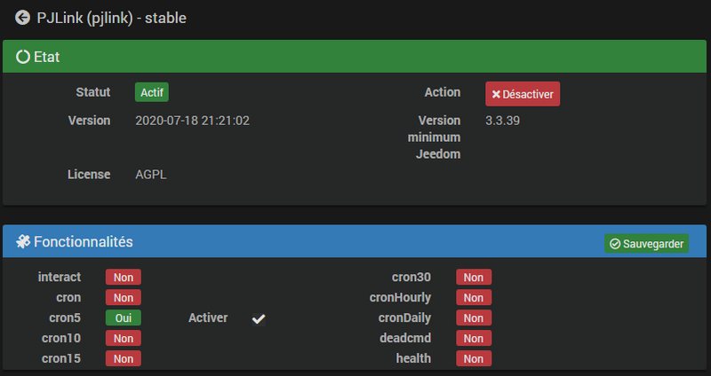

# PJLink plugin

The plugin **PJLink** allows the control of video projectors compatible with the protocol *PJLink* to communicate on the local network.

The non-exhaustive list of brands compatible with the protocol *PJLink* is : **BenQ, Canon, Casio, Epson, Fujifilm, Hitachi, InFocus, Maxell, Mitsubishi, Nec, Panasconic, Ricoh, Sharp, Sky, Sony...**

For more information on models that support the protocol *PJLink*, please refer to [this list classified by year of marketing](https://pjlink.jbmia.or.jp/english/list.html){:target = "\_ blank"} or to your hardware documentation.

> **Important information**    
> Compatible equipment breaks down into 2 classes, depending on your equipment you will not have access to the same information :
> * **Class 1** : compatible with basic functions.
> * **Class 2** : compatible with basic and advanced functions.

# Configuration

## Plugin configuration

The plugin **PJLink** does not require any specific configuration and should only be activated after installation.

The plugin uses a *Cron5* in order to update the data every 5 minutes.

## Equipment configuration

To access the different equipment **PJLink**, go to the menu **Plugins → Multimedia → PJLink**.

> **To know**    
> The button **+ Add** allows you to add new equipment **PJLink**.

On the equipment page, fill in the'**IP adress** equipment *(obligatoire)* as well as the **Password** if a password has been set on the hardware *(facultatif)*.    
The **Port** used by default by the protocol is the **4352**. To modify only with full knowledge of the facts.    
The **Timeout** is set by default to **5** seconds. You can increase this delay if your hardware takes longer to respond.

Check the box **Activate** and click on the button **Save**. The plugin will then create the commands corresponding to your material and retrieve the available information.

**Class 1 :**

**Class 2 :**

# Widget template

The visual of the equipment **PJLink** is refined and relevant. Different information is displayed when hovering over each icon.

You will not have access to the same commands depending on the possibilities offered by your equipment.

## Class 1

*  : Green, this icon indicates that no error is in progress. If an error is detected, the icon will be orange and the content of the error will be indicated on hover or on the last information directly in the device.
*  : Displayed if the sound is muted *(Mute Audio)*.
*  : Displayed if the video is cut *(Mute Video)*.
* The video projector icon changes color depending on the state of the equipment :
  * **Green** : The video projector is on.
  * **Red** : The video projector is turned off.
  * **Blue** : The video projector is cooling down.
  * **Orange** : The video projector is heating up.
* **Video input** : Selects the video input *(input)*.
* **Power** : Switch on / off the equipment.
* **Mute Audio** : To stop or resume sound broadcasting.
* **Mute Video** : To stop or resume video streaming.

## Class 2

All class 1 controls are accessible and also :

*  : Appears if audio and video are frozen *(Freeze)*.
* **Freeze** : Freeze / Unfreeze video and audio.
* **Speaker Volume** : The button "**-**" reduces the sound volume and "**+**" to increase it.
* **Microphone Volume** : The button "**-**" decreases the microphone volume and "**+**" to increase it.
