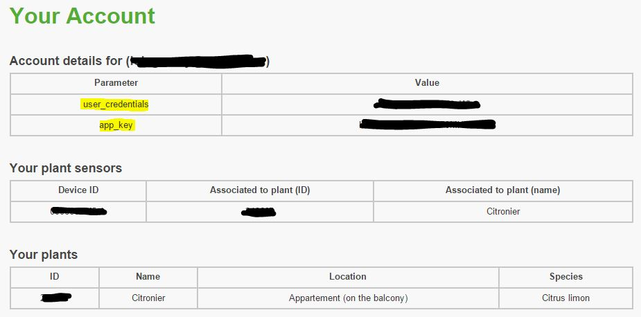

# Koubachi plugin

Plugin for Koubachi devices. It allows to retrieve information of humidity, temperature, brightness and advice for your plants. You can also indicate that a plant has been watered, vaporized, that fertilizer has been added

# Plugin configuration 

Once the koubachi plugin is installed, you must link it to your Koubachi account, for that go to your Koubachi account : [here](https://labs.koubachi.com/login?locale=en)

Indicate your login details, and click on login, then at the bottom of the page you have :

Get the value of "user\_credentials" and put it in the "Username" field". Do the same with the value of "app\_key" in the "Application key" field" :

Then click on "Synchronize my equipment".

# Equipment configuration 

You will then find the list of your plants here :

You should see here the list of your plants registered in Koubachi :

By clicking on one of them you get :

-   Plant name : the name of your plant
-   Parent object : the object to which the plant is attached
-   Activate / Visible : the possibility to activate the equipment (don't forget to do it the first time) and make it visible
-   For orders :
    -   Historize : allows to log the command
    -   Advanced (small notched wheels) : displays the advanced configuration of the command
    -   Test : allows to test the command to see its value
    -   Delete ("-" button) : to delete the order

# Widget 

Here is the result on the dashboard :

And on mobile :

