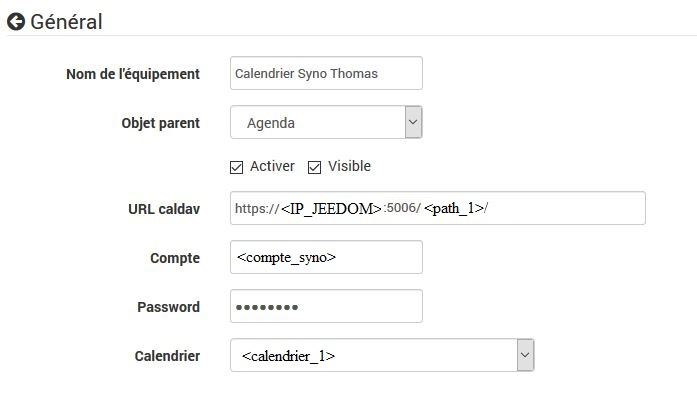

# Caldav plugin

# Description

The plugin **Caldav agenda** allows you to retrieve events from a caldav calendar. It manages multiple events by separating them with a comma (``,``). All that remains is to test the presence of the event in a scenario to trigger an action (in the scenarios there is the operator ``~`` or ``matches`` to find out if a character string contains another).

# Configuration

To configure it, it's very simple, you just have to create a device by diary and then associate it with event isolation patterns.

You must enter a URL, an account and a password to access the agenda. Once saved, you can choose the calendar you want to use.

In the pattern box, it is possible to put a pattern to filter / extract an event.

Example pattern : ``!^Arrière-cuisine (.*)$!``

If the event is "Scullery 15", the returned value will be 15. This makes it possible to manage temperatures for programming.

http://perldoc.perl.org/perlre.html

>**Important**
>
>The name of the calendar can only be chosen after saving the equipment with correct information. It may take a while to appear.

## Configuration with Webdav on Synology

You must first configure the Webdav package. You have to know if you want to use http or https (I recommend https). Once activated, note the port activated for https (5006 by default).

You have to know where the calendars will be stored :

It will therefore be necessary to specify in jeedom as follows :

## Configuration with Webdav on Framagenda

You must first create an account on Framagenda. Il faut ensuite aller sur https://framagenda.org/index.php/apps/calendar/.

You must retrieve the Framagenda URL which is used for the configuration of the plugin.

# FAQ

>**No event dates back**
>Have you selected and saved an agenda ?

>**Can we have future events**
>No it is not possible the plugin only gives the current events.

>**How often is the information refreshed ?**
>By default it is every minute.
