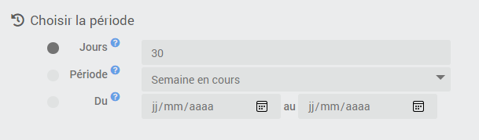

# Data Export plugin

Plugin allowing to generate and manage the archiving of historical exports of the orders of your choice to a `* .csv` file.

The plugin offers the possibility of exporting the raw values of each order over the selected period or the statistics thereof : **mean, min., max., sum, standard deviation, number of values, last value**.

It is possible to recover the export file in several ways :
- Direct download on demand,
- By sending on the channel of your choice via programming,
- By sending on the channel of your choice via a scenario.

An import tool is also included in order to be able to integrate values into the history of a Jeedom order.

# Configuration

## Plugin configuration

The plugin **Data Export** does not require any specific configuration and should only be activated after installation.

## Equipment configuration

To manage your different export batches, go to the menu **Plugins → Organization → Data Export** and click on the equipment you want to configure.

>**INFORMATION**
>
>The button **+ Add** allows you to create a new export batch.

You can give a name to the export batch, assign it a parent object *(useful to identify the export send command in a scenario)* and activate or deactivate it.    
Check the box **Statistics** allows you to opt for an export of statistics *(mean, min., max., sum, standard deviation, variance, number of values, last value)* instead of raw values.

### Choose the periodicity of the export

Choose the period for which the history must be retrieved among the possibilities offered :
- **Days** : the selection will be made on the **"X" last days** *(minimum:1/maximum:999)*.
- **Period** : Select a **predefined period** *(Current week, Previous week, Current month, Previous month, Current year, Previous year, etc...)*.
- **Dates** : Manually fill in the **start and end dates** of the selection.  
>**TRICK**
>
>If the end date is not entered, it will be the current day by default.

### Choose the orders to export

Then select the orders for which you want to obtain the histories by clicking on the blue button **Display historical orders**.    

A window opens and displays the list of orders logged with a selection box to be checked at the start of the line. Each column can be filtered or sorted, the button **Reverse** allows the inversion of the current selection and the green button **Validate** saves the current selection.

Below the command selector button is **the list of currently selected commands**.

>**TRICK**
>
>Clicking on the name of an order opens the configuration page of the order concerned.

# Archiving export files

To access the archived exports, go to the tab **Archiving** equipment.

Field **Retention** allows you to indicate the number of export files to keep in archives *(minimum:1/maximum:99)*.

Below the part **Navigation** displays the list of currently archived export files. Select one of the files to view **file preview** *(limited to the first 1000 lines)* and **activate the download and delete file buttons**.

# Export data

## Download on demand

Once the period and the orders have been chosen, save the equipment then click on the blue button **CSV export** to generate a new export corresponding to the requested criteria.

At the end of the process, the new file will be automatically added to the list of exports on the tab **Archiving**. Click on the file name to select it then on the green button **Download** to download it immediately via your browser.

## Send via programming

It is possible to send the export file on the channel of your choice *(Mail, Telegram, Discord, etc...)* via programming directly configured on the equipment page.

To activate the schedule, check the box **Activate** of the section **Scheduled sending**.

3 new fields then appear :
- **Programming** : indicate the programming by a cron.
> **TRICK**
>
>Click on the question mark at the end of the line to access the cron-wizard to easily configure the schedule.

- **Send order** : select the Action / Message command allowing sending on the chosen channel *(facultatif)*.
> **INFORMATION**
>
>If no send command is selected, the export file will still be generated and archived.

- **Shipment title** : Fill in the title to be affixed to this shipment *(facultatif)*.
> **TRICK**
>
>It is possible to use [**scenario tags**](https://doc.jeedom.com/en_US/core/4.1/scenario#Les%20tags){:target = "\_ blank"} in the title of the shipment.  

## Send via scenario

You can also send the export file to the channel of your choice *(Mail, Telegram, Discord, etc...)* via a scenario.

You must then select the command **Send CSV Export** corresponding to the desired export batch in a block *Action* of a scenario.
Fill in the **Title** *(facultatif)* as well as **Action / Message command to send the export** on the desired channel *(facultatif)*.

> **TRICK**
>
>As for sending by programming, it is possible to use [**scenario tags**](https://doc.jeedom.com/en_US/core/4.1/scenario#Les%20tags){:target = "\_ blank"} in the sending title and the file will be automatically archived by the plugin if no sending command is entered.

# Import data

If you want to integrate data into the history of a Jeedom order, you can use this tool. To do so, you must send a spreadsheet file with the extension `csv` **with semicolon separators** containing a column of values to integrate and a column of corresponding time stamps.

Beware of timestamps which can be interpreted and modified depending on the spreadsheet application you are using. For example, **Excel** tends to remove seconds automatically and format the date in French format by default. In this case, you will need to indicate a custom format such as `dd / mm / yyyy hh:mm:ss` or `yyyy-mm-dd hh:mm:ss` for cells containing a timestamp.

>**IMPORTANT**
>
>Importing data into Jeedom is not trivial and must be done knowingly. It is always advisable to carry out a preliminary backup of Jeedom before any intervention of this type.

To access the value import tool, go to the general page of the plugin then click on the button **Import**.

The import window is used to integrate values in the history of an Info type order from a file `*.csv` provided that :
- The file contains **a column named "Date"**,
- The file contains **a column named "Value"**,
- The column separator is **a semicolon**,
- The **date format** is correctly entered (French \| international).

## Send data

Click on the button to select a `CSV` file. Once loaded, the file is verified and important information is displayed on the screen :
- **Name and size** of the file,
- **Number of lines** treat,
- **Period** concerned by the import,
- **Dates and values** to import.

## Receive data

Then click on the button to select the command intended to receive the values. Information such as subtype and unit will then be displayed on the screen.

If a history already exists on the order for the period concerned by the import, its content will also be displayed.

## Process existing data

If there is a history on the order during the phase concerned by the import, the tool will ask you how you want to manage this data.

3 choices are possible :
- **Keep all data** already present in history,
- **Replace only duplicate values** between the csv file and the history,
- **Overwrite all data** in history over the period.

## Start import

Once the file containing the data to be imported has been integrated and verified by Jeedom, the data reception command has been entered and your choice has been made concerning the processing of the history, you can click on the button **Import file** to initiate the procedure.
