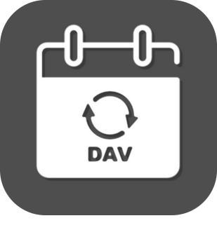
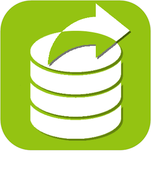

>**Important**
>Only official plugins have their documentation here. You can consult the documentation of the other plugins directly from the Jeedom Market. Once on the plugin in question, click on documentation.
>You can see [here](https://market.jeedom.com/index.php?v=d&p=market&type=plugin&categorie=organization) all official plugins in this category

| | | | |
|--- | --- | --- | ---|
||Caldav agenda|Plugin author : Thomas Guenneguez. Be careful : it is not an Official Jeedom plugin but a plugin developed by a third party and whose evolution has been abandoned. The Jeedom technical team will provide assistance with this plugin without obligation of result. Plugin to read events from a Caldav Calendar. With a regular expression we can, for example, extract a temperature from an event.|[Documentation Stable](caldav/index.md) [Market](https://market.jeedom.com/index.php?v=d&p=market_display&id=1149) [Changelog Stable](caldav/changelog.md)|
||Agenda|Plugin for managing calendars and performing actions automatically at the start and / or end of an event.|[Documentation Stable](calendar/index.md) - [Beta Documentation](calendar/beta/index.md) [Market](https://market.jeedom.com/index.php?v=d&p=market_display&id=57) [Changelog Stable](calendar/changelog.md) - [Changelog Beta](calendar/beta/changelog.md)|
||Data Export|Plugin allowing to archive historical or statistics exports to a CSV file. It is possible to automate the reception of export files on the channel of your choice via scenario or programming.  The plugin also allows you to import data into Jeedom from a CSV file to an Info type control.|[Documentation Stable](dataexport/index.md) - [Beta Documentation](dataexport/beta/index.md) [Market](https://market.jeedom.com/index.php?v=d&p=market_display&id=4057) [Changelog Stable](dataexport/changelog.md) - [Changelog Beta](dataexport/beta/changelog.md)|
||DomoGeek|Plugin to retrieve information from the DomoGeek site. The plugin allows to retrieve a lot of info :  - Public holiday  - Weekend  - School Holidays  - Duration of day (sun)  - Sunrise time  - Zenith hour - Sunset time  - EDF Tempo color  - EDF color Tempo of tomorrow - Vigilance Météo France Flood  - Vigilance Météo France Météo  - Weather alert France Type of disturbance  - EDF WCY  - IP adress  - Season  - Saint of the day  - Saint of the next day|[Documentation Stable](domogeek/index.md) - [Beta Documentation](domogeek/beta/index.md) [Market](https://market.jeedom.com/index.php?v=d&p=market_display&id=250) [Changelog Stable](domogeek/changelog.md) - [Changelog Beta](domogeek/beta/changelog.md)|
||Google calendar|Plugin for retrieving events from Google Calendar. He is able to interpret the titles of events as interaction. Important : this plugin requires to have a dev account with Google (everyone can have it it's free and without impact). The process is explained in the documentation.|[Documentation Stable](gCalendar/index.md) - [Beta Documentation](gCalendar/beta/index.md) [Market](https://market.jeedom.com/index.php?v=d&p=market_display&id=3318) [Changelog Stable](gCalendar/changelog.md) - [Changelog Beta](gCalendar/beta/changelog.md)|
||Geoloc|Plugin allowing Jeedom to manage geolocation (Only for Android via the Tasker application).|[Documentation Stable](geoloc/index.md) - [Beta Documentation](geoloc/beta/index.md) [Market](https://market.jeedom.com/index.php?v=d&p=market_display&id=12) [Changelog Stable](geoloc/changelog.md) - [Changelog Beta](geoloc/beta/changelog.md)|
||Mode|Plugin allowing to create and manage different modes (house / apartment, alarm, presence, etc ...) and to perform actions automatically when entering and / or exiting a mode.|[Documentation Stable](mode/index.md) - [Beta Documentation](mode/beta/index.md) [Market](https://market.jeedom.com/index.php?v=d&p=market_display&id=1929) [Changelog Stable](mode/changelog.md) - [Changelog Beta](mode/beta/changelog.md)|
