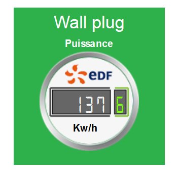

# Widget plugin

The widget plugin is a bit special because it does not allow you to create equipment but to modify the rendering (display) of an order. The objective of this plugin is therefore to simply customize the way to display a value, info, or action according to his tastes and desires.

Since version 1.112 of Jeedom, it is possible to customize widgets with specific options (created by the widget developer). So we can have a widget that will display differently from one order to another.

So, we can have the same widget written in blue on one order and in green on another.

> **NOTE**
>
> Widget and Tile, not to be confused.
>
> The widget is the part that will take care of formatting and displaying an info or order. A widget should only handle one command or info.
>
> La Tuile is a grouping of widgets for a module. This is the area in which the different widgets applied to the commands and info of the module will be displayed.

# Installing the Widget plugin 

As with any plugin, the Widget plugin is installed from the Jeedom interface, "General" menu ⇒ "Plugins"


Click on the green icon to go directly to the Market. In this window click on "Official" and in the search field put "Widget".


Click on the plugin icon. This opens the plugin file where several information is found.


Click on the "Install stable" button". Once installed, Jeedom asks you if you want to go to the plugin configuration page. Answer yes. On the widget plugin configuration page, we only have one option for this plugin : activate or deactivate.

By default the plugin is disabled. I invite you to click on the green button "activate".

As of now the plugin is active and operational.

# Presentation and basic function of the Widget Plugin 

To go to the Widget plugin, go to the "Plugins" menu ⇒ "Programming" ⇒ "Widget".


So we are on the main plugin page. By default, the latter has a range of widgets as soon as it is installed. You can download others via the market or create your own widgets (see below).


By clicking on one of the widgets in the list on the right or left menu you will open the widget configuration page, in which you can modify, see a preview of the widget (if Jeedom finds a compatible command) and a whole lots of configuration info like widget source code


> **Warning**
>
> If you modify a widget that is not one of your creations, it is preferable to duplicate it to avoid losing your modifications if the original widget is updated.

For more info on configuration and widget creation see below.

## Apply the widget on an order 

To apply a widget to a single command or modify the one applied, you must go to the module configuration page. The path to access the module differs according to the type of the latter. Here are some examples :

For Z-Wave modules, "Plugins" ⇒ "Home automation protocol" ⇒ "Z-wave", then choose the module of the command you want to modify.


On the module configuration page, go to the command and click on the toothed wheels. In the new window, go to the "Advanced view" tab"


Here you can modify the widget applied for computers and mobiles with the dedicated drop-down lists.


> **NOTE**
>
> The drop-down lists are self-filtering. They only provide widgets compatible with the type of command.

## Apply the widget on several commands

En cliquant sur le bouton “Appliquer sur des commandes” vous ouvrez une fenêtre qui liste toutes les commandes compatibles avec le type du widget. So you can simply apply or remove the widget to many orders at once.


Just check the commands on which you want to apply the widget

### Various examples for the same order 




## Widget customization options 

Since version 1.112 of Jeedom, it is possible to customize widgets with specific options (created by the widget developer) and common to all widgets. So we can have a widget that will display differently from one order to another.

There are 2 ways to access these options. Or by the Home Automation tree which is in the "General" menu ⇒ "Home Automation Summary"


On this page you find all your home automation elements, objects, modules, commands. Click on the small notched wheel to access the configuration page.


Either from the module configuration page.


### Add a custom option 

In the "Advanced display" tab, there are 2 drop-down lists which allow you to change the widget used on a computer for the order and the other for mobile devices. There are also other options, to display or not the names and stats, force the line break before / after the widget if there are several commands in a module (line breaks in the tile). Finally the list of optional Widget parameters applied


> **NOTE**
>
> To add an option, simply click on the "Add" button, enter the name of the option with the correct lower and upper case letters, as well as the value to be assigned to the option.

## Advanced configuration

See the doc on the Home automation summary ⇒ [Here](https://jeedom.github.io/core/en_US/display)

## Widget creation / modification
The plugin offers 2 possibilities for the creation of Widgets, the easy mode which allows to make basic widgets easily with a creation assistant, and the advanced mode which also allows the modification thereafter of all widgets.

> **NOTE**
>
> Advanced mode provides limitless flexibility. However, you need to have some knowledge of basic programming language such as HTML and CSS for the base and JavaScript to be able to do things a little more complex.

### Easy creation mode

To make a widget with the wizard, you just need to go to the plugin : "Plugins" menu ⇒ "Programming" ⇒ "Widget". From this page, click on the "Easy creation mode" button at the top left.


On the new page, you can in the right part, view the basic Jeedom icons, the images you have imported and the imported packages. On the left side, first a button to import packs or images, then 3 buttons to create a widget.


-   On / Off Widget ⇒ Intended for button commands for on / off
-   Simple State Widget ⇒ Intended for commands which have a status feedback
-   Numeric Widget ⇒ Intended for commands that send a numeric value (example : Temperature, brightness… etc)

#### Example with the creation of a status widget 

> **NOTE**
>
> This example remains applicable for the 2 other types of creation

Click on the button "Simple State Widget". We arrive on the assisted configuration page. You must give a name to the widget (unique name), the type of interface, if the widget is intended for the PC (Dashboard) or mobile, then the library to use (Jeedom, Personal image or packs).


Then you must choose the icon for State 0 and 1, as well as the size of the icon (value in "EM" =% of the original size of the browser font, 1 = 100%). This done, the source code appears below the configuration area.

> **Warning**
>
> Do not modify this information if you do not know what you are doing.

It only remains to validate to finalize the creation of the widget. You will be automatically redirected to the advanced configuration page which allows you to apply the widget to several commands

### Creation / modification in advanced mode 

In advanced mode, you must have knowledge of programming language "HTML", "CSS" and "JavaScript" to be able to modify a widget correctly.

> **NOTE**
>
> There are several sites in FR on the web to learn these languages, I recommend OpenClassRoom which explains everything from the beginning.

To access the advanced mode, simply go to the widget plugin, choose the widget to modify or click on the "Add widget" button"

#### Creating a widget 

From the main plugin page, click on "Add a Widget". Jeedom asks you some info on the future widget.


-   Name must be a unique name. So check that this name does not already exist.
-   Version, corresponds to the type of device for which it is intended (PC or Mobile).
-   Type, corresponds to the type of command that will use the widget: none, info or action.
-   Sub-type, gives precision to the type chosen previously.

You can change the name, type and subtype later. However, this may have implications if the widget is already applied to one or more commands. It is therefore better to avoid it.

##### Type Info 

The type "info" is used for commands which return a value, for example, a module state, a numerical value (temperature, brightness, humidity etc), a text or any other information.

-   Digital : for numbers
-   Binary : for on / off states (0/1)
-   Other : for all other types of info like texts

##### The action type 

The "action" type is used for commands that will have an action in Jeedom or on external equipment.

-   Default : used to create action buttons
-   Cursor : used to create cursors for changing numeric values
-   Message : Used to create a text entry area with send button
-   Color : used to create a color choice button

Once configured, click on "Add". Jeedom redirects you to the main page of Widget configuration / modification. From there, the widget is created in Jeedom but does not currently contain any code for displaying the command.


#### Editing a widget 

Once on the main config page of a widget, it is in the "source code" part that the changes in appearance apply.

> **Warning**
>
> To modify this info you need to have some basics in HTML, CSS and JavaScript programming. The modifications can have a significant impact on the display of the widget and the display of other widgets, or even block the display of all widgets.

The base (skeleton) of a widget is in HTML. This allows you to structure the display and find information more simply.

In Jeedom for widgets, the first piece of code to create is a "div" that will act as the main container for all the code in our Widget.

In this "div", you can find up to 3 distinct sub-parts :

-   The HTML part which will display the information
-   The CSS part which will make it more attractive by formatting the HTML part (Optional Part)
-   The JavaScript part which allows you to work on various actions, calculations and animations

##### HTML Code 

Rather than long speeches, here is an example of basic code for a widget

**Basic HTML structure.**

````
<div>
    <center>
        <span></span>
    </center>

    <style>

    </style>

    <script>

    </script>
</div>
````

The basic structure which schematizes the different locations in our widget is now created. However, we have nothing displayed, it's normal.

- ``div`` : relatively versatile multipurpose container with line feed after it
- ``center`` : tag that centers its content
- ``span`` : relatively versatile multipurpose container with no line feed after it
- ``style`` : Container for the CSS code that will be applied in general (be careful its content can affect all the elements of the page)
- ``script`` : tag that will contain JavaScript

As it is, it is difficult to do anything with this piece of code. This is why we will add some options (called Attribute in HTML language) in our tags.

**Addition of basic attributes.**

````
<div class="Doc-#id# cmd tooltips cmd-widget #history#" title="" data-type="info" data-subtype="numeric" data-cmd_id="#id#" >

    <center>
        <span></span>
    </center>

    <style>

    </style>

    <script>

    </script>
</div>
````

In our ``div`` main we added several attributes :

``id`` : The "id" attribute is not recommended on Jeedom

> **Important**
>
> To be sure to avoid a conflict at the level of IDs (which can crash the whole web page), under Jeedom we use class-ids and "data" attributes-". This makes it possible to be sure that in the event of a collision, the entire web page will not be crashed.

class : Classes unlike ids are not unique. They are used to apply a style defined in the style part (the tag). We can thus simply reproduce the same formatting that we create once and that we reuse by keyword (class). Here we add several basic defined and available classes in Jeedom (see Jeedom class below).

Jeedom uses instead of the id attribute, a class like id, this makes it possible to make an element unique on the page in order to find it and target it more easily. It is imperative that its value is unique on the page. For this I advise you to use a word that represents our element. In our example the div represents the whole of our widget, so we can use the name of our widget or an abbreviation (here I chose Doc-). Then, in order to guarantee that the class-id is unique, we will put a tag "#id#" (for more info on Jeedom tags see below), which gives "Doc-#id#".

- ``data-type`` : this attribute allows to store the type of the command on which the widget will be applied. Its value must therefore correspond to the type parameter above the code area.
- ``data-subtype`` : this attribute allows to store the subtype of the command on which the widget will be applied. Its value must therefore correspond to the subtype parameter above the code area.
- ``data-cmd\_id`` : This attribute takes as value the Tag \#id\#. It is used by Jeedom for updating the Dashboard.

From there, we have a base which corresponds to the Jeedom standard. It is
the minimalist code it takes to have a widget that respects the
Jeedom charter / rule

> **Important**
>
> Do not forget to modify the data-type and data-subtype attribute if you modify these values in the widget config.

##### CSS code 

This part which is added between the 2 "style" tags, allows to declare formatting rules. This part is optional because you can add the formatting directly in the style attribute of a tag or using JavaScript. The use of this part is therefore a matter of preference to properly separate HTML and CSS

> **Warning**
>
> Any code declared in style tags, applies to the whole page. So be careful with the CSS selector that you choose to use so as not to alter the other widgets.

In order not to unintentionally impact other widgets by the CSS code that you are going to put there, I advise you to use the id selector which targets your widget.

Example, if I want to put in red the text located in the "Span" tag, we would tend to write :

**Code put in the Style tag.**

````
span{
    color: red;
}
````

But that would change the text color of all the span on the page. So to avoid this, add an id selector that targets your widget to limit its action :

**Code put in the Style tag and delimited.**

````
.Doc-#id# span{
    color: red;
}
````

By adding .Doc- \#id\# in front of the span selector, we delimit the modification inside our widget.

##### JavaScript code 

JavaScript is put between the tags "Script". We use JavaScript to do calculations, convert data, animate the widget, format the widget, perform actions on the widget based on events. In addition to basic JavaScript, Jeedom incorporates by default several Frameworks which simplify JavaScript code. So we can use without initializing them :

-   Jquery
-   Jquery UI
-   Bootstrap

> **Warning**
>
> In the event of an error in the JS code, this can block all the JS codes that may follow, whether in the widget or other widgets. So be careful when making changes.

> **Tip**
>
> If after having saved a modification of the widget, the toothed wheel contained to rotate indefinitely, you may have made a JS error which causes the continuation of the JS execution to crash on the page. To be able to correct it, you just have to pass the div id = jqueryLoadingDiv in display none using the browser console, correct the code and save. You also have to do F5 to refresh the page.

### Jeedom tags 

In Jeedom you will often come across tags which are names surrounded by "\#". The principle of operation of these tags is simple : Jeedom will replace them with the value that corresponds to the tag. Tags are sorts of variables (boxes) in which values that are unknown at the time of writing the code are stored. It's a bit like making a text with blanks to put words in it later that would give variable meaning to the text.

Not all tags are available with all types of orders, so here is the list and their details :

- \#id\# : Order ID created by Jeedom when the order was created (unique numeric value). Use as text, in JS or in HTML attributes
- \#logicalId\# : Logical order ID (may be empty). Use as text or in JS
- \#name\# : Name of the order.  Use as text or in JS
- \#name\_display\# : Name of the order. To be used for displaying the name of the command at widget level. Use as text or in JS
- \#hideCmdName\# : Empty if the name of the command must be displayed. And "display:none; "if the name of the command should not be displayed. Use in HTML style (CSS) attributes
- \#maxValue\# : Maximum value that can take the order. Use as text, in JS or in HTML attributes
- \#valueName\# : Name of the linked info command, if the action command is linked to an info command, name of the action command otherwise. Use as text or in JS
- \#lastValue\# : Last value of the order (can be empty). Use as text or in JS
- \#unite\# : Command unit To be used as text or in JS
- \#collectDate\# : Returns the date and time of the last widget update in format ``yyyy-mm-dd hh:mn:ss`` Use as text, in JS, or in the title attribute
- \#state\# : Command value To be used as text or in JS
- \#displayHistory\# : Allows you to take into account the option "Display statistics on widgets" in the "General" menu ⇒ "Administration" ⇒ "Configuration" tab "Configuration of commands". If the option is on yes, the tag will return a blank otherwise ``display : none;`` To be used in the "style" attribute of an html tag to display if logging is activated in the Jeedom config
- \#averageHistoryValue\# : Average value over the last x hours of the command To be used as text or in JS
- \#minHistoryValue\# : Minimum over the last x hours of the order To be used as text or in JS
- \#maxHistoryValue\# : Maximum over the last x hours of the order To be used as text or in JS
- \#tendance\# : Allows if the value history is activated to return the class : ``fa fa-minus``, ``fa fa-arrow-up`` or ``fa fa-arrow-down`` (line icon, down arrow, up arrow), linked to the trend of the value To be used in the attribute ``class`` a tag ``i``
- \#history\# : Allows if the value history is activated to return the class : 'history cursor '(See Jeedom CSS class), otherwise it will be replaced by an empty. The tag therefore allows to display or not the history graph on the dashboard. To be used in the "class" attribute of the main div


### Jeedom CSS Classes 

- ``cmd`` : Must be added to the "class" attribute of the main div, this class allows the widget to be updated. Without this class the widget is only updated by refreshing the page.
- ``cmd-widget`` : This class is recommended because it allows you to add some default CSS parameters to the widget for good behavior.
- ``cursor`` : Allows you to change the pointer in hand.
- ``history`` : This class allows you to modify the pointer in hand, and when clicking to display the history of the widget's value.
- ``tooltips`` : It is for the title of an element instead of being yellow it becomes translucent black with the white text

# Faq 

>**How to learn to make a widget ?**
>
>The widget system is based on the HTML and Javascript languages, so it is advisable to watch the courses (very numerous) on these languages. In addition it is interesting to also read courses on Jquery (and Jquery mobile for the mobile version of widgets). Another way is to make a widget in "easy creation", so the plugin will automatically generate the code of your widgets.
