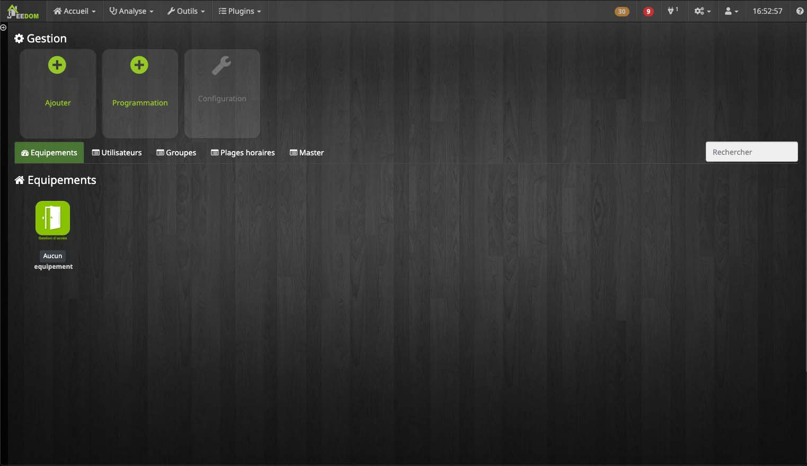
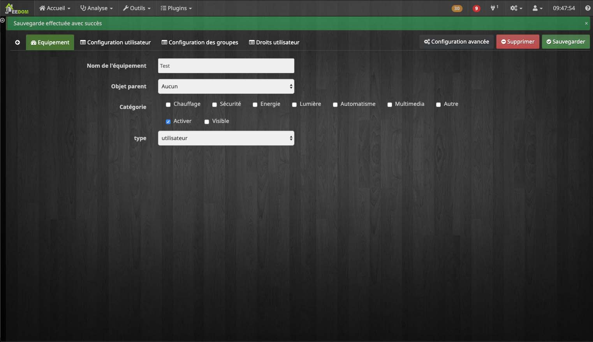

# Access Management Plugin

This plugin is used for advanced management of an access system, using the following functionalities :

- Activation and presentation of the plugin
- Creation and management of doors
- User creation and management
- Creation and management of groups
- Creation and management of time slots
- History search

>All screenshots are taken under a theme, if the appearance of your Jeedom is not exactly the same do not worry.

## Activation and presentation of the access management plugin

### Activation
After installing your plugin, you must activate it.

>If you use KNX, in the group **Setup** fill in the fields.

After activating the plugin you should see it in  **Plugins** → **Security** → **access management**. If this is not the case do not hesitate to update your page (Ctrl + F5 or Cmd + R).

### Presentation

In the default view of the plugin, you can add a bagde, a user, a time slot or a door.

Below, different tabs allow you to easily find each of the elements.
The search bar will help sorting in each category to find an item more easily.

On the **Dashboard** a history of the last 20 events is available.

## Creation and management of doors </a>

#### Door creation

**Add** to create a door.
The field allows you to define the name of the door.

In the list *Type*, select **Door / Reader**.

#### Door configuration

**Setup équipement** allows to configure the door.

#### Equipment rights

**Equipment rights** is used to assign specific time slots to the door during which users will not need their badges to pass.

**Add des droits** allows you to select an already existing time slot to assign it to your door.
>All users connected to the selected time zone will be able to pass through this door during the times set on it.

The button **-** removes the time slot.

## User creation and management </a>
---

#### User creation

**Add** used to create a user.
The field allows you to define the user name.

In the list *Type*, indicate **User**.

#### User configuration

**Setup utilisateur** is used to configure. 

Several fields are customizable.
You can indicate :

- a user id (corresponding to the user&#39;s badge numbers),
- the name,
- first name,
- user profile picture,
- the start date, which is the first day of your new user,
- the end date, which is the last day of your new user,
- user status :
    - In service _ (default status) _,
    - Volé,
    - Perdu,
- Four fields in which you can add notes.

The button **To copy** takes the value of **Username**, of **User first name** and from'**User ID** to assign them to **Name of equipment**, which you can see in the tab **Device**.

The button **Send** allows you to transmit the profile photo you want for your user.

The button **Download** upload user photo. 
The file will be named according to the values indicated in the fields **Username** and **User first name** (separated by a dash).

#### Configuring groups for a user

 **Setup des groupes** used to assign your user to a group.
>Check a box to select the corresponding group.

#### User rights

The tab **User rights** used to assign specific rights to the user.

**Add des droits**, allows to select a door and a time range which will be assigned to the selected user. 
Two options are available **Refuse** and **Accept** for action.

The new rights assigned are visible in the tab **User rights**. The button **-** removes rights.

## Creation and management of groups

#### Creation of a group
Use the button **Add** to create a group.
The field allows you to define the group name.

In the type list, select **Group**.

#### Rights of a group

The tab **Group rights** used to assign specific rights to your group.

**Add des droits**, allows you to select a door and a time range which will be assigned to the selected group.
Two options are available **Refuse** and **Accept** for action.

In the tab **Group rights** the new rights affected will be visible. The button **-** removes rights.

## Creation and management of time slots

#### Creation of a time slot
Use the button **Add** to create a time range.
The field allows you to define the name of the time slot.

In the type list, select **Time slots**.

#### Time range configuration

The tab **Setup plage horaire** allows to configure a new time slot. 

>**Advice :** 
> - To configure a time slot, left click on the boxes that interest you according to the day and time. 
A box turns blue when it is active.
 By default, the boxes are active every day from 10:30 a.m. to 7:00 p.m. 
 To deactivate a box, right click on it. This will then go transparent.
> - By default public holidays are taken into account, be sure to deselect the blue boxes on the line **"Holidays"**.
> - Slide the scroll bar to the right at the bottom of the table to see more schedules.

## History search

**Important step :** to access this part, it is important to carry out an adjustment upstream. Go to **Plugins** → **Plugins management**, IN **My plugins**, Click on **Access management**.

In the game **Panel** check **Show desktop panel** then click on **Save**.

Once the change has been made, a new section in the menu **Home** is available.
However, if it does not appear, be sure to refresh your page.

**Home** → **access management** to access advanced search. The default view shows the last 20 recorded events.

The left-hand part allows you to determine the search criteria.

 - **User list :** Names of users searched. You can select multiple users.
 - **Equipment list :** Names of equipment sought. You can select multiple devices.
 - **List of time slots :** Track names searched. You can select multiple time slots.
 - **Start date :** Enter a start date and time for your search.
 - **End date** Indicate an end date and a time for your search.
 - **List of groups** Names of wanted groups. You can select multiple groups.
 - **List of actions** Select the result of an action, you have the choice between : **All**, **Refuse** and **To allow**.

>In the upper part of the table, below each column title, the different fields allow you to perform a second search that will sort the results.
