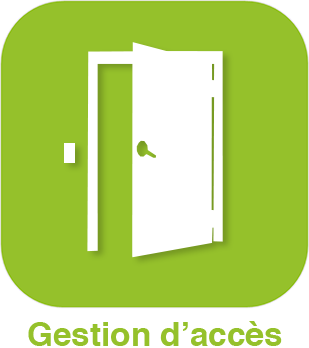

>**Important**
>Only official plugins have their documentation here. You can consult the documentation of the other plugins directly from the Jeedom Market. Once on the plugin in question, click on documentation.
>You can see [here](https://market.jeedom.com/index.php?v=d&p=market&type=plugin&categorie=security) all official plugins in this category

| | | | |
|--- | --- | --- | ---|
||jeelocker|ATTENTION plugin only available in beta Jeelocker is a plugin dedicated to locker access management|[Beta documentation](Jeelocker/beta/index.md) [Market](https://market.jeedom.com/index.php?v=d&p=market_display&id=4237) [Changelog beta](Jeelocker/beta/changelog.md)|
||Ajax Systems|Plugin used to connect to an Ajax alarm|[Documentation Stable](ajaxSystem/index.md) - [Beta documentation](ajaxSystem/beta/index.md) [Market](https://market.jeedom.com/index.php?v=d&p=market_display&id=4150) [Changelog Stable](ajaxSystem/changelog.md) - [Changelog beta](ajaxSystem/beta/changelog.md)|
||Alarme|Security management plugin. Build your alarm easily (without programming), complete and customizable.|[Documentation Stable](alarm/index.md) - [Beta documentation](alarm/beta/index.md) [Market](https://market.jeedom.com/index.php?v=d&p=market_display&id=26) [Changelog Stable](alarm/changelog.md) - [Changelog beta](alarm/beta/changelog.md)|
||Camera|Plugin allowing the display of IP cameras. The video display of the camera is carried out by successive snapshots (captures) every second. The plugin is compatible with RTSP cameras.|[Documentation Stable](camera/index.md) - [Beta documentation](camera/beta/index.md) [Market](https://market.jeedom.com/index.php?v=d&p=market_display&id=70) [Changelog Stable](camera/changelog.md) - [Changelog beta](camera/beta/changelog.md)|
||Access management|Plugin that allows you to manage the access control of a building by creating users, groups, time slots and readers / actuators. Be careful : PREMIUM plugins are NOT included in ANY Service Pack. They are only available on request from Jeedom (contact via our website).|[Documentation Stable](gestAccess/index.md) - [Beta documentation](gestAccess/beta/index.md) [Market](https://market.jeedom.com/index.php?v=d&p=market_display&id=3686) [Changelog Stable](gestAccess/changelog.md) - [Changelog beta](gestAccess/beta/changelog.md)|
||jeelocker|ATTENTION plugin only available in beta Jeelocker is a plugin dedicated to locker access management|[Beta documentation](jeelocker/beta/index.md) [Market](https://market.jeedom.com/index.php?v=d&p=market_display&id=4238) [Changelog beta](jeelocker/beta/changelog.md)|
||Netatmo Security|Plugin for Netatmo Security. Attention to display the video stream you need the camera plugin|[Documentation Stable](netatmoWelcome/index.md) - [Beta documentation](netatmoWelcome/beta/index.md) [Market](https://market.jeedom.com/index.php?v=d&p=market_display&id=1967) [Changelog Stable](netatmoWelcome/changelog.md) - [Changelog beta](netatmoWelcome/beta/changelog.md)|
||Nuki|This plugin allows you to control Nuki connected locks using the bridge. It also allows to configure the bridge in push mode|[Documentation Stable](nuki/index.md) - [Beta documentation](nuki/beta/index.md) [Market](https://market.jeedom.com/index.php?v=d&p=market_display&id=2819) [Changelog Stable](nuki/changelog.md) - [Changelog beta](nuki/beta/changelog.md)|
||Simons voss|Plugin for Simons Voss Smart Intego locks|[Documentation Stable](simonsvoss/index.md) - [Beta documentation](simonsvoss/beta/index.md) [Market](https://market.jeedom.com/index.php?v=d&p=market_display&id=3906)|
||Ubiquiti Unifi protect|ATTENTION plugin only available in beta Plugin to connect Jeedom to Unifi Protect|[Beta documentation](unifiprotect/beta/index.md) [Market](https://market.jeedom.com/index.php?v=d&p=market_display&id=4188) [Changelog beta](unifiprotect/beta/changelog.md)|
||Vesta|Plugin to control Vesta alarm panels|[Documentation Stable](vesta/index.md) - [Beta documentation](vesta/beta/index.md) [Market](https://market.jeedom.com/index.php?v=d&p=market_display&id=4330) [Changelog Stable](vesta/changelog.md) - [Changelog beta](vesta/beta/changelog.md)|
