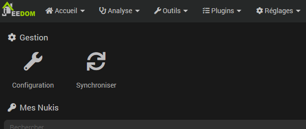

# Nuki plugin

This plugin allows you to control Nuki connected locks using the bridge.

## Plugin configuration

After downloading the plugin, you just need to activate it, then configure the bridge information.

This information is available on the mobile application when configuring the bridge after activating API access on it.

It is then necessary to click on the button "Configure the bridge" in order to indicate to the bridge the address of Jeedom for the feedback.

## Equipment configuration

Synchronization of locks is accessible from the menu Plugins > Security > Nuki:

> **NOTE**
>
> Orders are automatically created, there is no need to add them manually.

## Possible values for the command *State*

|     | **smart lock**             | **open**  | **doorsensor** |
|-----|---------------------------|-------------|----------------|
| 0   | Not calibrated               | Not calibrated | -              |
| 1   | Locked               | On line    | Disabled     |
| 2   | Unlock            | -           | Closed         |
| 3   | Unlocked             | rto active  | Opened        |
| 4   | Lockdown              | -           | Unknown       |
| 5   | Unlocked (latch)    | Open      | Calibration      |
| 6   | Unlocked (lock n go) | -           | -              |
| 7   | Unlock (latch)   | Opening   | -              |
| 16  | -                         | -           | Not calibrated    |
| 240 | -                         | -           | Deleted       |
| 253 | -                         | Startup   | -              |
| 254 | Engine Stuck             | -           | -              |
| 255 | Unknown                   | Unknown     | -              |
