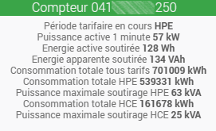

# Téléinfo SME-SMI plugin

The plugin **Teleinfo SME-SMI** allows the reading and interpretation of teleinformation from SME-PMI communicating industrial meters connected in series (USB, GPIO).

# Configuration

Like any Jeedom plugin, the plugin **Teleinfo SME-SMI** must be activated after installation.

## Plugin setup

Once the dependencies are correctly installed, simply select the serial port to which the meter is connected and then save the configuration. The daemon can then be started.

## Equipment configuration

The equipment relating to the counter is automatically created in Jeedom after starting the daemon and receiving a first complete frame. There is no particular configuration to specify regarding the equipment.

# Commandes

Orders are also created automatically, as they go, based on the information received, particularly the pricing period.

>Example :
>
