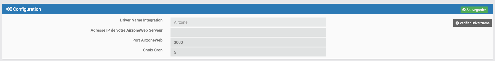

# Airzone plugin

# Description

Plugin to manage your AirzoneWeb systems

# Prerequisites

 - Jeedom v4.1.22
 - Find out the IP address of your AirzoneWeb Server

# Installation

After downloading the plugin, you must first activate it, like any Jeedom plugin.

# Configuration

Go to the Plugins / Plugins management menu

Click on your plugin, and configure it with the IP address of your AirzoneWebServer as well as the port (by default, Airzone systems have a port configured on 3000)
The number of systems is automatically detected when new equipment is added.

Choose the desired Cron for the refresh of the values :  5, 10, 15, 30, Hourly or Daily.

Choose the Wait time between requests for each zone; by default 10s if empty field.

By clicking on the Add DriverName button, you can modify the name of the driver on your Airzone system.

Sauvegardez

# Adding equipment

Go to the Plugins / Comfort / AirzoneJeedom menu

Click Add.

The zones available on your system will be available in the drop-down menu.
Choose a zone for an equipment

Remember to Activate and make Visible your equipment, and assign it a parent to find it on your dashboard.

IMPORTANT : If you have an area that contains special characters, this can cause a SystemOut of Range error.

# Zone Scan

When your equipment is created, and activated, you can click on Scan Zones, at the top of the equipment
This will send a request to the webserver to retrieve all the information of your Installation

The page will refresh and bring up a selection menu to choose the Zone associated with this equipment

# Dashboard

After creating your equipment, you will find them on the dashboard.

The mode icons change depending on the selected mode: Cold, Hot, Ventilation, Dry, and Stop.

To benefit from the colored icons, remember to go to the settings of your Jeedom (Settings / System / Configuration / Interface), and check "Colored Widget Icons"

Only the Master zones have the drop-down menu to change the mode in the associated zones configured in your system

The Setpoint and Temperature info icons change according to the value windows : -20 ° c, between 20 and 25 ° C, more than 25 ° C (and the equivalent if the zone is set in Fahrenheit)

The choices available in the modes, or the fan speeds are detected according to the possibilities of your system.

Typical equipment :

Equipment of a master zone; we see an additional command to activate the same mode on all the associated zones of the system

