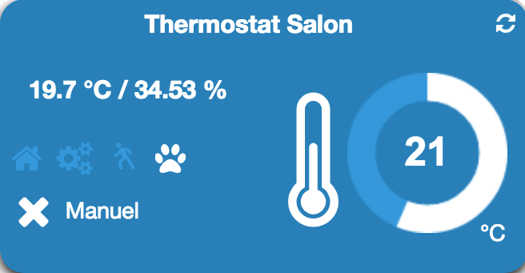

# Greenmomit plugin

Plugin to communicate and control your Green Momit thermostat

# Description 

## Marketing description

The smart thermostat Momit ST allows you to manage the comfort of your home, wherever you are, from a smartphone, tablet or computer, while helping you reduce your energy bill by 20%.

Powered from the mains, the thermostat connects to the boiler via a potential-free changeover contact. Connected to your home WiFi network, you can access your heating system from any computer, smartphone or tablet. The Momit ST smart thermostat stands out from its competitors by offering various innovative features :

-   Moniteur
    -   Save all your energy consumption data.
-   Calendrier
    -   Allows you to easily adjust your thermostat.
-   Presence
    -   Has a sensor that reduces excessive energy consumption when you are away. Heating can even be automatically turned off.
-   Control
    -   Allows you to manage the comfort of your accommodation from anywhere and anytime from your smartphone, tablet or PC.
-   Temps
    -   Estimate the average time that each accommodation takes to reach the indicated temperature by optimizing the anticipation period necessary to reach the right temperature.
-   Economies
    -   Visual indicator displayed when savings are made.
-   Vacances
    -   During the holiday period the Momit smart thermostat pauses learning.
    -   Unlike traditional thermostats, the Momit ST smart thermostat has an elegant and innovative design that will allow you to integrate it harmoniously into your decor. With glass finish and touch screen.
    -   With a free application (iOS and Android), your Smartphone and a simple Internet connection, you can access all the features of the Momit ST smart thermostat in real time, from anywhere.

**Functions**

-   WiFi IP thermostat
-   Programmable and remotely controllable
-   Compatible with conventional or combined boiler systems
-   Replaces any standard dry contact thermostat (Relay)
-   Capacitive touch screen
-   Different integrated sensors (temperature, humidity, brightness, proximity)
-   Schedule programming
-   Vacation function
-   Elegant and innovative design
-   Glass finish
-   Different display designs available
-   Free iPhone app
-   Free Android app
-   API available on request from Green Momit Support

**Technical characteristics**

-   Food : 230 V AC 50..60 Hz
-   Exit : Without potential
-   Maximum power :
    -   5 A for resistive load
    -   2 A for an inductive load (cosÎ † = 0.4)
-   Wifi : IEEE 802.11 b / g
-   Sensors :
    -   Capacitive touch screen
    -   NTC temperature sensor 100k @ 25 ° C
    -   Humidity sensor 0-99%
    -   Brightness sensor
    -   Proximity sensor up to 5 m
-   IP protection : IP20
-   Dimensions : 94 x 94 x 32 mm
-   Weight : 225g
-   Standards :
    -   ETSI EN 300 328 V1.7.1 (2006-10)
    -   ETSI-EN 301 489-1 V1.9.2 (2011-09)
    -   ETSI EN 301 489-17 V2.2.1 (2012-09)
    -   EN 62479:2010
    -   EN 60730-2-9; EN 60730-1

# Setup 

## Install the plugin 

Proceed with the installation of the plugin

Click on "General", then Plugins

Click on the "Market" icon to access the content of plugins available on the Jeedom Market.

Browse the market up to the "Comfort" category or use the search box with the keyword "Green Momit". Click on the plugin.

You will be able to install the plugin in its version  stable or  Beta. The stable version is recommended for the majority of users.

## Plugin configuration 

Configure the plugin. Vous aurez besoin de vos identifiants qui vous permettent d'accéder au portail Green Momit (<https://st.greenmomit.com/>) Le site du constructeur (<http://greenmomit.com/>) 

Avant de configurer le plugin, vous devez valider que votre compte est fonctionnel sur le portail Green Momit. (<https://st.greenmomit.com/>)

And ask Green Momit support

-   Unique API ID 
-   Secret API code

by sending an email to ( <support@greenmomit.es>) or
(( <support@momit.zendesk.com> ).

 Nom d'utilisateur : spécifier l'adresse email utilisée pour accéder au site <https://st.greenmomit.com/>  

Password : your associated password 

 

Unique API ID : received by email following a request from Green Momit support

 

Secret API code : idem Then click on "Save" and "Synchronize your equipment"

## Plugin configuration

Configure the plugin

Click on "Plugins" ⇒ "Well-being" ⇒ "Green Momit"

Your thermostat is configured, all you have to do is :

-   Specify parent object,
-   l'activer,
-   and make it visible.

The option : "Thermostat control is not done by Jeedom ", lets leave the Green Momit application priority over Jeedom.

##  Widget configuration

Le widget du thermostat est déjà en place et disponible dans l'objet parent définit dans la configuration précédente.

Température actuelle (sonde du thermostat). 

Hydrométrie actuelle (sonde du thermostat).

Eteint le thermostat si le thermostat détecte que c'est la nuit.

Le thermostat apprend tout seul vos habitudes.

Le thermostat s'arrête automatiquement s'il ne détecte pas de présence.  

Mettre le thermostat en mode Manuel ou Automatique.  

Etat du thermostat.  

Consigne du thermostat. Modification de la consigne avec la roue.  

Rafraîchir l'état. En survolant, affichage de la dernière synchronisation. 

