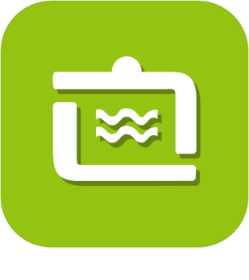

>**Important**
>Only official plugins have their documentation here. You can consult the documentation of the other plugins directly from the Jeedom Market. Once on the plugin in question, click on documentation.
>You can see [here](https://market.jeedom.com/index.php?v=d&p=market&type=plugin&categorie=wellness) all official plugins in this category

| | | | |
|--- | --- | --- | ---|
||Airzone Web|Plugin for the integration in Jeedom of AirzoneWeb system|[Documentation Stable](airzone/index.md) - [Beta Documentation](airzone/beta/index.md) [Market](https://market.jeedom.com/index.php?v=d&p=market_display&id=4216) [Changelog Stable](airzone/changelog.md) - [Changelog Beta](airzone/beta/changelog.md)|
||Alfawise fogger|Plugin to control Alfawise foggers|[Documentation Stable](alfawiseumist/index.md) - [Beta Documentation](alfawiseumist/beta/index.md) [Market](https://market.jeedom.com/index.php?v=d&p=market_display&id=3296) [Changelog Stable](alfawiseumist/changelog.md) - [Changelog Beta](alfawiseumist/beta/changelog.md)|
||CoolAutomation|Plugin enabling automatic discovery, configuration and API communication with CoolAutomation brand products: CoolLink Hub, CoolMaster and CoolMaster Pro.|[Documentation Stable](coolAutomation/index.md) - [Beta Documentation](coolAutomation/beta/index.md) [Market](https://market.jeedom.com/index.php?v=d&p=market_display&id=4504) [Changelog Stable](coolAutomation/changelog.md) - [Changelog Beta](coolAutomation/beta/changelog.md)|
||Green Momit|Plugin for Greenmomit thermostats|[Documentation Stable](greenmomit/index.md) [Market](https://market.jeedom.com/index.php?v=d&p=market_display&id=1081) [Changelog Stable](greenmomit/changelog.md)|
||Ikettle|Plugin to manage Ikettle and Ikettle 2 smarter kettles|[Documentation Stable](ikettle/index.md) [Market](https://market.jeedom.com/index.php?v=d&p=market_display&id=3297) [Changelog Stable](ikettle/changelog.md)|
||Intesis|Plugin permettant de piloter les passerelles « Intesis Wifi (ASCII) AC Interfaces » (anciennement dénommées Intesisbox). Basées sur le protocole WMP, les passerelles « Intesis Wifi (ASCII) AC Interfaces » sont des box qui permettent de domotiser des systèmes de climatisation gainables (interface Intesis à connecter en filaire sur le bus du climatisateur) ou à split avec télécommande infrarouge (interface Intesis IR). This plugin supports all models of Intesis Wifi (ASCII) AC Interfaces gateways (both wired and IR), but is not compatible with IntesisHome gateways (and in particular not with Intesis gateways from the IntesisHome range).|[Documentation Stable](intesis/index.md) - [Beta Documentation](intesis/beta/index.md) [Market](https://market.jeedom.com/index.php?v=d&p=market_display&id=3921) [Changelog Stable](intesis/changelog.md) - [Changelog Beta](intesis/beta/changelog.md)|
||Neato|Plugin to control your Botvac Connected vacuum cleaner from Neato. It allows you to launch a turbo or eco cleaning cycle, to pause, to resume, to return to base, to know the status, the presence on the dock, the level of charge, and much more.....  You dream of a vacuum cleaner integrated into your home automation, it is achievable thanks to this plugin !|[Documentation Stable](neato/index.md) - [Beta Documentation](neato/beta/index.md) [Market](https://market.jeedom.com/index.php?v=d&p=market_display&id=2260) [Changelog Stable](neato/changelog.md) - [Changelog Beta](neato/beta/changelog.md)|
||Netatmo Thermostat|Plugin to control your Netatmo thermostat.  The plugin allows to : -Choose the thermostat operating mode (program, max, absent, frost-free, off, manual setpoint) -Choose your calendar (holidays, switchboard, etc.)...) - Know the battery and the signal levels of the thermostat - Know the current schedule as well as the next one (and the end time of the current schedule) - Define the day and time when the modes end (absent, frost-free, max and manual) - All functions are available via scenarios - The two widgets (dashboard and mobile) provide access to all of these features|[Documentation Stable](netatmoThermostat/index.md) - [Beta Documentation](netatmoThermostat/beta/index.md) [Market](https://market.jeedom.com/index.php?v=d&p=market_display&id=1969) [Changelog Stable](netatmoThermostat/changelog.md) - [Changelog Beta](netatmoThermostat/beta/changelog.md)|
||Smarter coffee|Plugin to manage the smarter coffee maker. Be careful : only compatible with version 1 of the coffee maker, version 2 which manages Ifttt is not compatible|[Documentation Stable](smartercoffee/index.md) - [Beta Documentation](smartercoffee/beta/index.md) [Market](https://market.jeedom.com/index.php?v=d&p=market_display&id=2285) [Changelog Stable](smartercoffee/changelog.md) - [Changelog Beta](smartercoffee/beta/changelog.md)|
||Swimo|Allows you to control a Swimo pool controller.|[Documentation Stable](swimo/index.md) [Market](https://market.jeedom.com/index.php?v=d&p=market_display&id=3747) [Changelog Stable](swimo/changelog.md)|
||Thermostat|This very powerful and very complete plugin will allow you to finely manage the temperature of your accommodation, whether to heat or cool it. The plugin learns by itself the best way to save energy over time while maintaining optimal comfort in your home.|[Documentation Stable](thermostat/index.md) - [Beta Documentation](thermostat/beta/index.md) [Market](https://market.jeedom.com/index.php?v=d&p=market_display&id=77) [Changelog Stable](thermostat/changelog.md) - [Changelog Beta](thermostat/beta/changelog.md)|
||Thinking Cleaner|Plugin to order roombas via the Thinking Cleaner module|[Documentation Stable](thinkingCleaner/index.md) [Market](https://market.jeedom.com/index.php?v=d&p=market_display&id=1712) [Changelog Stable](thinkingCleaner/changelog.md)|
