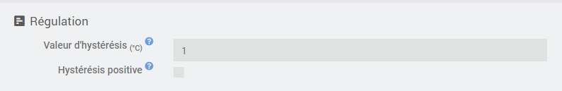
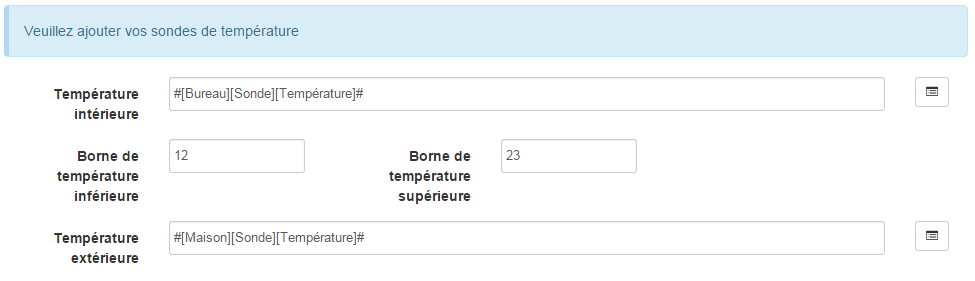
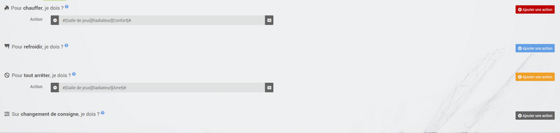

# Thermostat plugin

# Description

This plugin allows you to create and manage thermostats to control the heating of your home. It operates in 2 modes, your choice :

-   The mode **hysteresis** corresponds to switching the heating on and off as a function of the interior temperature, in relation to a threshold corresponding to the setpoint. The hysteresis allows to avoid too frequent switching when the temperature is around the set point.
-   The mode **temporal** calculates a percentage of heating over a predefined time cycle, taking into account the differences between the setpoint and the indoor and outdoor temperatures (insulation). This mode is more precise, has a learning function allowing automatic adjustment of the coefficients but may require some manual adjustments to adapt it to your installation. Important for the time mode to work, you absolutely need an indoor AND outdoor temperature sensor.

# Configuration

This plugin is for creating thermostats in Jeedom. It can control heating, air conditioning or both.

The advantage compared to a conventional thermostat is that it will be able to be fully integrated into your home automation installation. In addition to temperature regulation, because this is what is asked first, the thermostat can interact with all the equipment in the house.

Among its features are :

-   taking into account the outside temperature, therefore the house's insulation coefficient,
-   a regulatory system that learns to optimize regulation,
-   the possibility of managing the doors to disengage the thermostat,
-   fault management of equipment, temperature sensors and heaters,
-   complete programming with the diary plugin, including the possibility of anticipating the change of setpoint so that the temperature is reached at the programmed time (Smartstart)

First, we will show you the implementation, then detail the different settings of the thermostat configuration and finally, through some use cases, how we can enrich it in combination with other plugins or using scenarios.

## Configuration in a few clicks

The Jeedom thermostat is very powerful but for traditional use, its implementation is really simple and quick, from the moment we understand the essential steps :

-   definition of the Thermostat motor (hysteresis or time). It is the choice of the regulation algorithm.
-   configuration and operating range : heating only, air conditioning or both, min and max temperatures of use.
-   Defining the actions the thermostat should take to heat, cool, or shut down.

Then there are different tabs :

-   The mode configuration defines predetermined set temperatures. For example, comfort mode at 20 ° C, eco at 18 ° C. There may also be day, night, vacation, absence, etc ... here you start to see the possibilities of customization of the plugin.
-   To refine the operating mode of the thermostat, you will also be able to configure openings that will temporarily interrupt the regulation (for example, an open window can stop the heating). The definition of this interruption is done here simply.
-   The management of failure modes for temperature sensors or for heating makes it possible to define actions to be executed for a degraded mode.
-   The Advanced Configuration tab allows you to adjust the heating regulation parameters.
-   If in addition, you have the Agenda plugin, programming mode changes becomes possible directly from the programming tab.

Your thermostat is now operational and by using scenarios or by combining it with other plugins (agenda, virtual, presence, ...), it will blend smoothly into your home automation installation. This is what we get by default on the Dashboard :

The lock on the widget allows you to block the thermostat in a given setpoint, following an unforeseen event : holidays, guests, ...

## The creation of a thermostat in detail

To create a new thermostat, go to the configuration page by pulling down the menu **Plugins → Comfort** and select **Thermostat**. Click on the button **Add** located at the top left and enter the desired name for your thermostat.

First, we will inform the general parameters of the thermostat. They are found at the top left, general section and it is necessary to specify here the parent object, the activation and the visibility of the thermostat, usual information for any user of jeedom.

## The choice of thermostat algorithm

Highlighted in this image is the thermostat operating motor. There are 2 possible algorithms for temperature regulation.

When you select the mode **Hysteresis**, your heating starts up as soon as the temperature is lower than the setpoint minus the hysteresis and it turns off as soon as the temperature exceeds the setpoint plus the hysteresis.

For example, if the hysteresis is set at 1 ° C and the setpoint is 19 ° C, then the heating is activated when the temperature drops below 18 ° C and stops as soon as it reaches 20 ° C.

The parameters to be supplied are the hysteresis value in ° C and the command which allows the temperature measurement to be recovered. The hysteresis will be adjusted according to the precision of the sensor, for example for a precise probe at 0.5 ° C, a hysteresis of 0.2 ° C is a good compromise.

It is possible to take into account only the positive hysteresis by checking the box **Positive hysteresis**. In "Heating" mode, the thermostat will then come on as soon as the interior temperature is lower than the setpoint or, in "Air conditioning" mode, as soon as the interior temperature is higher than the setpoint.

> **INFORMATION**
>
> The parameters related to the hysteresis can be found in the tab **Advanced**.

In the case of the mode **Temporal**, the heating or air conditioning command is defined on a predefined cycle and the command execution time depends on the difference between the setpoint and the temperature measured by the sensor. The algorithm will also calculate the heating (or cooling) time over a cycle according to the inertia and the insulation of the room.

Finally, the longer the cycle time, the slower the regulation. Conversely, too short a time will cause frequent switching of your heating system which may not have time to heat the room volume effectively. It is recommended not to reduce this cycle time too much (acceptable values are between 30 and 60 minutes).

This type of regulation is more optimized, it improves comfort and allows substantial energy savings.

## The general configuration

In addition to the operating mode of the thermostat, you can decide whether the thermostat is used in heating, cooling or both mode. Then you indicate its range of use : the minimum and maximum setpoints will define the possible setpoint values accessible on the widget.

Then, you must specify the commands that allow you to measure the temperatures. Note that the Temporal mode absolutely needs to know the outside temperature. If you do not have an outdoor sensor, this can be provided by the "Weather forecast" plugin".

> **TRICK**
>
> The fields `` Minimum temperature '' and `` Maximum temperature '' define the operating range of the thermostat outside which a sensor failure is triggered *(See the paragraph on default actions below*).

It is also possible to indicate the consumption per day in kWh of your heating *(facultatif)* which will display an indication of the performance of your heating by doing the calculation **consumption / DJU** *(unified-degree-day)*. You can also display any command of your choice on the thermostat by entering it in the field **Personal order**.

## The actions

Everything relating to the controls of the radiator or air conditioner is described in the tab **Actions**. Several actions can be defined there, which gives our thermostat the possibility of controlling different equipment (case of operation by zone for example or control of another thermostat)

Actions are those that allow heating, cooling (air conditioning), stopping the command. An additional action can be envisaged at each setpoint change, whether in manual or automatic mode. You may want to use #slider# in the action's options to pass the current setpoint to the action.

## The trends : the starting point for automation

The modes (defined in the tab **Modes**) are predetermined thermostat guidelines that fit your lifestyle. For example, the mode *Night* or *Eco* give the temperature you want when everyone is asleep. The mode *Day* or *Comfort* determines the behavior of the thermostat to have a comfortable temperature when you are present at home. Nothing is frozen here. You can define as many modes as you want to use them via scenarios (We will come back to this later).

In the image below, the mode *Comfort* has a setpoint of 19 ° C and for the mode *Eco*, the thermostat is set at 17 ° C. The mode *Vacation* programs the thermostat at 15 ° C in the event of prolonged absence. It is not visible on the dashboard, because it is a scenario which programs all the equipment in *Vacation* and thus position the thermostat in this mode.

To define a mode, proceed as follows :

-   Click on the button *Add mode*,
-   give a name to this mode, for example `Eco`,
-   add an action and choose the command *Thermostat* of your thermostat equipment,
-   adjust the desired temperature for this mode,
-   Check the box **Visible** to display this mode on the thermostat widget on the Dashboard.

>**Important**
>
>Attention during the renaming of a mode it is absolutely necessary to review the scenarios / equipment which use the old name to pass them on the new

## The openings : to temporarily interrupt the thermostat

Imagine that you want to temporarily stop your heating or air conditioning, for example to ventilate the room for which the thermostat is active. To detect the opening of the window, you will use a sensor located on the opening of your window, thus allowing you to carry out this interruption by adding it in the tab of configuration of the openings. Two additional parameters can be set here; the opening and closing times of the window will cause the thermostat to stop and resume operation.

You can define the sending of an alert if one of the doors entered on this page remains open for more than `XX` minutes.

To configure the operation when the window is opened :

-   select the opening sensor info in the `Opening` field
-   adjust the time before the thermostat switches off after opening in the `Switch off if open more than (min.) :``
-   adjust the time after closing the window allowing the thermostat to be restarted in the `Switch on if closed since (min.) :``
-   Click on the button *Save* to record the inclusion of openings

> **TRICK**
>
> It is possible to define several openings, this is necessary when the thermostat controls an area composed of several rooms.

## Predict a degraded mode thanks to failure management

Faults can come from either the temperature sensors or the heating control. The thermostat can detect a fault during a prolonged deviation of the temperature from the setpoint.

### Temperature probe failure

If the sensors used by the thermostat do not return a temperature change, for example in the event of battery wear, then the thermostat initiates fault actions. When the fault occurs, it is possible to put the device in a predetermined operating mode, for example forcing the order of a pilot wire radiator. More simply the sending of a message by sms or a notification allows to be warned and to intervene manually.

> **Important**
>
> The parameter that allows the thermostat to decide on a probe failure is located in the tab *Advanced*. This is the `maximum time between 2 temperature changes`.

To define a failure action :

-   Click on the tab *Probe failure*,
-   Click on the button *Add a failure action*
-   select an action and fill in the associated fields

You can enter several actions, which will be executed in sequence and in the case of more complex actions, call up a scenario *(type `scenario` without accent in the action field then click elsewhere to be able to enter the name of the scenario)*.

### Heating / air conditioning failure

The proper functioning of the heating or air conditioning is conditioned by a good follow-up of instructions. Thus, if the temperature deviates from the operating range of the thermostat, it initiates heating / air conditioning failure actions. This analysis is carried out over several cycles.

> **Important**
>
> The parameter that allows the thermostat to decide on a probe failure is located in the tab *Advanced*. These are the `Hot failure margin` for heating and the` Cold failure margin` for air conditioning.

To define a failure action :

-   Click on the tab *Heating / air conditioning failure*,
-   Click on the button *Add a failure action*
-   select an action and fill in the associated fields

You can enter several actions, which will be executed in sequence and in the case of more complex actions, call up a scenario *(type `scenario` without accent in the action field then click elsewhere to be able to enter the name of the scenario)*.

## Manage special cases with the advanced thermostat configuration

This tab contains all the parameters for adjusting the thermostat in time mode. In most cases, it is not necessary to modify these values, since self-learning will automatically calculate the coefficients. However, even if the thermostat can adapt to most cases, it is possible to adjust the coefficients for an optimized configuration for your installation.

The coefficients are as follows :

-   **Heating coefficient / Cooling coefficient** : this is the gain of the regulatory system. This value is multiplied by the difference between the setpoint and the interior temperature measured to deduce the heating / cooling time.
-   **Hot learning / Cold learning** : this parameter indicates the progress of learning. A value of 1 indicates the start of learning, the algorithm performs a coarse adjustment of the coefficients. Then as this parameter increases, the adjustment becomes more refined. A value of 50 indicates the end of learning.
-   **Heating insulation / Air conditioning insulation** : this coefficient is multiplied by the difference between the setpoint and the outside temperature measured to deduce the heating / air conditioning time. It represents the contribution of the outside temperature to the heating / cooling time and its value is normally lower than the heating / cooling coefficient, in the case of a well insulated room.
-   **Learn hot insulation / Learn cold insulation** : same function as above, but for the insulation coefficients.
-   **Heating offset (%) / Air conditioning offset (%)** : The heating offset allows to take into account *internal contributions*, normally it should not be fixed but we suppose that learning integrates the dynamic part in the other 2 coefficients. The *internal contributions*, it is for example a computer which will cause a rise in temperature when it is turned on, but it may also be individuals (1 person = 80W on average), the refrigerator in the kitchen. In a room to the south, it is a sunny facade which can provide additional energy. In theory, this coefficient is negative.
- **Offset to be applied if the radiator is considered hot (%)** : to be used if your heating control system has a significant inertia, whether due to the radiators, the configuration of the room (distance between the radiator and the temperature probe) or the temperature probe itself ( depending on the model, their reactivity is more or less). The visible consequence of this inertia is a temporary overshoot of the set point during significant temperature increases (set point which goes from 15 ° C to 19 ° C for example). This parameter corresponds to the difference observed between the heating period (= heating is on) and the period when the temperature measured by the probe increases, divided by the length of the configured cycle. For example, if there is a difference of 30 minutes between the start of heating and the start of temperature rise, and the duration of the heating cycles is set to 60 minutes, we can set this parameter 50%. Thus, when a 100% heating cycle is followed by another heating, this parameter allows to take into account the heat generated by the radiator in the first cycle but not yet measured by the probe for the calculation of the second cycle, by reducing d '' its heating power. The power of the second cycle will then be reduced by 50% compared to the calculation made according to the temperature measured by the probe.
-   **Self learning** : check box to activate / deactivate learning the coefficients.
-   **Smart start** : This option allows you to give intelligence to the thermostat, by anticipating the change of setpoint so that the temperature is reached at the programmed time. This option requires having the agenda plugin. Please note that for the smart start to work, it is essential that the learning is more than 25. Another point it takes only the nearest event to come
-   **cycle (min)** : this is the thermostat calculation cycle. At the end of the cycle and according to the difference between the temperatures and the setpoint, the thermostat calculates the heating time for the next cycle.
-   **Minimum heating time (% of cycle)** : If the calculation results in a heating time lower than this value, then the thermostat considers that it is not necessary to heat / cool, the command will carry over to the next cycle. This avoids damaging certain devices such as stoves, but also achieves real energy efficiency.
-   **Hot Failure Margin / Cold Failure Margin** : this value is used to detect a heating / air conditioning malfunction. When the temperature exceeds this margin compared to the setpoint for more than 3 consecutive cycles, the thermostat switches to heating failure mode.
- **Limits incessant on / off cycles (pellet, gas, fuel oil) and PID** : This option allows you to regulate with different heating levels. The return of power from the next cycle should give the new heating level setpoint to the heater. Cycles end at 100%, so have a short cycle time.
- **Delta setpoint - outside temperature for hot / cold direction** : the thermostat chooses the direction (heating or air conditioning) according to the setpoint and the outside temperature (for reasons of savings, it is assumed that the inside temperature tends towards the outside temperature). With these parameters you can change the threshold. Ex : if you want 25 and it is 22 outside by default the thermostat will go into heating mode (just put in this mode for the calculation it does not mean that it will heat), by setting the hot delta to 4 it will no longer heat because 25-22 = 3 and 3 <4 it will therefore go into cooling mode (if the interior temperature is above the setpoint)

> **To know**
>
> Self-learning is still active. However, the initialization phase can be relatively long *(count about 3 days)*. During this phase, it is necessary to have sufficiently long periods during which the setpoint does not change.

## Thermostat controls

All commands are not accessible in programming, some are status information returned by the plugin. In the scenarios, we find :

-   **The trends** : it is possible to make the mode changes, by directly executing the commands (here, Comfort, Comfort morning, Eco, Holidays)
-   **Off** : this command cuts the thermostat, the regulation is no longer active, the heating / air conditioning is stopped
-   **Thermostat** : this is the thermostat setpoint
-   **lock** : lock command, it is not possible to modify the thermostat status (mode change, setpoint)
-   **unlock** : unlocks the thermostat to change its state
-   **Heating only** : regulation only intervenes to heat
-   **Air conditioning only** : the regulation is only active to cool
-   **Heating offset** : modifies the offset coefficient of the heating corresponding to the internal contributions : a scenario can modify this parameter according to a presence detector for example
-   **Cold offset** : as above but for air conditioning
-   **Allow everything** : modifies the behavior of the thermostat to act both in heating and in air conditioning
-   **Power** : only available in time mode, this command indicates the percentage of heating / cooling time over the cycle time.
-   **Performance** : only available if you have an outdoor temperature control and a consumption control (in kWh, reset to 0 every day at 00:00). This shows you the performance of your heating system compared to the unified degree day.
-   **Delta setpoint** : only available in time mode, this command allows you to enter a calculation delta on the setpoint. If> 0 then the thermostat will seek if it should heat for (setpoint - delta / 2) if yes then it will seek to heat up to (setpoint + delta / 2). The advantage is to heat longer but less often.

> **Tip**
>
> Using the thermostat in `Heating only` mode requires having defined the controls *To heat I have to ?* and *To stop everything I have to ?* In `Air conditioning only` mode, controls are required *To cool I have to ?* and *To stop everything I have to ?*. And in `All authorized` mode, it is necessary to have entered the 3 commands.

## A concrete example of using the thermostat

When your thermostat is configured, you must carry out the programming. The best method to explain it is to take a use case. So, we want to program our thermostat according to the hours of presence of the occupants of the house.

First, we will use 2 scenarios to put the heating in mode **Comfort** (setpoint 20 ° C) every morning of the week between 5 a.m. and 7:30 a.m., then in the evening between 5 p.m. and 9 p.m. The mode **Comfort** will also be activated on Wednesday afternoons from 12 p.m. to 9 p.m. and on weekends from 8 a.m. to 10 p.m. The rest of the time, the heating switches to **Eco**, with a set point of 18 ° C.

So we create the scenario ***Comfort heating***, in programmed mode :

and the code :

On the same principle, the "Eco Heating" scenario" :

and its code :

Note that in the scenarios, the thermostat control is complete since we can act on the operating mode (heating or air conditioning only), the modes, the set value and the lock (lock, unlock).

If scenario creation is sometimes complicated, for the programming of a thermostat, the combination of thermostat actions with the calendar of the agenda plugin makes it possible to do this simply.

The agenda plugin allows you to go further in programming and above all presents less risk of being wrong. Indeed, compared to the previous programming, the calendar will appear in clear on the screen and we will be able to take into account holidays, vacations .... In short, control the thermostat according to his lifestyle.

## Programming with the agenda plugin

We do not present here the Agenda plugin, the objective being to couple it with the programming of the thermostat. Note that if you have the agenda plugin, a tab *Programming* appears in the thermostat configuration, allowing direct access to the associated calendar.

So we are going to create a new agenda named **Heating programming**, to which will be added the thermostat mode change events.
Once the calendar has been created, we will add the Morning (Monday to Friday from 5 a.m. to 7:30 a.m.), Evening (Monday, Tuesday, Thursday and Friday from 5 p.m. to 9 p.m.), Wednesday (Wednesday from 12 p.m. to 9 p.m.) events, Weekend (8 a.m. to 10 p.m.), Public holidays. All these events have as their starting action the selection of the mode **Comfort** of the thermostat and as an end action the mode **Eco** :

For the programming of the Evening event :

Just repeat for each event to get this colorful monthly agenda :

Returning to the thermostat configuration, you can access calendar events directly from the programming tab :

## Visualization of thermostat operation

Once the thermostat is configured, it is important to check its efficiency.

In the `Home` menu, there is the` Thermostat` submenu. The window that appears when you select this menu is divided into three areas :

-   The *Widget* thermostat, to view the instantaneous status of the thermostat,
-   a graph representing the cumulative heating time per day (in number of hours),
-   another graph which displays the setpoint curves, interior temperature and heating status.

*Cumulative heating time graph*

*Thermostat curve graph*

# FAQ

>**Can we use the thermostat with a heated floor, which has a high inertia ?**
>
>The thermostat adapts practically to all cases, but this requires an in-depth analysis of your installation to adjust the coefficients, if you are in a particular situation. See the section on *Advanced configuration* to adjust the coefficients, especially in the case of a heated floor. Several topics on the forum deal with the use of the thermostat for different types of heating (stove, floor heating boiler, etc.))

>**My coefficients keep moving**
>
>   It's normal, the system constantly corrects its coefficients thanks to the self-learning system

>**How long does it take, in time mode, to learn ?**
>
>It takes on average 7 days for the system to learn and regulate optimally

>**I cannot program my thermostat**
>
>The programming of the thermostat can be done either by a scenario, or with the use of the agenda plugin.

>**My thermostat never seems to go into heating or air conditioning mode**
>
>If the thermostat does not have a control corresponding to heating and / or air conditioning, it cannot switch to these modes.

>**No matter how I change the temperature or the mode, the thermostat always returns to the previous state**
>
>Check that your thermostat is not locked

>**In hysteresis mode my thermostat never changes state**
>
>It is that the temperature probes do not automatically raise their value, it is advisable to set up a "Cron of control"

>**The curves of the thermostat (in particular the setpoint) do not seem to be correct**
>
>Look at the smoothing side of the order history in question. Indeed to gain in efficiency Jeedom averages the values over 5 minutes then over the hour.

>**The mode / action tab is empty and when I click on the add buttons it does nothing**
>
>Try to disable Adblock (or any other ad blocker), for some unknown reason these block the javaScript of the page for no reason.
