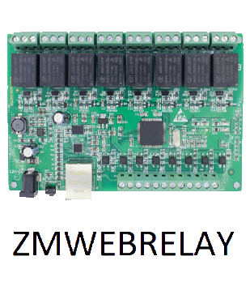

# Domotic protocol

>**IMPORTANT**

>Only contributor plugins have their documentation here. You can consult the documentation of the official plugins directly from the Jeedom Market. Once on the plugin in question, click on documentation.
>You can see [here](https://market.jeedom.com/index.php?v=d&p=market&type=plugin&categorie=automation+protocol) all official plugins in this category

| | | | |
|--- | --- | --- | ---|
||Abeille|Plugin Abeille pour la passerelle Zigate (https://zigate.fr).|[Documentation](http://kiwihc16.free.fr/) - [Market](https://market.jeedom.com/index.php?v=d&p=market_display&id=3219)|
||JeeMySensors|Plugin for the mySensors protocol|[Documentation](https://totoff974.github.io/jeedom-JeeMySensors/en_US/) - [Market](https://market.jeedom.com/index.php?v=d&p=market_display&id=3822)|
||JeePlcBus|Plugin for managing the PlcBus protocol|[Documentation](https://totoff974.github.io/JeePlcBus/en_US/) - [Market](https://market.jeedom.com/index.php?v=d&p=market_display&id=2487)|
||Store|Plugin to manage blinds|[Documentation]() - [Market](https://market.jeedom.com/index.php?v=d&p=market_display&id=296)|
||AirSend|Plugin for sending radio commands (433-434Mhz) through the AirSend device|[Documentation](https://devmel.github.io/jeedom_airsend/en_US/) - [Market](https://market.jeedom.com/index.php?v=d&p=market_display&id=3611)|
||Boxio|Plugin to use the Legrand USB-CPL module|[Documentation](https://apages2.github.io/pluginjeedom-boxio/en_US/) - [Market](https://market.jeedom.com/index.php?v=d&p=market_display&id=1335)|
||EIB - KNX|Connect Jeedom with your KNX home automation system and Jeedom will become a participant in your installation|[Documentation](http://mika-nt28.github.io/Documentations/eibd/en_US/) - [Market](https://market.jeedom.com/index.php?v=d&p=market_display&id=203)|
||Fibaro|Plugin to retrieve data from Fibaro boxes and interact|[Documentation](https://rems02.github.io/fibaro/en_US/) - [Market](https://market.jeedom.com/index.php?v=d&p=market_display&id=3588)|
||Global Cache|This plugin allows you to connect all Global Cache devices to Jeedom|[Documentation](https://mika-nt28.github.io/Documentations/globalcache/en_US/) - [Market](https://market.jeedom.com/index.php?v=d&p=market_display&id=2932)|
||jMQTT|This plugin connects Jeedom to an MQTT broker like Mosquitto in order to retrieve subscribed messages and publish its own messages. It supports the automatic discovery of equipment but also their manual creation.|[Documentation](https://domotruc.github.io/jMQTT/en_US/) - [Market](https://market.jeedom.com/index.php?v=d&p=market_display&id=3166)|
||JeeDore|Tydom gateway plugin|[Documentation](https://github.com/rezolv-fr/jeedoredaemon-dotnet/blob/master/docs/index.md) - [Market](https://market.jeedom.com/index.php?v=d&p=market_display&id=3757)|
||Jeedouino|Jeedouino plugin to manage Arduino card (s) (via Ethernet or USB), R.PI GPIOs, PiFace cards (piRack), RPI IO Plus 32e / s cards, MCP23017 (on RPI) or ESP8266 / NodeMCU / Wemos.|[Documentation](https://revlysj.github.io/jeedouino/en_US/index) - [Market](https://market.jeedom.com/index.php?v=d&p=market_display&id=2064)|
||Mochad - X10|Plugin to manage X10 devices via the Mochad daemon and a CM15 computer interface|[Documentation](https://mika-nt28.github.io/Documentations/mochad/en_US/) - [Market](https://market.jeedom.com/index.php?v=d&p=market_display&id=359)|
||Myhome|Plugin to use the Legrand / Bticino Zigbee module|[Documentation](https://apages2.github.io/pluginjeedom-myhome/en_US/) - [Market](https://market.jeedom.com/index.php?v=d&p=market_display&id=2445)|
||MyModbus|Plugin for the management of materials which have the ModBus protocol|[Documentation](https://bebel27a.github.io/jeedom-mymobdus.github.io/en_US/) - [Market](https://market.jeedom.com/index.php?v=d&p=market_display&id=3858)|
||Osram Lightify|Plugin for controlling Osram Lightify bulbs|[Documentation]() - [Market](https://market.jeedom.com/index.php?v=d&p=market_display&id=2811)|
||RPICT7V1|Plugin allowing to use on Jeedom the RPICT series cards in HAT for Raspberry Pi.|[Documentation](https://tlierdotfr.github.io/jeedom-plugin-rpict/en_US/) - [Market](https://market.jeedom.com/index.php?v=d&p=market_display&id=3637)|
||Tahoma|Plugin to use Tahoma and Connexoon|[Documentation](https://github.com/redbug26/jeedom-tahoma/tree/master/doc/en_US/index.asciidoc) - [Market](https://market.jeedom.com/index.php?v=d&p=market_display&id=1719)|
||Teleinfo|Plugin for using USB / Serial telephony information modems|[Documentation](https://NextDom.github.io/plugin-teleinfo/en_US/) - [Market](https://market.jeedom.com/index.php?v=d&p=market_display&id=260)|
||ZiGate|Zigate plugin for using the zigate|[Documentation](https://jeedom-zigate.github.io/jeedom-plugin-zigate) - [Market](https://market.jeedom.com/index.php?v=d&p=market_display&id=3186)|
||ZmWebRelay|Plugin for managing the ZmWebRelay|[Documentation](https://jeedomsteph37.github.io/zmwebrelay/en_US/) - [Market](https://market.jeedom.com/index.php?v=d&p=market_display&id=3417)|
