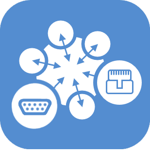

# Domotic protocol

>**Important**
>Only contributor plugins have their documentation here. You can consult the documentation of the official plugins directly from the Jeedom Market. Once on the plugin in question, click on documentation.
>You can see [here](https://market.jeedom.com/index.php?v=d&p=market&type=plugin&categorie=automation+protocol) all official plugins in this category

| | | | |
|--- | --- | --- | ---|
||MQTT Discovery|Plugin for automatic discovery of MQTT equipment based on the principle of 'MQTT Auto Discovery' (or 'HA Discovery') which exists under home assistant. Cela permet d'utiliser Open MQTT Gateway (https://docs.openmqttgateway.com/) sur esp32 ou l'équivalent Theengs gateway (https://gateway.theengs.io/) on pi. It becomes very easy to manage the presence of bluetooth tags such as nuts or to integrate a large list of BLEA compatible hardware. But it is also compatible with any equipment supporting 'MQTT Discovery' such as zwave, zigbee, Nuki, Switchbot, Sonos...|[Documentation Stable](https://mips2648.github.io/jeedom-plugins-docs/MQTTDiscovery/en_US/) - [Beta Documentation](https://mips2648.github.io/jeedom-plugins-docs/MQTTDiscovery/en_US/) [Market](https://market.jeedom.com/index.php?v=d&p=market_display&id=4429) [Changelog Stable](https://mips2648.github.io/jeedom-plugins-docs/MQTTDiscovery/en_US/changelog) - [Changelog Beta](https://mips2648.github.io/jeedom-plugins-docs/MQTTDiscovery/en_US/changelog)|
||Agua IOT Micronova navel 2 stove.0|PoeleAgua plugin for managing wood and pellet stoves using the micronova aqua iot platform (navel 2.0) ex: Jolly Mec / Piazzetta / superior / MCZ and much more. See documentation for supported models|[Documentation Stable](https://lefilliatre.github.io/lefilliatre-documentation/PoeleAgua/en_US/) - [Beta Documentation](https://lefilliatre.github.io/lefilliatre-documentation/PoeleAgua/en_US/) [Market](https://market.jeedom.com/index.php?v=d&p=market_display&id=4251) [Changelog Stable](https://lefilliatre.github.io/lefilliatre-documentation/PoeleAgua/en_US/changelog) - [Changelog Beta](https://lefilliatre.github.io/lefilliatre-documentation/PoeleAgua/en_US/changelog)|
||dht22|Plugin allowing the reading of DHT11, DHT22, AM2302 probes connected to the GPIO of a raspberry|[Documentation Stable](https://linura.github.io/dht22/en_US/) [Market](https://market.jeedom.com/index.php?v=d&p=market_display&id=4010) [Changelog Stable](https://linura.github.io/dht22/en_US/changelog)|
||EIB - KNX|Connect Jeedom with your KNX home automation system and Jeedom will become a participant in your installation|[Documentation Stable](http://mika-nt28.github.io/Documentations/eibd/en_US/) [Market](https://market.jeedom.com/index.php?v=d&p=market_display&id=203) [Changelog Stable](https://mika-nt28.github.io/Documentations/eibd/en_US/changelog)|
||Global Cache|This plugin allows you to connect all Global Cache devices to Jeedom|[Documentation Stable](https://mika-nt28.github.io/Documentations/globalcache/en_US/) [Market](https://market.jeedom.com/index.php?v=d&p=market_display&id=2932) [Changelog Stable](https://mika-nt28.github.io/Documentations/globalcache/en_US/changelog)|
||Homekit Network Devices Control|This plugin allows you to control your Homekit Network devices in jeedom (not BLE). The purpose of this plugin is to allow the control of devices that are only compatible with the Homekit protocol and no other protocol. So for example not Philips Hue which is accessible via a dedicated plugin !|[Documentation Stable](https://nebzhb.github.io/jeedom_docs/plugins/hkControl/en_US/) - [Beta Documentation](https://nebzhb.github.io/jeedom_docs/plugins/hkControl/en_US/) [Market](https://market.jeedom.com/index.php?v=d&p=market_display&id=3919) [Changelog Stable](https://nebzhb.github.io/jeedom_docs/plugins/hkControl/en_US/changelog) - [Changelog Beta](https://nebzhb.github.io/jeedom_docs/plugins/hkControl/en_US/changelog)|
||Jeedouino|Jeedouino plugin to manage Arduino board (s) (via Ethernet or USB), R.PI GPIOs, PiFace boards (piRack), RPI IO Plus 32e / s boards, MCP23017 (on RPI) or ESP8266 / NodeMCU / Wemos.|[Documentation Stable](https://revlysj.github.io/jeedouino/en_US/index) [Market](https://market.jeedom.com/index.php?v=d&p=market_display&id=2064) [Changelog Stable](https://revlysj.github.io/jeedouino/en_US/changelog)|
||Mochad - X10|Plugin to manage X10 devices via the Mochad daemon and a CM15 computer interface|[Documentation Stable](https://mika-nt28.github.io/Documentations/mochad/en_US/) [Market](https://market.jeedom.com/index.php?v=d&p=market_display&id=359) [Changelog Stable](https://mika-nt28.github.io/Documentations/mochad/en_US/changelog)|
||Modbus2MQTT|Allows reading and writing on modbus TCP devices from and to MQTT|[Documentation Stable](https://mips2648.github.io/jeedom-plugins-docs/modbus2mqtt/en_US/) - [Beta Documentation](https://mips2648.github.io/jeedom-plugins-docs/modbus2mqtt/en_US/) [Market](https://market.jeedom.com/index.php?v=d&p=market_display&id=4309) [Changelog Stable](https://mips2648.github.io/jeedom-plugins-docs/modbus2mqtt/en_US/changelog) - [Changelog Beta](https://mips2648.github.io/jeedom-plugins-docs/modbus2mqtt/en_US/changelog)|
||Modbus TCP Server|Plugin transforming your Jeedom into a modbus TCP server|[Documentation Stable](https://mips2648.github.io/jeedom-plugins-docs/modbustcp/en_US/) [Market](https://market.jeedom.com/index.php?v=d&p=market_display&id=4320) [Changelog Stable](https://mips2648.github.io/jeedom-plugins-docs/modbustcp/en_US/changelog)|
||MyModbus|Lecture et écriture en Modbus|[Documentation Stable](https://mrwaloo.github.io/jeedom-plugins-doc/en_US/mymodbus_doc) - [Beta Documentation](https://mrwaloo.github.io/jeedom-plugins-doc/en_US/mymodbus_doc) [Market](https://market.jeedom.com/index.php?v=d&p=market_display&id=3858) [Changelog Stable](https://mrwaloo.github.io/jeedom-plugins-doc/en_US/mymodbus_changelog) - [Changelog Beta](https://mrwaloo.github.io/jeedom-plugins-doc/en_US/mymodbus_changelog)|
||Relay Module|Plugin pour piloter des modules de relais ethernet<ul><li><a href='https://fr.aliexpress.com/item/4000999069820.html?spm=a2g0o.productlist.main.1.4be8486f3Ic93qDingtian'>IOT Relay</a></li><li><a href='https://fr.aliexpress.com/item/32914881766.html?spm=a2g0o.productlist.main.45.109933f0huhSBo'>8-channel IP network relay, dual control, RJ45 Ethernet interface</li>> Other type of card could be added upon request|[Documentation Stable](http://fobsoft.github.io/jeedom-plugins-documentation/relayModule/fr_FR) - [Beta Documentation](http://fobsoft.github.io/jeedom-plugins-documentation/relayModule/fr_FR) [Market](https://market.jeedom.com/index.php?v=d&p=market_display&id=4382) [Changelog Stable](http://fobsoft.github.io/jeedom-plugins-documentation/relayModule/en_US/changelog) - [Changelog Beta](http://fobsoft.github.io/jeedom-plugins-documentation/relayModule/en_US/changelog)|
||Niren TcpKpI8O8|Tcpkp plugin for managing Niren tcpkp I/O cards|[Documentation Stable](https://lefilliatre.github.io/lefilliatre-documentation/tcpkp/en_US/) - [Beta Documentation](https://lefilliatre.github.io/lefilliatre-documentation/tcpkp/en_US/) [Market](https://market.jeedom.com/index.php?v=d&p=market_display&id=4256) [Changelog Stable](https://lefilliatre.github.io/lefilliatre-documentation/tcpkp/en_US/changelog) - [Changelog Beta](https://lefilliatre.github.io/lefilliatre-documentation/tcpkp/en_US/changelog)|
