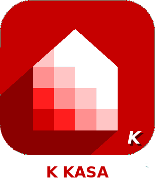

# Connected objects

>**IMPORTANT**
>Only contributor plugins have their documentation here. You can consult the documentation of the official plugins directly from the Jeedom Market. Once on the plugin in question, click on documentation.
>You can see [here](https://market.jeedom.com/index.php?v=d&p=market&type=plugin&categorie=devicecommunication) all official plugins in this category

| | | | |
|--- | --- | --- | ---|
||Bosch Indego|Plugin for Bosch Indego robotic lawnmowers|[Documentation](https://jpty.github.io/jeedom/plugins/BoschIndego/en_US/index.html) - [Market](https://market.jeedom.com/index.php?v=d&p=market_display&id=3937)|
||JPI Plugin||[Documentation](https://NextDom.github.io/plugin-jpi/en_US/) - [Market](https://market.jeedom.com/index.php?v=d&p=market_display&id=2850)|
||SmartLife / Tuya objects|SmartLife or Tuya connected object management plugin|[Documentation](https://sabinus52.github.io/jeedom-smartlife/en_US/) - [Market](https://market.jeedom.com/index.php?v=d&p=market_display&id=3724)|
||XeeCloud|XeeCloud plugin to display connected car info|[Documentation](https://fgmx85.github.io/plugin-XeeCloud/en_US/) - [Market](https://market.jeedom.com/index.php?v=d&p=market_display&id=1925)|
||Alexa - SmartHome|SmartHome interface for Alexa-API|[Documentation](http://sigalou-domotique.fr/plugin-jeedom-alexa-api/92-alexa-amazon-smarthome-documentation-2) - [Market](https://market.jeedom.com/index.php?v=d&p=market_display&id=3914)|
||Flipr|Plugin for retrieving info from the Flipr connected object (www.goflipr.com)|[Documentation](https://tof32.github.io/docPluginFlipr/en_US/) - [Market](https://market.jeedom.com/index.php?v=d&p=market_display&id=3981)|
||Gardena Smart System||[Documentation](https://xlec.github.io/jeedom-gardenasmartsystem/en_US/) - [Market](https://market.jeedom.com/index.php?v=d&p=market_display&id=3367)|
||Heatzy|Plugin to manage Heatzy connected modules|[Documentation](https://l3flo.github.io/jeedom-heatzy/en_US/) - [Market](https://market.jeedom.com/index.php?v=d&p=market_display&id=3111)|
||Home Connect|Plugin to retrieve information from compatible household appliances|[Documentation](https://jmvedrine.github.io/homeconnect/en_US/) - [Market](https://market.jeedom.com/index.php?v=d&p=market_display&id=3894)|
||kKasa|Kasa T-Link plugin|[Documentation](https://kavod.github.io/kkasa/en_US/) - [Market](https://market.jeedom.com/index.php?v=d&p=market_display&id=3489)|
||K Roomba|Plugin to control Roomba vacuum cleaners|[Documentation](https://jmvedrine.github.io/kroomba/en_US/) - [Market](https://market.jeedom.com/index.php?v=d&p=market_display&id=2776)|
||Nissan Leaf Connect||[Documentation]() - [Market](https://market.jeedom.com/index.php?v=d&p=market_display&id=2383)|
||Sonoff DIY|Sonoff DIY|[Documentation](http://sigalou-domotique.fr/sonoff-diy/83-plugin-sonoff-diy-documentation) - [Market](https://market.jeedom.com/index.php?v=d&p=market_display&id=3890)|
||Sure PetCare|Plug-in for Sure Petcare connected objects for animals (Sureflap)|[Documentation](https://jmvedrine.github.io/jeedom-surepetcare/en_US/) - [Market](https://market.jeedom.com/index.php?v=d&p=market_display&id=3718)|
||Switchbot|Plugin for controlling switch-bot equipment (Actuators, probes).Use of a compulsory Bluetooth key. Does not require the hub to operate.Read the documentation and the prerequisites before any use|[Documentation](https://zyg0m4t1k.github.io/switchbot/en_US/) - [Market](https://market.jeedom.com/index.php?v=d&p=market_display&id=3892)|
||Tesla|Plugin to monitor a Tesla|[Documentation](http://tesla.jeedom.free.fr) - [Market](https://market.jeedom.com/index.php?v=d&p=market_display&id=3486)|
||Twinkly|Twinkly plugin to order tkinkly garlands|[Documentation](https://koleos6.github.io/twinkly/en_US/) - [Market](https://market.jeedom.com/index.php?v=d&p=market_display&id=3541)|
||Wall|Plugin for tablet management|[Documentation](https://barre35.github.io/jeedom-plugin-wall/en_US/index) - [Market](https://market.jeedom.com/index.php?v=d&p=market_display&id=3634)|
||wifilightV2||[Documentation](https://bcaro.github.io/wifilightV2-doc/en_US/) - [Market](https://market.jeedom.com/index.php?v=d&p=market_display&id=2793)|
||worxLandroidS||[Documentation](https://sebsst.github.io/worxLandroidS/en_US/) - [Market](https://market.jeedom.com/index.php?v=d&p=market_display&id=3396)|
||Renault ZE|Plugin for connection with Renault ZE vehicles|[Documentation](https://anto35.github.io/jeedom_docs/plugins/ze/index) - [Market](https://market.jeedom.com/index.php?v=d&p=market_display&id=3067)|
