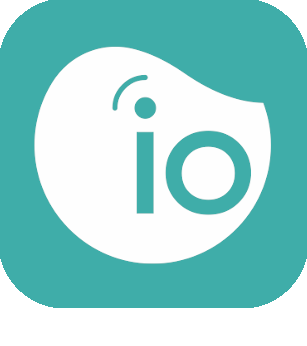
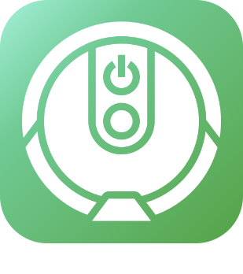

# Connected objects

>**Important**
>Only contributor plugins have their documentation here. You can consult the documentation of the official plugins directly from the Jeedom Market. Once on the plugin in question, click on documentation.
>You can see [here](https://market.jeedom.com/index.php?v=d&p=market&type=plugin&categorie=devicecommunication) all official plugins in this category

| | | | |
|--- | --- | --- | ---|
||Bosch Indego|Plugin for Bosch Indego robotic lawnmowers|[Documentation Stable](https://jpty.github.io/jeedom/plugins/BoschIndego/en_US/index.html) [Market](https://market.jeedom.com/index.php?v=d&p=market_display&id=3937) [Changelog Stable](https://jpty.github.io/jeedom/plugins/BoschIndego/en_US/changelog.html)|
||Mercedes Me|Plugin arrété car Mercedes arrête l'API BYOC: https://developer.mercedes-benz.com/news/bringyourowncar-sundown Plugin to retrieve information from your Mercedes.  Based on the official API.|[Documentation Stable](https://mguyard.github.io/Jeedom-Documentations/en_US/Mercedes_me/documentation) - [Beta Documentation](https://mguyard.github.io/Jeedom-Documentations/en_US/Mercedes_me/documentation) [Market](https://market.jeedom.com/index.php?v=d&p=market_display&id=4046) [Changelog Stable](https://mguyard.github.io/Jeedom-Documentations/en_US/Mercedes_me/changelog) - [Changelog Beta](https://mguyard.github.io/Jeedom-Documentations/en_US/Mercedes_me/changelog)|
||MyTado|This plugin allows you to manage Tado connected objects|[Documentation Stable](https://doc.jeedom.com/en_US/plugins/programming/MyTado) - [Beta Documentation](https://doc.jeedom.com/en_US/plugins/programming/MyTado/beta) [Market](https://market.jeedom.com/index.php?v=d&p=market_display&id=4502) [Changelog Stable](https://doc.jeedom.com/en_US/plugins/programming/MyTado/changelog) - [Changelog Beta](https://doc.jeedom.com/en_US/plugins/programming/MyTado/beta/changelog)|
||AirthingsX|Integration with Airthings API: records measurements of Airthings equipment for air quality. Attention: requires PHP 7.3 and an Airthings API key to be created by yourself (the operation is free).|[Documentation Stable](https://www.xypii.be/projects/jeedom-airthingsx/en_US/) [Market](https://market.jeedom.com/index.php?v=d&p=market_display&id=4268) [Changelog Stable]()|
||Alexa-Smart Home|The plugin has been completely redesigned and redesigned to accept the equipment detected by the Alexa application. The link set up by the plugins between Jeedom and the Amazon server makes it possible to trace the states of the equipment and to send them commands. The link between the Amazon server (Alexa) and the equipment is ensured by the skills of each manufacturer (Xiaomi, SmartLife, Tuya, Netatmo, Wemo, Somfy, eWelink, etc.), which makes the possibilities totally endless.|[Documentation Stable](http://jeedom.sigalou-domotique.fr/alexa-amazon-smarthome-documentation) [Market](https://market.jeedom.com/index.php?v=d&p=market_display&id=3914) [Changelog Stable](http://jeedom.sigalou-domotique.fr/alexa-amazon-smarthome-changelog)|
||Arenti|Plugin allowing you to retrieve all information and control devices synchronized with the Arenti API. For viewing the video stream : automatic creation of camera equipment if you have the camera plugin and ONVIF has been activated on the device.|[Documentation Stable](https://flobul-domotique.fr/presentation-et-documentation-du-plugin-arenti-pour-jeedom/) - [Beta Documentation](https://flobul-domotique.fr/presentation-et-documentation-du-plugin-arenti-pour-jeedom/) [Market](https://market.jeedom.com/index.php?v=d&p=market_display&id=4420) [Changelog Stable](https://flobul-domotique.fr/liste-des-versions-du-plugin-arenti-pour-jeedom/) - [Changelog Beta](https://flobul-domotique.fr/liste-des-versions-du-plugin-arenti-pour-jeedom/)|
||FordCar|Plugin allowing this connection to Ford Pass and to recover all the information of your Vehicle. It allows you to lock/unlock your vehicle and, depending on the region of the world, start your vehicle.|[Documentation Stable](https://cddu33.github.io/fordcar/en_US/) - [Beta Documentation](https://cddu33.github.io/fordcar/en_US/) [Market](https://market.jeedom.com/index.php?v=d&p=market_display&id=4319) [Changelog Stable](https://cddu33.github.io/fordcar/en_US/changelog) - [Changelog Beta](https://cddu33.github.io/fordcar/en_US/changelog_beta)|
||Govee|Plugin allowing you to control Govee equipment (free since 04/07/2024)|[Documentation Stable](https://youdom.net/plugin-govee-with-youdom/) - [Beta Documentation](https://youdom.net/plugin-govee-with-youdom/) [Market](https://market.jeedom.com/index.php?v=d&p=market_display&id=4371) [Changelog Stable](https://youdom.net/plugin-govee-changelog/) - [Changelog Beta](https://youdom.net/plugin-govee-changelog/)|
||Home Connect|Plugin to retrieve information from compatible household appliances|[Documentation Stable](https://jmvedrine.github.io/homeconnect/en_US/) [Market](https://market.jeedom.com/index.php?v=d&p=market_display&id=3894) [Changelog Stable](https://jmvedrine.github.io/homeconnect/en_US/changelog)|
||Info & Location|Management of the presence, geolocation and other information of a telephone|[Documentation Stable](https://jeremie-c.github.io/plugin-InfoLoc/en_US/index) [Market](https://market.jeedom.com/index.php?v=d&p=market_display&id=4020) [Changelog Stable](https://jeremie-c.github.io/plugin-InfoLoc/en_US/changelog)|
||iopool - EcO|Plugin Jeedom pour collecter les informations de la sonde <a href='https://iopool.com'>iopool EcO from the iopool Cloud (API). For more details, do not hesitate to consult the documentation which is very complete.|[Documentation Stable](https://mguyard.github.io/Jeedom-Documentations/en_US/iopool_EcO/documentation) - [Beta Documentation](https://mguyard.github.io/Jeedom-Documentations/en_US/iopool_EcO/documentation) [Market](https://market.jeedom.com/index.php?v=d&p=market_display&id=4189) [Changelog Stable](https://mguyard.github.io/Jeedom-Documentations/en_US/iopool_EcO/changelog) - [Changelog Beta](https://mguyard.github.io/Jeedom-Documentations/en_US/iopool_EcO/changelog)|
||Kia-UVO|KIA-UVO Compatible Vehicle Management Plugin|[Documentation Stable](https://neopix.github.io/jeedom-kiauvo-documentation/fr_FR) [Market](https://market.jeedom.com/index.php?v=d&p=market_display&id=4076) [Changelog Stable](https://neopix.github.io/jeedom-kiauvo-documentation/en_US/changelog)|
||iRobot|Plugin for controlling robot vacuum cleaners (Roomba) and floor scrubbers (Braava) from the iRobot brand.|[Documentation Stable](https://mips2648.github.io/jeedom-plugins-docs/kroomba/en_US/) - [Beta Documentation](https://mips2648.github.io/jeedom-plugins-docs/kroomba/en_US/) [Market](https://market.jeedom.com/index.php?v=d&p=market_display&id=2776) [Changelog Stable](https://mips2648.github.io/jeedom-plugins-docs/kroomba/en_US/changelog) - [Changelog Beta](https://mips2648.github.io/jeedom-plugins-docs/kroomba/en_US/changelog)|
||LG Smart Thinq|Plugin for LG brand Connected Objects compatible with 'Smart Thinq APIv1'|[Documentation Stable](https://pifou25.github.io/jeedom-lgthinq-plugin/en_US/) - [Beta Documentation](https://pifou25.github.io/jeedom-lgthinq-plugin/en_US/index_beta) [Market](https://market.jeedom.com/index.php?v=d&p=market_display&id=4080) [Changelog Stable](https://pifou25.github.io/jeedom-lgthinq-plugin/en_US/changelog) - [Changelog Beta](https://pifou25.github.io/jeedom-lgthinq-plugin/en_US/changelog_beta)|
||LG ThinQ|Plugin to retrieve information and control devices synchronized with the LG ThinQ API|[Documentation Stable](https://flobul-domotique.fr/presentation-et-documentation-du-plugin-lgthinq2-pour-jeedom/) - [Beta Documentation](https://flobul-domotique.fr/presentation-et-documentation-du-plugin-lgthinq2-pour-jeedom/) [Market](https://market.jeedom.com/index.php?v=d&p=market_display&id=4485) [Changelog Stable](https://flobul-domotique.fr/liste-des-versions-du-plugin-lgthinq2-pour-jeedom/) - [Changelog Beta](https://flobul-domotique.fr/liste-des-versions-du-plugin-lgthinq2-pour-jeedom/)|
||Miele|Plugin for integrating all appliances of the Miele@Home range. It is possible to access device data, monitor it and perform certain actions (depending on the device)|[Documentation Stable](https://mips2648.github.io/jeedom-plugins-docs/miele/en_US/) - [Beta Documentation](https://mips2648.github.io/jeedom-plugins-docs/miele/en_US/) [Market](https://market.jeedom.com/index.php?v=d&p=market_display&id=3950) [Changelog Stable](https://mips2648.github.io/jeedom-plugins-docs/miele/en_US/changelog) - [Changelog Beta](https://mips2648.github.io/jeedom-plugins-docs/miele/en_US/changelog)|
||Netatmo Pro|Integration of the Netatmo universe|[Documentation Stable](https://thanaus.github.io/jeedom_docs/plugins/netatmopro/en_US/) - [Beta Documentation](https://thanaus.github.io/jeedom_docs/plugins/netatmopro/en_US/) [Market](https://market.jeedom.com/index.php?v=d&p=market_display&id=2950) [Changelog Stable](https://thanaus.github.io/jeedom_docs/plugins/netatmopro/en_US/changelog) - [Changelog Beta](https://thanaus.github.io/jeedom_docs/plugins/netatmopro/en_US/changelog)|
||Netro watering|Plugin based on the Netro Smart Garden automatic watering system|[Documentation Stable](https://kcofoni.github.io/jeedom-docs/plugin-netroarrosage/docs/en_US/) - [Beta Documentation](https://kcofoni.github.io/jeedom-docs/plugin-netroarrosage/docs/en_US/beta/) [Market](https://market.jeedom.com/index.php?v=d&p=market_display&id=4354) [Changelog Stable](https://kcofoni.github.io/jeedom-docs/plugin-netroarrosage/docs/en_US/changelog) - [Changelog Beta](https://kcofoni.github.io/jeedom-docs/plugin-netroarrosage/docs/en_US/beta/changelog)|
||SmartThings|This plugin allows you to create equipment for each device identified on your SmartThings account. Communication is done only through the SmartThings API, no direct connection between Jeedom and the device is made. The commands generated during synchronization depend on the device (each device provides its list of commands), they also depend on the information reported via the API (if the value is 'null', the command is not created because not updated via the API or not managed). I still left an option to create all the commands just in case. Les commandes disponibles varient et peuvent être très nombreuses : display the status of the device, its program, turn it on/off, change channels, launch a program...  I implemented a widget for the most common devices, for others, you are free to create your own, and why not share it.|[Documentation Stable](https://flobul-domotique.fr/documentation-du-plugin-smartthings-pour-jeedom) [Market](https://market.jeedom.com/index.php?v=d&p=market_display&id=4099) [Changelog Stable](https://flobul-domotique.fr/liste-des-versions-du-plugin-smartthings-pour-jeedom/)|
||Sure PetCare|Plug-in for Sure Petcare connected objects for animals (Sureflap)|[Documentation Stable](https://jmvedrine.github.io/jeedom-surepetcare/en_US/) - [Beta Documentation](https://jmvedrine.github.io/jeedom-surepetcare/en_US/) [Market](https://market.jeedom.com/index.php?v=d&p=market_display&id=3718) [Changelog Stable](https://jmvedrine.github.io/jeedom-surepetcare/en_US/changelog) - [Changelog Beta](https://raw.githubusercontent.com/jmvedrine/jeedom-surepetcare/beta/docs/en_US/changelog.md)|
||Switchbotcloud|This plugin allows you to control Switchbot equipment via Jeedom.|[Documentation Stable](https://jeremyarnoux.github.io/jeedom/plugins/switchbotcloud/index.html) [Market](https://market.jeedom.com/index.php?v=d&p=market_display&id=4369) [Changelog Stable](https://jeremyarnoux.github.io/jeedom/plugins/switchbotcloud/changelog.html)|
||Tesla|Here is the plugin to monitor your Tesla(s) ! Access your Tesla from Jeedom and control heating, charging, windows, ... from scenarios.  This plugin also contains a tracking tool that allows you to follow the history of your journeys, your charges and your parking times.  Find the statistics of the journeys made. Set favorites on the map with a range and when your Tesla enters or exits this favorite, trigger scenarios, ...   Make your Tesla a connected object !  No Cloud, your data is stored at home. No subscription, no additional costs|[Documentation Stable](http://tesla.jeedom.free.fr/documentation) - [Beta Documentation](http://tesla.jeedom.free.fr/documentation) [Market](https://market.jeedom.com/index.php?v=d&p=market_display&id=3486) [Changelog Stable](http://tesla.jeedom.free.fr/changelog) - [Changelog Beta](http://tesla.jeedom.free.fr/changelog)|
||Velux|Plugin to coordinate the movements of a window and a Velux roller shutter.   Please note this plugin requires the hkControl plugin!|[Documentation Stable](https://ktn001.github.io/en_US/velux/) - [Beta Documentation](https://ktn001.github.io/en_US/velux/beta.html) [Market](https://market.jeedom.com/index.php?v=d&p=market_display&id=4453) [Changelog Stable](https://ktn001.github.io/en_US/velux/changelog) - [Changelog Beta](https://ktn001.github.io/en_US/velux/changelog)|
||VeSync|Plugin to retrieve information and control synchronized devices on the VeSync API|[Documentation Stable](https://flobul-domotique.fr/presentation-et-documentation-du-plugin-vesync-pour-jeedom/) - [Beta Documentation](https://flobul-domotique.fr/presentation-et-documentation-du-plugin-vesync-pour-jeedom/) [Market](https://market.jeedom.com/index.php?v=d&p=market_display&id=4362) [Changelog Stable](https://flobul-domotique.fr/liste-des-versions-du-plugin-vesync-pour-jeedom/) - [Changelog Beta](https://flobul-domotique.fr/liste-des-versions-du-plugin-vesync-pour-jeedom/)|
||Wall|Plugin for tablet management|[Documentation Stable](https://barre35.github.io/jeedom-plugin-doc/en_US/wall_documentation) [Market](https://market.jeedom.com/index.php?v=d&p=market_display&id=3634) [Changelog Stable](https://barre35.github.io/jeedom-plugin-doc/en_US/wall_changelog)|
||wifilightV2|Controls a large number of wifi devices locally with the internet turned off : lamps, leds, sockets, switches, thermostats, various brands. Tapo, Kasa, Govee, Philips Wiz, Meross, Mystrom, MagicHome, Gateway Tuya/Zigbee including SilverCrest Lidl, Smartlife, Tuya, Ewelink, Sonoff, Sonoff DIY, Mi.Light (Milight), Yeelight, Xiaomi Philips, TP-Link, Nanoleaf, H801, iHomma, arilux, Revogi, etc. Consult the documentation for the exact list of compatible equipment..|[Documentation Stable](https://bcaro.github.io/wifilightV2-doc/en_US/) - [Beta Documentation](https://bcaro.github.io/wifilightV2-doc/en_US/) [Market](https://market.jeedom.com/index.php?v=d&p=market_display&id=2793) [Changelog Stable](https://bcaro.github.io/wifilightV2-doc/en_US/changelog) - [Changelog Beta](https://bcaro.github.io/wifilightV2-doc/en_US/changelog)|
||worxLandroidS|Jeedom plugin for Worx Landroid robot mowers models S / M / L cloud version|[Documentation Stable](https://mips2648.github.io/jeedom-plugins-docs/worxLandroidS/en_US/) - [Beta Documentation](https://mips2648.github.io/jeedom-plugins-docs/worxLandroidS/en_US/) [Market](https://market.jeedom.com/index.php?v=d&p=market_display&id=3396) [Changelog Stable](https://mips2648.github.io/jeedom-plugins-docs/worxLandroidS/en_US/changelog) - [Changelog Beta](https://mips2648.github.io/jeedom-plugins-docs/worxLandroidS/en_US/changelog)|
