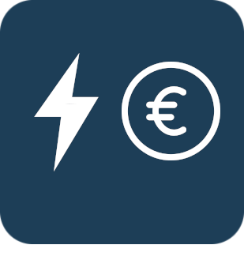
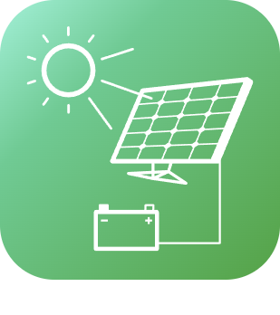

# Energie

>**Important**
>Only contributor plugins have their documentation here. You can consult the documentation of the official plugins directly from the Jeedom Market. Once on the plugin in question, click on documentation.
>You can see [here](https://market.jeedom.com/index.php?v=d&p=market&type=plugin&categorie=energy) all official plugins in this category

| | | | |
|--- | --- | --- | ---|
||EcogazSync|Plugin to connect to the Ecogaz API.|[Documentation Stable](https://github.com/impulsio/EcogazSync/blob/main/docs/en_US/index.md) - [Beta Documentation](https://github.com/impulsio/EcogazSync/blob/beta/docs/en_US/index.md) [Market](https://market.jeedom.com/index.php?v=d&p=market_display&id=4347) [Changelog Stable](https://github.com/impulsio/EcogazSync/blob/main/docs/en_US/changelog.md) - [Changelog Beta](https://github.com/impulsio/EcogazSync/blob/beta/docs/en_US/changelog.md)|
||Electricity Cost|Présentation du plugin: https://www.youtube.com/watch?v=ZW8eTLZ5hsw Plugin allowing to calculate the costs according to their electrical state, power or consumption. It is possible to assign equipment to meter equipment in order to compare costs. Electricity Cost allows to retrieve daily, weekly, monthly and annual costs.|[Documentation Stable](https://hbedek.github.io/Jeedom_docs/docs/ElectricityCost/en_US/) [Market](https://market.jeedom.com/index.php?v=d&p=market_display&id=4179) [Changelog Stable](https://hbedek.github.io/Jeedom_docs/docs/ElectricityCost/en_US/changelog)|
||RteSync|Plugin to connect to the RTE API. For the moment only the Ecowatt API is available. Please follow the documentation for the configuration. [Documentation](https://github.com/impulsio/RteSync/blob/beta/docs/en_US/index.md)|[Documentation Stable](https://github.com/impulsio/RteSync/blob/main/docs/en_US/index.md) - [Beta Documentation](https://github.com/impulsio/RteSync/blob/beta/docs/en_US/index.md) [Market](https://market.jeedom.com/index.php?v=d&p=market_display&id=4338) [Changelog Stable](https://github.com/impulsio/RteSync/blob/main/docs/en_US/changelog.md) - [Changelog Beta](https://github.com/impulsio/RteSync/blob/beta/docs/en_US/changelog.md)|
||SmartMeter P1|Plugin to connect to a SmartMeter equipped with a P1 port|[Documentation Stable](https://mips2648.github.io/jeedom-plugins-docs/SmartMeterP1/en_US/) - [Beta Documentation](https://mips2648.github.io/jeedom-plugins-docs/SmartMeterP1/en_US/) [Market](https://market.jeedom.com/index.php?v=d&p=market_display&id=4190) [Changelog Stable](https://mips2648.github.io/jeedom-plugins-docs/SmartMeterP1/en_US/changelog) - [Changelog Beta](https://mips2648.github.io/jeedom-plugins-docs/SmartMeterP1/en_US/changelog)|
||APSystems ECU|Plugin recovering data from an APSystems ECU in Jeedom. It retrieves information about ECU, micro-inverters, generated power per module, voltages, temperatures...|[Documentation Stable](https://nchoiset.github.io/jeedom-plugins-doc/aps_ecu/en_US/index) - [Beta Documentation](https://nchoiset.github.io/jeedom-plugins-doc/aps_ecu/en_US/beta/index) [Market](https://market.jeedom.com/index.php?v=d&p=market_display&id=4318) [Changelog Stable](https://nchoiset.github.io/jeedom-plugins-doc/aps_ecu/en_US/changelog) - [Changelog Beta](https://nchoiset.github.io/jeedom-plugins-doc/aps_ecu/en_US/beta/changelog)|
||APSEZ1M|Plugin for controlling and retrieving information from APSystem EZ1-M Microinverters. Power recovery by panel, overall, etc|[Documentation Stable](https://taggou91.github.io/jeedom_docs/plugins/aps-ez1m/en_US/) [Market](https://market.jeedom.com/index.php?v=d&p=market_display&id=4477) [Changelog Stable](https://taggou91.github.io/jeedom_docs/plugins/aps-ez1m/changelog.html)|
||Autoconsommation|Plugin to turn on and off other Jeedom equipment in order to optimize electrical self-consumption (in the case of a photovoltaic installation)|[Documentation Stable](https://bwibwi13.github.io/plugin-autoconso/fr_FR) [Market](https://market.jeedom.com/index.php?v=d&p=market_display&id=4322) [Changelog Stable](https://bwibwi13.github.io/plugin-autoconso/en_US/changelog)|
||Beem|Plugin to retrieve Beembox information from Beem energy|[Documentation Stable](https://flobul-domotique.fr/presentation-et-documentation-du-plugin-beem-pour-jeedom/) - [Beta Documentation](https://flobul-domotique.fr/presentation-et-documentation-du-plugin-beem-pour-jeedom/) [Market](https://market.jeedom.com/index.php?v=d&p=market_display&id=4337) [Changelog Stable](https://flobul-domotique.fr/liste-des-versions-du-plugin-beem-pour-jeedom/) - [Changelog Beta](https://flobul-domotique.fr/liste-des-versions-du-plugin-beem-pour-jeedom/)|
||Followed Conso|Plugin to manage its energy consumption (gas, electricity and water) as well as its production |[Documentation Stable](https://mickeys27.github.io/Docs/conso/en_US/) [Market](https://market.jeedom.com/index.php?v=d&p=market_display&id=1805) [Changelog Stable](https://mickeys27.github.io/Docs/conso/en_US/changelog)|
||EDF Time|Plugin to retrieve EDF Tempo information and display the remaining days for each color, as well as off-peak / peak hour rates.|[Documentation Stable](https://github.com/idoexp/jeedom_edf_tempo#edf-tempo-pour-jeedom) [Market](https://market.jeedom.com/index.php?v=d&p=market_display&id=4432) [Changelog Stable](https://github.com/idoexp/jeedom_edf_tempo#changelog)|
||eeSmart|Plugin to retrieve the data that the ERL D2L module from eeemart sends to the monitoring.consopy server.|[Documentation Stable](https://caelion.github.io/jeedom-plugins-documentation/eeSmart/en_US/) [Market](https://market.jeedom.com/index.php?v=d&p=market_display&id=3933) [Changelog Stable](https://caelion.github.io/jeedom-plugins-documentation/eeSmart/en_US/changelog)|
||Emporia Energy|Real-time energy consumption monitoring (Vue Energy Monitor)|[Documentation Stable](https://thanaus.github.io/jeedom_docs/plugins/emporiapro/en_US/) - [Beta Documentation](https://thanaus.github.io/jeedom_docs/plugins/emporiapro/en_US/) [Market](https://market.jeedom.com/index.php?v=d&p=market_display&id=4409) [Changelog Stable](https://thanaus.github.io/jeedom_docs/plugins/emporiapro/en_US/changelog) - [Changelog Beta](https://thanaus.github.io/jeedom_docs/plugins/emporiapro/en_US/changelog)|
||Enphase Secure|Plugin allowing to connect to Enphase gateways in version V7 minimum. the plugin automatically retrieves the token and then locally on the gateway. It remains local until the token expires|[Documentation Stable](https://cddu33.github.io/enphase_secure/en_US/index) - [Beta Documentation](https://cddu33.github.io/enphase_secure/en_US/beta_doc) [Market](https://market.jeedom.com/index.php?v=d&p=market_display&id=4334) [Changelog Stable](https://cddu33.github.io/enphase_secure/en_US/changelog) - [Changelog Beta](https://cddu33.github.io/enphase_secure/en_US/changelog_beta)|
||Fullup|Plugin for reading data from Fullup connected gauges. The plugin refreshes the data every hour via a cron.|[Documentation Stable](https://mips2648.github.io/jeedom-plugins-docs/fullup/en_US/) [Market](https://market.jeedom.com/index.php?v=d&p=market_display&id=3445) [Changelog Stable](https://mips2648.github.io/jeedom-plugins-docs/fullup/en_US/changelog)|
||GRDF Connect|Retrieve gas metering information from your GRDF customer account .|[Documentation Stable](https://limad.github.io/plugins-docs/plugin-grdfConnect/fr_FR) - [Beta Documentation](https://limad.github.io/plugins-docs/plugin-grdfConnect/fr_FR) [Market](https://market.jeedom.com/index.php?v=d&p=market_display&id=4381) [Changelog Stable](https://limad.github.io/plugins-docs/plugin-grdfConnect/en_US/changelog) - [Changelog Beta](https://limad.github.io/plugins-docs/plugin-grdfConnect/en_US/changelog)|
||Hydro Quebec|Plugin for retrieving electricity consumption information from Hydro-Québec (wwww.hydroquebec.com), and create crons based on events|[Documentation Stable](http://fobsoft.github.io/jeedom-plugins-documentation/hydroQuebec/fr_FR) - [Beta Documentation](http://fobsoft.github.io/jeedom-plugins-documentation/hydroQuebec/fr_FR) [Market](https://market.jeedom.com/index.php?v=d&p=market_display&id=4243) [Changelog Stable](http://fobsoft.github.io/jeedom-plugins-documentation/hydroQuebec/en_US/changelog) - [Changelog Beta](http://fobsoft.github.io/jeedom-plugins-documentation/hydroQuebec/en_US/changelog)|
||IoTaWatt|Plugin allowing you to retrieve information from your IoTaWatt box. IoTaWatt is an open-source, open-hardware project to produce an accurate, inexpensive, and easy-to-use energy monitor. It can use several dozen common current transformers and will transmit the data locally via an integrated web server, or upload it to any of the third party energy websites/databases.|[Documentation Stable](https://flobul-domotique.fr/presentation-et-documentation-du-plugin-iotawatt-pour-jeedom/) - [Beta Documentation](https://flobul-domotique.fr/presentation-et-documentation-du-plugin-iotawatt-pour-jeedom/) [Market](https://market.jeedom.com/index.php?v=d&p=market_display&id=4399) [Changelog Stable](https://flobul-domotique.fr/liste-des-versions-du-plugin-iotawatt-pour-jeedom/) - [Changelog Beta](https://flobul-domotique.fr/liste-des-versions-du-plugin-iotawatt-pour-jeedom/)|
||myWallBox|Plugin for data recovery from a WallBox charging station.|[Documentation Stable](https://github.com/CStan77/jeedom_doc/blob/main/myWallBox/readme.md) [Market](https://market.jeedom.com/index.php?v=d&p=market_display&id=4428) [Changelog Stable](https://github.com/CStan77/jeedom_doc/blob/main/myWallBox/changelog.md)|
||Solaredge|Plugin for reading data from a Solaredge photovoltaic panel inverter.|[Documentation Stable](https://mips2648.github.io/jeedom-plugins-docs/onduleursolaredge/en_US/) [Market](https://market.jeedom.com/index.php?v=d&p=market_display&id=3440) [Changelog Stable](https://mips2648.github.io/jeedom-plugins-docs/onduleursolaredge/en_US/changelog)|
||Tesla Power wall|Plugin to monitor a Tesla Powerwall. Offers an image widget that gives a synthetic view of the exchanges of electron flows between the different elements of the system.|[Documentation Stable](https://vercorsio.github.io/jeedom-powerwall-plugin/en_US/) - [Beta Documentation](https://vercorsio.github.io/jeedom-powerwall-plugin/en_US/) [Market](https://market.jeedom.com/index.php?v=d&p=market_display&id=4377) [Changelog Stable](https://vercorsio.github.io/jeedom-powerwall-plugin/en_US/changelog) - [Changelog Beta](https://vercorsio.github.io/jeedom-powerwall-plugin/en_US/changelog)|
||Energy Generation|Self-consumption is the goal in energy production. This plugin is there to help you by controlling the activations|[Documentation Stable](http://mika-nt28.github.io/Documentations/prosommateur/fr_FR) [Market](https://market.jeedom.com/index.php?v=d&p=market_display&id=3829) [Changelog Stable](https://mika-nt28.github.io/Documentations/prosommateur/en_US/changelog)|
||CO2 monitoring|Plugin for monitoring CO2 emissions linked to its electricity, gas, fuel oil or other consumption|[Documentation Stable](https://agp42.github.io/suiviCO2/fr_FR) [Market](https://market.jeedom.com/index.php?v=d&p=market_display&id=3929) [Changelog Stable](https://agp42.github.io/suiviCO2/en_US/changelog)|
||Veolia Pro|Information on water consumption (smart meter) from the "Veolia & moi - Eau". For information, the "Mon eau & Moi" site will soon be integrated into the plugin.|[Documentation Stable](https://thanaus.github.io/jeedom_docs/plugins/veoliapro/en_US/) - [Beta Documentation](https://thanaus.github.io/jeedom_docs/plugins/veoliapro/en_US/) [Market](https://market.jeedom.com/index.php?v=d&p=market_display&id=4331) [Changelog Stable](https://thanaus.github.io/jeedom_docs/plugins/veoliapro/en_US/changelog) - [Changelog Beta](https://thanaus.github.io/jeedom_docs/plugins/veoliapro/en_US/changelog)|
||Wall Connector (Tesla)|This plugin allows you to calculate the cost and consumption of your vehicle's charges made with Tesla's Wall Connector Gen 3 charging station. WallConnector supports 3 pricing modes : Fixed, Off-peak & Peak time as well as EDF’s Tempo pricing.|[Documentation Stable](https://www.latourdugeek.fr/jeedom/plugin/wall-connector-gen-3-pour-jeedom/) - [Beta Documentation](https://www.latourdugeek.fr/jeedom/plugin/wall-connector-gen-3-pour-jeedom/) [Market](https://market.jeedom.com/index.php?v=d&p=market_display&id=4478) [Changelog Stable](https://www.latourdugeek.fr/pluging-wallconnector-changelog/) - [Changelog Beta](https://www.latourdugeek.fr/pluging-wallconnector-changelog/)|
