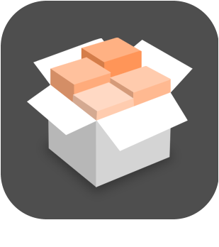
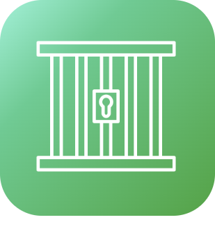

# Monitoring

>**Important**
>Only contributor plugins have their documentation here. You can consult the documentation of the official plugins directly from the Jeedom Market. Once on the plugin in question, click on documentation.
>You can see [here](https://market.jeedom.com/index.php?v=d&p=market&type=plugin&categorie=monitoring) all official plugins in this category

| | | | |
|--- | --- | --- | ---|
||AdGuard Home|Plugin to activate or deactivate your AdGuard Home server. Manage customers And much more !!|[Documentation Stable](https://nebzhb.github.io/jeedom_docs/plugins/AdGuard/en_US/) - [Beta Documentation](https://nebzhb.github.io/jeedom_docs/plugins/AdGuard/en_US/) [Market](https://market.jeedom.com/index.php?v=d&p=market_display&id=4196) [Changelog Stable](https://nebzhb.github.io/jeedom_docs/plugins/AdGuard/en_US/changelog) - [Changelog Beta](https://nebzhb.github.io/jeedom_docs/plugins/AdGuard/en_US/changelog)|
||Jailbreak|This plugin is for all iPads and iPhones found in cupboards and drawers, which have gathered dust, which have been forgotten or abandoned. Il permet d'intéragir avec Jeedom pour remonter des informations, lancer Application, exécuter des actions... Plus d'informations sur la présentation du plugin : https://flobul-domotique.fr/presentation-du-plugin-jailbreak-pour-jeedom/|[Documentation Stable](https://flobul-domotique.fr/documentation-du-plugin-jailbreak-pour-jeedom/) [Market](https://market.jeedom.com/index.php?v=d&p=market_display&id=3928) [Changelog Stable](https://flobul-domotique.fr/liste-des-versions-du-plugin-jailbreak-pour-jeedom/)|
||APSEZ1M|Plugin for controlling and retrieving information from APSystem EZ1-M Microinverters. Power recovery by panel, overall, etc|[Documentation Stable](https://taggou91.github.io/jeedom_docs/plugins/aps-ez1m/en_US/) [Market](https://market.jeedom.com/index.php?v=d&p=market_display&id=4477) [Changelog Stable](https://taggou91.github.io/jeedom_docs/plugins/aps-ez1m/changelog.html)|
||Defaults|State/measurement consistency monitoring|[Documentation Stable](https://ktn001.github.io/en_US/defauts/index.html) [Market](https://market.jeedom.com/index.php?v=d&p=market_display&id=4147) [Changelog Stable](https://ktn001.github.io/en_US/defauts/changelog.html)|
||fail2ban|Plugin to monitor fail2ban. It allows you to report all instant information from a local or remote fail2ban instance (via SSH) but it also keeps daily counters of blocked IPs as well as a counter for country of origin (country retrieved by geolocation of the address IP). It also allows you to ban and unban an IP address.|[Documentation Stable](https://mips2648.github.io/jeedom-plugins-docs/fail2ban/en_US/) - [Beta Documentation](https://mips2648.github.io/jeedom-plugins-docs/fail2ban/en_US/) [Market](https://market.jeedom.com/index.php?v=d&p=market_display&id=4439) [Changelog Stable](https://mips2648.github.io/jeedom-plugins-docs/fail2ban/en_US/changelog) - [Changelog Beta](https://mips2648.github.io/jeedom-plugins-docs/fail2ban/en_US/changelog)|
||fullyKiosK|FullyKiosK plugin for tablet management using the fullykiosk app|[Documentation Stable](https://sebsst.github.io/fullyKiosK/en_US/) [Market](https://market.jeedom.com/index.php?v=d&p=market_display&id=3406) [Changelog Stable](https://sebsst.github.io/fullyKiosK/en_US/changelog)|
||Gain Market|Recovers your balance on the Jeedom market (as a developer) and can alert you when it changes or when the Jeedom payment is detected|[Documentation Stable](https://frixo3190.github.io/jeedom_plugins/gain_market/docs/en_US/) [Market](https://market.jeedom.com/index.php?v=d&p=market_display&id=4228) [Changelog Stable](https://frixo3190.github.io/jeedom_plugins/gain_market/docs/en_US/#changelog)|
||Hard Disk Sentinel|This plugin allows you to retrieve health information from your hard drives using the Linux Hard Disk Sentinel tool.|[Documentation Stable](https://flobul-domotique.fr/presentation-et-documentation-du-plugin-hdsentinel-pour-jeedom/) [Market](https://market.jeedom.com/index.php?v=d&p=market_display&id=4247) [Changelog Stable](https://flobul-domotique.fr/liste-des-versions-du-plugin-hdsentinel-pour-jeedom/)|
||InfluxDB|Plugin allowing connection to a DB InfluxDB v1 or v2. It makes it easy to send the desired information by simply selecting the corresponding commands from a list, which makes it possible to externalize the history which can then be consulted via Grafana for example.|[Documentation Stable](https://mips2648.github.io/jeedom-plugins-docs/influxdb/en_US/) - [Beta Documentation](https://mips2648.github.io/jeedom-plugins-docs/influxdb/en_US/) [Market](https://market.jeedom.com/index.php?v=d&p=market_display&id=3935) [Changelog Stable](https://mips2648.github.io/jeedom-plugins-docs/influxdb/en_US/changelog) - [Changelog Beta](https://mips2648.github.io/jeedom-plugins-docs/influxdb/en_US/changelog)|
||JeeLog|Activity logging plugin for equipment, scenarios, and log files|[Documentation Stable](https://kiboost.github.io/jeedom_docs/plugins/jeelog/en_US/) [Market](https://market.jeedom.com/index.php?v=d&p=market_display&id=3362) [Changelog Stable](https://kiboost.github.io/jeedom_docs/plugins/jeelog/en_US/changelog.html)|
||Monitor sensors|This plugin will allow you to keep an eye on all of your sensors (Z-Wave, EnOcean, ZigBee) in order to check their health, their range, their last message received, etc . all summarized in a table, alerts in case of failure ! Also very specific monitoring of the Z-Wave network (Queue, Status). Daemon status monitoring for all plugins.|[Documentation Stable](https://frixo3190.github.io/jeedom_plugins/monitor_sensors/docs/en_US/) [Market](https://market.jeedom.com/index.php?v=d&p=market_display&id=4207) [Changelog Stable](https://frixo3190.github.io/jeedom_plugins/monitor_sensors/docs/en_US/#changelog)|
||No-Ip Renew|This plugin allows you to automatically renew your free no-ip domain names.com (operation to be done manually every 30 days otherwise).|[Documentation Stable](https://tomitomas.github.io/jeedom_doc/NoIp/en_US/) - [Beta Documentation](https://tomitomas.github.io/jeedom_doc/NoIp/en_US/) [Market](https://market.jeedom.com/index.php?v=d&p=market_display&id=4112) [Changelog Stable](https://tomitomas.github.io/jeedom_doc/NoIp/en_US/changelog) - [Changelog Beta](https://tomitomas.github.io/jeedom_doc/NoIp/en_US/changelog_beta)|
||Portainer|Plugin allowing connection to Portainer.io, a docker management tool, and therefore to manage your dockers and containers on Jeedom.|[Documentation Stable](https://mips2648.github.io/jeedom-plugins-docs/portainer/en_US/) - [Beta Documentation](https://mips2648.github.io/jeedom-plugins-docs/portainer/en_US/) [Market](https://market.jeedom.com/index.php?v=d&p=market_display&id=3931) [Changelog Stable](https://mips2648.github.io/jeedom-plugins-docs/portainer/en_US/changelog) - [Changelog Beta](https://mips2648.github.io/jeedom-plugins-docs/portainer/en_US/changelog)|
||Proxmox|Plugin allowing the management of a Proxmox server. It is possible to recover all the resources (nodes, virtual machine, storage...) and all their properties (status, memory, CPU, disk, IP address, activity time, list of snapshots...). The plugin also allows you to start and stop VMs and containers as well as take snapshots and backups. It also has a specific health page summarizing all the information about your equipment.|[Documentation Stable](https://mips2648.github.io/jeedom-plugins-docs/proxmox/en_US/) - [Beta Documentation](https://mips2648.github.io/jeedom-plugins-docs/proxmox/en_US/) [Market](https://market.jeedom.com/index.php?v=d&p=market_display&id=3835) [Changelog Stable](https://mips2648.github.io/jeedom-plugins-docs/proxmox/en_US/changelog) - [Changelog Beta](https://mips2648.github.io/jeedom-plugins-docs/proxmox/en_US/changelog)|
||sfrBox|Plugin to control sfr/neuf box|[Documentation Stable](https://limad.github.io/plugins-docs/plugin-sfrBox/) [Market](https://market.jeedom.com/index.php?v=d&p=market_display&id=3752) [Changelog Stable](https://limad.github.io/plugins-docs/plugin-sfrBox/en_US/changelog.html)|
||Solax Cloud|Plugin to retrieve information from Solax inverters via Solax Cloud|[Documentation Stable](https://phroc.github.io/Jeedom_Solaxcloud/en_US/) [Market](https://market.jeedom.com/index.php?v=d&p=market_display&id=4049) [Changelog Stable](https://phroc.github.io/Jeedom_Solaxcloud/en_US/changelog)|
||Speedtest by Ookla|Ce plugin permet de tester la bande passante internet à l'aide de https://www.speedtest.net|[Documentation Stable](https://spine34.github.io/jeedom-plugin-speedtestByOokla/en_US/) - [Beta Documentation](https://spine34.github.io/jeedom-plugin-speedtestByOokla/en_US/beta/) [Market](https://market.jeedom.com/index.php?v=d&p=market_display&id=4345) [Changelog Stable](https://spine34.github.io/jeedom-plugin-speedtestByOokla/en_US/changelog) - [Changelog Beta](https://spine34.github.io/jeedom-plugin-speedtestByOokla/en_US/beta/changelog)|
||Unifi Network|Unifi Network - Connecting to a Unifi Network Controller. Allows certain actions (Locate, Manage site LED, Firmware update, PowerCycle/Activation/Deactivation POE on switches, Activation/Deactivation/Reboot of Access Points, Activation/Deactivation of WLANs, Block/Unblock/Manage presence of clients Wi-Fi, etc)  Not intended to replace the controller interface  Unsupported : Unifi Access & Unifi VOIP|[Documentation Stable](https://nebzhb.github.io/jeedom_docs/plugins/unifi/en_US/) - [Beta Documentation](https://nebzhb.github.io/jeedom_docs/plugins/unifi/en_US/) [Market](https://market.jeedom.com/index.php?v=d&p=market_display&id=3433) [Changelog Stable](https://nebzhb.github.io/jeedom_docs/plugins/unifi/en_US/changelog) - [Changelog Beta](https://nebzhb.github.io/jeedom_docs/plugins/unifi/en_US/changelog)|
