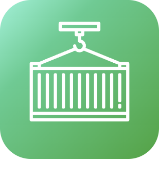

# Monitoring

>**Important**
>Only contributor plugins have their documentation here. You can consult the documentation of the official plugins directly from the Jeedom Market. Once on the plugin in question, click on documentation.
>You can see [here](https://market.jeedom.com/index.php?v=d&p=market&type=plugin&categorie=monitoring) all official plugins in this category

| | | | |
|--- | --- | --- | ---|
||AdGuard Home|Plugin to activate or deactivate your AdGuard Home server. Manage customers And much more !!|[Documentation Stable](https://nebzhb.github.io/jeedom_docs/plugins/AdGuard/en_US/) - [Beta Documentation](https://nebzhb.github.io/jeedom_docs/plugins/AdGuard/en_US/) [Market](https://market.jeedom.com/index.php?v=d&p=market_display&id=4196) [Changelog Stable](https://nebzhb.github.io/jeedom_docs/plugins/AdGuard/en_US/changelog) - [Changelog Beta](https://nebzhb.github.io/jeedom_docs/plugins/AdGuard/en_US/changelog)|
||Jailbreak|This plugin is for all iPads and iPhones found in cupboards and drawers, which have gathered dust, which have been forgotten or abandoned. Il permet d'intéragir avec Jeedom pour remonter des informations, lancer Application, exécuter des actions... Plus d'informations sur la présentation du plugin : https://flobul-domotique.fr/presentation-du-plugin-jailbreak-pour-jeedom/|[Documentation Stable](https://flobul-domotique.fr/documentation-du-plugin-jailbreak-pour-jeedom/) [Market](https://market.jeedom.com/index.php?v=d&p=market_display&id=3928) [Changelog Stable](https://flobul-domotique.fr/liste-des-versions-du-plugin-jailbreak-pour-jeedom/)|
||fullyKiosK|FullyKiosK plugin for tablet management using the fullykiosk app|[Documentation Stable](https://sebsst.github.io/fullyKiosK/en_US/) [Market](https://market.jeedom.com/index.php?v=d&p=market_display&id=3406) [Changelog Stable](https://sebsst.github.io/fullyKiosK/en_US/changelog)|
||JeeLog|Activity logging plugin for equipment, scenarios, and log files|[Documentation Stable](https://kiboost.github.io/jeedom_docs/plugins/jeelog/en_US/) [Market](https://market.jeedom.com/index.php?v=d&p=market_display&id=3362) [Changelog Stable](https://kiboost.github.io/jeedom_docs/plugins/jeelog/en_US/changelog.html)|
||Monitor sensors|This plugin will allow you to keep an eye on all of your sensors (Z-Wave, EnOcean, ZigBee) in order to check their health, their range, their last message received, etc . all summarized in a table, alerts in case of failure ! Also very specific monitoring of the Z-Wave network (Queue, Status). Daemon status monitoring for all plugins.|[Documentation Stable](https://frixo3190.github.io/jeedom_plugins/monitor_sensors/docs/en_US/) [Market](https://market.jeedom.com/index.php?v=d&p=market_display&id=4207) [Changelog Stable](https://frixo3190.github.io/jeedom_plugins/monitor_sensors/docs/en_US/#changelog)|
||Portainer|Plugin allowing connection to Portainer.io, a docker management tool, and therefore to manage your dockers and containers on Jeedom.|[Documentation Stable](https://mips2648.github.io/jeedom-plugins-docs/portainer/en_US/) [Market](https://market.jeedom.com/index.php?v=d&p=market_display&id=3931) [Changelog Stable](https://mips2648.github.io/jeedom-plugins-docs/portainer/en_US/changelog)|
||Proxmox|Plugin allowing the management of a Proxmox server. It is possible to recover all the resources (nodes, virtual machine, storage...) and all their properties (status, memory, CPU, disk, IP address, activity time, list of snapshots...). The plugin also allows you to start and stop VMs and containers as well as take snapshots and backups. It also has a specific health page summarizing all the information about your equipment.|[Documentation Stable](https://mips2648.github.io/jeedom-plugins-docs/proxmox/en_US/) [Market](https://market.jeedom.com/index.php?v=d&p=market_display&id=3835) [Changelog Stable](https://mips2648.github.io/jeedom-plugins-docs/proxmox/en_US/changelog)|
||Unifi Network|Unifi Network - Connecting to a Unifi Network Controller. Allows certain actions (Locate, Manage site LED, Firmware update, PowerCycle/Activation/Deactivation POE on switches, Activation/Deactivation/Reboot of Access Points, Activation/Deactivation of WLANs, Block/Unblock/Manage presence of clients Wi-Fi, etc)  Not intended to replace the controller interface  Unsupported : Unifi Access & Unifi VOIP|[Documentation Stable](https://nebzhb.github.io/jeedom_docs/plugins/unifi/en_US/) [Market](https://market.jeedom.com/index.php?v=d&p=market_display&id=3433) [Changelog Stable](https://nebzhb.github.io/jeedom_docs/plugins/unifi/en_US/changelog)|
