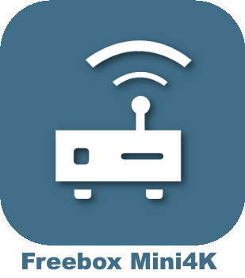

# Multimedia

>**IMPORTANT**
>Only contributor plugins have their documentation here. You can consult the documentation of the official plugins directly from the Jeedom Market. Once on the plugin in question, click on documentation.
>You can see [here](https://market.jeedom.com/index.php?v=d&p=market&type=plugin&categorie=multimedia) all official plugins in this category

| | | | |
|--- | --- | --- | ---|
||Acer Video Projector|Plugin to control Acer video projectors|[Documentation](https://github.com/Cricri67/Jeedom-AcerVP/blob/master/docs/en_US/index.md) - [Market](https://market.jeedom.com/index.php?v=d&p=market_display&id=3501)|
||AndroidRemoteControl|Plugin to control Android TV and other Android devices|[Documentation](https://NextDom.github.io/plugin-AndroidRemoteControl/) - [Market](https://market.jeedom.com/index.php?v=d&p=market_display&id=3360)|
||Bose SoundTouch|Plugin to control Bose SoundTouch speakers.|[Documentation](https://sabinus52.github.io/jeedom-bose-soundtouch/en_US/) - [Market](https://market.jeedom.com/index.php?v=d&p=market_display&id=3565)|
||Freebox mini4K remote control|Remote control for your Freebox mini4K|[Documentation](http://mika-nt28.github.io/Documentations/FreeboxMini4k/fr_FR) - [Market](https://market.jeedom.com/index.php?v=d&p=market_display&id=3756)|
||JeeOrangeTv|Plugin to control the Orange TV decoder by IP|[Documentation](https://totoff974.github.io/JeeOrangeTv/en_US/) - [Market](https://market.jeedom.com/index.php?v=d&p=market_display&id=2706)|
||NB LaBox||[Documentation]() - [Market](https://market.jeedom.com/index.php?v=d&p=market_display&id=2428)|
||Alexa - Amazon Music|Amazon Music interface|[Documentation](http://sigalou-domotique.fr/plugin-jeedom-alexa-api/90-alexa-amazon-music-documentation) - [Market](https://market.jeedom.com/index.php?v=d&p=market_display&id=3910)|
||Alexa - Deezer|Deezer interface|[Documentation](http://sigalou-domotique.fr/plugin-jeedom-alexa-api/98-alexa-deezer-documentation) - [Market](https://market.jeedom.com/index.php?v=d&p=market_display&id=3911)|
||Alexa - Spotify|Spotify interface|[Documentation](http://sigalou-domotique.fr/plugin-jeedom-alexa-api/97-alexa-sportify-documentation) - [Market](https://market.jeedom.com/index.php?v=d&p=market_display&id=3913)|
||Diaporama|Diaporama|[Documentation](http://sigalou-domotique.fr/diaporama/82-plugin-diaporama-documentation) - [Market](https://market.jeedom.com/index.php?v=d&p=market_display&id=3870)|
||Freebox Crystal|Get information from your Freebox Crystal|[Documentation](https://mika-nt28.github.io/Documentations/freeCrystal/en_US/) - [Market](https://market.jeedom.com/index.php?v=d&p=market_display&id=1139)|
||Google Cast|Google Cast compatible equipment management plugin|[Documentation](https://github.com/guirem/plugin-googlecast/blob/develop/docs/en_US/index.md) - [Market](https://market.jeedom.com/index.php?v=d&p=market_display&id=3350)|
||HomepTalk|TTS to an Apple HomePod|[Documentation](https://nebzhb.github.io/jeedom_docs/plugins/homepTalk/en_US/) - [Market](https://market.jeedom.com/index.php?v=d&p=market_display&id=3825)|
||Marantz Denon|Plugin to control Denon / Marantz amplifiers|[Documentation](https://github.com/guirem/plugin-marantzdenon/blob/master/docs/en_US/index.md) - [Market](https://market.jeedom.com/index.php?v=d&p=market_display&id=3342)|
||MusicCast controller|Yamaha MusicCast control plugin|[Documentation](https://granddam.github.io/plugin-musiccast/en_US/index) - [Market](https://market.jeedom.com/index.php?v=d&p=market_display&id=3099)|
||onkyo|Plugin to control Onkyo brand amplifiers|[Documentation](http://dough29.github.io/Jeedom-Onkyo/en_US/) - [Market](https://market.jeedom.com/index.php?v=d&p=market_display&id=1107)|
||Panasonic TV|Description|[Documentation]() - [Market](https://market.jeedom.com/index.php?v=d&p=market_display&id=2882)|
||philips|Plugin for piloting TV philips|[Documentation](https://barre35.github.io/jeedom-plugin-philips/en_US/index) - [Market](https://market.jeedom.com/index.php?v=d&p=market_display&id=3875)|
||Plex||[Documentation](https://mika-nt28.github.io/Documentations/plex/en_US/) - [Market](https://market.jeedom.com/index.php?v=d&p=market_display&id=1380)|
||Sony Bravia|Control and monitoring of Sony bravia TVs|[Documentation](https://NextDom.github.io//plugin-sonybravia/en_US/) - [Market](https://market.jeedom.com/index.php?v=d&p=market_display&id=3100)|
||Spotify|Plugin for spotify connect control|[Documentation](https://barre35.github.io/jeedom-plugin-spotify/en_US/index) - [Market](https://market.jeedom.com/index.php?v=d&p=market_display&id=3700)|
||Syno Audio Station|Plugin for Synology Audio Station|[Documentation](https://nexus79000.github.io/synoaudio/en_US/) - [Market](https://market.jeedom.com/index.php?v=d&p=market_display&id=2063)|
||Syno Download|Plugin for Synology Download Station.|[Documentation](https://nexus79000.github.io/synodownload/en_US/) - [Market](https://market.jeedom.com/index.php?v=d&p=market_display&id=2624)|
||Syno Video Station|Plugin for Synology Video Station|[Documentation](https://nexus79000.github.io/synovideo/en_US/) - [Market](https://market.jeedom.com/index.php?v=d&p=market_display&id=2887)|
||Freebox Revolution|Plugin to control the Freebox Player of the Freebox Revolution|[Documentation](https://mika-nt28.github.io/Documentations/telecfree/en_US/) - [Market](https://market.jeedom.com/index.php?v=d&p=market_display&id=2032)|
||WebOS TV|Plugin to control LG WebOs TVs.|[Documentation](https://zyg0m4t1k.github.io/webosTv/en_US/) - [Market](https://market.jeedom.com/index.php?v=d&p=market_display&id=3301)|
