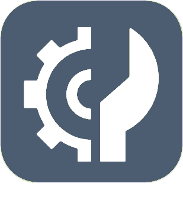

# Programmation

>**Important**
>Only contributor plugins have their documentation here. You can consult the documentation of the official plugins directly from the Jeedom Market. Once on the plugin in question, click on documentation.
>You can see [here](https://market.jeedom.com/index.php?v=d&p=market&type=plugin&categorie=programming) all official plugins in this category

| | | | |
|--- | --- | --- | ---|
||Advanced Scenario|Plugins to manage, create or modify your scenarios. Uses the existing scenario system by adding some functionality.|[Documentation Stable](http://fobsoft.github.io/jeedom-plugins-documentation/advancedScenario/fr_FR) - [Beta Documentation](http://fobsoft.github.io/jeedom-plugins-documentation/advancedScenario/fr_FR) [Market](https://market.jeedom.com/index.php?v=d&p=market_display&id=4281) [Changelog Stable](http://fobsoft.github.io/jeedom-plugins-documentation/advancedScenario/en_US/changelog) - [Changelog Beta](http://fobsoft.github.io/jeedom-plugins-documentation/advancedScenario/en_US/changelog)|
||BLEA2MQTT Gateway Manager|Plugin managing the installation, configuration and start of the blea2mqtt service, allowing to create BLEA antennas from Linux or MacOS, via an SSH connection.|[Documentation Stable](https://flobul-domotique.fr/presentation-et-documentation-du-plugin-blea2mqtt-pour-jeedom/) - [Beta Documentation](https://flobul-domotique.fr/presentation-et-documentation-du-plugin-blea2mqtt-pour-jeedom/) [Market](https://market.jeedom.com/index.php?v=d&p=market_display&id=4403) [Changelog Stable](https://flobul-domotique.fr/liste-des-versions-du-plugin-blea2mqtt-pour-jeedom/) - [Changelog Beta](https://flobul-domotique.fr/liste-des-versions-du-plugin-blea2mqtt-pour-jeedom/)|
||Generic type manager|Plugin to manage your commands via their generic type dynamically. Ce plugin a l'avantage de tout centraliser et permettre une gestion hiérarchique des ‹ objets ›|[Documentation Stable](http://fobsoft.github.io/jeedom-plugins-documentation/genericTypeManager/fr_FR) - [Beta Documentation](http://fobsoft.github.io/jeedom-plugins-documentation/genericTypeManager/fr_FR) [Market](https://market.jeedom.com/index.php?v=d&p=market_display&id=4235) [Changelog Stable](http://fobsoft.github.io/jeedom-plugins-documentation/genericTypeManager/en_US/changelog) - [Changelog Beta](http://fobsoft.github.io/jeedom-plugins-documentation/genericTypeManager/en_US/changelog)|
||JeeXplorer|Jeedom Explorer / File Editor|[Documentation Stable](https://kiboost.github.io/jeedom_docs/plugins/jeexplorer/en_US/) [Market](https://market.jeedom.com/index.php?v=d&p=market_display&id=3690) [Changelog Stable](https://kiboost.github.io/jeedom_docs/plugins/jeexplorer/en_US/changelog.html)|
||LogManager|Plugin allowing personalized log management in your scenarios. It is possible to create as many logs as desired, different log levels are possible for each log file. This allows you to organize your scenario logs according to your preferences, for example to group all the actions on a piece of equipment in the same log regardless of the scenario.|[Documentation Stable](https://mips2648.github.io/jeedom-plugins-docs/logmanager/en_US/) - [Beta Documentation](https://mips2648.github.io/jeedom-plugins-docs/logmanager/en_US/) [Market](https://market.jeedom.com/index.php?v=d&p=market_display&id=3817) [Changelog Stable](https://mips2648.github.io/jeedom-plugins-docs/logmanager/en_US/changelog) - [Changelog Beta](https://mips2648.github.io/jeedom-plugins-docs/logmanager/en_US/changelog)|
||Theengs gateway|Plugin to easily install and configure antennas running under Theengs gateway which allows you to capture bluetooth devices (BLEA) and send them back to Jeedom to be integrated via the MQTT Discovery plugin|[Documentation Stable](https://mips2648.github.io/jeedom-plugins-docs/tgw/en_US/) - [Beta Documentation](https://mips2648.github.io/jeedom-plugins-docs/tgw/en_US/) [Market](https://market.jeedom.com/index.php?v=d&p=market_display&id=4441) [Changelog Stable](https://mips2648.github.io/jeedom-plugins-docs/tgw/en_US/changelog) - [Changelog Beta](https://mips2648.github.io/jeedom-plugins-docs/tgw/en_US/changelog)|
