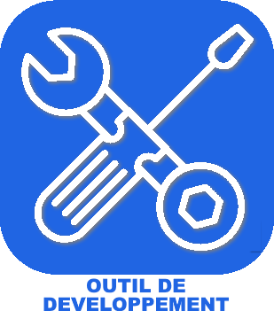

# Programmation

>**IMPORTANT**
>Only contributor plugins have their documentation here. You can consult the documentation of the official plugins directly from the Jeedom Market. Once on the plugin in question, click on documentation.
>You can see [here](https://market.jeedom.com/index.php?v=d&p=market&type=plugin&categorie=programming) all official plugins in this category

| | | | |
|--- | --- | --- | ---|
||AutoLogin|Automatic user login based on IP|[Documentation](https://github.com/guirem/plugin-autologin/blob/develop/docs/en_US/index.md) - [Market](https://market.jeedom.com/index.php?v=d&p=market_display&id=3394)|
||Http Remote Event||[Documentation]() - [Market](https://market.jeedom.com/index.php?v=d&p=market_display&id=1939)|
||JeeXplorer|Jeedom Explorer / File Editor|[Documentation](https://kiboost.github.io/jeedom_docs/plugins/jeexplorer/en_US/) - [Market](https://market.jeedom.com/index.php?v=d&p=market_display&id=3690)|
||Development tool|Allows you to create plugins for jeedom|[Documentation]() - [Market](https://market.jeedom.com/index.php?v=d&p=market_display&id=2634)|
||Webview||[Documentation](http://engles.fr/jeedom_webview_docs/en_US/) - [Market](https://market.jeedom.com/index.php?v=d&p=market_display&id=3089)|
