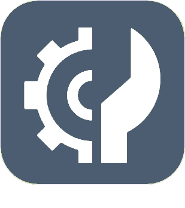
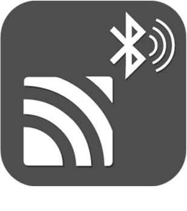

# Programmation

>**Important**
>Only contributor plugins have their documentation here. You can consult the documentation of the official plugins directly from the Jeedom Market. Once on the plugin in question, click on documentation.
>You can see [here](https://market.jeedom.com/index.php?v=d&p=market&type=plugin&categorie=programming) all official plugins in this category

| | | | |
|--- | --- | --- | ---|
||EventTranslator|Traducteur/convertisseur d'événements en temps réel : mappe les valeurs d'une commande info source vers des actions Jeedom (commande ou scénario). Mode apprentissage automatique (5 min), aucune dépendance, aucun démon. Cas d'usage 1 : adapter les valeurs d'un clavier, télécommande ou interrupteur Zigbee/Z-Wave/WiFi vers le plugin Alarme, ArmManager ou tout autre plugin cible — sans scénario. Cas d'usage 2 : piloter jusqu'à 12 actions distinctes depuis un interrupteur multi-boutons (simple / double / long appui) en quelques clics.|[Documentation Stable](https://mickadam29.github.io/EventTranslator/en_US/) - [Beta Documentation](https://mickadam29.github.io/EventTranslator/en_US/) [Market](https://market.jeedom.com/index.php?v=d&p=market_display&id=4650) [Changelog Stable](https://mickadam29.github.io/EventTranslator/en_US/changelog) - [Changelog Beta](https://mickadam29.github.io/EventTranslator/en_US/changelog)|
||Advanced Scenario|Plugins to manage, create or modify your scenarios. Uses the existing scenario system by adding some functionality.|[Documentation Stable](http://fobsoft.github.io/jeedom-plugins-documentation/advancedScenario/fr_FR) - [Beta Documentation](http://fobsoft.github.io/jeedom-plugins-documentation/advancedScenario/fr_FR) [Market](https://market.jeedom.com/index.php?v=d&p=market_display&id=4281) [Changelog Stable](http://fobsoft.github.io/jeedom-plugins-documentation/advancedScenario/en_US/changelog) - [Changelog Beta](http://fobsoft.github.io/jeedom-plugins-documentation/advancedScenario/en_US/changelog)|
||BLEA2MQTT Gateway Manager|Plugin managing the installation, configuration and start of the blea2mqtt service, allowing to create BLEA antennas from Linux or MacOS, via an SSH connection.|[Documentation Stable](https://flobul-domotique.fr/presentation-et-documentation-du-plugin-blea2mqtt-pour-jeedom/) - [Beta Documentation](https://flobul-domotique.fr/presentation-et-documentation-du-plugin-blea2mqtt-pour-jeedom/) [Market](https://market.jeedom.com/index.php?v=d&p=market_display&id=4403) [Changelog Stable](https://flobul-domotique.fr/liste-des-versions-du-plugin-blea2mqtt-pour-jeedom/) - [Changelog Beta](https://flobul-domotique.fr/liste-des-versions-du-plugin-blea2mqtt-pour-jeedom/)|
||Generic type manager|Plugin to manage your commands via their generic type dynamically. Ce plugin a l'avantage de tout centraliser et permettre une gestion hiérarchique des ‹ objets ›|[Documentation Stable](http://fobsoft.github.io/jeedom-plugins-documentation/genericTypeManager/fr_FR) - [Beta Documentation](http://fobsoft.github.io/jeedom-plugins-documentation/genericTypeManager/fr_FR) [Market](https://market.jeedom.com/index.php?v=d&p=market_display&id=4235) [Changelog Stable](http://fobsoft.github.io/jeedom-plugins-documentation/genericTypeManager/en_US/changelog) - [Changelog Beta](http://fobsoft.github.io/jeedom-plugins-documentation/genericTypeManager/en_US/changelog)|
||JeeXplorer|Jeedom Explorer / File Editor|[Documentation Stable](https://kiboost.github.io/jeedom_docs/plugins/jeexplorer/en_US/) [Market](https://market.jeedom.com/index.php?v=d&p=market_display&id=3690) [Changelog Stable](https://kiboost.github.io/jeedom_docs/plugins/jeexplorer/en_US/changelog.html)|
||LogManager|Plugin allowing personalized log management in your scenarios. It is possible to create as many logs as desired, different log levels are possible for each log file. This allows you to organize your scenario logs according to your preferences, for example to group all the actions on a piece of equipment in the same log regardless of the scenario.|[Documentation Stable](https://mips2648.github.io/jeedom-plugins-docs/logmanager/en_US/) - [Beta Documentation](https://mips2648.github.io/jeedom-plugins-docs/logmanager/en_US/) [Market](https://market.jeedom.com/index.php?v=d&p=market_display&id=3817) [Changelog Stable](https://mips2648.github.io/jeedom-plugins-docs/logmanager/en_US/changelog) - [Changelog Beta](https://mips2648.github.io/jeedom-plugins-docs/logmanager/en_US/changelog)|
||Pimp my Jeedom|Personalize Jeedom according to YOUR desires !  Easily install widgets made by Salvialf and design menus made by Noodom and configure customization options in a few clicks.  In the event of an update available for a widget, a message will notify you in Jeedom in order to always benefit from the latest developments.  Le plugin inclus également un outil permettant de créer et de gérer les widgets tiers. Many functions are available : management of widget-related commands, widget settings, ability to include or remove files, code editor and real-time preview.  Many other functions are being developed to make Jeedom customization accessible to everyone.|[Documentation Stable](https://salvialf.github.io/Salvialf-Documentation/pimpJeedom/en_US/) [Market](https://market.jeedom.com/index.php?v=d&p=market_display&id=4005) [Changelog Stable](https://salvialf.github.io/Salvialf-Documentation/pimpJeedom/en_US/changelog)|
||Theengs gateway|Plugin to easily install and configure antennas running under Theengs gateway which allows you to capture bluetooth devices (BLEA) and send them back to Jeedom to be integrated via the MQTT Discovery plugin|[Documentation Stable](https://mips2648.github.io/jeedom-plugins-docs/tgw/en_US/) - [Beta Documentation](https://mips2648.github.io/jeedom-plugins-docs/tgw/en_US/) [Market](https://market.jeedom.com/index.php?v=d&p=market_display&id=4441) [Changelog Stable](https://mips2648.github.io/jeedom-plugins-docs/tgw/en_US/changelog) - [Changelog Beta](https://mips2648.github.io/jeedom-plugins-docs/tgw/en_US/changelog)|
