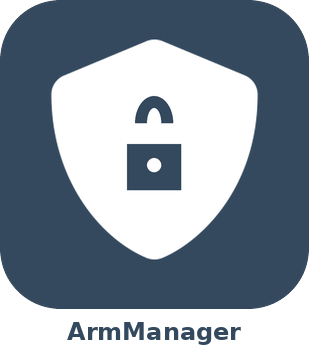
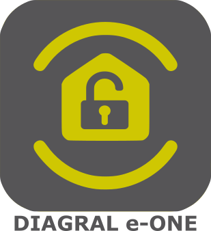
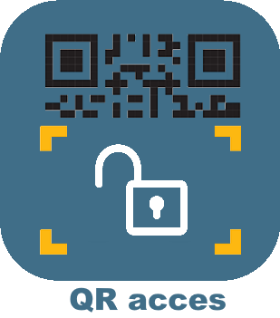
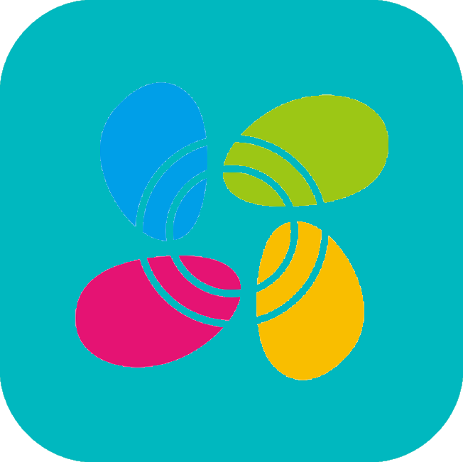
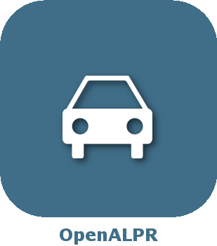
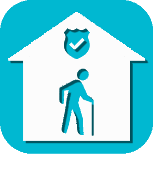
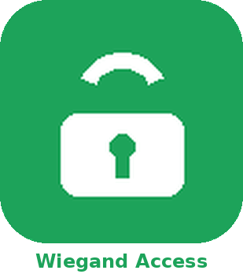

# Security

>**Important**
>Only contributor plugins have their documentation here. You can consult the documentation of the official plugins directly from the Jeedom Market. Once on the plugin in question, click on documentation.
>You can see [here](https://market.jeedom.com/index.php?v=d&p=market&type=plugin&categorie=security) all official plugins in this category

| | | | |
|--- | --- | --- | ---|
||AlarmeMyfox|I take back the plugin that was abandoned. Plugin V2 to use the Myfox, Evology, Easybox control unit, allows you to retrieve information from the temperature sensor, brightness, freezer, smoke, heating, events, alarm status, and activate/deactivate the alarm and equipment , play scenarios|[Documentation Stable](https://vegeta0911.github.io/documentation/plugins/en_US/AlarmeMyfox/) [Market](https://market.jeedom.com/index.php?v=d&p=market_display&id=4471) [Changelog Stable](https://vegeta0911.github.io/documentation/plugins/en_US/AlarmeMyfox/changelog)|
||ArmManager|S'interfacer avec le plugin Alarme Jeedom depuis vos claviers et télécommandes Zigbee conformes au standard IAS ACE (cluster 0x0501 via Zigbee2MQTT). 7 événements configurables (arm_all_zones, arm_day_zones, arm_night_zones, disarm, panic, emergency, tamper), chacun relié à une commande ou un scénario Jeedom. Découverte automatique des équipements Z2M, indicateur de compatibilité temps réel. Aucun démon, aucune dépendance.|[Documentation Stable](https://mickadam29.github.io/ArmManager/en_US/) - [Beta Documentation](https://mickadam29.github.io/ArmManager/en_US/) [Market](https://market.jeedom.com/index.php?v=d&p=market_display&id=4657) [Changelog Stable](https://mickadam29.github.io/ArmManager/en_US/changelog) - [Changelog Beta](https://mickadam29.github.io/ArmManager/en_US/changelog)|
||Diagral eOne|Plugin to manage Diagral eOne alarms|[Documentation Stable](https://mguyard.github.io/Jeedom-Diagral_eOne/en_US/) [Market](https://market.jeedom.com/index.php?v=d&p=market_display&id=3820) [Changelog Stable](https://mguyard.github.io/Jeedom-Diagral_eOne/en_US/changelog)|
||Access by QR code|Manage access to your house by QR code.|[Documentation Stable](http://mika-nt28.github.io/Documentations/QRacces/fr_FR) [Market](https://market.jeedom.com/index.php?v=d&p=market_display&id=3758) [Changelog Stable](https://mika-nt28.github.io/Documentations/QRacces/en_US/changelog)|
||Arlo|Plugin allowing the control of Arlo range equipment such as cameras, base station and integrated siren. It is possible to control the mode, activation and deactivation of the cameras, view the live stream of the cameras, trigger video captures and recordings, trigger the siren... All current models supported by the Arlo app (web or mobile) are supported by the plugin: Arlo, Arlo Pro, Pro2, Pro3, Pro4, Ultra, Arlo Floodlight, Arlo Essential, Arlo Q, Arlo Go, Arlo Baby, Arlo Doorbell and Video Doorbell...|[Documentation Stable](https://mips2648.github.io/jeedom-plugins-docs/arlo/en_US/) - [Beta Documentation](https://mips2648.github.io/jeedom-plugins-docs/arlo/en_US/) [Market](https://market.jeedom.com/index.php?v=d&p=market_display&id=3708) [Changelog Stable](https://mips2648.github.io/jeedom-plugins-docs/arlo/en_US/changelog) - [Changelog Beta](https://mips2648.github.io/jeedom-plugins-docs/arlo/en_US/changelog)|
||Doorbird V2||[Documentation Stable](https://vegeta0911.github.io/documentation/plugins/en_US/Doorbirdv2/) [Market](https://market.jeedom.com/index.php?v=d&p=market_display&id=4503) [Changelog Stable](https://vegeta0911.github.io/documentation/plugins/en_US/Doorbirdv2/changelog)|
||Facial recognition|This plugin allows use OpenCv to detect your visiage and recognize you.Attention, all the same to what you authorized with this plugin because it is quite simple to deceive the system (Twins, photos)|[Documentation Stable](http://mika-nt28.github.io/Documentations/facerecognition/en_US/) [Market](https://market.jeedom.com/index.php?v=d&p=market_display&id=3863) [Changelog Stable](https://mika-nt28.github.io/Documentations/facerecognition/en_US/changelog)|
||Frigate|Frigate plugin for Jeedom. Only works with Frigate versions > 0.13.0. Le plugin n'installe pas le serveur Frigate mais permet de le controler.|[Documentation Stable](https://sagitaz.github.io/plugin-frigate/fr_FR) - [Beta Documentation](https://sagitaz.github.io/plugin-frigate/fr_FR) [Market](https://market.jeedom.com/index.php?v=d&p=market_display&id=4516) [Changelog Stable](https://sagitaz.github.io/plugin-frigate/en_US/changelog) - [Changelog Beta](https://sagitaz.github.io/plugin-frigate/en_US/changelog)|
||jeezviz|Plugin for controlling EZVIZ cameras and videophones|[Documentation Stable](https://famille-ozaer.github.io/jeezviz/en_US/index.md) [Market](https://market.jeedom.com/index.php?v=d&p=market_display&id=4063) [Changelog Stable](https://famille-ozaer.github.io/jeezviz/en_US/changelog.html)|
||Netatmo Security|Plugin to manage Netatmo Sécurité equipment and particularly cameras. Without unwanted emails, the plugin allows the acquisition of live (snapshot or video) either directly or via the Camera plugin without changing the security settings of your box.   Connection via API and/or locally (if possible)|[Documentation Stable](https://limad.github.io/plugins-docs/plugin-netatmoSecurity/en_US/) - [Beta Documentation](https://limad.github.io/plugins-docs/plugin-netatmoSecurity/en_US/) [Market](https://market.jeedom.com/index.php?v=d&p=market_display&id=4472) [Changelog Stable](https://limad.github.io/plugins-docs/plugin-netatmoSecurity/en_US/changelog) - [Changelog Beta](https://limad.github.io/plugins-docs/plugin-netatmoSecurity/en_US/changelog)|
||OpenALPR|Permanent plugin to recognize license plate with our cameras|[Documentation Stable](https://mika-nt28.github.io/Documentations/openalpr/fr_FR) [Market](https://market.jeedom.com/index.php?v=d&p=market_display&id=1613) [Changelog Stable](https://mika-nt28.github.io/Documentations/openalpr/en_US/changelog)|
||Senior Care - Alert button|Plugin for assistance to the elderly - Management of alert buttons|[Documentation Stable](https://agp42.github.io/seniorcarealertbt/en_US/) [Market](https://market.jeedom.com/index.php?v=d&p=market_display&id=3948) [Changelog Stable](https://agp42.github.io/seniorcarealertbt/en_US/changelog)|
||Senior Care - Comfort and Safety|Plugin for assistance to the elderly - Management of comfort and security of housing|[Documentation Stable](https://agp42.github.io/seniorcarecomfortsecurity/en_US/) [Market](https://market.jeedom.com/index.php?v=d&p=market_display&id=3972) [Changelog Stable](https://agp42.github.io/seniorcarecomfortsecurity/en_US/changelog)|
||Senior Care - Inactivity detection|Plugin for assistance to the elderly - Inactivity detection function|[Documentation Stable](https://agp42.github.io/seniorcareinactivity/en_US/) [Market](https://market.jeedom.com/index.php?v=d&p=market_display&id=3947) [Changelog Stable](https://agp42.github.io/seniorcareinactivity/en_US/changelog)|
||Verisure alarm|Verisure plugin for Jeedom|[Documentation Stable](https://xav-74.github.io/verisure/en_US/) [Market](https://market.jeedom.com/index.php?v=d&p=market_display&id=3997) [Changelog Stable](https://xav-74.github.io/verisure/en_US/changelog)|
||Wiegand Access|Contrôle d'accès multi-lecteurs par badge RFID et/ou clavier PIN (digicode). Compatible avec tout équipement Jeedom disposant d'une commande événement (Zigbee/PTVO, Z-Wave, WiFi, MQTT, virtuel…). Enregistrement de badges par apprentissage ou import CSV, planning horaire par badge, historique des accès, protection anti-intrusion. Lecteur virtuel de démo inclus — testez sans matériel.|[Documentation Stable](https://mickadam29.github.io/wiegandAccess/en_US/) - [Beta Documentation](https://mickadam29.github.io/wiegandAccess/en_US/) [Market](https://market.jeedom.com/index.php?v=d&p=market_display&id=4654) [Changelog Stable](https://mickadam29.github.io/wiegandAccess/en_US/changelog) - [Changelog Beta](https://mickadam29.github.io/wiegandAccess/en_US/changelog)|
