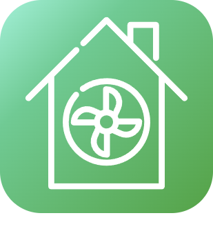

# Confort

>****
>. . .
>  

| | | | |
|--- | --- | --- | ---|
||| .  .  ...).  .| -    - |
|||. |  |
||Clage|. . . .|  |
||||  |
||Heta||  |
||||  |
||| .   ...).   .   | -    - |
||MyUplink Internal API|Ce plugin permet de récupérer les informations des pompes à chaleur NiBe depuis l'API internal du site https://myUplink.com. Ce plugin ne fonctionne pas avec l'ancienne API http://www.nibeuplink.com. En plus des commandes de base, le plugin permet de générer des commandes depuis l'interface console (consommations, durées...)|  |
||| . ...). . | -    - |
||Qivivo||  |
||||  |
|||. : .|  |
||)|. : | -    - |
