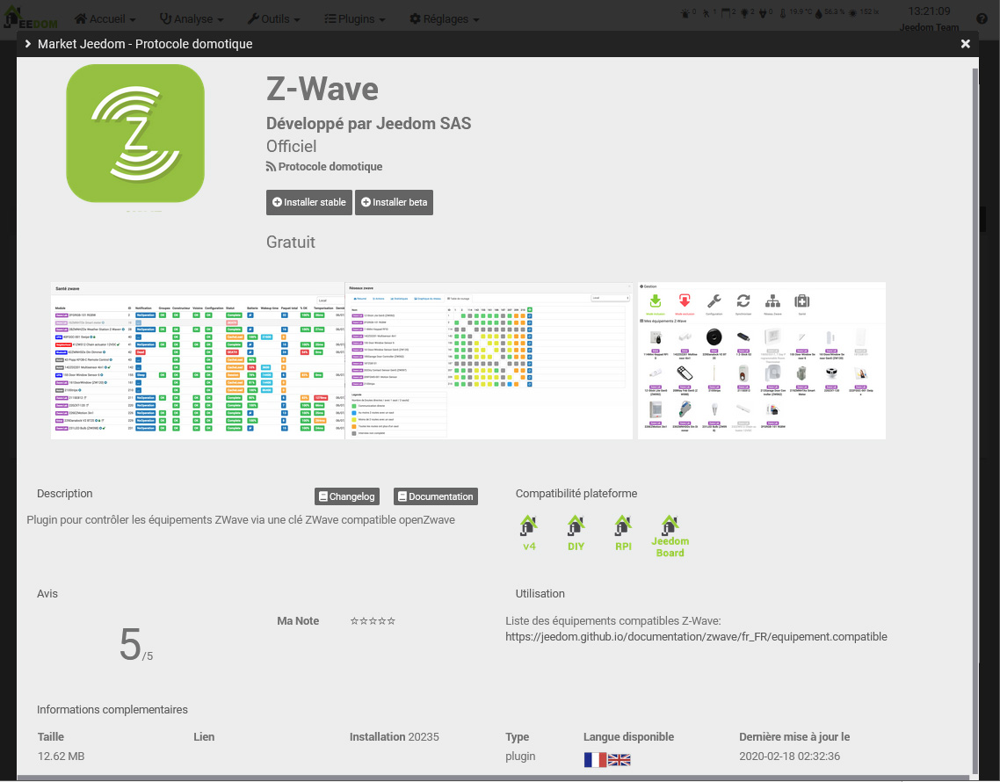

# First step

Welcome to this first step documentation, it will help you to put your Jeedom into service.

## Registration on the market

The first thing to do is to create an account on the Market to be able to register your Jeedom on it. Click [here](https://market.jeedom.com/).

Click on the "Register" button at the top left :

Fill in the different fields and validate. You should then be in your Market account:

## Adding your service pack code

If you bought a Jeedom box then you should have received an email containing a code for your service pack.

> **IMPORTANT**
>
> It is important to fill it in because this code gives you access to certain plugins for free, as well as to exclusive services.

> **IMPORTANT**
>
> If you buy a service pack from the Jeedom Market you have nothing to do, it is automatically assigned to you.

Once the code has been retrieved from the email, all you have to do is go to the [Jeedom Market](https://market.jeedom.com/) and identify yourself.

Then go to your profile page:

Then click on the “My services” tab and enter your Service Pack number and validate.

> **Tip**
>
> If you bought an official Jeedom box, the service pack number should have been emailed to you. If you have not received anything, please contact the store where you bought your box.

## Find your Jeedom on the network

Once Jeedom is electrically connected and connected to your local network, here is how to connect to it.

### Find Jeedom

#### Through the market

The simplest solution (but does not work in 100% of cases depending on the configuration of your internet access), you have to start the box, wait around 10 minutes (be careful if you use a netinstallation type image, it will be more like 30 minutes ) and go [here](https://www.jeedom.com/market/index.php?v=d&p=find)

> **Tip**
>
> Please note, you must be on the same network as the Jeedom box for this method to work.

> **IMPORTANT**
>
> Depending on your ADSL box, this feature may not work. If so, nothing serious, you just need to connect to your ADSL box and find the jeedom IP in it. This step does nothing but give you the local IP of your Jeedom. This is not when adding your Jeedom to your market account is done.

#### By your internet box

-   Go to the administration interface of your internet box and look for Jeedom in your network devices.
-   Get his IP.
-   Put this IP in your internet browser. You should be on the Jeedom interface.

## First connection

Whichever method is used, you will then arrive on the Login page. By default the login and password are "admin".

## Link my Jeedom to my market account

We will see here how to link your Jeedom to your Market account.

-   Once connected to your jeedom, you must go to **Settings → System → Configuration**.
-   Click on the tab **Updates / Market**.
-   Below, click on the tab **Market**.
-   Check the box **Activate**.
-   Remplissez l'adresse : `https://market.jeedom.com`.
-   Also fill in the fields **Username** and **Password** based on your identifiers (Market identifiers and not Jeedom).
-   You can test to verify that the connection is made correctly.
-   Don&#39;t forget to save !

For more details on the configuration page, see *Configuration manual -> Administration*.

## Get my direct access URL

If you have a Service Pack, Jeedom provides you with a direct access URL to your Jeedom without having to open the ports on your box or other.

To configure it, just go to Settings → System → Configuration

Then go to the "Networks" part"

Once here, just activate **Using Jeedom DNS** then on the line **Management** to do **Restart** and your URL will appear at HTTP status level, you can of course customize it from the Market profile page.

> **IMPORTANT**
>
> If you have just linked your Jeedom to your Market account, you must wait 24 to 48 hours before you can use the DNS service

## Change Jeedom's default password

One of the important steps is to change the default password of your Jeedom account, for that click on Settings → System → Users:

Once on it, you just have to choose the line with the user **admin** and click on **Password** :

A window will ask you for the password. Be careful to remember it well, or you will no longer be able to access your Jeedom.

## Create my first object

You will create your first object, but first you need to know what an object is.

In Jeedom, it can be anything and everything, but it is recommended to do it according to your rooms.

> **Tip**
>
> It is possible to define relationships between objects. Exemple : the living room belongs to the ground floor object which itself belongs to the house object.

Nothing could be simpler to create an object :

-   Go to Tools → Objects.
-   Click on the Add button.
-   Jeedom will ask you the name of it. Validate. This is your first object created :

For more information on this part, see *User manual -> Object*.

## Install my first plugin

A plugin allows to add functionality to Jeedom. There are hundreds. Many are free, others may be chargeable. To access the plugins page, go to Plugins → Plugins management.

Then just click on Market:

You will then have the list of all plugins that can be installed.

> **IMPORTANT**
>
> Please note, some are official and others are not. In the event of a problem with an unofficial plugin, the Jeedom team cannot be held responsible.

By clicking on a plugin, you get its file:

You then find :

- Buttons to install the plugin : the stable version is highly recommended,
- A button to remove the plugin,
- A brief description,
- A link to the plugin documentation,
- A link to the changelog (the latest changes),
- Compatibility with different platforms,
- User reviews,
- How to use the plugin,
- Additional information like the author, the link to the forum discussion regarding this plugin, the date of the last update, etc.

For more information on plugins, *User manual -> Plugin*.

# Support

Jeedom tackles very wide fields and evolving from day to day.
However, there are many ways to find help and ask your questions.

## The forum

You will find it [here](https://community.jeedom.com/).

The forum is very active and contains a lot of information. If you have a question, don't hesitate to ask it. You will have an answer in less than an hour (on average). Please note, the forum is maintained by the Jeedom community, made up of volunteers, and not by the Jeedom company.

## Support requests (or tickets)

> **IMPORTANT**
>
> Please note, all support requests must have an account on the Market.

If you have not found a solution to your problem, as a last resort, you can request support from the Jeedom team. This request goes through a ticket. There are several ways to open one:

-   Directly from Jeedom (recommended method): Settings menu → Support request.
-   If for some reason you do not have access to your Jeedom, you can always open a ticket from the Market :
    -   Either by clicking on your name and then on *Support request*,
    -   either by going to your profile, then in the section **Tickets**, use the button "Open a support request".

All further exchanges will be by email.

> **Tip**
>
> If, when opening a ticket, you get an error indicating that you have reached your quota, then you are limited to a certain number of support requests per month, depending on your service pack.

The different service packs are :
- Community (free): 2 tickets / month (on paid plugins only)
- Power : 10 tickets / month
- Pro : 100 tickets / month

You can find the detail of the service packs [here](https://www.jeedom.com/site/fr/soft.html#obtenir).

>**IMPORTANT**
>
>Be careful, we see a lot of users with "mailinblack" mailboxes, who during the first exchange ask the sender to validate a link to prove that it is indeed a human. This system is not compatible with our ticketing system, so even if we answer you, you will never receive the answer in your mailbox because it blocks us. So please put an email address on your market profile page that does not use this system, otherwise you will never receive our response.
