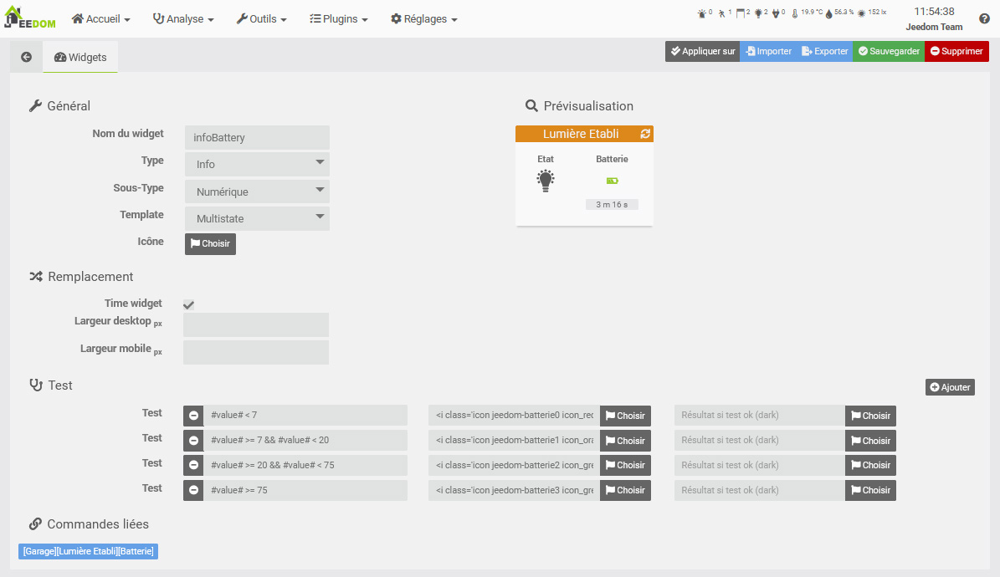

# Presentation

Jeedom is free open-source software that can be installed on any Linux system. It is based on a heart with multiple functionalities : simple and advanced scenario management, interaction with the home automation installation in text and sound, visualization of history and generation of curves and graphs, linking of all equipment and connected objects, customization of the interface...

Jeedom does not require access to external servers to operate. Your entire installation is managed locally and you are therefore the only ones who have access to it to guarantee complete confidentiality..

Thanks to its flexibility and numerous customization parameters, each user can create their own Jeedom home automation. Using widgets, views and designs, you have complete freedom to imagine your own interface if you wish.

Jeedom allows many possibilities including :

- Manage the security of goods and people,
- Automate heating for better comfort and energy savings,
- Visualize and manage energy consumption, to anticipate expenditure and reduce consumption,
- Communicate by voice, SMS, emails or mobile applications,
- Manage all the automations in the house, shutters, gate, lights, etc..,
- Manage audio and video multimedia devices, and connected objects.

Jeedom is based on the Core, embedding the structure and central functions.

Different [Plugins](https://market.jeedom.com) can then propose new functions.

The Core includes among others :

## Dashboard / Summary

*Equipment, including actuators or sensors, is organized by objects. Objects can, for example, represent physical parts*.

## Widget creation

*Jeedom offers a Widget creation engine for equipment tiles. You can thus create your own Widgets, in addition to the basic Widgets. Widgets can also be created directly from code, for advanced users.*

## Historical

*All the information can be saved (temperature curve, consumption, door openings, etc.), and accessible in Analysis → History or from the Dashboard tiles.*

## Scenarios

*Scenarios allow you to automate all or part of your equipment. They are built with different blocks. Conditional blocks (If Then, Otherwise), actions, programming (IN x minutes or A hhmm), loop, comment, or php code. All blocks are nestable into each other, offering endless possibilities.*

## Interactions

*The interaction system in Jeedom allows you to perform actions from text or voice commands.*

## Update center

*The update center allows you to update all of Jeedom's functionality, including the core software and its Plugins. Other extension management functions are available (delete, reinstall, check, etc.).*

# Market

Around this core are Plugins, which can be of all kinds :

-   Home automation protocol (Z-Wave, RFXcom, EnOcean…),
-   IP protocol (KNX, xPL…),
-   Communicating object (Nest, Netatmo…),
-   High level (alarm, thermostat ...),
-   Interface (widget),
-   Organization (calendar, Google calendar),
-   Development (script).

These Plugins can be installed from the Market and allow you to extend the possibilities of Jeedom.

Jeedom allows any plugin to chat with another on a standardized basis. This allows for example to use the thermostat or alarm Plugins with any home automation protocol or even an IP plugin or communicating object ...

