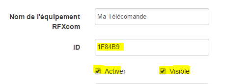

# Ematronics component

## Finding the Remote ID

### Go to "Plugins", "Plugin management", "RFX COM"


### In "RFXcom protocol management"


check Protocol 8, BlindsT1, Save and Exit.


### Enable, "Launch in debug mode"


Wait for the window to open, then press the Open button on your Ematronic remote control.

````
MainThread - rfxcmd:2765 - DEBUG - Test message: 09 19 03 01 1F 84 B9 01 01 60
MainThread - rfxcmd:2805 - DEBUG - Message OK
MainThread - rfxcmd:328 - DEBUG - Verified OK
MainThread - rfxcmd:334 - DEBUG - PacketType: 19
MainThread - rfxcmd:338 - DEBUG - SubType: 03
MainThread - rfxcmd:342 - DEBUG - SeqNbr: 01
MainThread - rfxcmd:346 - DEBUG - Id1: 1F
MainThread - rfxcmd:350 - DEBUG - Id2: 84
MainThread - rfxcmd:359 - DEBUG - Verify correct packet length
MainThread - rfxcmd:556 - DEBUG - Save packet to log_msgfile
````

### Find remote control ID

Remarque: Ematronic remote controls always start with : 09 19 03 so the area that interests us starts from "Test message" : 09 19 03.

Spot : Id1 and Id2 and add the following hexadecimal : in my example Id1=1F and Id2=84. you must therefore locate them in the line, "Test message" and extract the Id3, here Id3=B9, Our remote control therefore has the ID ⇒ 1F84B9.

### Stop Debug Mode using the "Stop/Restart the daemon" button"


## Creation of the remote control under JeeDom

Go to Plugins, Domotic Protocol, RFXcom.


Click on "Add" and enter a name for your virtual remote.


Choose the template from the list of equipment : "Ematronic flap - Fault".

Replace the automatic ID with the one you extracted earlier and Check "Enable" and "Visible" :



Click on "Save" to save your configuration and load the "Volet Ematronic - Default" template".


Here is your remote control is ready, it should look like this :


## Associate your JeeDom virtual remote control with your Ematronic motor

### Engine reset

-   Electrically disconnect the motor.
-   On the original remote control, leave the "Up" button pressed for 3 or 4 seconds, the led becomes fixed red.
-   Connect the motor electrically.
-   Release the button on the remote.
-   The motor will beep 5 times.
-   Quickly, press with a paperclip on the "micro button" on the back of the remote control.
-   The motor will beep 3 times.

## Association of the JeeDom virtual remote control with the Ematronic motor

-   Electrically disconnect the motor.
-   On the original remote control, leave the "Up" button pressed for 3 or 4 seconds, the led becomes fixed red.
-   Connect the motor electrically.
-   Release the button on the remote.
-   The motor will beep 5 times.
-   Press the "Mount" command on the JeeDom virtual remote control.
[image](images/volet.ematronic/image09.png)
-   The engine will beep 3 times, to announce that your JeeDoom is associated !!
