# Compatibility of Zigbee modules

# 3A Smart Home DE

|Image|Marque|Nom|Type|Remarque|Lien|
|---|---|---|---|---|---|
||3A Smart Home DE|SFLS-PP lp wireless ballast||||
||3A Smart Home DE|Smart plug + 2 USB ports||||
||3A Smart Home DE|Zigbee 3.0 ZLL RGB light||||
||3A Smart Home DE|ZW-EC-01 Store Zemismart||||

# ADUROLIGHT

|Image|Marque|Nom|Type|Remarque|Lien|
|---|---|---|---|---|---|
||ADUROLIGHT|Trust ZPIR-8000||||

# BYLED

|Image|Marque|Nom|Type|Remarque|Lien|
|---|---|---|---|---|---|
||BYLED|BYLED - ZigBee receiver for industrial suspension||||

# Bitron Video

|Image|Marque|Nom|Type|Remarque|Lien|
|---|---|---|---|---|---|
||Bitron Video|SMABIT - 4-button remote control|||[Buy](https://www.domadoo.fr/fr/peripheriques/5551-smabit-telecommande-zigbee-4-boutons-8023874395814.html)|
||Bitron Video|SMABIT - Smart socket ON / OFF 16A|||[Buy](https://www.domadoo.fr/fr/peripheriques/5563-smabit-prise-intelligente-zigbee-onoff-16a-8023874395852.html)|
||Bitron Video|SMABIT - Smart thermostat with integrated relay|||[Buy](https://www.domadoo.fr/fr/peripheriques/5565-smabit-thermostat-intelligent-zigbee-avec-relais-8023874395883.html)|
||SMaBiT|SMABIT - Zigbee outdoor siren 104 dB|Mermaid||[Buy](https://www.domadoo.fr/fr/peripheriques/5564-smabit-sirene-exterieure-zigbee-104-db-8023874397641.html?domid=4&id_campaign=9)|
||Bitron Video|SMABIT - Opening detector + Wired sensor input|||[Buy](https://www.domadoo.fr/fr/peripheriques/5546-smabit-detecteur-d-ouverture-zigbee-entree-capteurs-filaires-8023874396651.html)|
|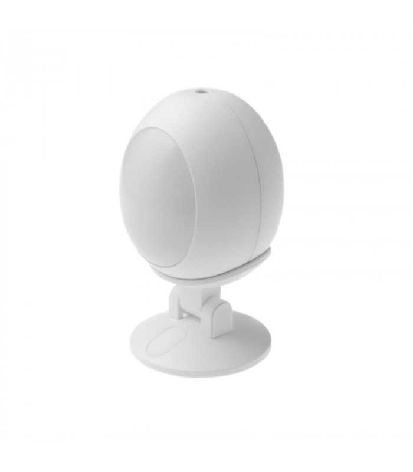|Bitron Video|SMABIT - Design motion detector|||[Buy](https://www.domadoo.fr/fr/peripheriques/5549-smabit-detecteur-de-mouvement-design-zigbee-8021156061013.html)|
||Bitron Video|SMABIT - Smoke detector|||[Buy](https://www.domadoo.fr/fr/peripheriques/5555-smabit-detecteur-de-fumee-optique-zigbee-avec-fonction-sirene-8023874396644.html)|
||Bitron Video|SMABIT - Smart socket ON / OFF 16A||||
||Bitron Video|SMABIT - 2.5A dimmer smart socket|||[Buy](https://www.domadoo.fr/fr/peripheriques/5561-smabit-prise-intelligente-zigbee-variateur-25a-8023874395845.html)|
||Bitron Video|SMABIT - Curtain motion detector|||[Buy](https://www.domadoo.fr/fr/peripheriques/5540-smabit-detecteur-de-mouvement-de-rideau-zigbee-8021156062300.html)|
||Bitron Video|SMABIT - 2.5A dimmer wall relay|||[Buy](https://www.domadoo.fr/fr/peripheriques/5543-smabit-relais-mural-variateur-25a-zigbee-8023874397122.html)|
|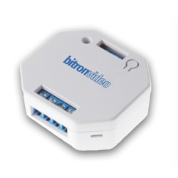|Bitron Video|SMABIT - Switch wall relay 10A|||[Buy](https://www.domadoo.fr/fr/peripheriques/5544-smabit-relais-mural-commutateur-10a-zigbee-8023874397139.html)|
||Bitron Video|SMABIT - Extra flat opening detector|||[Buy](https://www.domadoo.fr/fr/peripheriques/5547-smabit-detecteur-d-ouverture-de-porte-ou-fenetre-ultra-plat-zigbee-8023874397658.html)|
|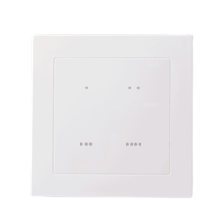|Bitron Video|SMABIT - Wall switch with batteries|||[Buy](https://www.domadoo.fr/fr/peripheriques/5568-smabit-interrupteur-mural-zigbee-avec-piles-8021156061037.html)|
||Bitron Video|SMABIT - Flood detector + siren|||[Buy](https://www.domadoo.fr/fr/peripheriques/5569-smabit-detecteur-de-fuite-d-eau-avec-sirene-zigbee-8021156063291.html)|
|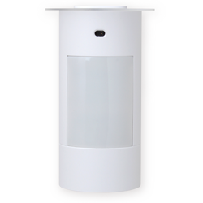|Bitron Video|SMABIT - Outdoor motion detector|||[Buy](https://www.domadoo.fr/fr/peripheriques/5550-smabit-detecteur-de-mouvement-exterieur-zigbee-8023874397665.html)|

# Eurotronic

|Image|Marque|Nom|Type|Remarque|Lien|
|---|---|---|---|---|---|
||Eurotronic|Thermosatic head||Valve that tends to no longer accept orders (change of setpoint) unless the batteries are removed and put back. On the other hand, this always feeds back the temperature information and manual setpoint change|[Buy](https://www.domadoo.fr/fr/peripheriques/5188-eurotronic-tete-thermostatique-zigbee-4260012711233.html)|

# Frient

|Image|Marque|Nom|Type|Remarque|Lien|
|---|---|---|---|---|---|
|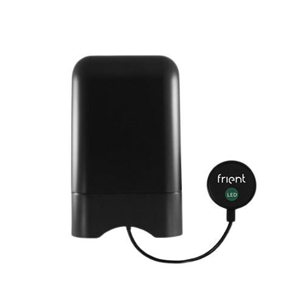|Frient|Optical electricity consumption meter|||[Buy](https://www.domadoo.fr/fr/peripheriques/5424-frient-compteur-optique-de-consommation-d-electricite-zigbee-ha-5713594002583.html)|
||Frient|Air quality sensor|||[Buy](https://www.domadoo.fr/fr/peripheriques/5408-frient-capteur-de-qualite-d-air-zigbee-ha-5713594002392.html)|
||Frient|IO Module||||
|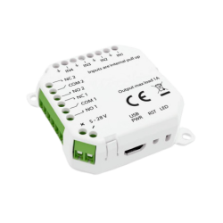|Frient|Zigbee 3 IO module.0 - 4 dry contact inputs + 2 NO/NC dry contact outputs (ON/OFF or pulse)|||[Buy](https://www.domadoo.fr/fr/peripheriques/6148-domadoo-module-io-zigbee-30-4-entrees-contact-sec-2-sorties-nonc-onoff-ou-impulsion.html?domid=4&id_campaign=9)|
||Develco|Smart keyboard||For the Info SOS command the meaning is : 2 SOS (long press on the button), 7 someone has passed it in front of the keyboard|[Buy](https://www.domadoo.fr/fr/peripheriques/5537-frient-clavier-a-codes-intelligent-zigbee-30-lecteur-rfid-5713594002415.html?domid=4&id_campaign=9)|
||Develco|Panic Button||There seems to be a problem with the firmware, only the deactivation of the alert (press the button for 5s after activating the panic mode) is sent to the zigbee networks|[Buy](https://www.domadoo.fr/fr/peripheriques/5808-frient-bouton-intelligent-zigbee-30.html?domid=4&id_campaign=9)|
||Frient|Smart siren|||[Buy](https://www.domadoo.fr/fr/peripheriques/5538-frient-sirene-intelligente-zigbee-30-5713594002422.html?domid=4&id_campaign=9)|
|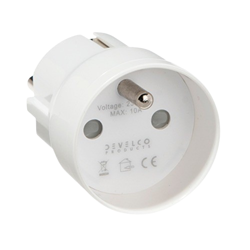|Frient|Smart plug|||[Buy](https://www.domadoo.fr/fr/peripheriques/5412-frient-prise-intelligente-mini-avec-mesure-de-consommation-zigbee-ha-version-fr-5713594002514.html)|
||Frient|Air quality sensor|||[Buy](https://www.domadoo.fr/fr/peripheriques/5408-frient-capteur-de-qualite-d-air-zigbee-ha-5713594002392.html)|
|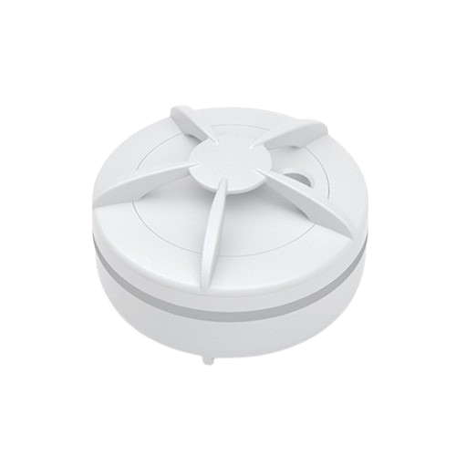|Frient|Smart flood detector|||[Buy](https://www.domadoo.fr/fr/peripheriques/5427-frient-detecteur-d-inondation-zigbee-30-5713594002453.html)|
|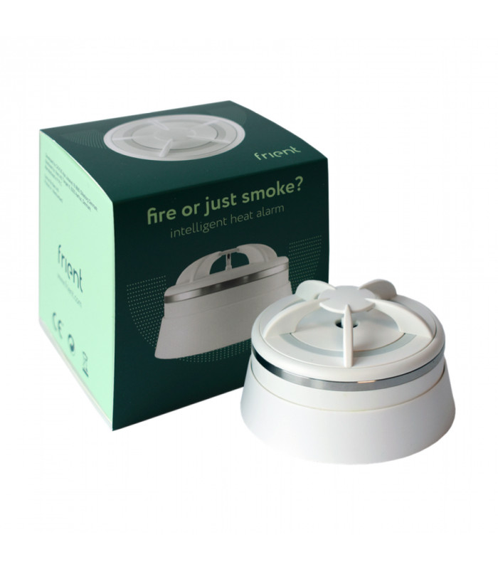|Frient|Heat detector|||[Buy](https://www.domadoo.fr/fr/peripheriques/5411-frient-detecteur-de-chaleur-intelligent-zigbee-30-din-en-14604-et-din-14676-5713594002446.html)|
||Frient|Temperature and humidity sensor|||[Buy](https://www.domadoo.fr/fr/peripheriques/5407-frient-capteur-de-temperature-et-humidite-intelligent-zigbee-30-5713594002385.html)|
||Frient|Smart keyboard||For the Info SOS command the meaning is : 2 SOS (long press on the button), 7 someone has passed it in front of the keyboard|[Buy](https://www.domadoo.fr/fr/peripheriques/5537-frient-clavier-a-codes-intelligent-zigbee-30-lecteur-rfid-5713594002415.html?domid=4&id_campaign=9)|
||Frient|Motion detector and temperature and light sensor|||[Buy](https://www.domadoo.fr/fr/peripheriques/5404-frient-detecteur-de-mouvement-zigbee-30-capteur-de-temperature-et-luminosite-5713594002361.html)|
|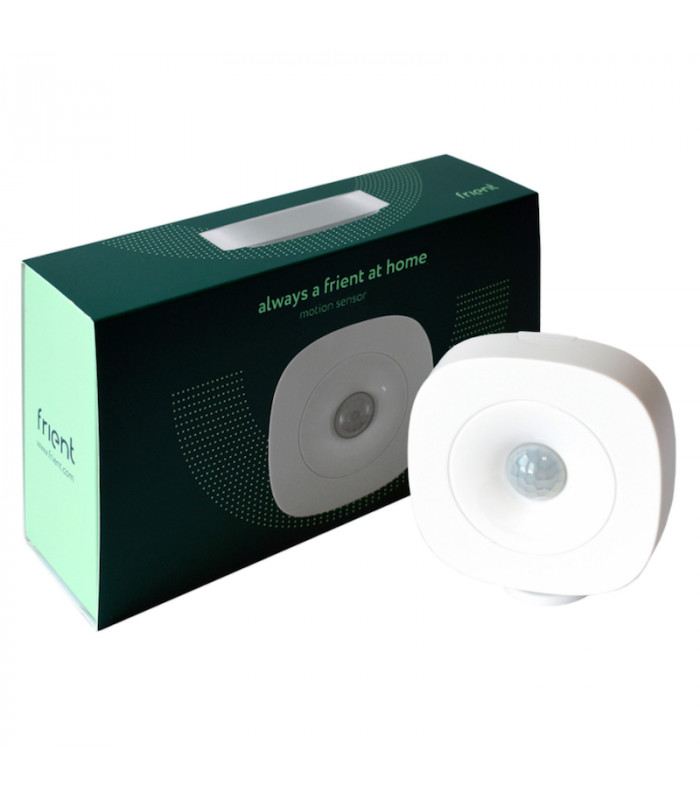|Frient|Movement detector|||[Buy](https://www.domadoo.fr/fr/peripheriques/5403-frient-detecteur-de-mouvement-zigbee-30-5713594002835.html)|
||Frient|FRIENT - ZIGBEE 3.0 SMART SIREN|||[Documentation](https://www.domadoo.fr/fr/index.php?controller=attachment&id_attachment=2700) [Buy](https://www.domadoo.fr/fr/peripheriques/5538-frient-sirene-intelligente-zigbee-30-5713594002422.html?domid=4&id_campaign=9)|
|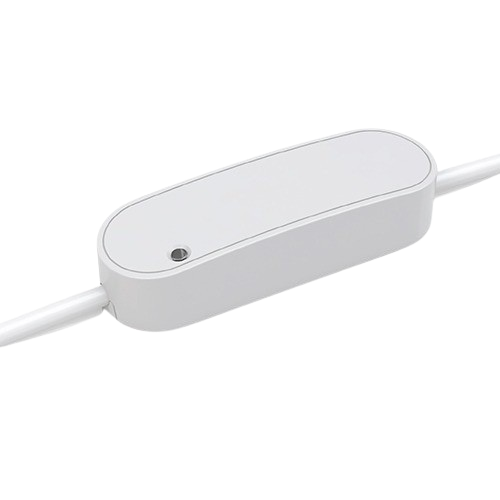|Frient|Smart cord switch|||[Buy](https://www.domadoo.fr/fr/peripheriques/5421-frient-interrupteur-sur-cordon-zigbee-30-5713594002408.html)|
||Frient|Smart smoke detector DIN EN 14604 AND DIN 14676|||[Buy](https://www.domadoo.fr/fr/peripheriques/5409-frient-detecteur-de-fumee-intelligent-zigbee-30-5713594002330.html)|
|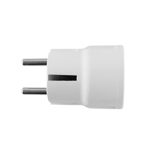|Frient|Schuko format smart plug|||[Buy](https://www.domadoo.fr/fr/peripheriques/5420-frient-prise-intelligente-mini-avec-mesure-de-consommation-zigbee-ha-version-schuko-5713594002347.html)|
||Frient|FR format smart socket|||[Buy](https://www.domadoo.fr/fr/peripheriques/5412-frient-prise-intelligente-mini-avec-mesure-de-consommation-zigbee-ha-version-fr-5713594002514.html)|
||Frient|Smart siren|||[Buy](https://www.domadoo.fr/fr/peripheriques/5538-frient-sirene-intelligente-zigbee-30-5713594002422.html?domid=4&id_campaign=9)|
||Frient|Door or window opening detector and temperature sensor|||[Buy](https://www.domadoo.fr/fr/peripheriques/5402-frient-detecteur-d-ouverture-de-porte-ou-fenetre-zigbee-30-capteur-de-temperature-5713594002354.html)|
||Frient|Intelligent motion detector|||[Buy](https://www.domadoo.fr/fr/peripheriques/5401-frient-detecteur-d-ouverture-de-porte-ou-fenetre-zigbee-30-5713594002545.html)|
||Frient|Smart button|Remote control,Button||[Buy](https://www.domadoo.fr/fr/peripheriques/5808-frient-bouton-intelligent-zigbee-30.html?domid=4&id_campaign=9)|

# GR-SMARTHOME

|Image|Marque|Nom|Type|Remarque|Lien|
|---|---|---|---|---|---|
||GR-SMARTHOME|Motorization for 1/4 turn valve|Vanne||[Buy](https://www.domadoo.fr/fr/peripheriques/5264-gr-smarthome-motorisation-zigbee-30-pour-vanne-14-de-tour.html)|
|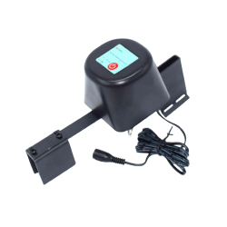|GR-SMARTHOME|GR-SMARTHOME - ZIGBEE 3 MOTORIZATION.0 FOR 1/4 TURN VALVE|||[Documentation](https://www.domadoo.fr/fr/index.php?controller=attachment&id_attachment=2823) [Buy](https://www.domadoo.fr/fr/peripheriques/5264-gr-smarthome-motorisation-zigbee-30-pour-vanne-14-de-tour.html?domid=4&id_campaign=9)|
||GR-SMARTHOME|Motorization for 1/4 turn valve|Vanne||[Buy](https://www.domadoo.fr/fr/peripheriques/5264-gr-smarthome-motorisation-zigbee-30-pour-vanne-14-de-tour.html)|
||GR-SMARTHOME|GR-SMARTHOME - ZIGBEE 3 MOTORIZATION.0 FOR 1/4 TURN VALVE|||[Documentation](https://www.domadoo.fr/fr/index.php?controller=attachment&id_attachment=2823) [Buy](https://www.domadoo.fr/fr/peripheriques/5264-gr-smarthome-motorisation-zigbee-30-pour-vanne-14-de-tour.html?domid=4&id_campaign=9)|

# Gewiss

|Image|Marque|Nom|Type|Remarque|Lien|
|---|---|---|---|---|---|
||Gewiss|Opening detector and temperature sensor||||
||Gewiss|2-channel actuator||||
||Gewiss|Motion detector and temperature and light sensor||||
||Gewiss|Smoke detector||||

# GreenPower

|Image|Marque|Nom|Type|Remarque|Lien|
|---|---|---|---|---|---|
||GreenPower|Generic GreenPower equipment||||
||GreenPower|GreenPower On / Off equipment||||
||GreenPower|GreenPower equipment window handle||||

# Groupes

|Image|Marque|Nom|Type|Remarque|Lien|
|---|---|---|---|---|---|
||Groupes|White - Brightness - On - Off||||
|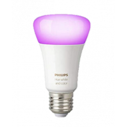|Groupes|Color - White - Brightness - On - Off||||
|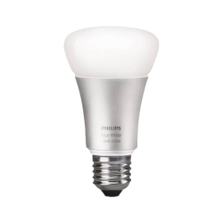|Groupes|Brightness - On - Off||||
||Groupes|On - Off||||
|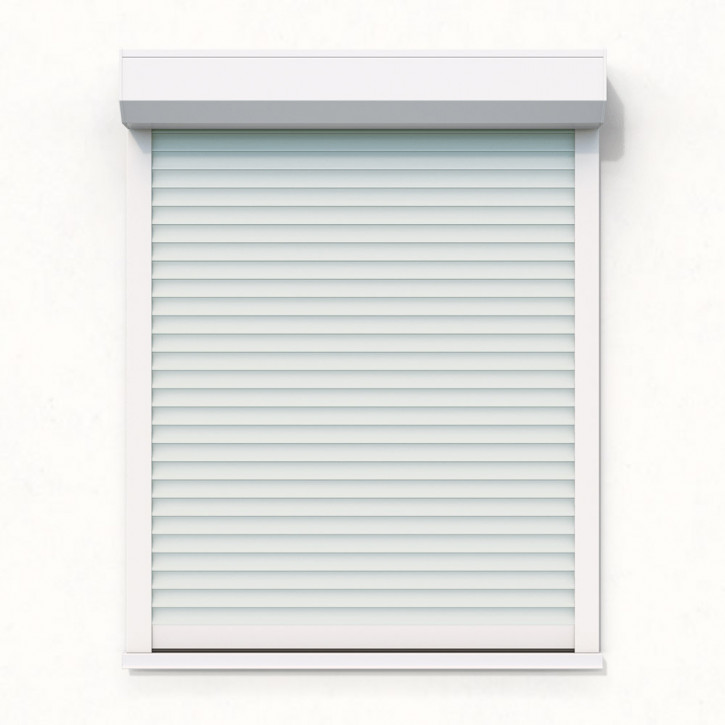|Groupes|Volet||||

# Halemeier

|Image|Marque|Nom|Type|Remarque|Lien|
|---|---|---|---|---|---|
||Halemeier|HA-ZGMW2-E||||
||Halemeier|HA-ZGMW2-E||||

# Insta

|Image|Marque|Nom|Type|Remarque|Lien|
|---|---|---|---|---|---|
|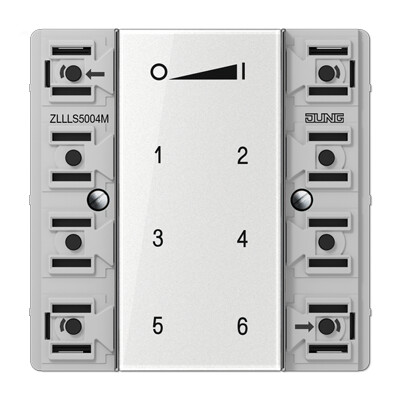|Insta|Remote control||||

# JunYu

|Image|Marque|Nom|Type|Remarque|Lien|
|---|---|---|---|---|---|
||JunYu|RGBW LED||Please note that the status feedback for this model is not in real time (either following a command or by explicitly requesting an update of it)||

# LIVOLO

|Image|Marque|Nom|Type|Remarque|Lien|
|---|---|---|---|---|---|
||LIVOLO|Interrupteur||||

# LS Deutschland GmbH

|Image|Marque|Nom|Type|Remarque|Lien|
|---|---|---|---|---|---|
||LS Deutschland GmbH|||||

# Legrand

|Image|Marque|Nom|Type|Remarque|Lien|
|---|---|---|---|---|---|
|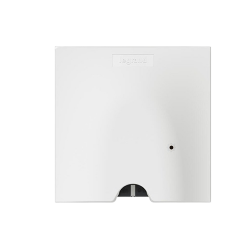|Legrand|Connected cable outlet||Can only be paired on channel 11||
|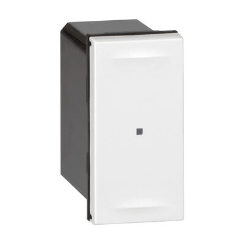|Legrand|Micro VMC module||Can only be paired on channel 11||
||Legrand|Connected socket||Can only be paired on channel 11||
|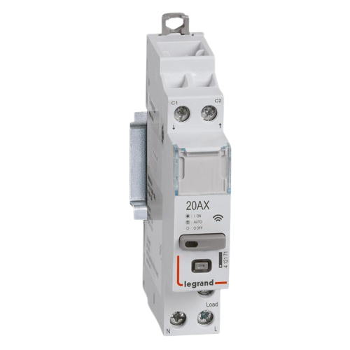|Legrand|DRIVIA connected contactor||Can only be paired on channel 11||
||Legrand|DIN power consumption module||Can only be paired on channel 11||
|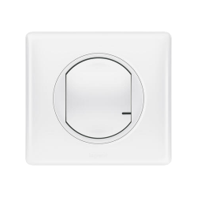|Legrand|Wired switch connected with dimmer option without neutral||Can only be paired on channel 11, 13 or 15||
|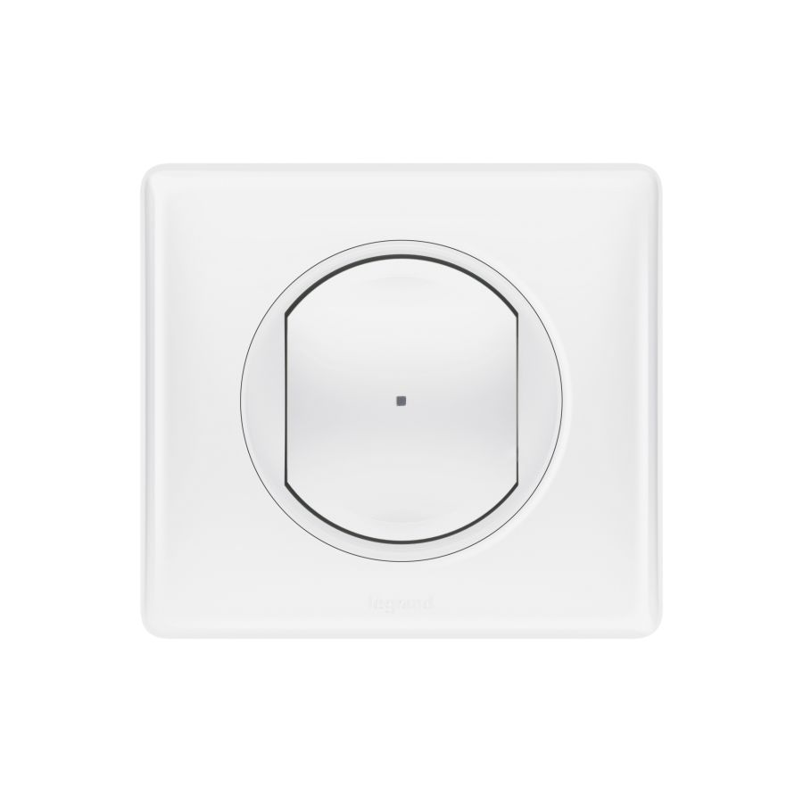|Legrand|Switch connected with neutral with dimmer option||Can only be paired on channel 11, 13 or 15||
||Legrand|Wireless dual control||Can only be paired on channel 11||
||Legrand|GreenPower Home / Away||||
||Legrand|GreenPower Day / Night||||
||Legrand|GreenPower On / Off||||
||Legrand|GreenPower shutter||||
|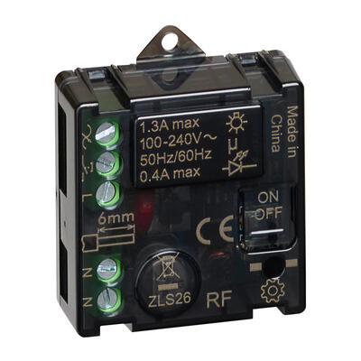|Legrand|Module for connected lighting||Can only be paired on channel 11 or 15||
|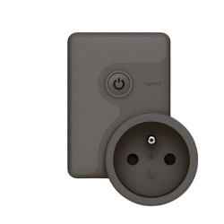|Legrand|Céliane mobile socket||Can only be paired on channel 11||
||Legrand|Double switch connected with neutral||Can only be paired on channel 11 or 15||
|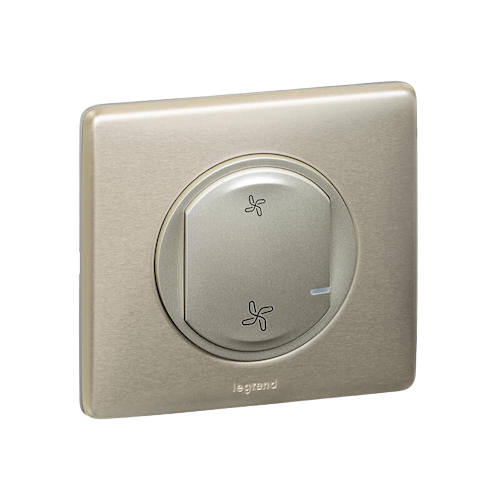|Legrand|Fan switch||Can only be paired on channel 11||
||Legrand|Movement detector||Can only be paired on channel 11||
||Legrand|Simple wireless control||Can only be paired on channel 11||
||Legrand|Wireless control Sunrise Sunset||Can only be paired on channel 11||
|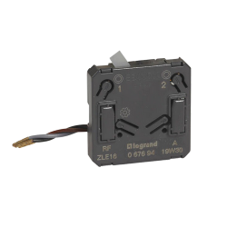|Legrand|Toggle command||Can only be paired on channel 11||
||Legrand|BTICINO - Wired switch for roller shutters with positioning||Can only be paired on channel 11||
||Legrand|Wired switch connected for roller shutter||Can only be paired on channel 11||
|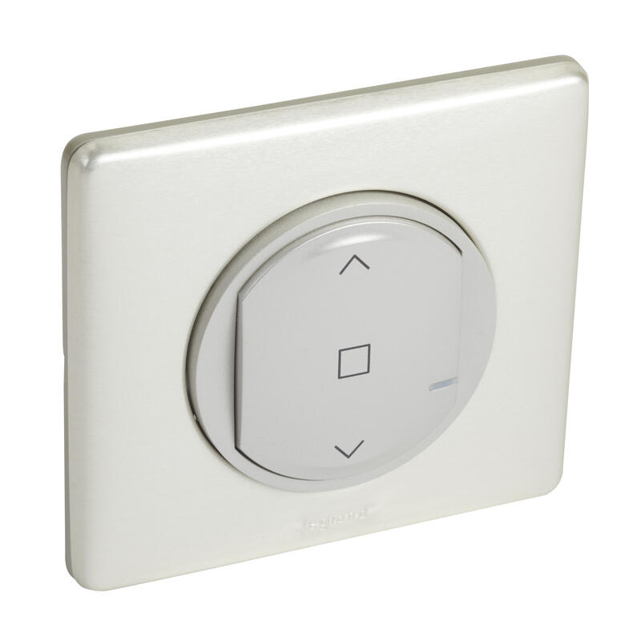|Legrand|Wireless control for roller shutter||Can only be paired on channel 11||
|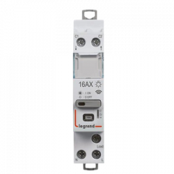|Legrand|Remote switch||Can only be paired on channel 11||
||Legrand|Scene command||Can only be paired on channel 11||

# LiXee

|Image|Marque|Nom|Type|Remarque|Lien|
|---|---|---|---|---|---|
||Lixee|Lixe ZiPulse - Pulse counter communicating in ZigBee 3.0.|Compteur|||
|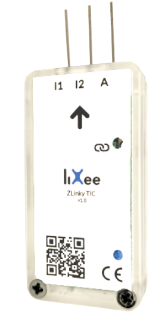|Lixee|TIC module for Linky meter|Compteur||[Buy](https://www.domadoo.fr/fr/box-domotique/5914-lixee-module-tic-vers-zigbee-30-pour-compteur-linky-3770014375148.html?domid=4&id_campaign=9)|

# MLI

|Image|Marque|Nom|Type|Remarque|Lien|
|---|---|---|---|---|---|
||MLI|MLI - ZBT remote all RGBW||||

# NIKO NV

|Image|Marque|Nom|Type|Remarque|Lien|
|---|---|---|---|---|---|
||NIKO NV|Smart plug||||

# Oeeone

|Image|Marque|Nom|Type|Remarque|Lien|
|---|---|---|---|---|---|
||Oeeone|Oeeone Smart LED Filament Bulb E27||||

# Paul Neuhaus

|Image|Marque|Nom|Type|Remarque|Lien|
|---|---|---|---|---|---|
||Paul Neuhaus|Q-Orbit||||
||Paul Neuhaus|Q-SKYLINE||||
||Paul Neuhaus|Q-Miran||||
||Paul Neuhaus|NLG-remote||||
||Paul Neuhaus|Neuhaus remote||||

# Philio

|Image|Marque|Nom|Type|Remarque|Lien|
|---|---|---|---|---|---|
||Philio|4 in 1 Multi sensor||||

# SZ

|Image|Marque|Nom|Type|Remarque|Lien|
|---|---|---|---|---|---|
|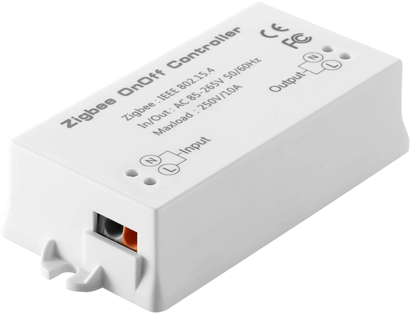|SZ|Zigbee On / Off controller||||

# Samjin

|Image|Marque|Nom|Type|Remarque|Lien|
|---|---|---|---|---|---|
||Samjin|Bouton||||
||Samjin|Motion||||

# Samotech

|Image|Marque|Nom|Type|Remarque|Lien|
|---|---|---|---|---|---|
||Samotech|SAMOTEK SM309||||

# Sinope Technologies

|Image|Marque|Nom|Type|Remarque|Lien|
|---|---|---|---|---|---|
||Ouellet|Ouellet OTH3600-GA-ZB|Thermostatic head|||

# Terncy

|Image|Marque|Nom|Type|Remarque|Lien|
|---|---|---|---|---|---|
|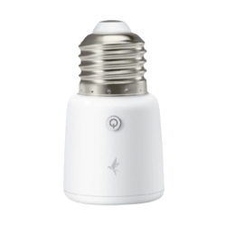|Terncy|SFLS-PP lp wireless ballast||||

# Titan Products Ltd

|Image|Marque|Nom|Type|Remarque|Lien|
|---|---|---|---|---|---|
||Titan Products Ltd|TPZ-Net Wireless CO2, Temperature & Humidity Sensors|Temperature, Humidity, Air quality, CO2|||

# Trust International

|Image|Marque|Nom|Type|Remarque|Lien|
|---|---|---|---|---|---|
||Trust International|Trust International ZLL-DimmableLigh||||

# Ysrai

|Image|Marque|Nom|Type|Remarque|Lien|
|---|---|---|---|---|---|
|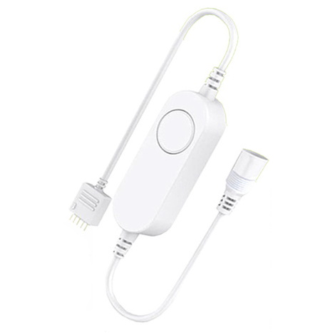|Ysrai|YSRSAI - ZB-CL01||||

# ZB Ajax Online

|Image|Marque|Nom|Type|Remarque|Lien|
|---|---|---|---|---|---|
||ZB Ajax Online|CCT Light||||

# Zemismart

|Image|Marque|Nom|Type|Remarque|Lien|
|---|---|---|---|---|---|
|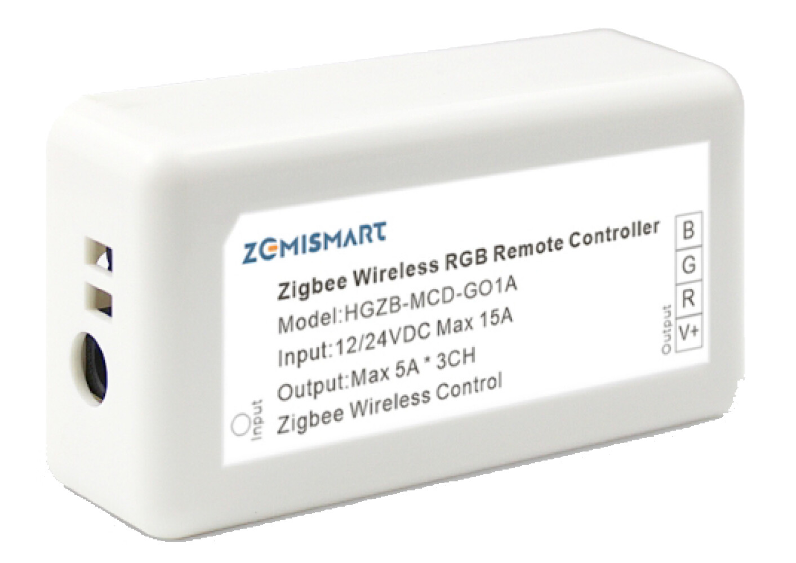|Zemismart|Zigbee 3.0 RGB Remote Controller||||
||Zemismart|Single load smart switch without neutral||||
||Zemismart|Single load smart switch without neutral||||
||Zemismart|Zemismart Zigbee/RF||||
||Zemismart|Store|Volets|||

# Acova

|Image|Marque|Nom|Type|Remarque|Lien|
|---|---|---|---|---|---|
||Acova|ACOVA Alcantara2|Chauffage||[Documentation](https://acova.fr/sites/default/files/PIM/documents/Notice_utilisation_Alcantara_2.pdf) [Buy](https://www.leroymerlin.fr/produits/chauffage-plomberie/chauffage-electrique/radiateur-electrique/radiateur-a-inertie/radiateur-electrique-connecte-a-inertie-fluide-1000w-acova-alcantara2-horizontal-82646764.html)|
||Acova|ACOVA Percale2|Chauffage||[Documentation](https://acova.fr/radiateur-electrique/percale-2-connecte-156865) [Buy](https://www.leroymerlin.fr/produits/chauffage-plomberie/chauffage-electrique/radiateur-electrique/radiateur-a-inertie/radiateur-electrique-connecte-a-inertie-fluide-1000w-acova-percale2-horizontal-82646753.html)|

# Adeo

|Image|Marque|Nom|Type|Remarque|Lien|
|---|---|---|---|---|---|
||Adeo|LEXMAN ENKI - Connected socket 16A Dimmer||||
||Adeo|LEXMAN ENKI - 16A connected socket|||[Buy](https://www.leroymerlin.fr/produits/electricite-domotique/domotique-et-objets-connectes/domotique/solutions-de-commande/prise-connectee-16a-3680w-repeteur-lexman-82428895.html)|
|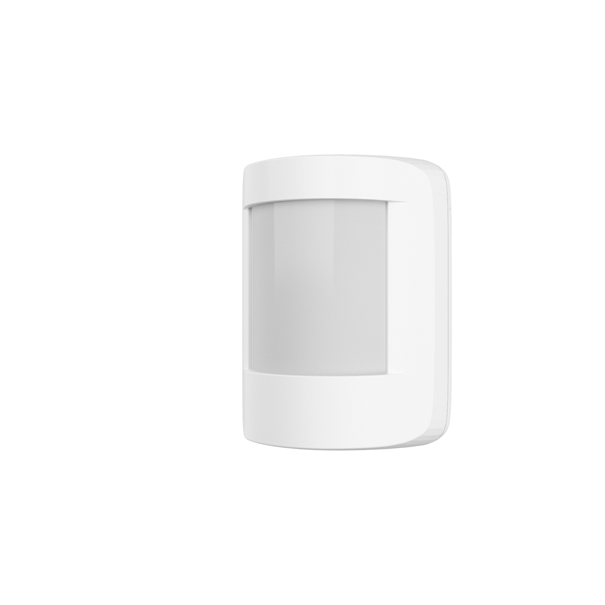|Adeo|Movement detector|Mouvement|||
|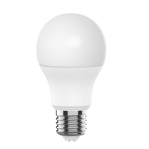|Adeo|LEXMAN ENKI - Smart bulb||||
|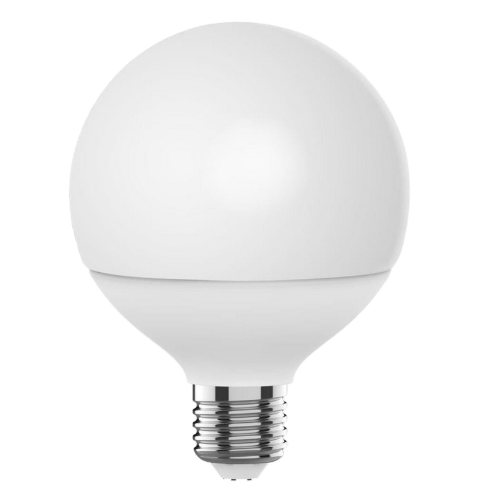|Adeo|LEXMAN ENKI - Smart bulb||||
|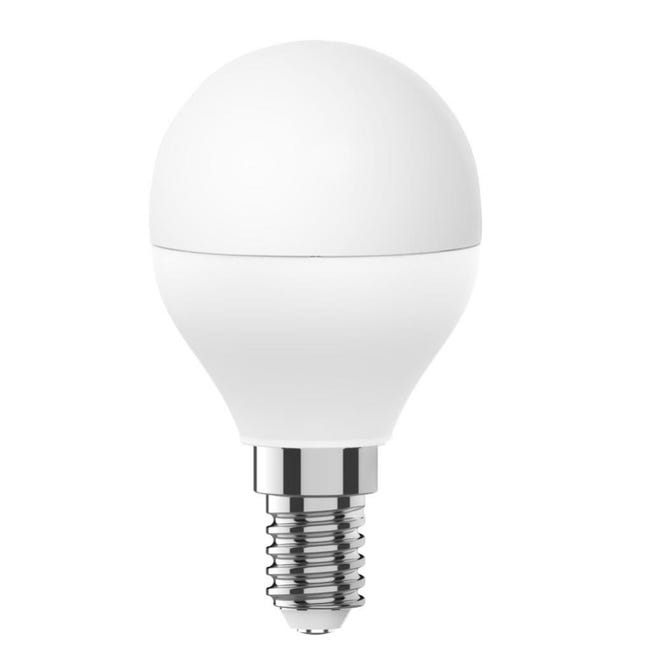|Adeo|LEXMAN ENKI - Smart bulb||||
|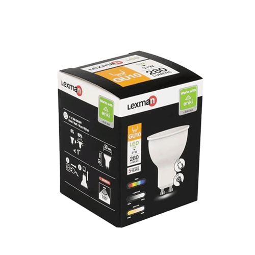|Adeo|LEXMAN ENKI - Smart bulb||||
|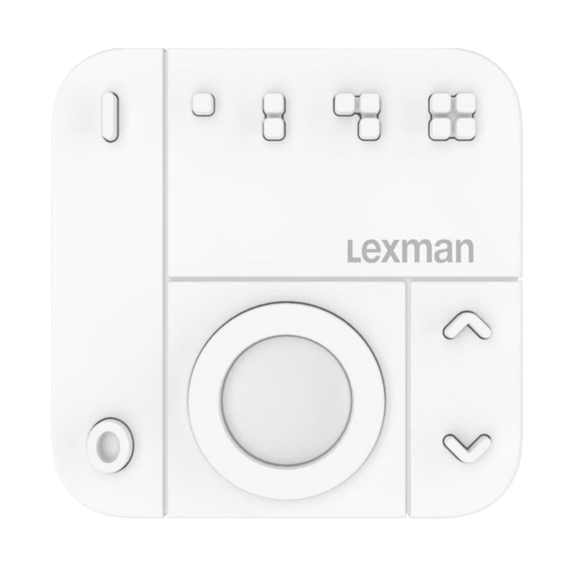|Adeo|LEXMAN ENKI - Remote control for connected RGB bulbs||||
|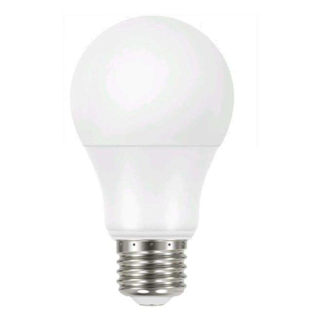|Adeo|LEXMAN ENKI - Smart bulb||||
||Adeo|LEXMAN ENKI E14 40W - Smart bulb||||
||Adeo|LEXMAN ENKI E27 75W - Smart bulb||||

# Alfawise

|Image|Marque|Nom|Type|Remarque|Lien|
|---|---|---|---|---|---|
|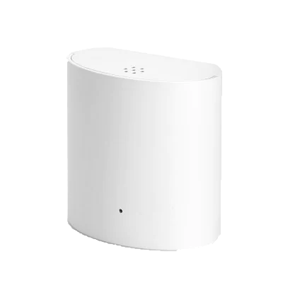|Alfawise|Alfawise Temperature / humidity||||
||Alfawise|Alfawise carries||||
||Alfawise|Alfawise carries||||

# Awox

|Image|Marque|Nom|Type|Remarque|Lien|
|---|---|---|---|---|---|
|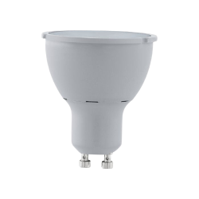|Awox|EGLO Crosslink-Z / Awox TLSR82||||

# Casaia

|Image|Marque|Nom|Type|Remarque|Lien|
|---|---|---|---|---|---|
||Casaia|Rail-Din 32A relay and Zigbee energy meter|Contactor, Counter||[Documentation](https://casaia.fr/product/relais-rail-din-et-compteur-denergie-zigbee/?attachment_id=2554&download_file=pciir2fcqcjiz) [Buy](https://www.domadoo.fr/fr/peripheriques/5578-casaia-relais-rail-din-32a-et-compteur-d-energie-zigbee-3770021021175.html)|
|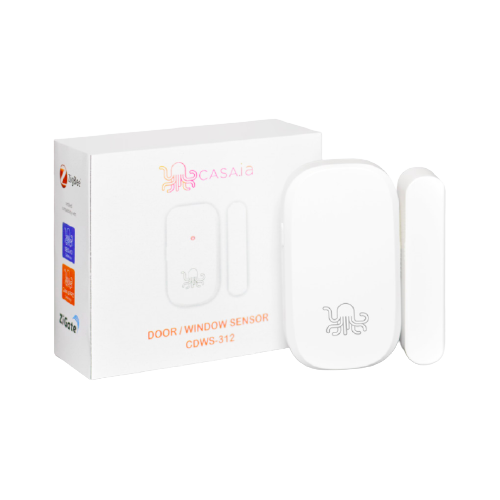|Casaia|Smart door detector|Ouverture|IMPORTANT : included but does not report any information||
||Casaia|4 button remote control||Only the + and minus buttons - work|[Buy](https://www.domadoo.fr/fr/peripheriques/5580-casaia-telecommande-keyfob-4-boutons-zigbee-3770021021205.html)|
||Casaia|Multi-sensor movements / vibrations / temperature / humidity|||[Buy](https://www.domadoo.fr/fr/peripheriques/5571-casaia-multi-sensor-zigbee-mouvements-vibrations-temperature-humidite-3770021021045.html)|
|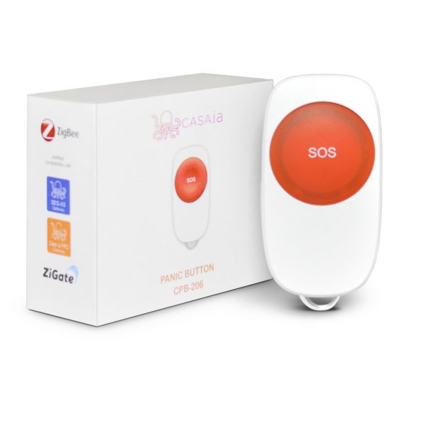|Casaia|SOS button||||
||Casaia|Zigbee access control module (6-24V DC) - Dry contact and delayed at 2 seconds|Contacteur||[Documentation](https://casaia.fr/product/module-de-controle-dacces-zigbee/?attachment_id=2539&download_file=nalg5m9bkxv0a) [Buy](https://www.domadoo.fr/fr/peripheriques/5574-casaia-module-de-controle-d-acces-zigbee-6-24v-dc-contact-sec-et-temporise-a-2-secondes-3770021021120.html)|
||Casaia|ZIGBEE DRY CONTACT RELAY MODULE (230V - 10A)|Contacteur||[Documentation](https://casaia.fr/product/module-relais-contact-sec-zigbee-2/?attachment_id=2531&download_file=sot05ddz1k2wn) [Buy](https://www.domadoo.fr/fr/peripheriques/5573-casaia-module-relais-contact-sec-zigbee-230v-10a-3770021021113.html)|
||Casaia|Zigbee triple relay module|Contacteur||[Documentation](https://casaia.fr/product/module-triple-relais-zigbee/?attachment_id=2518&download_file=c2digfwrhtylk) [Buy](https://www.domadoo.fr/fr/peripheriques/5577-casaia-module-triple-relais-zigbee-3770021021151.html)|
|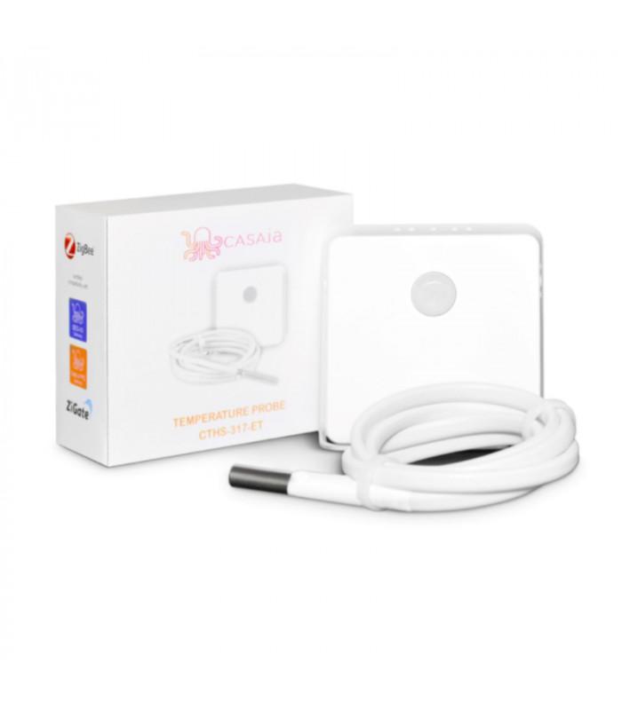|Casaia|Remote temperature probe on cable|||[Buy](https://www.domadoo.fr/fr/peripheriques/5572-casaia-sonde-de-temperature-deportee-sur-cable-zigbee-3770021021052.html)|

# ClimaxTechnology

|Image|Marque|Nom|Type|Remarque|Lien|
|---|---|---|---|---|---|
||ClimaxTechnology|Glass Break Detector|Capteur||[Documentation](https://www.climax.com.tw/new/downloads/ACGS-23ZBS_Product_News_20210701.pdf) |
||ClimaxTechnology|Temperature, humidity, brightness sensor|Sensor, Humidity, Temperature, Brightness||[Documentation](https://www.climax.com.tw/new/downloads/LMHT-1ZBS_Product_News_20121-0512.pdf) |
||ClimaxTechnology|Panic Button|||[Documentation](https://www.climax.com.tw/new/downloads/PB-23ZBS_Product%20News%2020190702.pdf) |
||ClimaxTechnology|Energy Meter|Sensor, Consumption||[Documentation](https://www.climax.com.tw/new/downloads/EMD-1ZBS_Product_News_2021_0423.pdf) |
||ClimaxTechnology|Temperature and humidity sensor|Sensor, Humidity, Temperature||[Documentation](https://www.climax.com.tw/new/downloads/RS-23R2-ZBS_Product%20News_20200603.pdf) |
|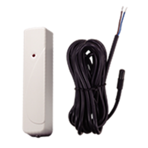|ClimaxTechnology|Temperature sensor|Sensor, Humidity, Temperature||[Documentation](https://www.climax.com.tw/new/downloads/TSO-9-EL-ZBS_Product%20News_20201111.pdf) |
||ClimaxTechnology|Input / Output Switch|Sensor, Humidity, Temperature||[Documentation](https://www.climax.com.tw/new/downloads/XE-11_Product%20News_20210503.pdf) |

# Danalock

|Image|Marque|Nom|Type|Remarque|Lien|
|---|---|---|---|---|---|
|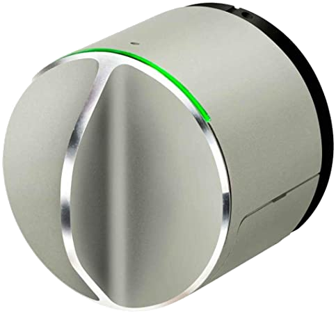|Danalock|Smart lock V3|||[Buy](https://www.domadoo.fr/fr/controle-acces/4540-danalock-serrure-connectee-bluetooth-et-zigbee-danalock-v3-5712560000493.html)|

# Danfoss

|Image|Marque|Nom|Type|Remarque|Lien|
|---|---|---|---|---|---|
|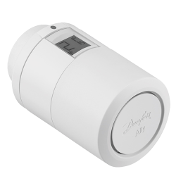|Danfoss|Danfoss Ally (2)|Thermostatic head||[Documentation](https://assets.danfoss.com/documents/DOC353849556547/DOC353849556547.pdf) [Buy](https://www.domadoo.fr/fr/peripheriques/5156-danfoss-tete-electronique-ally-zigbee-30-5702425245008.html)|
||Danfoss|Danfoss Icon Floor Controller|Heated Floor Controller|||
|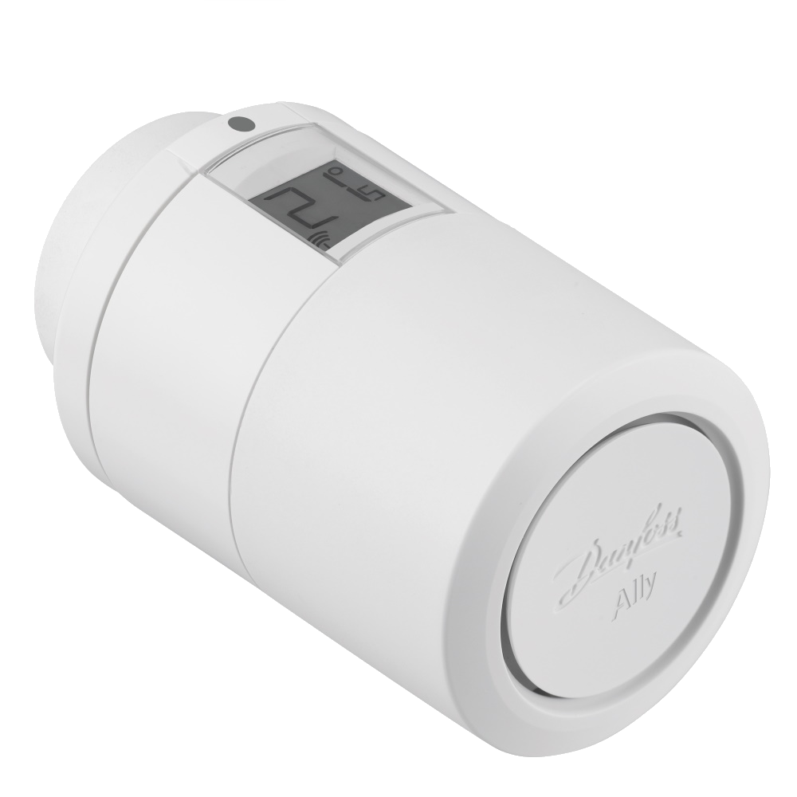|Danfoss|Danfoss Ally|Thermostatic head||[Documentation](https://assets.danfoss.com/documents/DOC353849556547/DOC353849556547.pdf) [Buy](https://www.domadoo.fr/fr/peripheriques/5156-danfoss-tete-electronique-ally-zigbee-30-5702425245008.html)|
|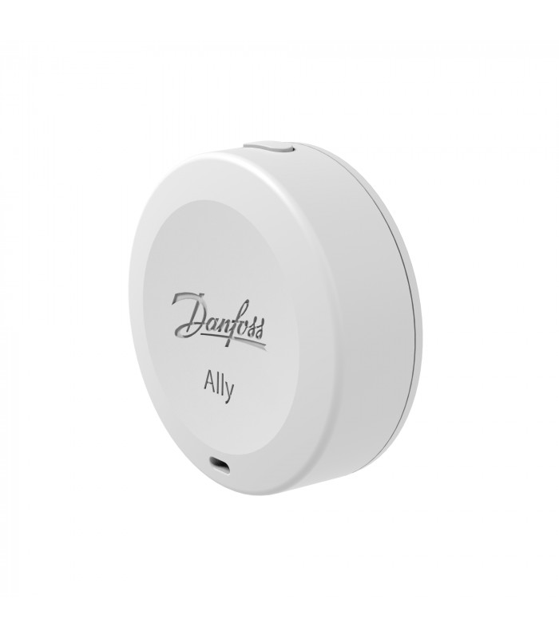|Danfoss|Temperature and humidity probe|||[Buy](https://www.domadoo.fr/fr/peripheriques/5930-danfoss-sonde-de-temperature-et-d-humidite-zigbee-30-5715162289013.html)|

# Dresden elektronik

|Image|Marque|Nom|Type|Remarque|Lien|
|---|---|---|---|---|---|
|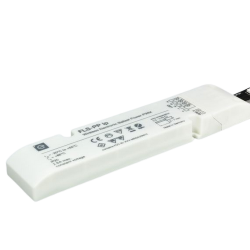|Dresden elektronik|FLS-PP lp wireless ballast||||

# EWeLink

|Image|Marque|Nom|Type|Remarque|Lien|
|---|---|---|---|---|---|
||eWeLight|Smart RGBCW LED Controller MR16||||
||EWeLink|OnOff Controller||||
||EWeLink|RGBCW MR16 Smart LED Bulb||||
||EWeLink|1 Channel ZigBee Smart Relay Switch||||
||EWeLink|OnOff Controller||||

# Ecodim

|Image|Marque|Nom|Type|Remarque|Lien|
|---|---|---|---|---|---|
||Ecodim|8 BUTTON WIRELESS WALL CONTROLLER||||
|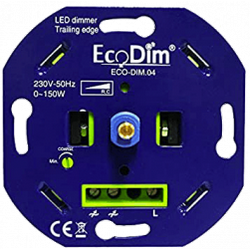|Ecodim|Rotary dimmer switch|Switch, Dimmer||[Buy](https://www.domadoo.fr/fr/eclairage/5369-ecodim-interrupteur-variateur-rotatif-zigbee-30-200w-8719322371263.html)|
||Ecodim|ECODIM - MODULE VARIATEUR INTELLIGENT ZIGBEE 3.0 250W ECO-DIM.10|Switch, Dimmer||[Buy](https://www.domadoo.fr/fr/eclairage/5372-ecodim-module-variateur-intelligent-zigbee-30-250w-eco-dim10-8719322371775.html?domid=4&id_campaign=9)|

# Evology

|Image|Marque|Nom|Type|Remarque|Lien|
|---|---|---|---|---|---|
||EVOLOGY|3450-Geu|Remote control|||
||Evology|Smart siren||||

# Feller

|Image|Marque|Nom|Type|Remarque|Lien|
|---|---|---|---|---|---|
||Feller|Friends of boo 4 buttons||||

# Gledopto

|Image|Marque|Nom|Type|Remarque|Lien|
|---|---|---|---|---|---|
||Gledopto|GL-B-004P||||
||Gledopto|GL-B-007Z||||
||Gledopto|GL-B-008Z||||
||Gledopto|Warm and cool white LED strip smart controller||||
||Gledopto|GL-C-007||||
||Gledopto|GL-C-008P||||
|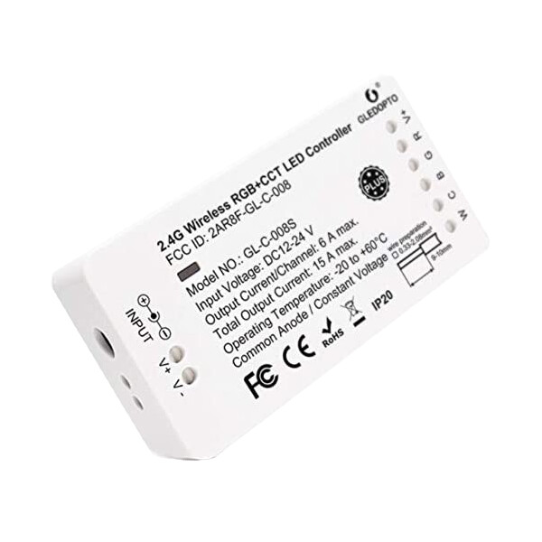|Gledopto|GL-C-008S||||
||Gledopto|GL-FL-006P||||
|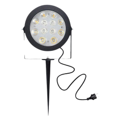|Gledopto|GL-G-001P||||
||Gledopto|GL-G-001ZS||||
||Gledopto|GL-H-001||||
|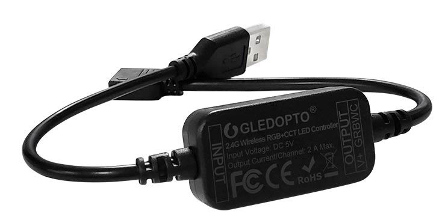|Gledopto|Gledopto RGBCCT tape||||
||Gledopto|Gledopto RGBCCT tape||||
|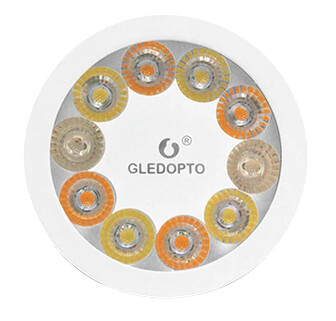|Gledopto|GL-S-004Z||||
|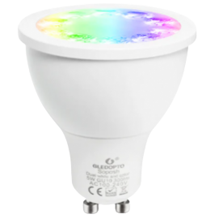|Gledopto|GL-S-007Z||||

# Heiman

|Image|Marque|Nom|Type|Remarque|Lien|
|---|---|---|---|---|---|
||Heiman|Smart Carbon Monoxide Sensor|||[Buy](https://www.domadoo.fr/fr/peripheriques/5884-heiman-capteur-co-monoxyde-de-carbone-zigbee-30.html?domid=4&id_campaign=9)|
|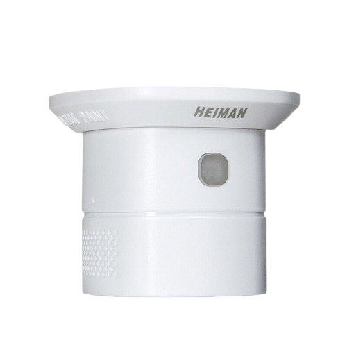|Heiman|Carbon monoxide detector||||
||Heiman|5-button color remote control||||
|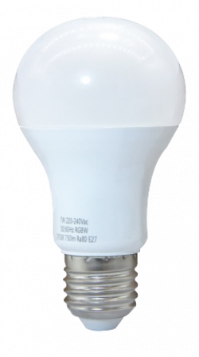|Heiman|ColorLight E27||||
|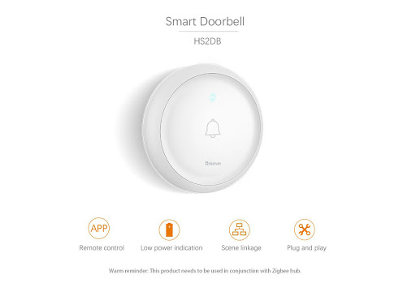|Heiman|Connected doorbell||||
||Heiman|Smart Combustible Gas Sensor|||[Buy](https://www.domadoo.fr/fr/peripheriques/5883-heiman-capteur-de-gaz-combustible-intelligent-zigbee-30.html?domid=4&id_campaign=9)|
|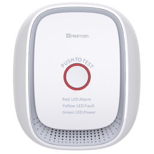|Heiman|Gas detector|||[Buy](https://www.domadoo.fr/fr/peripheriques/5883-heiman-capteur-de-gaz-combustible-intelligent-zigbee-30.html?domid=4&id_campaign=9)|
|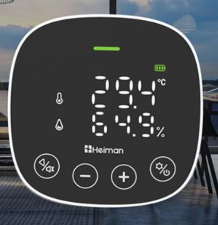|Heiman|Zigbee 3.0 air quality sensor|||[Buy](https://www.domadoo.fr/fr/peripheriques/5882-heiman-capteur-de-qualite-d-air-co2-temperature-humidite-zigbee-30-alarme-visuelle-et-sonore.html?domid=4&id_campaign=9)|
|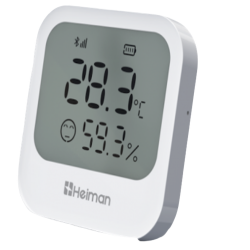|Heiman|HEIMAN - ZIGBEE 3 TEMPERATURE AND HUMIDITY SENSOR.0 WITH SCREEN|||[Buy](https://www.domadoo.fr/fr/peripheriques/6293-heiman-capteur-de-temperature-et-humidite-zigbee-30-avec-ecran.html?domid=4&id_campaign=9)|
||Heiman|||||
|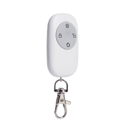|Heiman|4 button remote control|||[Buy](https://www.domadoo.fr/fr/peripheriques/5721-heiman-telecommande-porte-cles-de-scenes-zigbee.html?domid=4&id_campaign=9)|
||Heiman|SOS button||||
||Heiman|4 button remote control|||[Buy](https://www.domadoo.fr/fr/peripheriques/5715-heiman-telecommande-de-scenes-zigbee.html?domid=4&id_campaign=9)|
||Heiman|Smoke detector||||
||Heiman|Smoke detector||||
||Heiman|Smoke detector||||
||Heiman|5 button remote control||||
||Heiman|||||
||Heiman|Smart siren|||[Buy](https://www.domadoo.fr/fr/peripheriques/5714-heiman-sirene-interieure-intelligente-zigbee-30.html?domid=4&id_campaign=9)|
|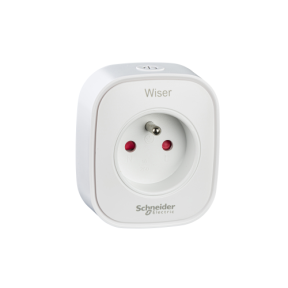|Schneider|Connected socket and repeater Wiser|Socket, Meter, Power, Repeater||[Buy](https://www.domadoo.fr/fr/eclairage/5499-schneider-electric-prise-connectee-et-repeteur-zigbee-30-wiser-3606489917883.html)|
||Heiman|Zigbee 3.0 indoor siren|Mermaid||[Buy](https://www.domadoo.fr/fr/peripheriques/5714-heiman-sirene-interieure-intelligente-zigbee-30.html?domid=4&id_campaign=9)|

# Icasa

|Image|Marque|Nom|Type|Remarque|Lien|
|---|---|---|---|---|---|
||Icasa|Filamant Bulb||||
|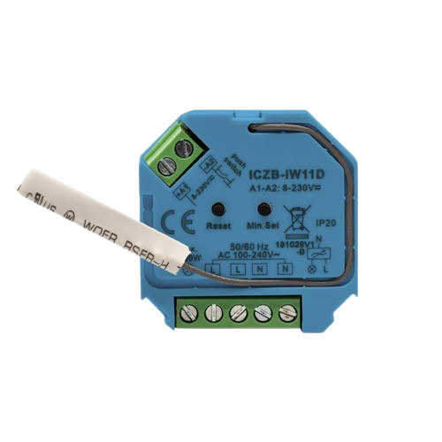|Icasa|AC dimmer||||
||Icasa|AC switch||||
||Icasa|Pulse 4S Wall Controller||||
||Icasa|Rotary Dimmer||||
||Icasa|Icasa RGB||||

# Idinio

|Image|Marque|Nom|Type|Remarque|Lien|
|---|---|---|---|---|---|
||Idinio|IDINIO - LED SWITCH ON CORD ZIGBEE 3.0 BLACK + WHITE (COMPATIBLE PHILIPS HUE)|||[Buy](https://www.domadoo.fr/fr/peripheriques/5744-idinio-interrupteur-led-sur-cordon-zigbee-30-noir-blanc-compatible-philips-hue-8720246200201.html?domid=4&id_campaign=9)|
||Idinio|Dimmer switch on foot|Switch, Dimmer||[Buy](https://www.domadoo.fr/fr/peripheriques/5743-idinio-variateur-sur-pied-zigbee-30-pour-led-noirblanc-compatible-philips-hue-8720246201291.html?domid=4&id_campaign=9)|

# Ikea

|Image|Marque|Nom|Type|Remarque|Lien|
|---|---|---|---|---|---|
||Ikea|FLOALT panel WS 30x30||||
||Ikea|FLOALT panel WS 30x90||||
|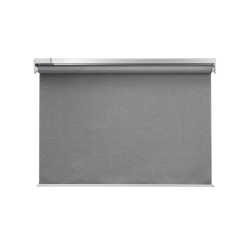|Ikea|Fyrtur - roller blind||||
||Ikea|GUNNARP panel round||||
|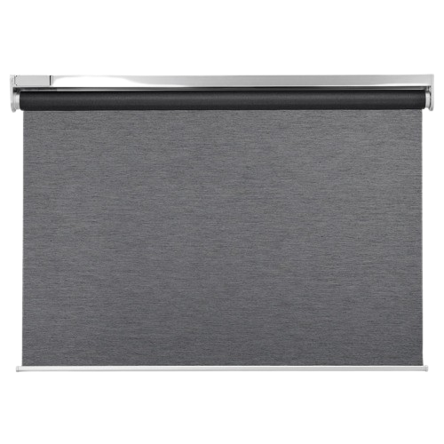|Ikea|Kadrilj - roller blind||||
|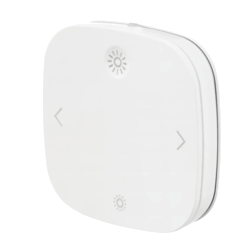|Ikea|STYRBAR remote control|Remote control|||
|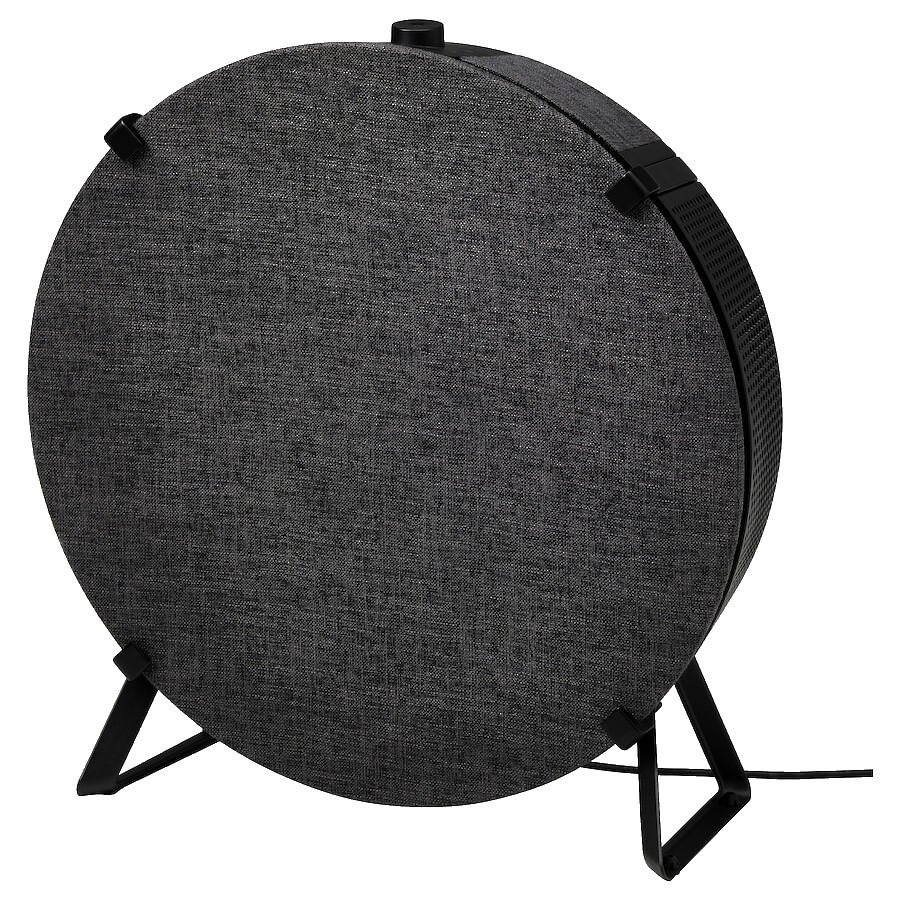|Ikea|IKEA Starkvind air purifier||||
|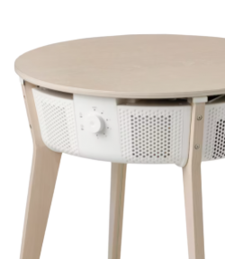|Ikea|IKEA Starkvind table air purifier||||
||Ikea|Symfonisk sound controller|Remote control|||
||Ikea|Symfonisk sound controller gen2|Remote control|||
||Ikea|10W driver||||
||Ikea|Driver 30W||||
|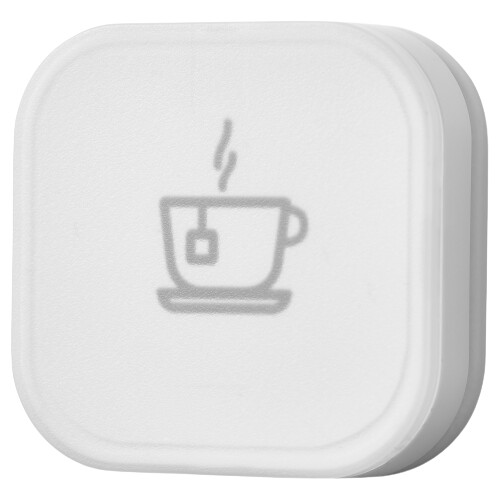|Ikea|SHORTCUT Button|Remote control|||
|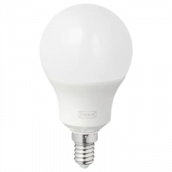|Ikea|Bulb E14 CWS 470lm||||
||Ikea|Bulb E14 CWS opal 600lm||||
|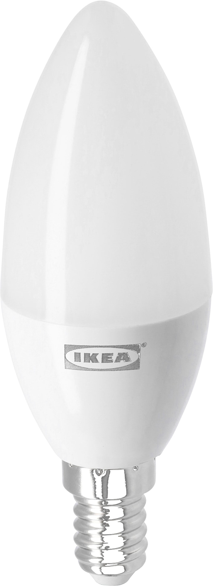|Ikea|Bulb E14 WS 470lm||||
||Ikea|Bulb E14 WS opal 600lm||||
|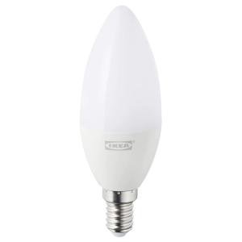|Ikea|Bulb E14 W opch 400lm||||
||Ikea|Bulb E27 CWS 806lm||||
||Ikea|Bulb E27 CWS opal 600lm||||
|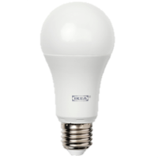|Ikea|Bulb E27 WS opal 1000lm||||
||Ikea|Bulb E27 WS opal 980lm||Please note that the status feedback for this model is not in real time (either following a command or by explicitly requesting an update of it)||
||Ikea|Bulb E27 WW 806lm||||
||Ikea|TRADFRI bulb E27 WW clear 250lm||||
||Ikea|Bulb E27 W opal 1000lm||||
||Ikea|Bulb GU10 WS 400lm||||
||Ikea|Bulb GU10 WW 400lm||||
||Ikea|Bulb GU10 W 400lm||||
|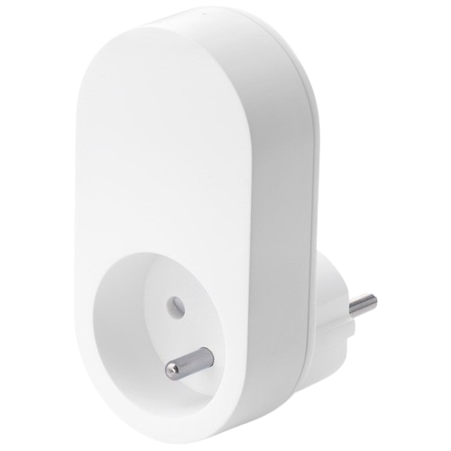|Ikea|Connected socket|||[Documentation](https://www.ikea.com/fr/fr/manuals/tradfri-wireless-control-outlet__AA-2106602-1_pub.pdf) |
||Ikea|Movement detector|||[Documentation](https://www.ikea.com/fr/fr/manuals/tradfri-wireless-motion-sensor__AA-2145280-2_pub.pdf) |
|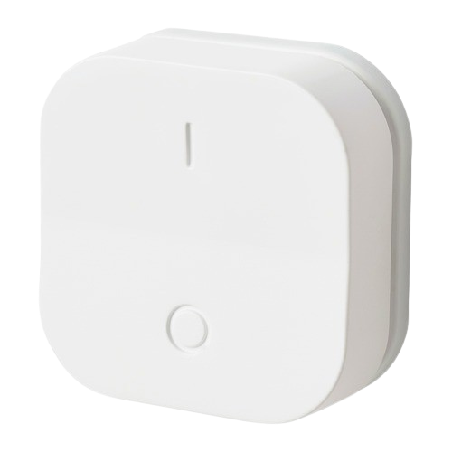|Ikea|2 button remote control|Remote control||[Documentation](https://www.ikea.com/fr/fr/assembly_instructions/tradfri-wireless-dimmer-white__AA-2175106-3_pub.pdf) |
||Ikea|5 button remote control|Remote control||[Documentation](https://www.ikea.com/fr/fr/manuals/tradfri-remote-control__AA-2144014-1_pub.pdf) |
||Ikea|Ikea repeateur||||
||Ikea|Bulb E27 1055lm||||
||Ikea|TRADFRI bulb E27 WW clear 250lm||||
||Ikea|Bulb GU10 WS 350lm||||
||Ikea|Tredansen||||
|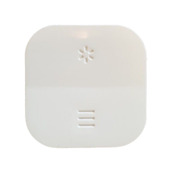|Ikea|2 button blind remote control||||

# Iluminize

|Image|Marque|Nom|Type|Remarque|Lien|
|---|---|---|---|---|---|
|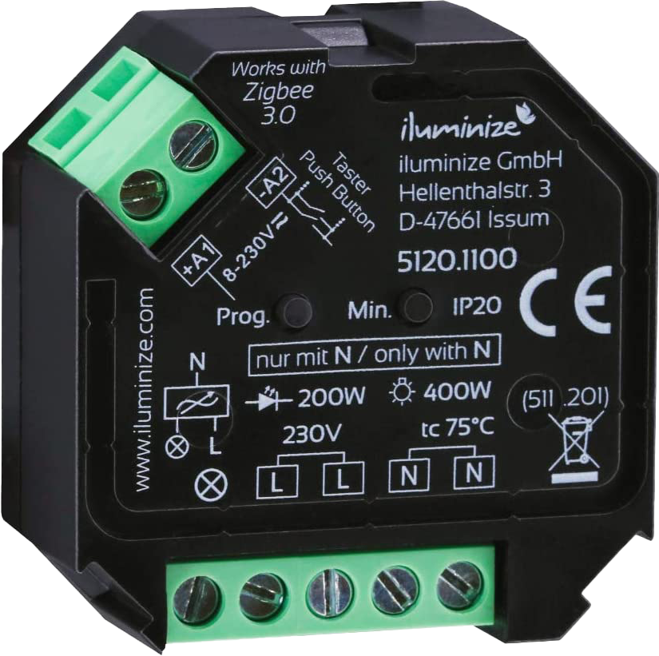|Iluminize|Zigbee 3.0 high voltage, Dimmer actuator||||

# Imaax

|Image|Marque|Nom|Type|Remarque|Lien|
|---|---|---|---|---|---|
|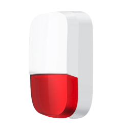|Imaax|IMMAX - Outdoor Smart Siren|||[Buy](https://www.domadoo.fr/fr/peripheriques/6352-immax-sirene-intelligente-exterieure-zigbee-30-tuya-ip65.html?domid=4&id_campaign=9)|
||Imaax|IMMAX - Double Socket||||
||Imaax|IMMAX - Multi Sensors (PIR, Temperature, Humidity, Luminosity|||[Buy](https://www.domadoo.fr/fr/peripheriques/6355-immax-detecteur-de-mouvement-pir-temperature-humidite-et-luminosite-zigbee-30-tuya.html?domid=4&id_campaign=9)|

# Innr

|Image|Marque|Nom|Type|Remarque|Lien|
|---|---|---|---|---|---|
|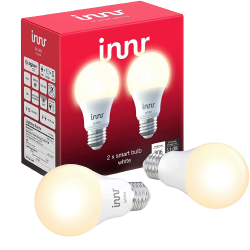|Innr|INNR AE 260||||
||Innr|INNR FLEXIBLE TAPE INDOOR RGBW|||[Buy](https://www.domadoo.fr/fr/peripheriques/5455-innr-ruban-flexible-indoor-couleur-4m-couleur-et-blanc-variable-2000k-a-6500k-8718781552725.html?domid=4&id_campaign=9)|
||Innr|INNR Outdoor Flex Light Color|||[Buy](https://www.domadoo.fr/fr/eclairage/5482-innr-ruban-flexible-outdoor-couleur-4m-zigbee-lightlink-8718781552527.html?domid=4&id_campaign=9)|
||Innr|INNR - CONNECTED LED GLOBE 19 CM FOR GARDEN - PACK OF 3|||[Buy](https://www.domadoo.fr/fr/eclairage/6240-innr-globe-led-connecte-19-cm-pour-jardin-avec-alim-couleur-et-blanc-pack-de-3-8718781553647.html?domid=4&id_campaign=9)|
|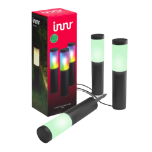|Innr|INNR - ZIGBEE CONNECTED LED CYLINDER SPOT FOR GARDEN - PACK OF 3|||[Buy](https://www.domadoo.fr/fr/peripheriques/5795-innr-spot-cylindre-led-connecte-zigbee-pour-jardin-pack-de-3-8718781552770.html?domid=4&id_campaign=9)|
||Innr|OSL 130 C|||[Buy](https://www.domadoo.fr/fr/peripheriques/5793-innr-spot-led-connecte-pour-jardin-couleur-et-blanc-zigbee-8718781552541.html?domid=4&id_campaign=9)|
||Innr|INNR RB 165||||
||Innr|INNR E14 RGBW|||[Buy](https://www.domadoo.fr/fr/peripheriques/5349-innr-ampoule-connectee-type-e14-zigbee-30-multicolor-rgbw-blanc-reglable-2200k-a-6500k-8718781552060.html)|
||Innr|Innr RB 265||||
||Innr|RB278T|||[Buy](https://www.domadoo.fr/fr/peripheriques/5353-innr-ampoule-connectee-type-e27-zigbee-30-pack-de-2-ampoules-blanc-reglable-2200k-a-5000k-8718781552312.html?domid=4&id_campaign=9)|
||Innr|INNR E27 Multicolor RGBW + White|||[Buy](https://www.domadoo.fr/fr/peripheriques/5355-innr-ampoule-connectee-type-e27-zigbee-30-multicolor-rgbw-blanc-reglable-2200k-a-6500k-8718781552206.html?domid=4&id_campaign=9)|
||Innr|INNR smart button|||[Buy](https://www.domadoo.fr/fr/peripheriques/6055-innr-bouton-intelligent-sans-fil-zigbee-1-touche-smart-button-8718781553364.html?domid=4&id_campaign=9)|
||Innr|INNR RF 263|||[Buy](https://www.domadoo.fr/fr/peripheriques/5361-innr-ampoule-connectee-type-e27-zigbee-30-pack-de-2-ampoules-vintage-filament-2200-k-8718781552022.html?domid=4&id_campaign=9)|
||Innr|INNR GU10 RGBW|||[Buy](https://www.domadoo.fr/fr/peripheriques/5451-innr-ampoule-connectee-type-gu10-zigbee-30-multicolor-rgbw-blanc-reglable-1800-a-6500k-8718781552039.html?domid=4&id_campaign=9)|
||Innr|INNR TAKEN||||
|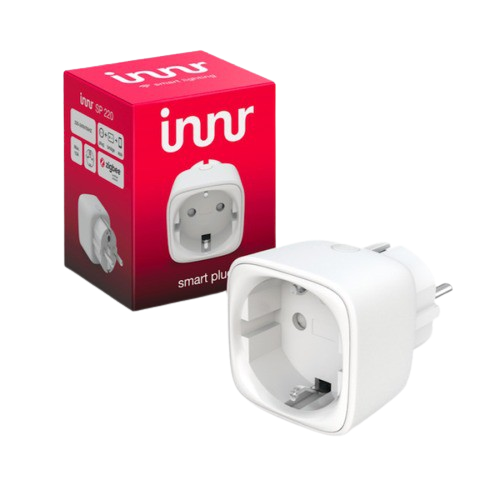|Innr|Prise|||[Buy](https://www.domadoo.fr/fr/peripheriques/5362-innr-prise-connectee-super-slim-zigbee-30-8718781552657.html)|

# Konke

|Image|Marque|Nom|Type|Remarque|Lien|
|---|---|---|---|---|---|
||Konke|Temperature and humidity probe||||
|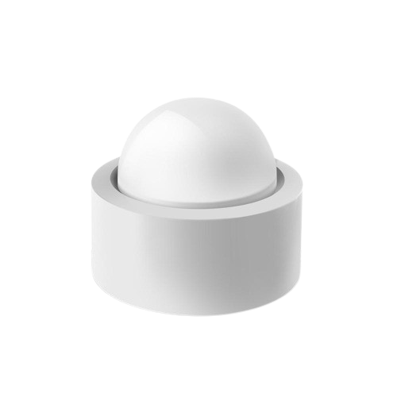|Konke|Konke Motion sensor||||

# Ledvance

|Image|Marque|Nom|Type|Remarque|Lien|
|---|---|---|---|---|---|
||Ledvance|Classic E27 Multicolor||||
||Ledvance|Classic E27 Tunable white||||
|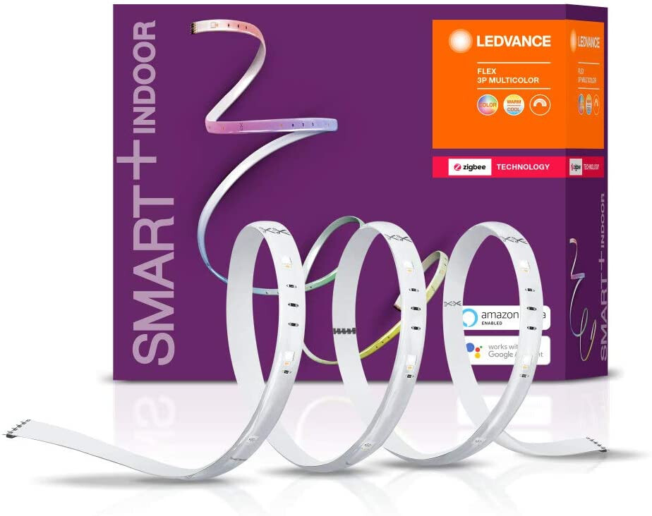|Ledvance|FLEX RGBW Z3||||
||Ledvance|Gardenpole RGBW Z3||||
||Ledvance|Outdoor FLEX RGBW Z3||||
|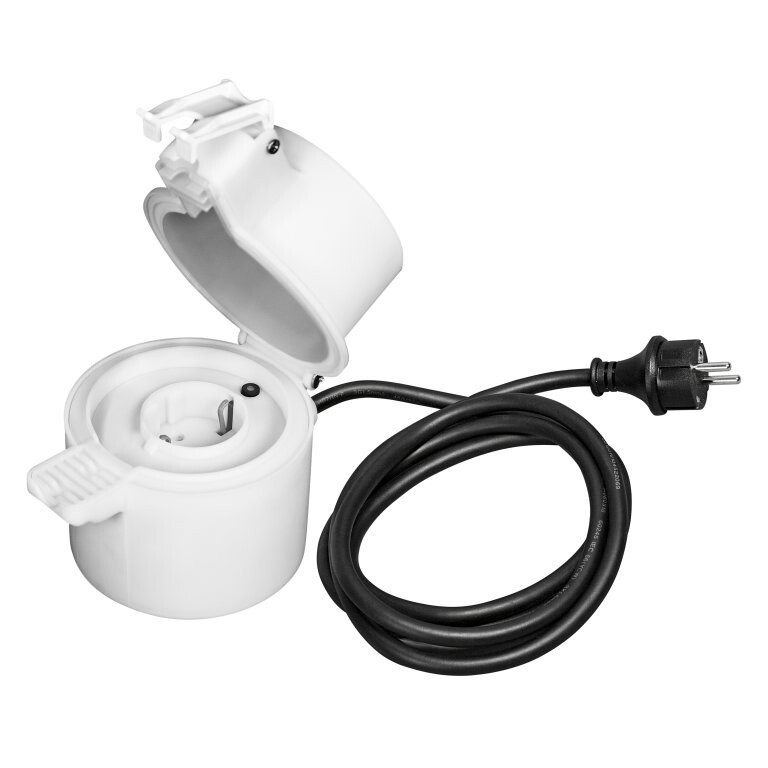|Ledvance|LEDVANCE SMART + BT OUTDOOR PLUG EU||||
|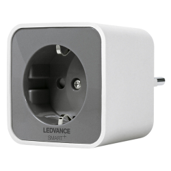|Ledvance|Smart socket + Plug Z3||||

# Lellki

|Image|Marque|Nom|Type|Remarque|Lien|
|---|---|---|---|---|---|
||Lellki|Smart power strip||||

# Lexman

|Image|Marque|Nom|Type|Remarque|Lien|
|---|---|---|---|---|---|
||Lexman|LEXMAN ENKI - 10A connected socket||||
||Lexman|LEXMAN ENKI - 16A connected socket|||[Buy](https://www.leroymerlin.fr/produits/electricite-domotique/domotique-et-objets-connectes/domotique/solutions-de-commande/prise-connectee-16a-3680w-repeteur-lexman-82428895.html)|

# Lidl

|Image|Marque|Nom|Type|Remarque|Lien|
|---|---|---|---|---|---|
||Lidl|Smart dimmer remote control||||
|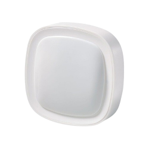|Lidl|Intelligent motion detector||||
||Lidl|E27 smart bulb||||
||Lidl|Connected outdoor LED wall light||||
||Lidl|Connected bulb E27 RGB||||
|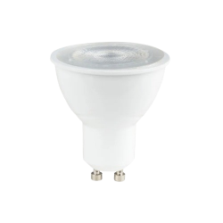|Lidl|GU10 connected LED bulb||||
||Lidl|Connected LED strip||||
||Lidl|GU10 RGB smart bulb||||
||Lidl|Connected LED bulb E14||||
||Lidl|Connected bulb E14 RGB||||
|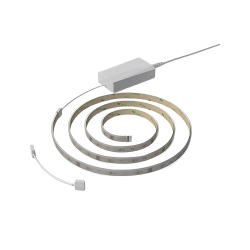|Lidl|Smart LED strip||||
||Lidl|Connected power strip 4 sockets and 2 USB ports||||
||Lidl|ON / OFF connected socket||||
||Lidl|Irrigation controller||||

# Loratap

|Image|Marque|Nom|Type|Remarque|Lien|
|---|---|---|---|---|---|
|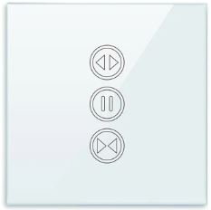|Loratap|Roller shutter module||||
||Loratap|LORATAP - Zigbee 3.0 signal repeater|||[Buy](https://www.domadoo.fr/fr/peripheriques/5984-loratap-repeteur-de-signal-zigbee-30.html?domid=4&id_campaign=9)|

# Miboxer

|Image|Marque|Nom|Type|Remarque|Lien|
|---|---|---|---|---|---|
||Miboxer|MIBOXER - LED Controller||||

# Moes

|Image|Marque|Nom|Type|Remarque|Lien|
|---|---|---|---|---|---|
|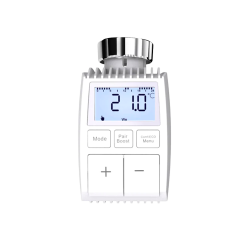|Moes|MOES - ZIGBEE 3 INTELLIGENT THERMOSTATIC HEAD.0 HOSE|||[Buy](https://www.domadoo.fr/fr/peripheriques/6390-moes-tete-thermostatique-intelligente-zigbee-30-tuya.html?domid=4&id_campaign=9)|
||Moes|MOES - ZIGBEE TUYA INTELLIGENT THERMOSTATIC HEAD|||[Buy](https://www.domadoo.fr/fr/peripheriques/6389-moes-tete-thermostatique-intelligente-zigbee-tuya.html?domid=4&id_campaign=9)|
||Moes|MOES - Zigbee Tuya presence detector (radar technology)|||[Buy](https://www.domadoo.fr/fr/domotique/6328-moes-detecteur-de-presence-zigbee-tuya-technologie-radar.html?domid=4&id_campaign=9)|

# Neo

|Image|Marque|Nom|Type|Remarque|Lien|
|---|---|---|---|---|---|
||Neo|NEO CoolCam NAS-WS02||||
||Neo|NEO - Zigbee Tuya 16A smart socket + consumption measurement|||[Buy](https://www.domadoo.fr/fr/peripheriques/6473-neo-prise-intelligente-zigbee-tuya-16a-mesure-de-consommation.html?domid=4&id_campaign=9 )|

# Nodon

|Image|Marque|Nom|Type|Remarque|Lien|
|---|---|---|---|---|---|
||NodOn|Single load ON / OFF switch 16A|Contacteur||[Buy](https://www.domadoo.fr/fr/peripheriques/5688-nodon-module-multifonction-zigbee-3700313925188.html?domid=4&id_campaign=9)|
||NodOn|16A PRO single load ON/OFF switch|Contacteur||[Buy](https://www.domadoo.fr/fr/peripheriques/5585-nodon-pro-module-multifonction-zigbee-3700313925256.html?domid=4&id_campaign=9)|
||NodOn|Double load ON / OFF switch module 2x3A|Contacteur||[Buy](https://www.domadoo.fr/fr/peripheriques/5689-nodon-module-eclairage-onoff-zigbee-3700313925225.html?domid=4&id_campaign=9)|
||NodOn|Dual load ON/OFF 2x3A PRO switch module|Contacteur||[Buy](https://www.domadoo.fr/fr/peripheriques/5586-nodon-pro-module-eclairage-onoff-zigbee-3700313925317.html?domid=4&id_campaign=9)|
|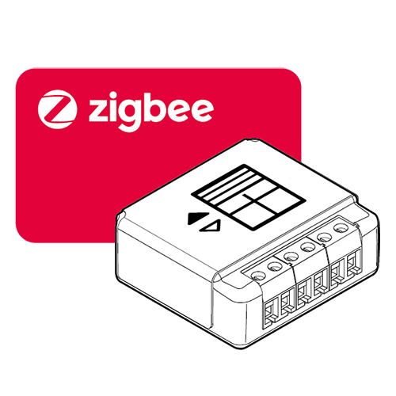|Nodon|Roller shutter module|||[Buy](https://www.domadoo.fr/fr/peripheriques/5690-nodon-module-volet-roulant-zigbee-3700313925201.html?domid=4&id_campaign=9)|
||Nodon|PRO roller shutter module|||[Buy](https://www.domadoo.fr/fr/peripheriques/5587-nodon-pro-module-volet-roulant-zigbee-3700313925287.html?domid=4&id_campaign=9)|
||NodOn|Philips Hue compatible Zigbee wall switch|Interrupteur||[Buy](https://www.domadoo.fr/fr/peripheriques/5922-nodon-interrupteur-mural-zigbee-compatible-philips-hue-3700313924723.html?domid=4&id_campaign=9)|

# Nous

|Image|Marque|Nom|Type|Remarque|Lien|
|---|---|---|---|---|---|
||Nous|US - ZIGBEE 3 FLOOD DETECTOR.0 HOSE|Sensor, Leak, Flood||[Buy](https://www.domadoo.fr/fr/peripheriques/6201-nous-detecteur-d-inondation-zigbee-30-tuya-5907772033883.html?domid=4&id_campaign=9)|
||Nous|US - ZIGBEE 3 SMART VALVE.0 HOSE|||[Buy](https://www.domadoo.fr/fr/peripheriques/6214-nous-vanne-intelligente-zigbee-30-tuya-5907772033968.html?domid=4&id_campaign=9)|
||Nous|US - ZIGBEE 3 SMART SOCKET.0 + CONSUMPTION MEASUREMENT|||[Documentation](https://nous.technology/product/a1z-1/fr.html) [Buy](https://www.domadoo.fr/fr/peripheriques/6165-nous-prise-intelligente-zigbee-30-mesure-de-consommation-5907772033517.html?domid=4&id_campaign=9)|
||Nous|US - Zigbee 3 Smart Temperature and Humidity Sensor.0 HOSE|||[Buy](https://www.domadoo.fr/fr/peripheriques/6197-nous-capteur-de-temperature-et-humidite-zigbee-30-tuya-5907772033890.html?domid=4&id_campaign=9)|
||Nous|US - Zigbee 3 door or window opening detector.0 HOSE|Ouverture||[Buy](https://www.domadoo.fr/fr/peripheriques/6193-nous-detecteur-d-ouverture-de-porte-ou-fenetre-zigbee-30-tuya-5907772033876.html?domid=4&id_campaign=9)|

# Orvibo

|Image|Marque|Nom|Type|Remarque|Lien|
|---|---|---|---|---|---|
|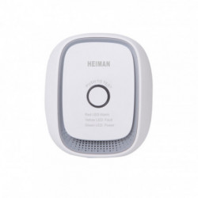|Orvibo|Gas sensor|Sensor, Gas||[Documentation](https://www.domadoo.fr/fr/index.php?controller=attachment&id_attachment=2475) [Buy](https://www.domadoo.fr/fr/peripheriques/5337-orvibo-detecteur-de-gaz-zigbee.html)|
||Orvibo|RGB controller||||
|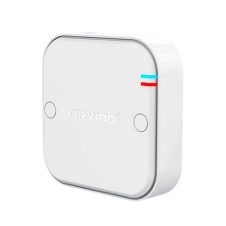|Orvibo|Multi-functional Relay|Contacteur|As of 12/15/2020, return to non-functional status|[Documentation](https://www.domadoo.fr/fr/index.php?controller=attachment&id_attachment=2461) [Buy](https://www.domadoo.fr/fr/peripheriques/5340-orvibo-module-commutateur-contact-sec-zigbee.html)|
||Orvibo|Sensor connector|Capteur|||
||Orvibo|Emergency button|Button, Remote control||[Buy](https://www.domadoo.fr/fr/peripheriques/5335-orvibo-bouton-d-urgence-sos-zigbee.html)|
||Orvibo|Gas sensor|Sensor, Gas|||
||Orvibo|Temperature / humidity sensor|Sensor, Temperature, Humidity||[Documentation](https://www.domadoo.fr/fr/index.php?controller=attachment&id_attachment=2455) [Buy](https://www.domadoo.fr/fr/peripheriques/5334-orvibo-capteur-de-temperature-et-humidite-zigbee.html)|
|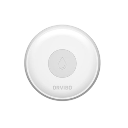|Orvibo|Water leak|Sensor, Leak, Flood||[Documentation](https://www.domadoo.fr/fr/index.php?controller=attachment&id_attachment=2458) [Buy](https://www.domadoo.fr/fr/peripheriques/5338-orvibo-detecteur-d-inondation-zigbee.html)|
|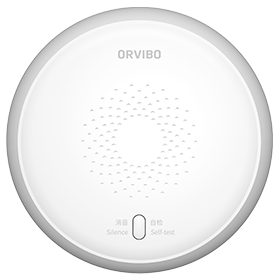|Orvibo|Smoke detector||||

# Osram

|Image|Marque|Nom|Type|Remarque|Lien|
|---|---|---|---|---|---|
|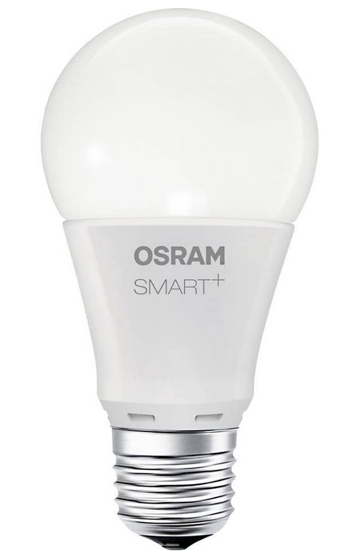|Osram|OSRAM Smart + Connected LED Bulb - E27 Base||||
|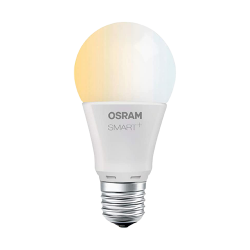|Osram|Osram Smart + Tunable white E27 base||Please note that the status feedback for this model is not in real time (either following a command or by explicitly requesting an update of it)||
||Osram|OSRAM Ceiling TW OSRAM||Please note that the status feedback for this model is not in real time (either following a command or by explicitly requesting an update of it)||
|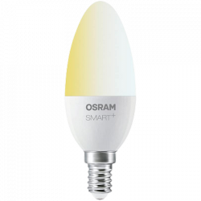|Osram|OSRAM Smart + E14 LED bulb||Please note that the status feedback for this model is not in real time (either following a command or by explicitly requesting an update of it)||
|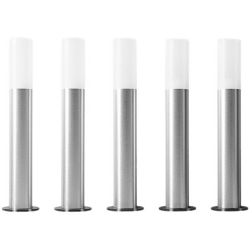|Osram|LEDVANCE SMART + GARDEN POLE||Please note that the status feedback for this model is not in real time (either following a command or by explicitly requesting an update of it)||
||Osram|OSRAM LIGHTIFY Indoor Flex RGBW||Please note that the status feedback for this model is not in real time (either following a command or by explicitly requesting an update of it)||
||Osram|Lightify Switch Mini||||
|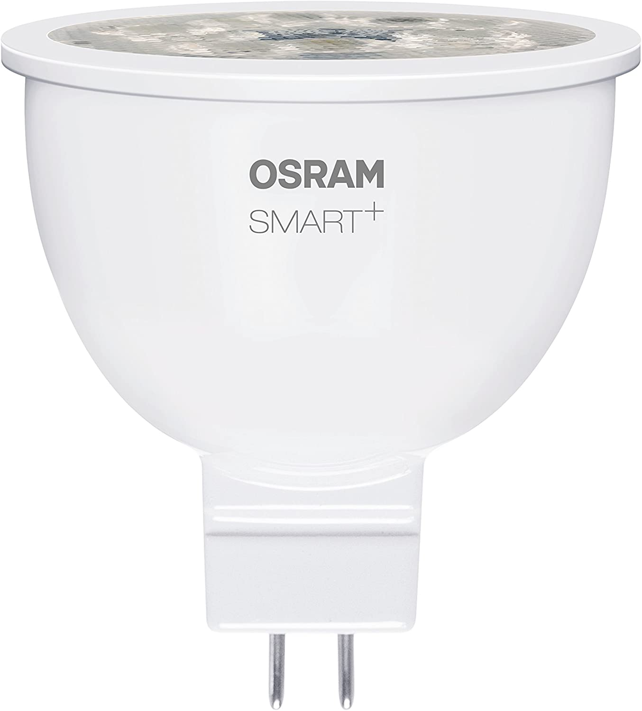|Osram|OSRAM SMART + Spot GU5.3 Tunable White||||
|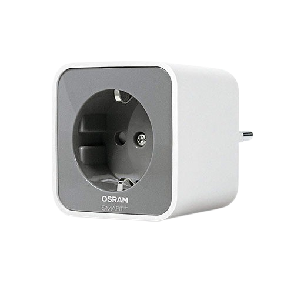|Osram|OSRAM Smart + Plug||||

# Owon

|Image|Marque|Nom|Type|Remarque|Lien|
|---|---|---|---|---|---|
||Owon|Rail-Din 32A relay and Zigbee energy meter|Contactor, Counter||[Documentation](https://www.owon-smart.com/uploads/Quick-Start-Guide-CB432-Din-Rail-Relay1.pdf) |
||Owon|OWON - SINGLE-PHASE/THREE-PHASE ZIGBEE ELECTRICITY CONSUMPTION METER (80 TO 300A) - JEEDOM/HOME ASSISTANT COMPATIBLE|||[Documentation](https://www.owon-smart.com/uploads/Quick-Start-Guide-PC321-Power-Clamp.pdf) [Buy](https://www.domadoo.fr/fr/peripheriques/6372-owon-compteur-de-consommation-electrique-zigbee-monophasetriphase-80-a-300a.html?domid=4&id_campaign=9)|
||Owon|ZIGBEE FAN COIL THERMOSTAT (100V-240V)|Thermostat||[Documentation](https://www.owon-smart.com/uploads/Quick-Start-Guide-%E2%80%93-PCT504-ZigBee-Fan-coil-Thermostat.pdf) [Buy](https://www.domadoo.fr/fr/peripheriques/6056-owon-thermostat-de-ventilo-convecteur-zigbee-100v-240v.html)|
||Owon|Multi-Sensor (Motion/Temperature/Humidity/Brightness)|||[Documentation](https://www.owon-smart.com/uploads/Quick-Start-Guide-PIR313-Multisensor-V0.4.pdf) [Buy](https://www.domadoo.fr/fr/peripheriques/6010-owon-capteur-de-mouvement-temperature-et-humidite-zigbee.html?domid=4&id_campaign=9)|
|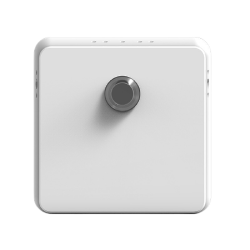|Owon|Multi-Sensor (Motion/Temperature/Humidity)|||[Documentation](https://www.owon-smart.com/uploads/Quick-Start-Guide-PIR323-ZigBee-Multi-Sensor.pdf) [Buy](https://www.domadoo.fr/fr/peripheriques/6009-owon-capteur-de-mouvement-temperature-et-humidite-zigbee.html?domid=4&id_campaign=9)|
|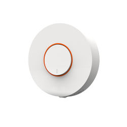|Owon|OWON - ZIGBEE HA ON/OFF WALL SWITCH + BINDING FUNCTION|||[Buy](https://www.domadoo.fr/fr/peripheriques/6318-owon-interrupteur-zigbee-ha-onoff-fonction-binding-2-piles-aaa.html?domid=4&id_campaign=9)|
||Owon|Remote temperature probe on cable|||[Buy](https://www.domadoo.fr/fr/peripheriques/5998-owon-sonde-de-temperature-deportee-sur-cable-zigbee.html)|
||Owon|OWON - SINGLE-PHASE/THREE-PHASE ZIGBEE ELECTRICITY CONSUMPTION METER (80 TO 300A) - JEEDOM/HOME ASSISTANT COMPATIBLE|||[Documentation](https://www.owon-smart.com/uploads/Quick-Start-Guide-PC321-Power-Clamp.pdf) [Buy](https://www.domadoo.fr/fr/peripheriques/6372-owon-compteur-de-consommation-electrique-zigbee-monophasetriphase-80-a-300a.html?domid=4&id_campaign=9)|

# Philips

|Image|Marque|Nom|Type|Remarque|Lien|
|---|---|---|---|---|---|
|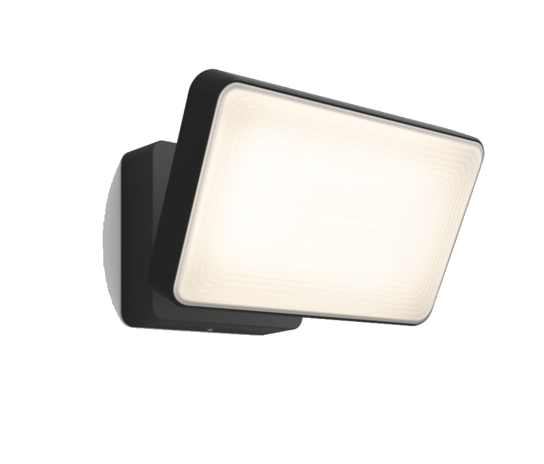|Philips|Projecteur extérieur Philips||||
||Philips|Philips Hue White and Color ambiance APPEAR||||
||Philips|Hue White A60 E27||||
||Philips|Hue White and Color Ambiance A60 E27||||
||Philips|Hue LightStrip Plus||||
||Philips|Hue Outdoor Lily XL||||
|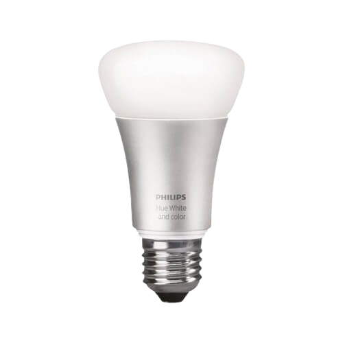|Philips|Hue bulb white and color||||
||Philips|Hue White and Color BR30 (1st Gen)||||
||Philips|Hue White and Color Ambiance Spot GU10||Please note that the status feedback for this model is not in real time (either following a command or by explicitly requesting an update of it)||
||Philips|Hue White and Color Ambiance A19 E26 (Gen 2)||||
||Philips|Hue White and Color Ambiance A19 E26 (Gen 3)||||
||Philips|Hue White and Color Ambiance BR30 Richer Colors||||
|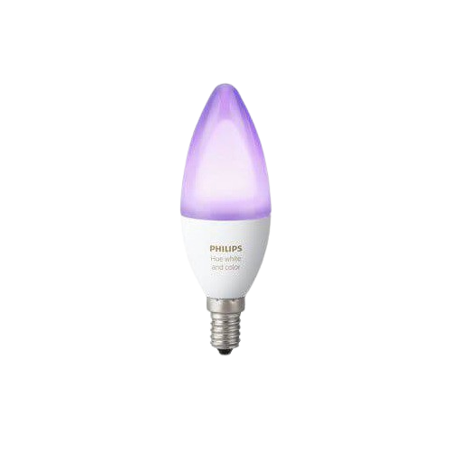|Philips|Hue White and Color Ambiance Candle E12||||
|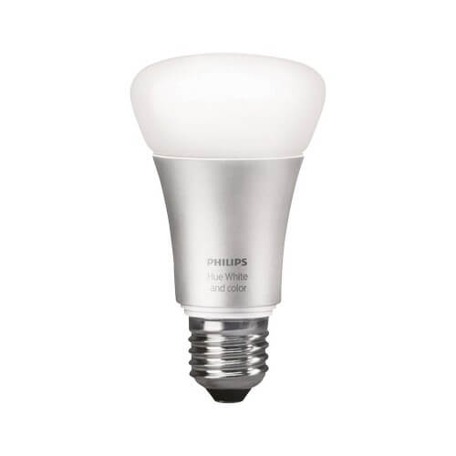|Philips|Hue White and Color Ambiance A19 E26||||
||Philips|Hue White and Color Ambiance A19 E26||Please note that there is no status feedback for this model, only an order sending is possible||
||Philips|Hue White and Color Ambiance Play Light Bar||||
|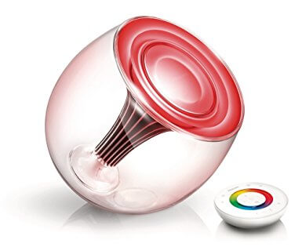|Philips|Hue LivingColors||||
||Philips|Hue LivingColors||||
||Philips|Hue LivingColors Iris Table Lamp Gen3||||
||Philips|Hue LivingColors||||
||Philips|Hue Iris Table Lamp||||
||Philips|Hue Bloom Living Colors Starter Pack||Please note that the status feedback for this model is not in real time (either following a command or by explicitly requesting an update of it)||
||Philips|Hue Bloom Table Lamp||||
||Philips|Hue LivingColors||||
||Philips|Hue Go Portable Light||||
||Philips|Hue Beyond Suspension Light||||
||Philips|Hue white and color||||
||Philips|Hue white and color||||
||Philips|Hue white and color||||
||Philips|Hue Smart plug||||
||Philips|Hue Smart plug||||
|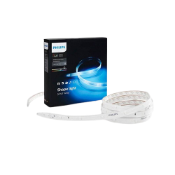|Philips|Hue LightStrip||||
|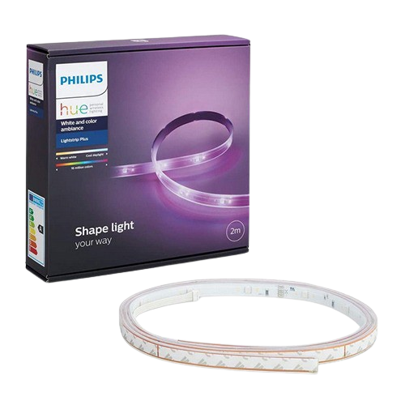|Philips|Hue LightStrip Plus||||
||Philips|Hue LightStrip Outdoor||||
||Philips|Hue White E27 with Bluetooth||||
||Philips|Hue White Ambiance E14 w / BT||||
|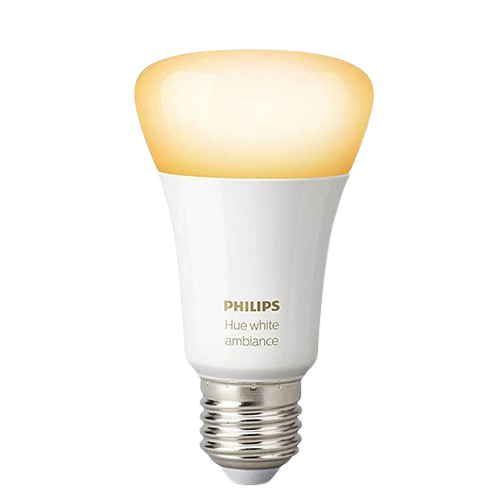|Philips|Hue white and color||Please note that there is no status feedback for this model, only an order sending is possible||
||Philips|Hue White Ambiance A19 E26 / E27||Please note that the status feedback for this model is not in real time (either following a command or by explicitly requesting an update of it)||
||Philips|LTW012||Please note that the status feedback for this model is not in real time (either following a command or by explicitly requesting an update of it)||
||Philips|White GU10 smart bulb||Please note that the status feedback for this model is not in real time (either following a command or by explicitly requesting an update of it)||
|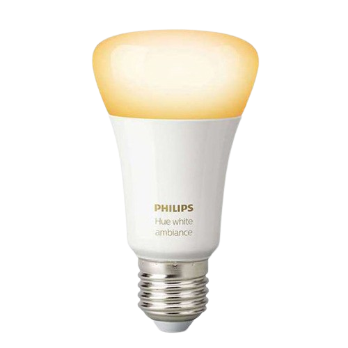|Philips|Hue White Ambiance E27||Please note that there is no status feedback for this model, only an order sending is possible||
||Philips|Hue White A67 E27 1600 LM||Please note that there is no status feedback for this model, only an order sending is possible||
||Philips|Hue White E27||Please note that there is no status feedback for this model, only an order sending is possible||
|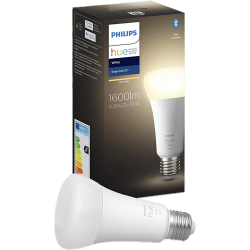|Philips|E27 Philps Hue 9W 806 lm Dimmable White Bulb||||
||Philips|E27 Philps Hue 9W||||
||Philips|Hue White B22||Please note that there is no status feedback for this model, only an order sending is possible||
|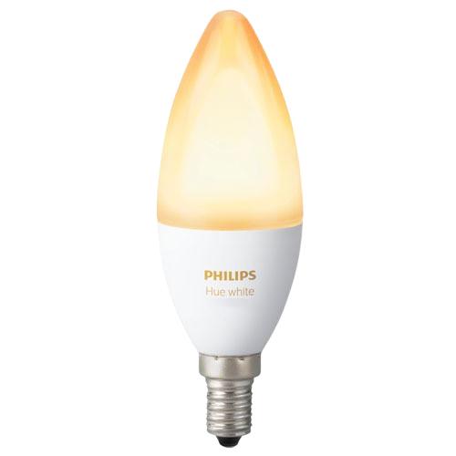|Philips|Hue White Candle E14||Please note that there is no status feedback for this model, only an order sending is possible||
||Philips|Hue White GU10||||
|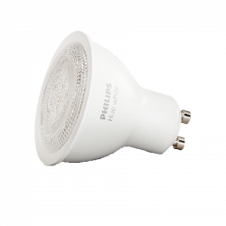|Philips|GU10 Philips HUE||||
||Philips|Hue E14 P45||||
|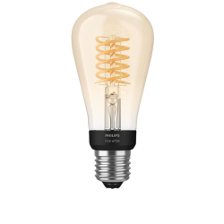|Philips|Hue White Filament Bulb ST64 E27||||
||Philips|Variateur||||
||Philips|4 button remote control||||
|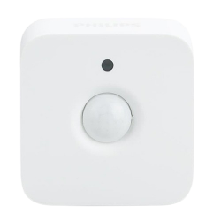|Philips|Hue indoor motion detector|Movement, Brightness, Temperature|||
|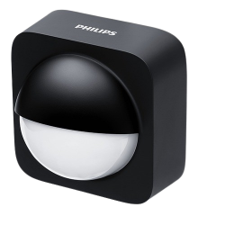|Philips|Hue outdoor motion detector|Movement, Brightness, Temperature|||
|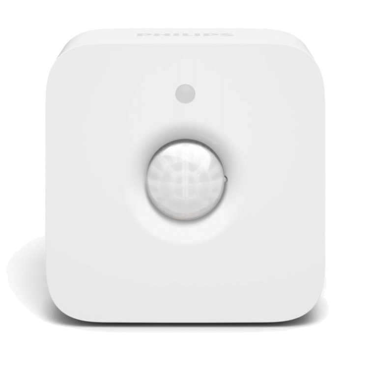|Philips|Hue indoor motion detector|Movement, Brightness, Temperature|||
||Philips|Hue outdoor motion detector|Movement, Brightness, Temperature|||
|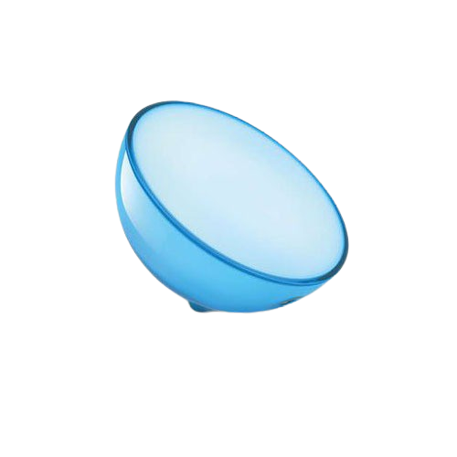|Philips|Hue Go||||
|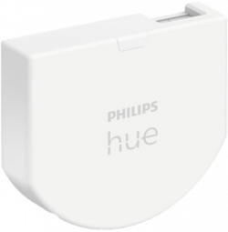|Philips|Hue Wall switch module||||
|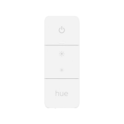|Philips|4 button remote control||||

# Popp

|Image|Marque|Nom|Type|Remarque|Lien|
|---|---|---|---|---|---|
|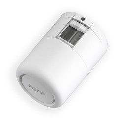|Popp|Popp valve|Thermostatic head|||

# Profalux

|Image|Marque|Nom|Type|Remarque|Lien|
|---|---|---|---|---|---|
||Profalux|Profalux MOT-C1Z06C||||
|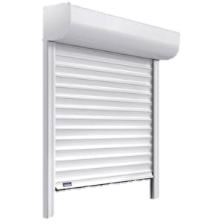|Profalux|Profalux MOE||||

# Salus

|Image|Marque|Nom|Type|Remarque|Lien|
|---|---|---|---|---|---|
||Salus|Salus PS600 - Connected Applied Probe|||[Documentation](https://salus-controls.com/fr/files/PS600-WE-QG-V003.pdf) |

# Schneider

|Image|Marque|Nom|Type|Remarque|Lien|
|---|---|---|---|---|---|
|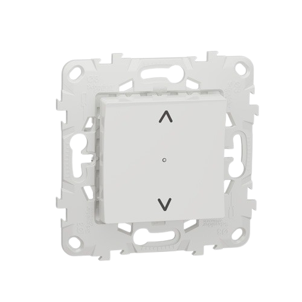|Schneider|PlusLink shutter insert|Volets||[Documentation](https://download.schneider-electric.com/files?p_enDocType=System+user+guide&p_File_Name=Merten_PL_Wiser_TIs_DE.pdf&p_Doc_Ref=Merten_PL_Wiser_TIs_DE) |
||Schneider|Double switch||||
|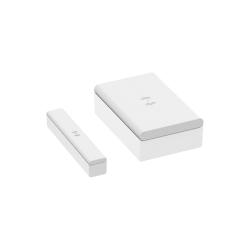|Schneider|Wiser Window / Door Sensor|Ouverture||[Documentation](https://download.schneider-electric.com/files?p_enDocType=User+guide&p_File_Name=MFR1569800.pdf&p_Doc_Ref=MFR1569800) |
|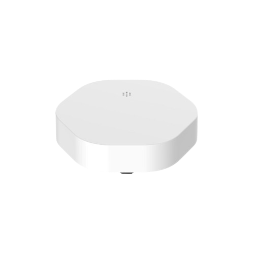|Schneider|Wiser Water Leakage Sensor|Fuite|||
|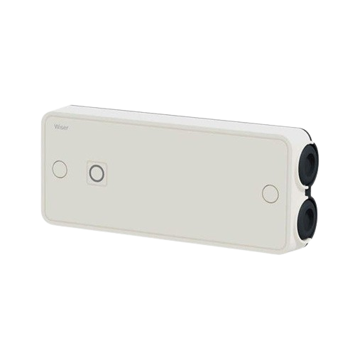|Schneider|Wiser electric heater actuator|||[Buy](https://www.domadoo.fr/fr/chauffage-clim/5498-schneider-electric-actionneur-pour-radiateur-electrique-fil-pilote-zigbee-30-wiser-3606481914705.html)|
|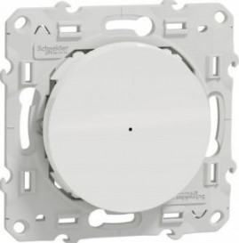|Schneider|Zigbee 3 connected push controller.0 WISER ODACE|Switch, Dimmer||[Documentation](https://download.schneider-electric.com/files?p_enDocType=Instruction+sheet&p_File_Name=S5x0522W_HW.pdf&p_Doc_Ref=S5x0522W_HW) [Buy](https://www.domadoo.fr/fr/peripheriques/5716-schneider-electric-interrupteur-sans-fil-sans-pile-pour-eclairage-odace-sfsp-3606481019561.html)|
||Schneider|Zigbee 3 connected roller shutter switch.0 WISER ODACE|Switch, Shutters||[Documentation](https://download.schneider-electric.com/files?p_enDocType=Instruction+sheet&p_File_Name=S5x0567W_HW.pdf&p_Doc_Ref=S5x0567W_HW) [Buy](https://www.domadoo.fr/fr/peripheriques/5723-schneider-electric-interrupteur-volet-roulant-connecte-zigbee-30-wiser-odace-blanc-3606481019585.html)|
||Schneider|ZIGBEE 3 CONNECTED SWITCH.0 WISER ODACE|||[Documentation](https://download.schneider-electric.com/files?p_enDocType=Instruction+sheet&p_File_Name=S5x0530W_HW.pdf&p_Doc_Ref=S5x0530W_HW) [Buy](https://www.domadoo.fr/fr/peripheriques/5719-schneider-electric-interrupteur-connecte-zigbee-30-wiser-odace-blanc-3606481019578.html)|
||Schneider|Wiser Exxact dimmer rotary|Variateur|||
||Schneider|Wiser micro dimmer module|Variateur|||
||Schneider|Connected module for roller shutters|Volets||[Documentation](https://download.schneider-electric.com/files?p_enDocType=Instruction+sheet&p_File_Name=CCT5xx5-xxx2_2W_HW.pdf&p_Doc_Ref=CCT5xx5-xxx2_2W_HW) [Buy](https://www.domadoo.fr/fr/peripheriques/5724-schneider-electric-micromodule-volet-roulant-connecte-zigbee-30-wiser-3606481048189.html)|
||Schneider|Wiser ON / OFF switch module|Interrupteur|||
||Schneider|Wiser 2nd edition ON / OFF switch module|Contacteur||[Buy](https://www.domadoo.fr/fr/peripheriques/5722-schneider-electric-micromodule-interrupteur-eclairage-connecte-zigbee-30-wiser-3606481048172.html?domid=4&id_campaign=9)|
|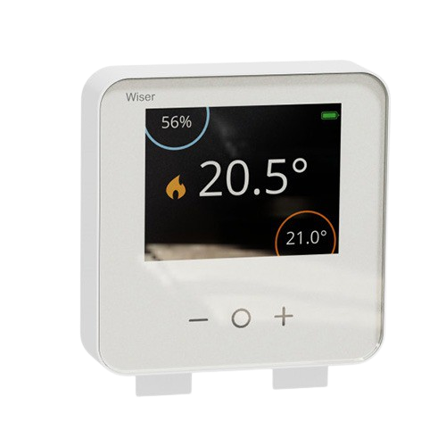|Schneider|Wiser connected room thermostat|Thermostat, Heating|Module not recommended, it seems to be very complicated to operate and requires the entire Schneider eco-system|[Buy](https://www.domadoo.fr/fr/thermostats/5496-schneider-electric-thermostat-d-ambiance-connecte-zigbee-30-wiser-3606489710194.html)|
|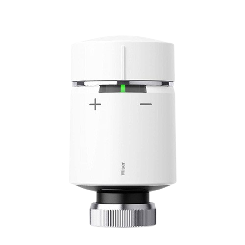|Schneider|Wiser connected thermostatic valve head|Thermostatic head, Heating||[Buy](https://www.domadoo.fr/fr/tetes-thermostatiques/5497-schneider-electric-tete-de-vanne-thermostatique-connectee-zigbee-30-wiser-3606489582821.html)|

# Smabit

|Image|Marque|Nom|Type|Remarque|Lien|
|---|---|---|---|---|---|
||Smabit|SMABIT - Outdoor motion detector|||[Buy](https://www.domadoo.fr/fr/peripheriques/5550-smabit-detecteur-de-mouvement-exterieur-zigbee-8023874397665.html)|

# Sonoff

|Image|Marque|Nom|Type|Remarque|Lien|
|---|---|---|---|---|---|
||Sonoff|SMART PLUG 16A US|Prise|||
||Sonoff|Micromodule switch connected|Contactor, Light||[Buy](https://www.domadoo.fr/fr/peripheriques/5375-sonoff-micromodule-commutateur-connecte-zigbee.html)|
|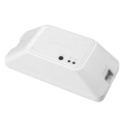|Sonoff|Micromodule switch 10A|Contacteur||[Documentation](http://dl.itead.cc/basiczbr3/BASICZBR3-user-manual-V-1-1.pdf) [Buy](https://www.domadoo.fr/fr/peripheriques/5258-sonoff-module-commutateur-10a-zigbee-30.html)|
|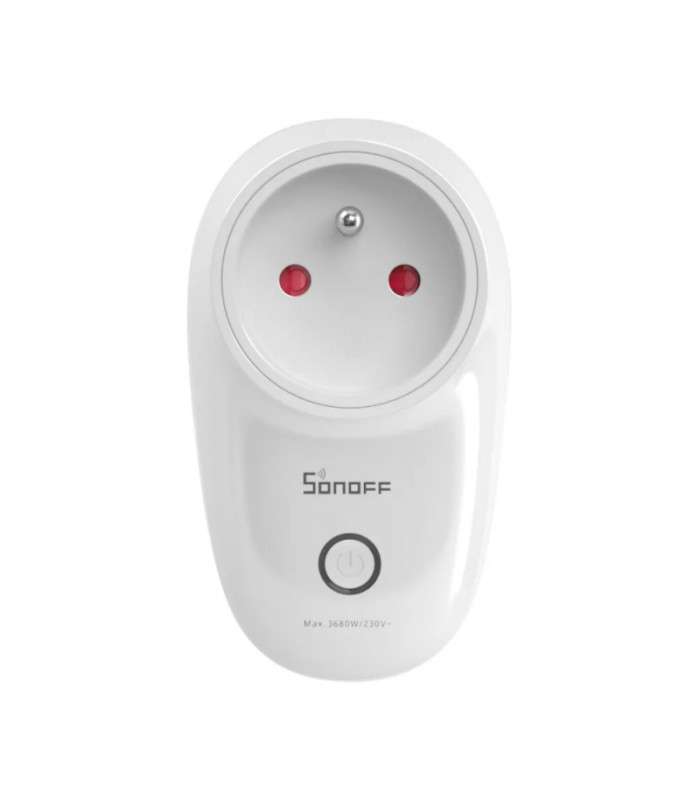|Sonoff|16A INTELLIGENT SOCKET|Prise||[Buy](https://www.domadoo.fr/fr/peripheriques/5880-sonoff-prise-intelligente-16a-zigbee-30-version-fr.html)|
||Sonoff|SONOFF - Zigbee 3 Temperature and Humidity Sensor.0 WITH SCREEN|||[Buy](https://www.domadoo.fr/fr/peripheriques/6614-sonoff-capteur-de-temperature-et-d-humidite-zigbee-30-avec-ecran.html?domid=4&id_campaign=9)|
||Sonoff|ZigBee Interrupteur Sans Fil Aucun Fil Neutre||||
|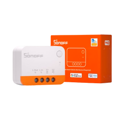|Sonoff|SONOFF - Smart switch without neutral Zigbee 3.0 ZBMINIL2|||[Buy](https://www.domadoo.fr/fr/peripheriques/6619-sonoff-commutateur-intelligent-sans-neutre-zigbee-30-zbminil2.html?domid=4&id_campaign=9)|
||Sonoff|Door / window opening sensor|Sensor, Aperture|Attention there is a bug in the firmware which makes it go up as a temperature and humidity module it is therefore necessary following the inclusion to reset the correct model and remove the temperature and humidity controls|[Documentation](http://dl.itead.cc/SNZB-04/Instructions/SNZB-04_V1.0_User_manual_20201116.pdf) [Buy](https://www.domadoo.fr/fr/peripheriques/5320-sonoff-capteur-d-ouverture-de-portefenetre-zigbee.html)|
|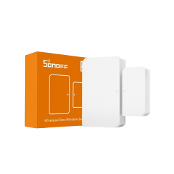|Sonoff|Door / window opening sensor|Sensor, Aperture||[Documentation](http://dl.itead.cc/SNZB-04/Instructions/SNZB-04_V1.0_User_manual_20201116.pdf) [Buy](https://www.domadoo.fr/fr/peripheriques/5320-sonoff-capteur-d-ouverture-de-portefenetre-zigbee.html)|
|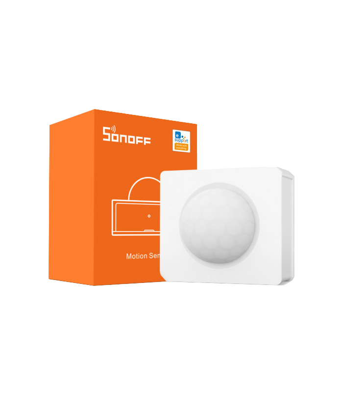|Sonoff|Intelligent motion detector|Sensor, Movement||[Documentation](http://dl.itead.cc/SNZB-03/Instructions/SNZB-03_V1.0_User_manual_20201116.pdf) [Buy](https://www.domadoo.fr/fr/peripheriques/5261-sonoff-detecteur-de-mouvement-zigbee-30.html)|
|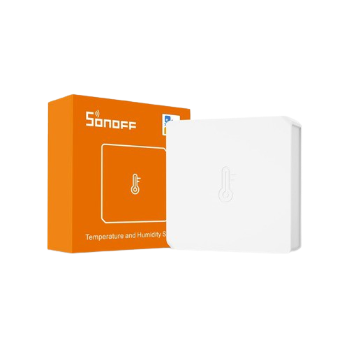|Sonoff|Temperature and humidity sensor|Sensor, Humidity, Temperature||[Documentation](http://dl.itead.cc/SNZB-02/Instructions/SNZB-02_V1.0_User_manual_20201116.pdf) [Buy](https://www.domadoo.fr/fr/peripheriques/5260-sonoff-capteur-de-temperature-et-d-humidite-zigbee-30.html)|
|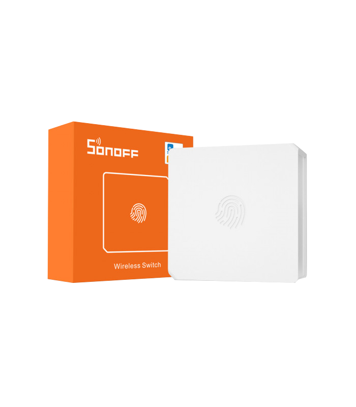|Sonoff|Wireless connected switch|Switch, Remote control||[Documentation](http://dl.itead.cc/SNZB-01/Instructions/SNZB-01_V1.0_User_manual_20201116.pdf) [Buy](https://www.domadoo.fr/fr/peripheriques/5259-sonoff-interrupteur-sans-fil-zigbee-30.html)|

# Sunricher

|Image|Marque|Nom|Type|Remarque|Lien|
|---|---|---|---|---|---|
|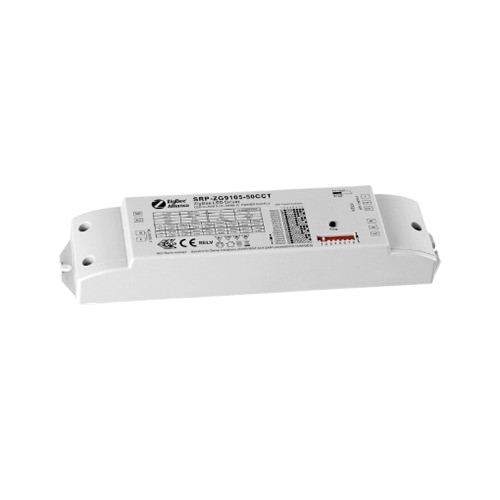|Sunricher|Sunricher CCT Lighting||||
|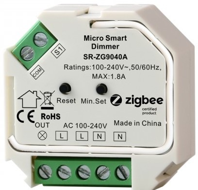|Sunricher|2-wire dimmer module|Dimmer, Light, Power, Metering||[Buy](https://www.domadoo.fr/fr/peripheriques/5244-sunricher-module-variateur-2-fils-zigbee-30.html)|
||Sunricher|Rotary dimmer switch|Dimmer, Light, Power, Metering||[Buy](https://www.domadoo.fr/fr/peripheriques/5736-sunricher-interrupteur-variateur-rotatif-500w-zigbee-dimmer.html)|
||Sunricher|ON / OFF module|Contactor, Light||[Buy](https://www.domadoo.fr/fr/peripheriques/5242-sunricher-module-onoff-zigbee-30.html)|
||Sunricher|Sunricher - SR-DIY-ZG9101-CCT|||[Buy](https://www.domadoo.fr/fr/eclairage/6336-sunricher-kit-ruban-de-led-cct-zigbee-30-2-metres.html?domid=4&id_campaign=9)|
||Sunricher|Sunricher Dali||||
|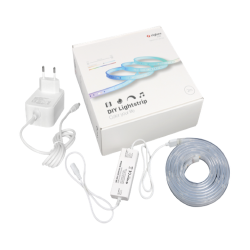|Sunricher|Sunricher - SR-DIY-ZG9101-RGBW|||[Buy](https://www.domadoo.fr/fr/eclairage/6337-sunricher-kit-ruban-de-led-rgbw-zigbee-30-2-metres.html)|
|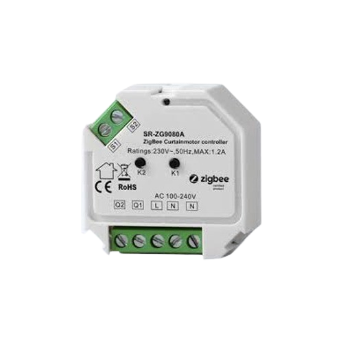|Sunricher|Roller shutter module|Shutter, Store||[Buy](https://www.domadoo.fr/fr/peripheriques/5245-sunricher-module-volet-roulant-zigbee-30.html)|
||Sunricher|SUNRICHER - MODULE ON/OFF 2 SORTIES AVEC MESURE DE CONSOMMATION ZIGBEE 3.0|||[Documentation](https://www.domadoo.fr/fr/index.php?controller=attachment&id_attachment=2820) [Buy](https://www.domadoo.fr/fr/peripheriques/6163-sunricher-module-onoff-2-sorties-avec-mesure-de-consommation-zigbee-30.html?domid=4&id_campaign=9)|
||Sunricher|SUNRICHER - MODULE ON/OFF 16A AVEC MESURE DE CONSOMMATION ZIGBEE 3.0|||[Buy](https://www.domadoo.fr/fr/peripheriques/6162-sunricher-module-onoff-16a-avec-mesure-de-consommation-zigbee-30.html?domid=4&id_campaign=9)|
|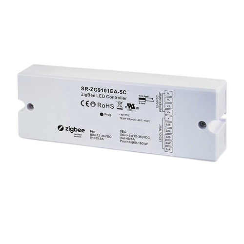|Sunricher|4 in 1 RGBW LED Controller|Light, RGBW, Dimmer||[Buy](https://www.domadoo.fr/fr/peripheriques/5248-sunricher-controleur-led-rgbw-4-en-1-zigbee-30.html)|
|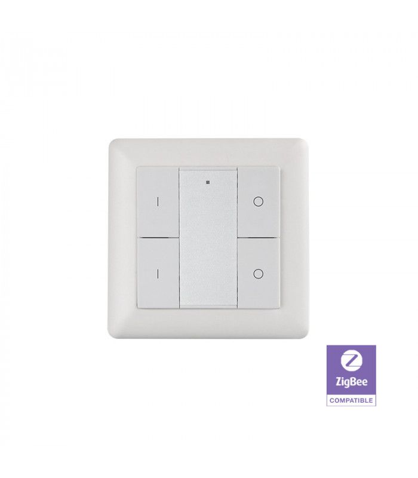|Sunricher|4 BUTTON WIRELESS WALL CONTROLLER|||[Buy](https://www.domadoo.fr/fr/peripheriques/5738-sunricher-controleur-mural-sans-fil-4-boutons-2-zones-zigbee.html)|
|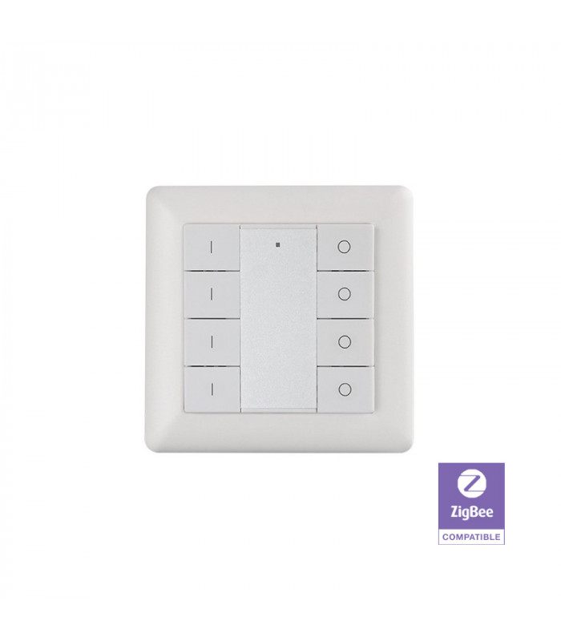|Sunricher|8 BUTTON WIRELESS WALL CONTROLLER|||[Buy](https://www.domadoo.fr/fr/peripheriques/5739-sunricher-controleur-mural-sans-fil-8-boutons-4-zones-zigbee.html)|
|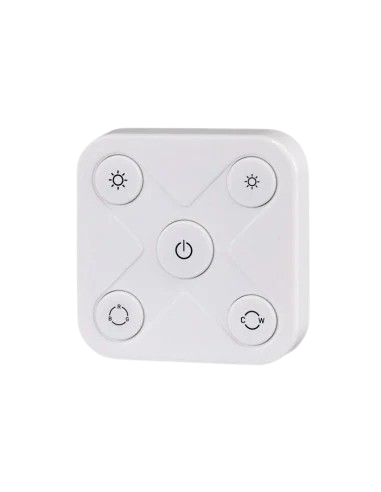|Sunricher|Sunricher RGB CCT Sun 3 in 1|||[Buy](https://www.domadoo.fr/fr/peripheriques/5710-sunricher-telecommande-3-en-1-zigbee-30.html?domid=4&id_campaign=9)|
|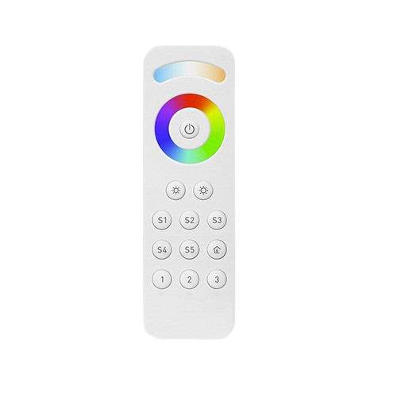|Sunricher|3 in 1 remote control|Remote control||[Buy](https://www.domadoo.fr/fr/peripheriques/5247-sunricher-telecommande-3-en-1-zigbee-30.html)|
||Sunricher|Sunricher thermostat||||
||Sunricher|2 BUTTON WIRELESS WALL CONTROLLER|||[Buy](https://www.domadoo.fr/fr/peripheriques/5737-sunricher-controleur-mural-sans-fil-2-boutons-1-zone-zigbee.html)|
||Sunricher|4-zone remote control|Remote control||[Buy](https://www.domadoo.fr/fr/peripheriques/5246-sunricher-telecommande-4-zones-zigbee-30.html)|

# Tryo2sys

|Image|Marque|Nom|Type|Remarque|Lien|
|---|---|---|---|---|---|
|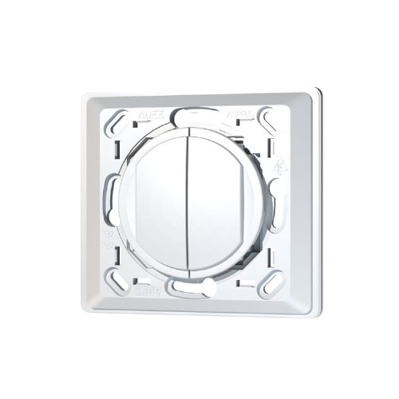|Tryo2sys|PTM 215 ZE||||

# Tuya

|Image|Marque|Nom|Type|Remarque|Lien|
|---|---|---|---|---|---|
||Tuya|Temperature and humidity sensor||||
||Tuya|Intelligent door or window opening sensor||||
|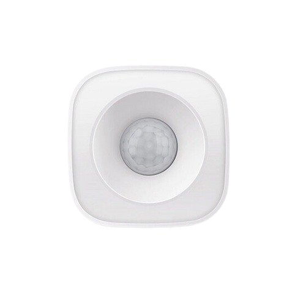|Tuya|Intelligent motion detector||||
||Tuya|Vibration sensor||||
||Tuya|TUYA - Light sensor|||[Buy](https://fr.aliexpress.com/item/1005002117427752.html?spm=a2g0s.9042311.0.0.22206c37vgJYy8)|
||Tuya|ON / OFF switch 2300W 1 channel||||
||Tuya|Smart ON / OFF plug and 2 USB ports||||
||Tuya|TUYA - Brightness sensor (2)|||[Buy](https://doowifi.fr/fr/capteur-wifi/180-capteur-luminosite-zigbee-DWF-0616ZB.html)|
||Tuya|Connected switch for roller shutter||||
|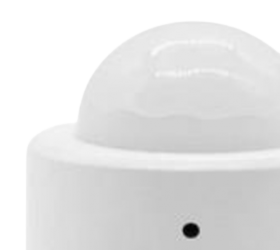|Tuya|Mini motion sensor||||
||Tuya|Smoke detector||||
||Tuya|Smart ON / OFF switch||||
||Tuya|Movement detector||||
|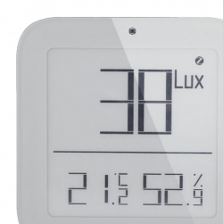|Tuya|Temperature, brightness, humidity with display||||
||Tuya|Triple switch||||
||Tuya|Door switch|Ouverture|||
|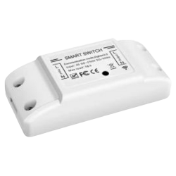|Tuya|Tuya Zigbee - Switch 16A||||
||Tuya|Single charge smart switch||||
||Tuya|Smart siren with LED|Mermaid|||
||Tuya|Tuya ZigBee 3 light microModule.0 double dimmer||||
|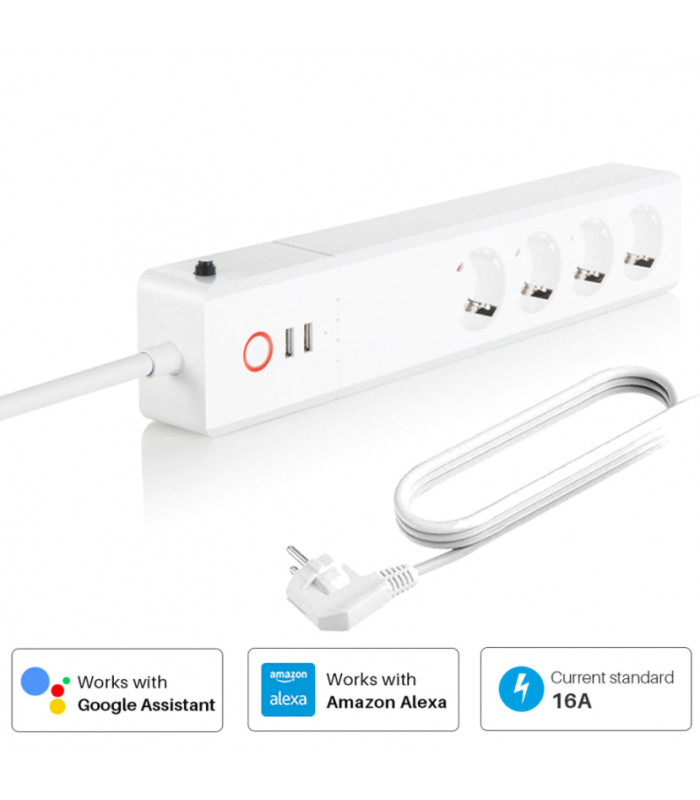|Tuya|USEELINK - Connected strip 4 sockets and 2 USB ports|||[Buy](https://www.domadoo.fr/fr/peripheriques/5489-useelink-multiprise-connectee-16a-zigbee-ha-4-prises-2-ports-usb.html)|
||Tuya|Double switch||||
||Tuya|Single charge smart switch||||
|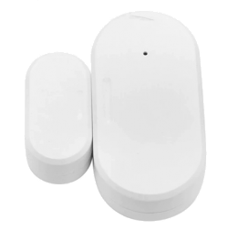|Tuya|Intelligent door or window opening sensor||||
|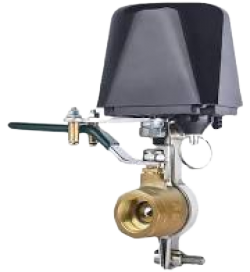|Tuya|Water / gas valve||||
||Tuya|ON / OFF switch 2300W 2 channel||||
||Tuya|Temperature and humidity sensor with display||||
||Tuya|MOES - Zigbee + RF Roller Shutter Module|Volets|||
|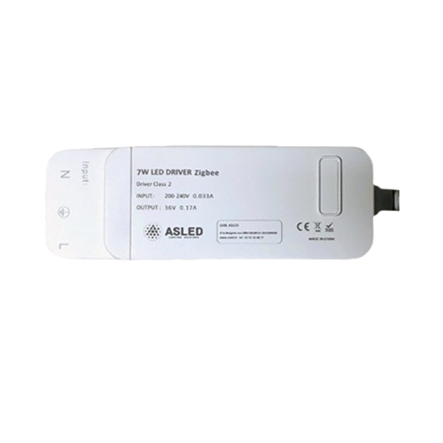|Tuya|LED controller||||
||Tuya|SOS remote control||||
|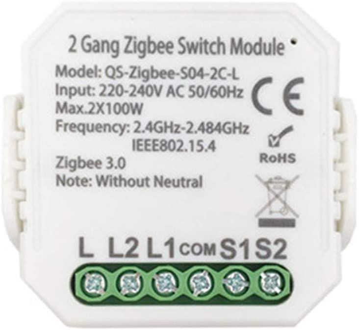|Tuya|Double micromodule without neutral||||
||Tuya|1 button connected switch|||[Buy](https://www.domadoo.fr/fr/domotique/5785-moes-interrupteur-intelligent-sans-fil-zigbee-1-bouton.html)|
||Tuya|Smart module for roller shutter (3)||||
|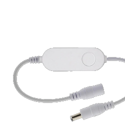|Tuya|LED strip controller||||
||Tuya|QONTROLS 16A socket with consumption measurement||||
||Tuya|LED controller||||
|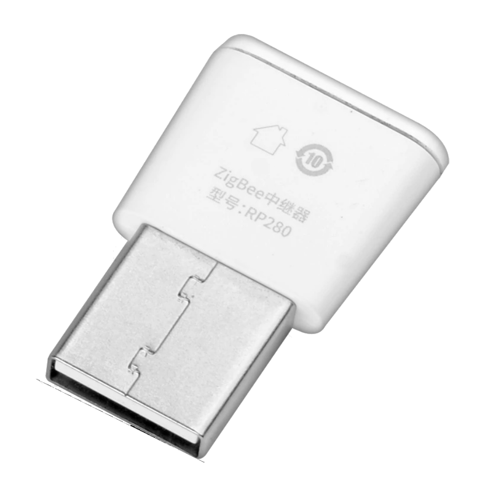|Tuya|Repeater|||[Buy](https://www.domadoo.fr/fr/peripheriques/5984-loratap-repeteur-de-signal-zigbee-30.html?domid=4&id_campaign=9)|
||Tuya|Connected switch for connected curtain||||
||Tuya|Connected socket|Socket, Meter, Power, Repeater|||
|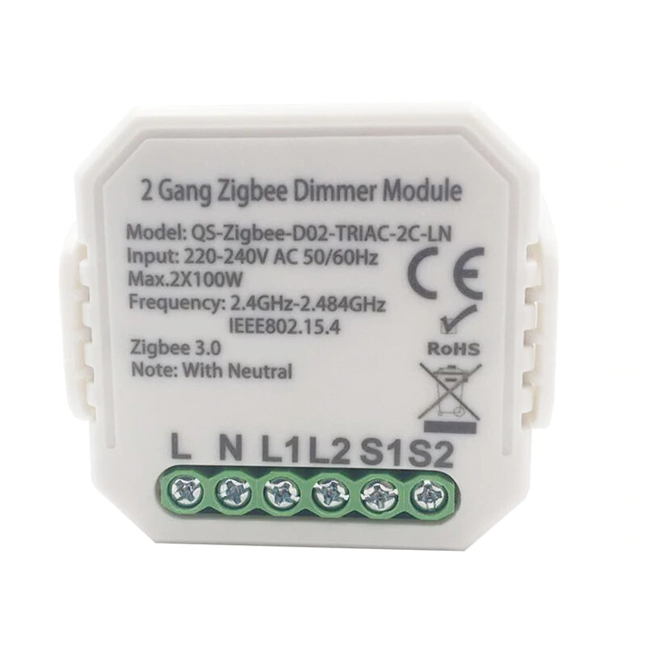|Tuya|Dimmer 2 voices||||
||Tuya|3 button connected switch||||
||Tuya|Scene remote 4 buttons||||
|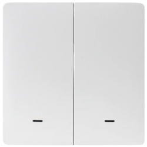|Tuya|Smart double switch||||
|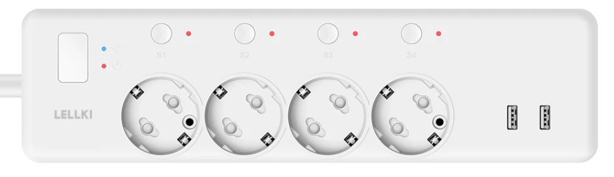|Tuya|Power Strip 16A 4000W 4AC + 2USB|Socket, Consumption, Power, Repeater||[Buy](https://fr.aliexpress.com/item/1005001408157771.html)|
|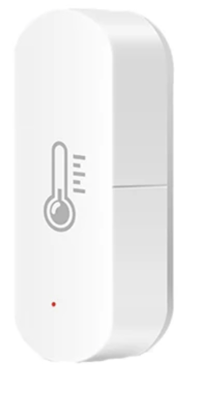|Tuya|Temperature and humidity sensor||||
||Tuya|Tuya Zigbee - 2 Way Switch||||
||Tuya|Power strip connected 4 sockets and 2 USB ports (2)|||[Buy](https://www.domadoo.fr/fr/peripheriques/5489-useelink-multiprise-connectee-16a-zigbee-ha-4-prises-2-ports-usb.html?domid=4&id_campaign=9)|
||Tuya|Connected socket|Socket, Meter, Power, Repeater|||
|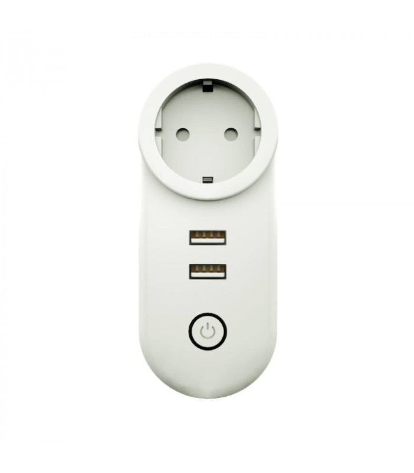|Tuya|Connected socket + USB|Prise||[Buy](https://www.domadoo.fr/fr/prises-connectees/5840-moes-prise-connectee-zigbee-30-2-ports-usb-pilotables-version-schuko.html)|
||Tuya|Connected switch for connected curtain||||
||Tuya|Connected switch 2 buttons|||[Buy](https://www.domadoo.fr/fr/domotique/5786-moes-interrupteur-intelligent-sans-fil-zigbee-2-boutons.html)|
||Tuya|Temperature, humidity||||
|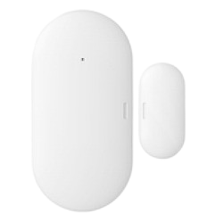|Tuya|Opening sensor|Ouverture|||
||Tuya|ON / OFF switch 2300W 1 channel||||
|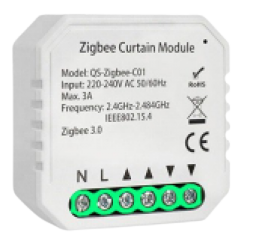|Tuya|Intelligent roller shutter module (2)||||
||Tuya|Double switch||||
|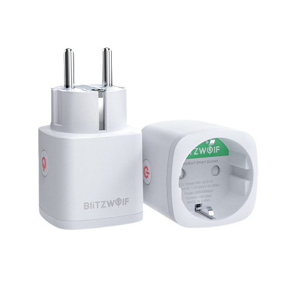|Tuya|BLITZWOLF - EU 16A smart plug||||
||Tuya|Triple switch||||
|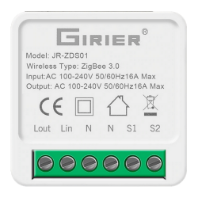|Tuya|Gigier JR-ZDS01||||
||Tuya|Mini RGB Led Strip Controller||||
|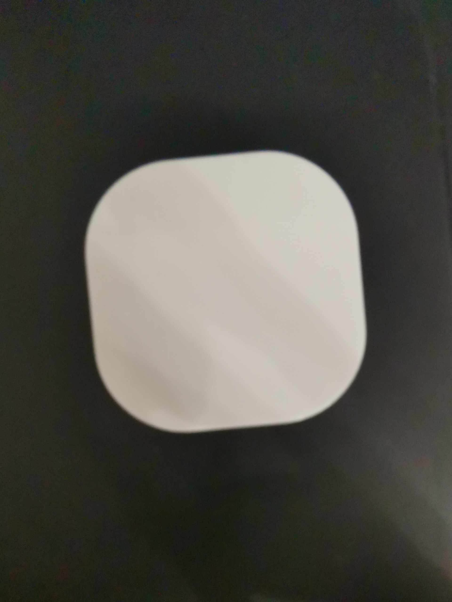|Tuya| Smart Key Switch||||
||Tuya|Switch module ON / OFF 10A|Socket, Consumption, Power, Repeater||[Buy](https://fr.aliexpress.com/item/1005003438720832.html)|
||Tuya|Roller shutter switch||||
||Tuya|Tuya Zigbee - 4 Way Switch||||
||Tuya|Range extender||||
||Tuya|Zigbee 3 micromodule.0 SKTE||||
||Tuya|Simple ON / OFF connected plug|Socket, Repeater||[Buy](https://fr.aliexpress.com/item/1005002761118194.html)|
||Tuya|Mini SMART - Single connected module ON / OFF 16A|||[Buy](https://fr.aliexpress.com/item/1005003167278697.html)|
||Tuya|Connected power strip 4 sockets and 2 USB ports||||
||Tuya|Tuya Zigbee - Valve controller||||
||Tuya|Tuya Zigbee - 3 Way Switch||||
||Tuya|Dual ON / OFF connected module||||
|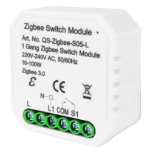|Tuya|Simple ON / OFF connected module without neutral||||
||Tuya|MOES - Dual ON / OFF connected module||||
|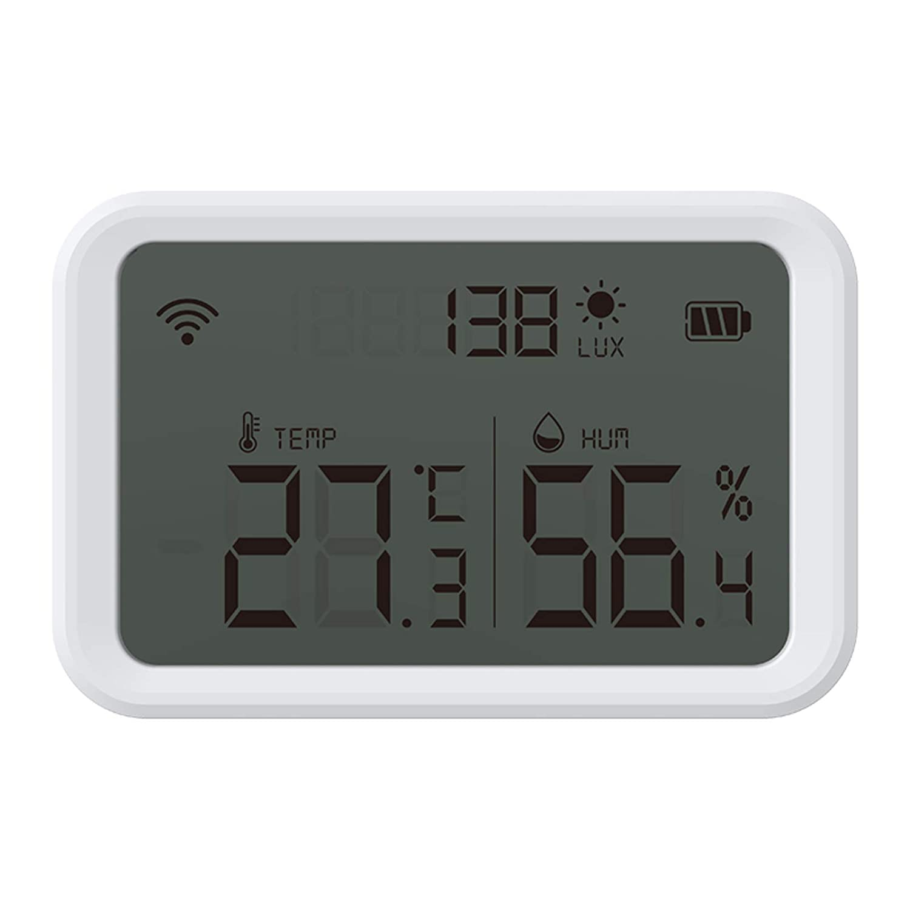|Tuya|Temperature, humidity and light sensor with display||||
||Tuya|Livarno Lux E27||||
||Tuya|Flood detector|Fuite|||
||Tuya|RGBCCT LED strip controller||||
||Tuya|Single charge smart switch||||
||Tuya|Smart triple switch||||
||Tuya|Socket with 2 usb ports||||
||Tuya|Smart single switch||||
||Tuya|Tuya Zigbee - 1 Way Switch||||
|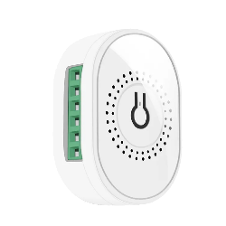|Tuya|SMART - Single ON / OFF connected module||||
||Tuya|Smart plug with power measurement|Socket, Repeater|||
||Tuya|4CH module||||
|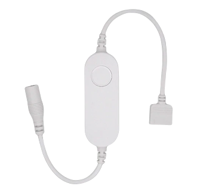|Tuya|RGBW LED strip controller||||
||Tuya|Detecteur d'inondation (3)|Fuite|||
|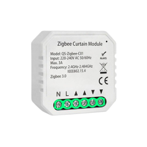|Tuya|Intelligent roller shutter module||||
||Tuya|4 button smart switch with batteries||||
||Tuya|Single connected plug ON / OFF 16A|Socket, Consumption, Power, Repeater||[Buy](https://fr.aliexpress.com/item/1005003444957152.html)|
||Tuya|3 button connected switch|||[Buy](https://www.domadoo.fr/fr/domotique/5787-moes-interrupteur-intelligent-sans-fil-zigbee-3-boutons.html)|
||Tuya|Triple switch||||
||Tuya|Flood detector (2)|Fuite|||
||Tuya|4 button smart switch with batteries||||
||Doowifi|ZIGBEE SHUTTER CONTROL DWF-0205ZB-PN-2|Volets|||
||Tuya|Connected socket|Socket, Meter, Power, Repeater|||
|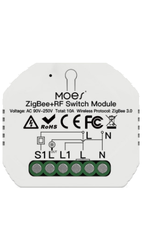|Tuya|MOES - Single ON / OFF connected module||||
||Tuya|ZigBee GU10 Smart LED Dimmable Bulbs RGBCCT 2200-6500K C+W 5W||||
||Tuya|Led bulb 3.0, RGB+WW+CW E27||||
||Tuya|3 button connected switch||||
||Tuya|Connected switch 2 buttons||||
||Tuya|Watering valve||For the moment, it is impossible to control the timer correctly, when it is set to On the valve remains open for 10min then shuts off|[Buy](https://www.domadoo.fr/fr/peripheriques/5886-saswell-electrovanne-et-programmateur-d-arrosage-connecte-zigbee-mesure-de-consommation.html?domid=4&id_campaign=9)|
||Tuya|Zigbee Motion Sensor||||
||Tuya|Tuya air quality CO||||
||Tuya|Watering valve||For the moment, it is impossible to control the timer correctly, when it is set to On the valve remains open for 10min then shuts off|[Buy](https://www.domadoo.fr/fr/peripheriques/5886-saswell-electrovanne-et-programmateur-d-arrosage-connecte-zigbee-mesure-de-consommation.html?domid=4&id_campaign=9)|
||Tuya|Watering valve||For the moment, it is impossible to control the timer correctly, when it is set to On the valve remains open for 10min then shuts off|[Buy](https://www.domadoo.fr/fr/peripheriques/5886-saswell-electrovanne-et-programmateur-d-arrosage-connecte-zigbee-mesure-de-consommation.html?domid=4&id_campaign=9)|
||Tuya|Smart thermostat||||
||Moes|MOES - Intelligent thermostatic head (3)|||[Buy](https://www.domadoo.fr/fr/tetes-thermostatiques/5783-moes-tete-thermostatique-intelligente-zigbee-30-blanc.html)|
||Tuya|Smart thermostat||||
|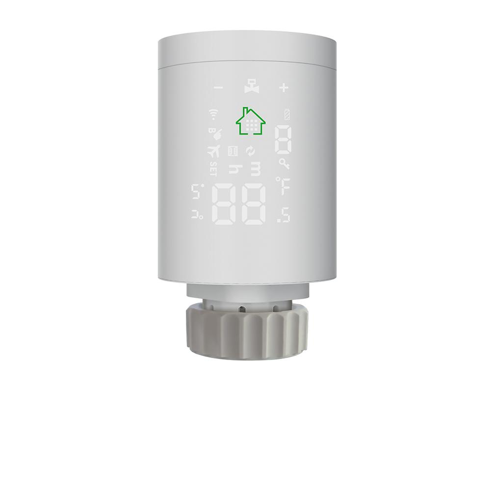|Moes|MOES - Intelligent thermostatic head||||
|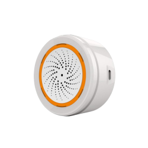|Tuya|Smart siren with temperature and humidity sensor||||
|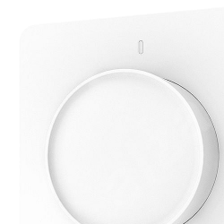|Tuya|MOES - Smart thermostat||||
|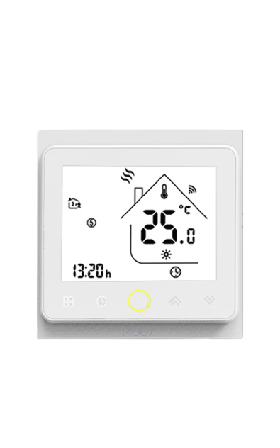|Tuya|MOES - Smart thermostat||||
|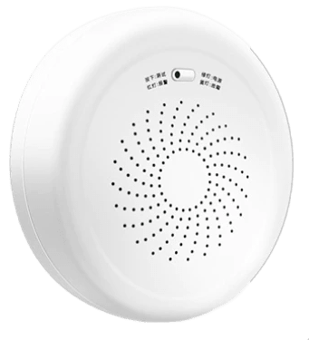|Tuya|Gas sensor||||
||Tuya|Tête thermostatique intelligente||||
||Tuya|MOES - Single dimmer module||||
|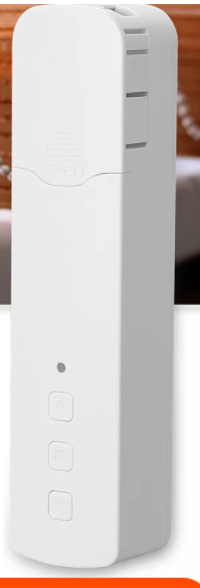|Tuya|Smart Motorized Chain Roller|Volets|||
||Tuya|MOES - Zigbee Tuya presence detector (radar technology)|||[Buy](https://www.domadoo.fr/fr/domotique/6328-moes-detecteur-de-presence-zigbee-tuya-technologie-radar.html?domid=4&id_campaign=9)|
||Tuya|Tuya air quality||||
|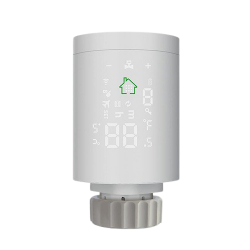|Moes|MOES - Intelligent thermostatic head (2)||||
|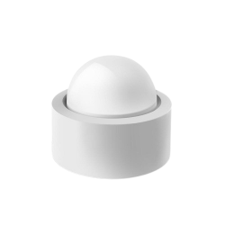|Tuya|Zigbee Motion Sensor||||

# Woox

|Image|Marque|Nom|Type|Remarque|Lien|
|---|---|---|---|---|---|
|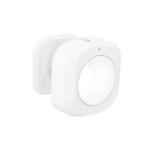|Woox|Intelligent motion detector||||
|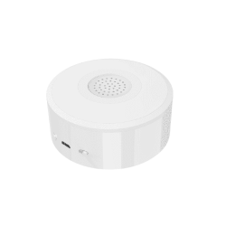|Woox|Smart siren with LED|Mermaid||[Buy](https://www.domadoo.fr/fr/peripheriques/5682-woox-sirene-interieure-intelligente-zigbee-30-8435606701105.html)|
||Woox|Intelligent door or window opening detector||||
||Woox|Connected E27 LED bulb - RGB + CCT|||[Buy](https://www.domadoo.fr/fr/peripheriques/5680-woox-ampoule-connectee-zigbee-e27-rgb-cct-compatible-amazon-alexa-et-google-assistant-8435606703581.html)|
||Woox|Smart flood detector||||
||Woox|4-button SOS / Arm / Disarm / Home remote control|Remote control||[Buy](https://www.domadoo.fr/fr/peripheriques/5684-woox-telecommande-intelligente-4-boutons-zigbee-30-8435606701136.html)|
||Woox|SOS button|Button, Remote control||[Buy](https://www.domadoo.fr/fr/peripheriques/5683-woox-bouton-d-urgence-sos-zigbee-30-8435606701112.html)|
||Woox|ON / OFF intelligent outdoor sprinkler controller |Sprinkler, Valve||[Buy](https://www.domadoo.fr/fr/peripheriques/5685-woox-controleur-d-arrosage-intelligent-onoff-zigbee-30-8435606701198.html)|
|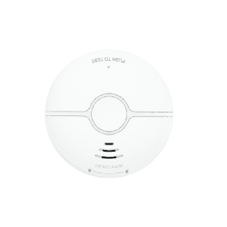|Woox|Smart smoke detector||||
|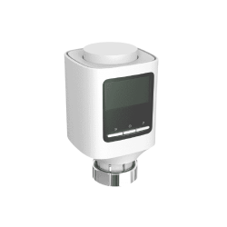|Woox|Intelligent thermostatic head with display|Thermostatic head||[Buy](https://www.domadoo.fr/fr/tetes-thermostatiques/5902-woox-tete-thermostatique-connectee-zigbee-30-8435606701761.html?domid=4&id_campaign=9)|

# Xiaomi

|Image|Marque|Nom|Type|Remarque|Lien|
|---|---|---|---|---|---|
||Xiaomi|Xiaomi Mijia RTCGQ01LM|||[Buy](https://www.domadoo.fr/fr/peripheriques/4518-xiaomi-aqara-detecteur-de-mouvement-zigbee-rtcgq11lm-192784000090.html?domid=4&id_campaign=9)|
|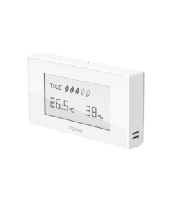|Xiaomi|XIAOMI AQARA - Zigbee 3 Air Quality Monitor.0 (TEMPERATURE, HUMIDITY, TVOC)|Temperature, Humidity, Air quality||[Documentation](https://cdn.aqara.com/cdn/website/mainland/static/docs/TVOC-Air-Quality-Monitor_Manual_EN.pdf) [Buy](https://www.domadoo.fr/fr/peripheriques/5751-xiaomi-aqara-moniteur-de-qualite-d-air-zigbee-30-temp-hum-covt-6970504214644.html)|
||Xiaomi|AQARA - SMART RADIATOR THERMOSTAT E1|||[Buy](https://www.domadoo.fr/fr/peripheriques/6286-aqara-tete-thermostatique-zigbee-30-aqara-radiator-thermostat-e1-6970504217058.html?domid=4&id_campaign=9)|
||Xiaomi|AQARA - Single switch with neutral||||
||Xiaomi|AQARA - Double switch with neutral||||
||Xiaomi|AQARA - Single switch without neutral||||
|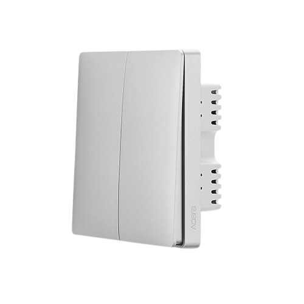|Xiaomi|AQARA - Double switch without neutral||||
||Xiaomi|AQARA - Intelligent motorization for chain roller blinds|||[Buy](https://www.domadoo.fr/fr/peripheriques/5892-xiaomi-aqara-motorisation-intelligente-pour-store-enrouleur-a-chainette-zigbee-30-rsd-m01-6970504215085.html)|
||Xiaomi|AQARA - MOTORIZATION FOR ZIGBEE 3 CURTAIN.0 AQARA CURTAIN DRIVER E1 (ROD VERSION)|||[Buy](https://www.domadoo.fr/fr/peripheriques/6250-aqara-motorisation-pour-rideau-zigbee-30-aqara-curtain-driver-e1-version-tringle-6970504216860.html?domid=4&id_campaign=9)|
||Xiaomi|Curtain motor||||
||Xiaomi|AQARA - Connected LED bulb|||[Buy](https://www.domadoo.fr/fr/peripheriques/5257-aqara-ampoule-led-zigbee-aqara-blanc-variable-0192784000144.html)|
|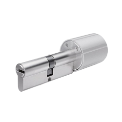|Xiaomi|MIJIA - Connected lock|Serrure|||
|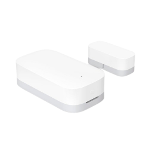|Xiaomi|AQARA - Intelligent opening detector (3)|||[Buy](https://www.domadoo.fr/fr/peripheriques/4514-xiaomi-detecteur-d-ouverture-portefenetre-zigbee-aqara.html)|
||Xiaomi|MI - Smart plug ON / OFF||||
||Xiaomi|AQARA - Connected socket|||[Buy](https://www.domadoo.fr/fr/peripheriques/5385-aqara-prise-connectee-zigbee-30-smart-plug-6970504210646.html)|
||Xiaomi|MI - ON / OFF connected socket + Consumption measurement|||[Buy](https://www.domadoo.fr/fr/peripheriques/5305-xiaomi-prise-connectee-zigbee-mi-smart-plug-6934177706493.html)|
||Xiaomi|AQARA - Smart bidirectional module||||
|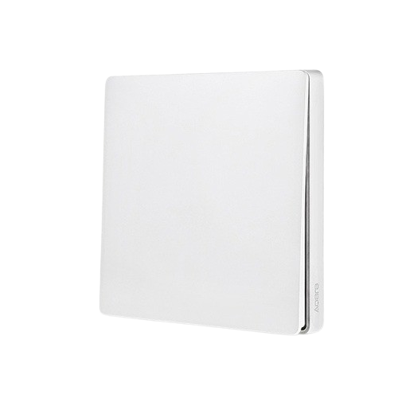|Xiaomi|AQARA - Smart wireless single switch|||[Buy](https://www.domadoo.fr/fr/peripheriques/4516-xiaomi-interrupteur-mural-simple-sans-fil-zigbee-aqara-6970504210)|
||Xiaomi|AQARA - Smart wireless single switch|||[Buy](https://www.domadoo.fr/fr/peripheriques/4516-xiaomi-interrupteur-mural-simple-sans-fil-zigbee-aqara-6970504210)|
|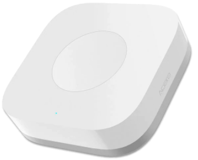|Xiaomi|AQARA - Smart Wireless Switch (REV1)|Remote control, Switch||[Buy](https://www.domadoo.fr/fr/peripheriques/4669-aqara-interrupteur-sans-fil-intelligent-zigbee-192784000052.html)|
||Xiaomi|AQARA - Wireless double switch||The module is a little capricious you have to be very close to the key|[Buy](https://www.domadoo.fr/fr/peripheriques/4517-xiaomi-interrupteur-mural-double-sans-fil-zigbee-aqara-6970504210042.html)|
|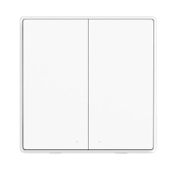|Xiaomi|AQARA - Wireless double switch|||[Buy](https://www.domadoo.fr/fr/peripheriques/4517-xiaomi-interrupteur-mural-double-sans-fil-zigbee-aqara-6970504210042.html)|
||Xiaomi|AQARA - Wireless switch 2||||
||Xiaomi|XIAOMI AQARA - H1 ZigBee 3 wireless double wall switch.0|Switch, Remote control|The module does not distinguish between right and left clicks, the 2nd button is therefore not usable|[Documentation](https://cdn.aqara.com/cdn/website/mainland/static/docs/Wireless-Remote-Switch-H1_Manual_EN.pdf) [Buy](https://www.domadoo.fr/fr/peripheriques/5725-xiaomi-aqara-interrupteur-mural-double-sans-fil-h1-zigbee-30-6970504215023.html)|
|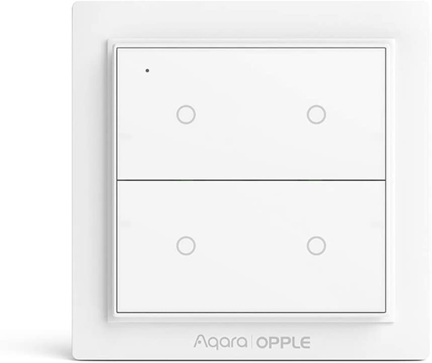|Xiaomi|AQARA - Wireless switch 4||||
|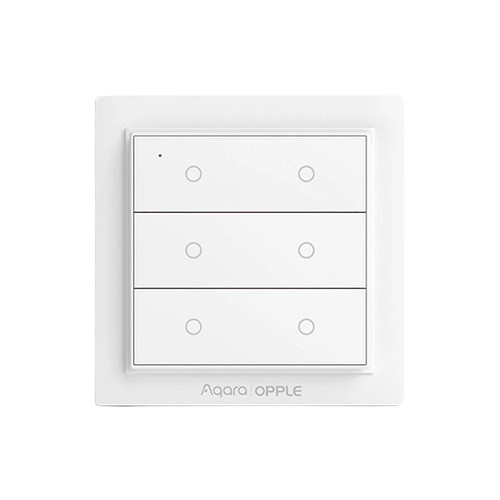|Xiaomi|AQARA - OPPLE 6-button smart wireless switch||||
|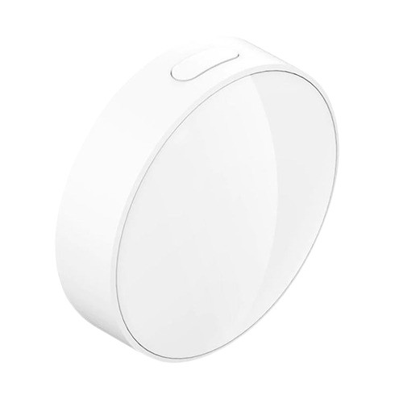|Xiaomi|MI - Light sensor|||[Buy](https://www.domadoo.fr/fr/peripheriques/5486-xiaomi-mi-capteur-de-luminosite-zigbee-30-6934177710865.html?domid=4&id_campaign=9)|
|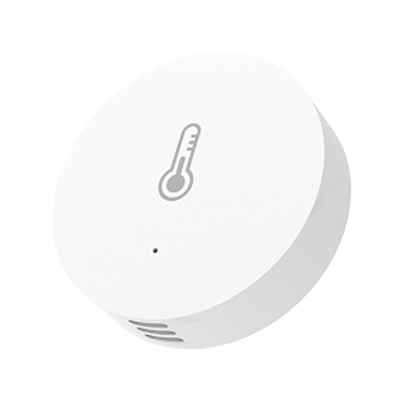|Xiaomi|MIJIA - Temperature / humidity sensor||||
||Xiaomi|AQARA - Smart wireless single switch|||[Buy](https://www.domadoo.fr/fr/peripheriques/4516-aqara-interrupteur-mural-simple-sans-fil-zigbee-6970504210035.html)|
|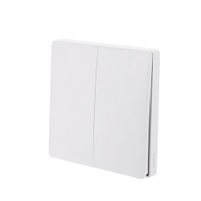|Xiaomi|AQARA - Smart wireless double switch|||[Buy](https://www.domadoo.fr/fr/peripheriques/4517-xiaomi-interrupteur-mural-double-sans-fil-zigbee-aqara-6970504210042.html)|
||Xiaomi|AQARA - Magic Cube intelligent controller|Remote control, Controller||[Buy](https://www.domadoo.fr/fr/peripheriques/4668-aqara-controleur-intelligent-magic-cube-zigbee-0192784000045.html)|
||Xiaomi|AQARA - Intelligent temperature and humidity sensor|||[Buy](https://www.domadoo.fr/fr/peripheriques/4515-aqara-capteur-de-temperature-et-d-humidite-zigbee-6970504212510.html)|
||Xiaomi|AQARA - Intelligent opening sensor|||[Buy](https://www.domadoo.fr/fr/peripheriques/4514-xiaomi-detecteur-d-ouverture-portefenetre-zigbee-aqara.html)|
||Xiaomi|MI - Intelligent opening sensor||||
||Xiaomi|AQARA - Intelligent motion sensor|||[Buy](https://www.domadoo.fr/fr/peripheriques/4518-xiaomi-detecteur-de-mouvement-zigbee-aqara-192784000090.html)|
||Xiaomi|AQARA - Intelligent motion sensor|||[Buy](https://www.domadoo.fr/fr/peripheriques/4518-aqara-detecteur-de-mouvement-zigbee-192784000090.html)|
||Xiaomi|Honeywell Gas Alarm||||
|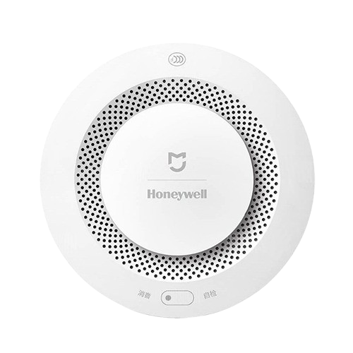|Xiaomi|MIJIA - Smart smoke detector||||
||Xiaomi|AQARA - Smart wireless switch|Remote control, Switch|||
|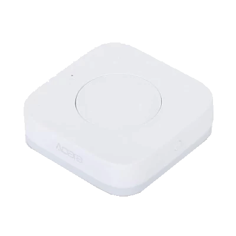|Xiaomi|AQARA - Smart Wireless Switch (REV2)|Remote control, Switch||[Buy](https://www.domadoo.fr/fr/peripheriques/4669-aqara-interrupteur-sans-fil-intelligent-zigbee-192784000052.html)|
||Xiaomi|AQARA - Smart Wireless Switch (REV3)|Remote control, Switch|||
|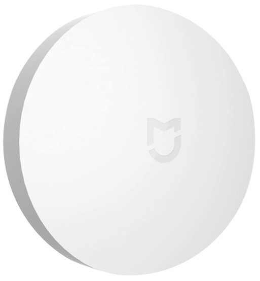|Xiaomi|MIJIA - Smart wireless switch||||
|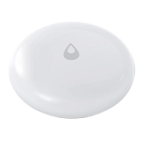|Xiaomi|AQARA - Intelligent flood detector|||[Buy](https://www.domadoo.fr/fr/peripheriques/4519-xiaomi-capteur-d-eau-zigbee-aqara-6970504210257.html)|
||Xiaomi|AQARA - Single switch without neutral|Contacteur|||
||Xiaomi|AQARA - Double switch without neutral|||[Buy](https://www.domadoo.fr/fr/peripheriques/5727-xiaomi-aqara-interrupteur-mural-double-intelligent-h1-zigbee-30-sans-neutre-ws-euk02-6970504214781.html?domid=4&id_campaign=9)|
||Xiaomi|AQARA - Smart wall switch D1||||
|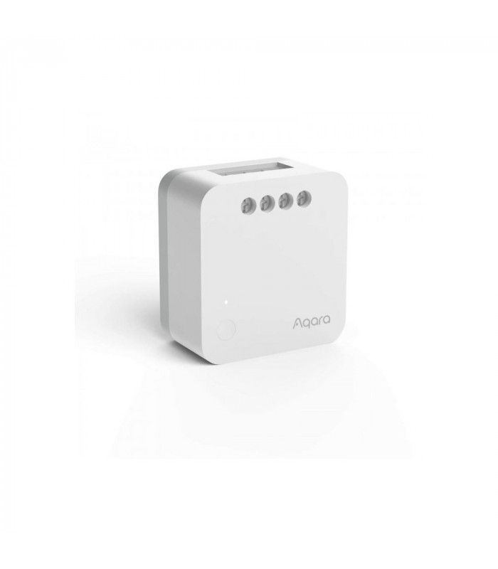|Xiaomi|AQARA - Micromodule on / off without neutral|Contactor, Meter, Power||[Buy](https://www.domadoo.fr/fr/peripheriques/5387-aqara-micromodule-onoff-zigbee-30-1250w-sans-neutre-6970504213302.html)|
||Xiaomi|XIAOMI AQARA - H1 ZigBee 3 smart wall switch.0 (WITHOUT NEUTRAL)|Switch, Light||[Documentation](https://cdn.aqara.com/cdn/website/mainland/static/docs/Smart-Wall-Switch-H1-No-Neutral_Manual_EN.pdf) [Buy](https://www.domadoo.fr/fr/peripheriques/5726-xiaomi-aqara-interrupteur-mural-intelligent-h1-zigbee-30-sans-neutre-ws-euk01-6970504214774.html)|
|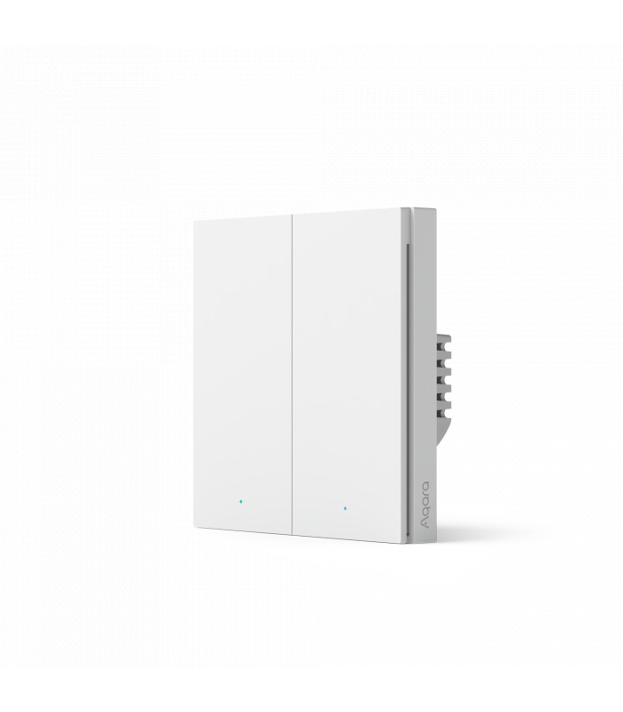|Xiaomi|XIAOMI AQARA - H1 ZigBee 3 Smart Double Wall Switch.0 (WITHOUT NEUTRAL)|Switch, Light||[Documentation](https://www.aqara.com/userfiles/fileupload/202105/1392376227816738818.pdf) [Buy](https://www.domadoo.fr/fr/peripheriques/5727-xiaomi-aqara-interrupteur-mural-double-intelligent-h1-zigbee-30-sans-neutre-6970504214781.html)|
|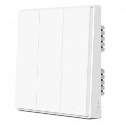|Xiaomi|AQARA - Triple switch with neutral||||
||Xiaomi|AQARA - Micromodule on / off with neutral|Contactor, Meter, Power||[Buy](https://www.domadoo.fr/fr/peripheriques/5386-aqara-micromodule-onoff-zigbee-30-2500w-avec-neutre-6970504213296.html)|
||Xiaomi|||||
||Xiaomi|XIAOMI AQARA - H1 ZigBee 3 Smart Double Wall Switch.0 (with neutral) + Consumption measurement|||[Documentation](https://cdn.aqara.com/cdn/website/mainland/static/docs/Smart-Wall-Switch-H1-With-Neutral_Manual_EN.pdf) [Buy](https://www.domadoo.fr/fr/peripheriques/5729-xiaomi-aqara-interrupteur-mural-double-intelligent-h1-zigbee-30-avec-neutre-ws-euk04-6970504214804.html)|
||Xiaomi|AQARA - Vibration sensor|Detector, Door, Vibration||[Buy](https://www.domadoo.fr/fr/peripheriques/4667-xiaomi-capteur-de-vibration-zigbee-aqara-192784000113.html)|
||Xiaomi|AQARA - Temperature / pressure / humidity sensor|||[Buy](https://www.domadoo.fr/fr/peripheriques/4515-aqara-capteur-de-temperature-et-d-humidite-zigbee-6970504212510.html)|
|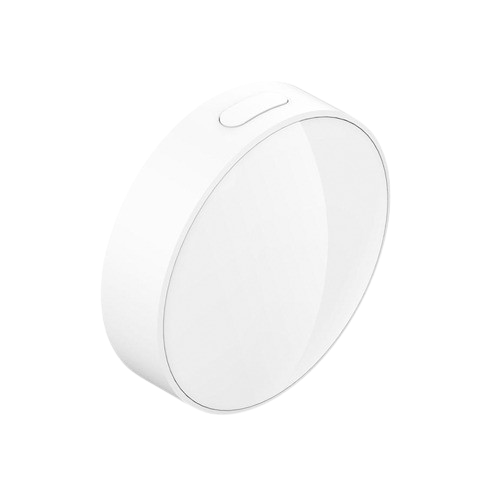|Xiaomi|AQARA - Light sensor||||
||Xiaomi|MI - Light sensor|||[Buy](https://www.domadoo.fr/fr/peripheriques/5486-xiaomi-mi-capteur-de-luminosite-zigbee-30-6934177710865.html)|
||Xiaomi|AQARA - FP1 Occupancy Sensor||||
||Xiaomi|MI - ON / OFF connected socket + Consumption measurement|||[Buy](https://www.domadoo.fr/fr/peripheriques/5305-xiaomi-prise-connectee-zigbee-mi-smart-plug-6934177706493.html)|
|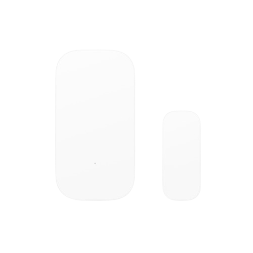|Xiaomi|AQARA - Intelligent opening detector|||[Buy](https://www.domadoo.fr/fr/peripheriques/4514-xiaomi-detecteur-d-ouverture-portefenetre-zigbee-aqara.html)|
||Xiaomi|AQARA - Smart motion detector v2|||[Buy](https://www.domadoo.fr/fr/peripheriques/4518-xiaomi-detecteur-de-mouvement-zigbee-aqara-192784000090.html)|
||Xiaomi|MIJIA - Smart wireless switch|Switch, Remote control|||
||Xiaomi|AQARA - Intelligent flood detector|||[Buy](https://www.domadoo.fr/fr/peripheriques/4519-xiaomi-capteur-d-eau-zigbee-aqara-6970504210257.html)|
|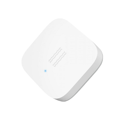|Xiaomi|AQARA - Vibration sensor|Detector, Door, Vibration||[Buy](https://www.domadoo.fr/fr/peripheriques/4667-xiaomi-capteur-de-vibration-zigbee-aqara-192784000113.html)|

This list is based on user feedback, the Jeedom team cannot therefore guarantee that all the modules in this list are 100% functional

2023-10-29 02:32:11
