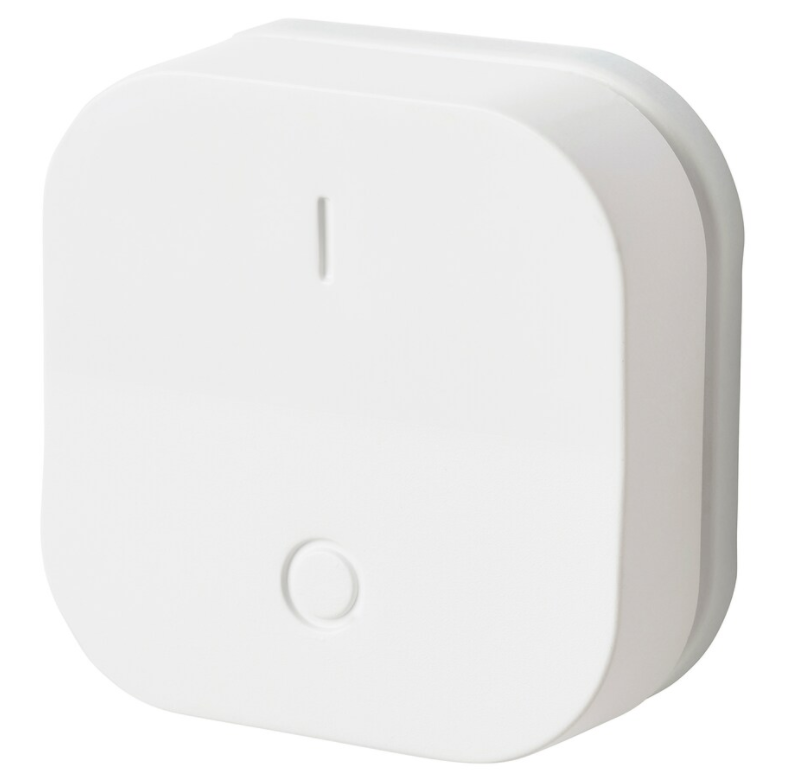
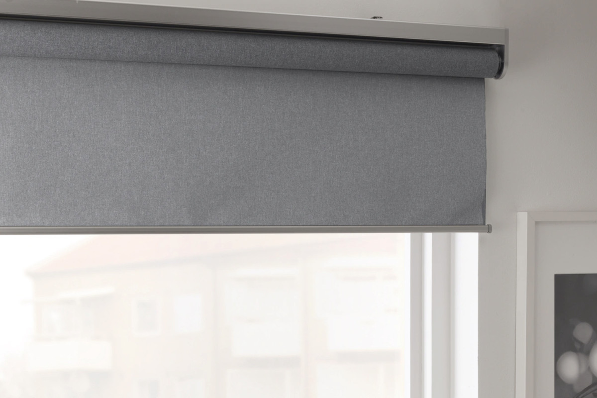

# Compatibility of Zigbee modules

# Legrand

|Image|Marque|Nom|Type|Remarque|Lien|
|---|---|---|---|---|---|
||Legrand|Legrand cable outlet||||
||Legrand|Legrand micro module||||
||Legrand|Legrand mobile socket Céliane||||

# TYZB01

|Image|Marque|Nom|Type|Remarque|Lien|
|---|---|---|---|---|---|
||TYZB01|GR-SMARTHOME 1/4 TURN VALVE|||[Buy](https://www.domadoo.fr/fr/peripheriques/5264-gr-smarthome-motorisation-zigbee-30-pour-vanne-14-de-tour.html)|

# Danalock

|Image|Marque|Nom|Type|Remarque|Lien|
|---|---|---|---|---|---|
||Danalock|Danalock V3 Zigbee||||

# Danfoss

|Image|Marque|Nom|Type|Remarque|Lien|
|---|---|---|---|---|---|
||Danfoss|Danfoss eTRV0100||To reset the valve, remove the batteries and put them back by pressing the button until the screen comes on again.|[Buy](https://www.domadoo.fr/fr/peripheriques/5156-danfoss-tete-electronique-ally-zigbee-30-5702425245008.html)|

# Generic

|Image|Marque|Nom|Type|Remarque|Lien|
|---|---|---|---|---|---|
||Generic|Light RGB||Generic equipment for an RGB light||
||Generic|On / off||Generic equipment for a socket or any On / Off module||
||Generic|Opening / Motion||Generic equipment for opening or motion sensor||

# Ikea

|Image|Marque|Nom|Type|Remarque|Lien|
|---|---|---|---|---|---|
||Ikea|Ikea repeateur||||
||Ikea|Ikea 2 button remote control||||
||Ikea|Ikea remote control 2 buttons store||||
||Ikea|Ikea 5 button remote control||||
||Ikea|Ikea fyrtur||For inclusion, it is advisable to reset the blind (by pressing the 2 buttons until the diode lights up), then put Jeedom in inclusion mode, remove the betarie and replace the battery of the blind||
||Ikea|Ikea Kadrilj||For inclusion, it is advisable to reset the blind (by pressing the 2 buttons until the diode lights up), then put Jeedom in inclusion mode, remove the betarie and replace the battery of the blind||
||Ikea|Ikea motion sensor||||

# Philips

|Image|Marque|Nom|Type|Remarque|Lien|
|---|---|---|---|---|---|
||Philips|Philips movement||||

# Sonoff

|Image|Marque|Nom|Type|Remarque|Lien|
|---|---|---|---|---|---|
||Sonoff|Sonoff Basic ZBR3|||[Buy](https://www.domadoo.fr/fr/peripheriques/5258-sonoff-module-commutateur-10a-zigbee-30.html)|
||Sonoff|Sonoff wears||Attetion there is a bug in the firmware which makes it go up as a temperature and humidity module so following the inclusion, reset the correct model and remove the temperature and humidity controls|[Buy](https://www.domadoo.fr/fr/peripheriques/5261-sonoff-detecteur-de-mouvement-zigbee-30.htm)|
||Sonoff|Sonoff movement|||[Buy](https://www.domadoo.fr/fr/peripheriques/5261-sonoff-detecteur-de-mouvement-zigbee-30.html)|
||Sonoff|Sonoff Temperature / humidity|||[Buy](https://www.domadoo.fr/fr/peripheriques/5260-sonoff-capteur-de-temperature-et-d-humidite-zigbee-30.html)|
||Sonoff|Sonoff button|||[Buy](https://www.domadoo.fr/fr/peripheriques/5259-sonoff-interrupteur-sans-fil-zigbee-30.html)|

# Sunricher

|Image|Marque|Nom|Type|Remarque|Lien|
|---|---|---|---|---|---|
||Sunricher|[SR-ZG9080A] Sunricher motor controller||||
||Sunricher|Sunricher RGB-CCT||||
||Sunricher|Sunricher ZG2858A||||

# Xiaomi

|Image|Marque|Nom|Type|Remarque|Lien|
|---|---|---|---|---|---|
||Xiaomi|Xioami double switch|||[Buy](https://www.domadoo.fr/fr/peripheriques/4517-xiaomi-interrupteur-mural-double-sans-fil-zigbee-aqara-6970504210042.html)|
||Xiaomi|Xioami Aquara Vibration|||[Buy](https://www.domadoo.fr/fr/peripheriques/4667-xiaomi-capteur-de-vibration-zigbee-aqara-192784000113.html)|
||Xiaomi|Xiaomi aquara wears|||[Buy](https://www.domadoo.fr/fr/peripheriques/4514-xiaomi-detecteur-d-ouverture-portefenetre-zigbee-aqara.html)|
||Xiaomi|Xiaomi aquara movement|||[Buy](https://www.domadoo.fr/fr/peripheriques/4518-xiaomi-detecteur-de-mouvement-zigbee-aqara-192784000090.html)|
||Xiaomi|Xiaomi aquara flood|||[Buy](https://www.domadoo.fr/fr/peripheriques/4519-xiaomi-capteur-d-eau-zigbee-aqara-6970504210257.html)|

This list is based on user feedback, the Jeedom team cannot therefore guarantee that all the modules in this list are 100% functional

2020-09-25 08:59:55
