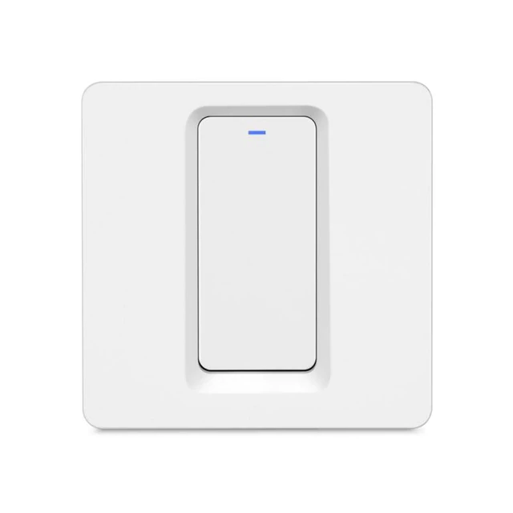

# Compatibility of Zigbee modules

# Eurotronic

|Image|Marque|Nom|Type|Remarque|Lien|
|---|---|---|---|---|---|
||Eurotronic|Spirit valve||Valve that tends to no longer accept orders (change of setpoint) unless the batteries are removed and put back. On the other hand, it always feeds back the temperature information and manual setpoint change||

# Frient by Develco

|Image|Marque|Nom|Type|Remarque|Lien|
|---|---|---|---|---|---|
||Frient by Develco|Electric meter interface||||
||Develco|Air Quality Sensor||||
||Frient by Develco|IO Module||||
||Develco|Keypad||||
||Develco|Panic Button||There seems to be a problem with the firmware, only the deactivation of the alert (press the button for 5s after activating the panic mode) is sent to the zigbee networks||
||Develco|Siren||||
||Frient by Develco|Wallplug||||
||Frient by Develco|Water leak detector||||
||Frient by Develco|Smart cable||||
||Frient by Develco|Smoke detector||||

# GR-SMARTHOME

|Image|Marque|Nom|Type|Remarque|Lien|
|---|---|---|---|---|---|
||GR-SMARTHOME|GR-SMARTHOME 1/4 TURN VALVE|||[Buy](https://www.domadoo.fr/fr/peripheriques/5264-gr-smarthome-motorisation-zigbee-30-pour-vanne-14-de-tour.html)|

# Groupes

|Image|Marque|Nom|Type|Remarque|Lien|
|---|---|---|---|---|---|
||Groupes|White - Brightness - On - Off||||
||Groupes|Color - White - Brightness - On - Off||||
||Groupes|Brightness - On - Off||||
||Groupes|On - Off||||

# Legrand

|Image|Marque|Nom|Type|Remarque|Lien|
|---|---|---|---|---|---|
||Legrand|Legrand cable outlet||||
||Legrand|Legrand contactor||||
||Legrand|Legrand micro module||||
||Legrand|Legrand mobile socket Céliane||||

# Alfawise

|Image|Marque|Nom|Type|Remarque|Lien|
|---|---|---|---|---|---|
||Alfawise|Alfawise Temperature / humidity||||
||Alfawise|Alfawise carries||||
||Alfawise|Alfawise carries||||

# Danalock

|Image|Marque|Nom|Type|Remarque|Lien|
|---|---|---|---|---|---|
||Danalock|Danalock V3||Jeedom does not recommend this module which seems to have a bug on the firmware which forces the module to be re-included every X hours or days|[Buy](https://www.domadoo.fr/fr/controle-acces/4540-danalock-serrure-connectee-bluetooth-et-zigbee-danalock-v3-5712560000493.html)|

# Danfoss

|Image|Marque|Nom|Type|Remarque|Lien|
|---|---|---|---|---|---|
||Danfoss|Danfoss Icon Floor Controller|Heated Floor Controller|||
||Danfoss|Danfoss Ally|Thermostatic head||[Documentation](https://assets.danfoss.com/documents/DOC353849556547/DOC353849556547.pdf) [Buy](https://www.domadoo.fr/fr/peripheriques/5156-danfoss-tete-electronique-ally-zigbee-30-5702425245008.html)|

# Ecodim

|Image|Marque|Nom|Type|Remarque|Lien|
|---|---|---|---|---|---|
||Ecodim|Led Smart Dimmer|Variateur|||

# Heiman

|Image|Marque|Nom|Type|Remarque|Lien|
|---|---|---|---|---|---|
||Heiman|Smoke Sensor||||
||Heiman|Smoke Sensor||||

# Icasa

|Image|Marque|Nom|Type|Remarque|Lien|
|---|---|---|---|---|---|
||Icasa|Filamant Bulb||||
||Icasa|AC dimmer||||
||Icasa|AC switch||||
||Icasa|Pulse 4S Wall Controller||||
||Icasa|Rotary Dimmer||||
||Icasa|Sunricher RGB||||

# Ikea

|Image|Marque|Nom|Type|Remarque|Lien|
|---|---|---|---|---|---|
||Ikea|Ikea fyrtur||||
||Ikea|Ikea Kadrilj||||
||Ikea|10W driver||||
||Ikea|Driver 30W||||
||Ikea|Bulb E14 opal 600lm||||
||Ikea|Bulb E14 W opch 400lm||||
||Ikea|Bulb E27 CWS opal 600lm||||
||Ikea|Bulb GU10 WS 400lm||||
||Ikea|Bulb GU10 WW 400lm||||
||Ikea|Ikea TRADFRI connected socket|||[Documentation](https://www.ikea.com/fr/fr/manuals/tradfri-wireless-control-outlet__AA-2106602-1_pub.pdf) |
||Ikea|Ikea TRADFRI Wireless motion detector white|||[Documentation](https://www.ikea.com/fr/fr/manuals/tradfri-wireless-motion-sensor__AA-2145280-2_pub.pdf) |
||Ikea|Ikea TRADFRI remote control 2 buttons|Remote control||[Documentation](https://www.ikea.com/fr/fr/assembly_instructions/tradfri-wireless-dimmer-white__AA-2175106-3_pub.pdf) |
||Ikea|Ikea TRADFRI 5-button remote control|Remote control||[Documentation](https://www.ikea.com/fr/fr/manuals/tradfri-remote-control__AA-2144014-1_pub.pdf) |
||Ikea|Ikea repeateur||||
||Ikea|Ikea remote control 2 buttons store||||

# Innr

|Image|Marque|Nom|Type|Remarque|Lien|
|---|---|---|---|---|---|
||Innr|INNR E27 Multicolor RGBW + White||||

# Nodon

|Image|Marque|Nom|Type|Remarque|Lien|
|---|---|---|---|---|---|
||Nodon|SIN-4-1-01||||
||Nodon|SIN-4-2-01||||
||Nodon|PTM 216 Z||||

# Orvibo

|Image|Marque|Nom|Type|Remarque|Lien|
|---|---|---|---|---|---|
||Orvibo|Gas sensor||||
||Orvibo|RGB controller||||
||Orvibo|Multi-functional Replay||||
||Orvibo|Sensor connector||||
||Orvibo|Emergency button||||
||Orvibo|Gas sensor||||
||Orvibo|Temperature / humidity||||
||Orvibo|Water leak||||
||Orvibo|Smoke detector||||

# Osram

|Image|Marque|Nom|Type|Remarque|Lien|
|---|---|---|---|---|---|
||Osram|OSRAM Smart + Connected LED Bulb - E27 Base||||
||Osram|OSRAM LIGHTIFY Indoor Flex RGBW||||
||Osram|OSRAM SMART + Spot GU5.3 Tunable White||||
||Osram|OSRAM Smart + Plug||||

# Philips

|Image|Marque|Nom|Type|Remarque|Lien|
|---|---|---|---|---|---|
||Philips|Hue White and Color Ambiance A60 E27||||
||Philips|Hue LightStrip Plus||||
||Philips|Hue bulb white and color||||
||Philips|Hue White and Color BR30 (1st Gen)||||
||Philips|Hue White and Color Ambiance Spot GU10||Please note that there is no status feedback for this model, only an order sending is possible||
||Philips|Hue White and Color Ambiance A19 E26 (Gen 2)||||
||Philips|Hue White and Color Ambiance A19 E26 (Gen 3)||||
||Philips|Hue White and Color Ambiance BR30 Richer Colors||||
||Philips|Hue White and Color Ambiance Candle E12||||
||Philips|Hue White and Color Ambiance A19 E26||||
||Philips|Hue White and Color Ambiance A19 E26||Please note that there is no status feedback for this model, only an order sending is possible||
||Philips|Hue White and Color Ambiance Play Light Bar||||
||Philips|Hue LivingColors||||
||Philips|Hue LivingColors||||
||Philips|Hue LivingColors Iris Table Lamp Gen3||||
||Philips|Hue LivingColors||||
||Philips|Hue Iris Table Lamp||||
||Philips|Hue Bloom Living Colors Starter Pack||||
||Philips|Hue Bloom Table Lamp||||
||Philips|Hue LivingColors||||
||Philips|Hue Go Portable Light||||
||Philips|Hue Beyond Suspension Light||||
||Philips|Hue white and color||||
||Philips|Hue white and color||||
||Philips|Hue white and color||||
||Philips|Hue Smart plug||||
||Philips|Hue LightStrip||||
||Philips|Hue LightStrip Plus||||
||Philips|Hue LightStrip Outdoor||||
||Philips|Hue white and color||Please note that there is no status feedback for this model, only an order sending is possible||
||Philips|LTW012||Please note that there is no status feedback for this model, only an order sending is possible||
||Philips|Hue White Ambiance E27||Please note that there is no status feedback for this model, only an order sending is possible||
||Philips|Hue White B22||Please note that there is no status feedback for this model, only an order sending is possible||
||Philips|Hue White Candle E14||Please note that there is no status feedback for this model, only an order sending is possible||
||Philips|Variateur||||
||Philips|4 button remote control||||
||Philips|Hue indoor motion detector|Movement, Brightness, Temperature|||
||Philips|Hue outdoor motion detector|Movement, Brightness, Temperature|||
||Philips|Hue Go||||

# Schneider

|Image|Marque|Nom|Type|Remarque|Lien|
|---|---|---|---|---|---|
||Schneider|PlusLink shutter insert|Volets||[Documentation](https://download.schneider-electric.com/files?p_enDocType=System+user+guide&p_File_Name=Merten_PL_Wiser_TIs_DE.pdf&p_Doc_Ref=Merten_PL_Wiser_TIs_DE) |
||Schneider|Double switch||||
||Schneider|Wiser Window / Door Sensor|Ouverture||[Documentation](https://download.schneider-electric.com/files?p_enDocType=User+guide&p_File_Name=MFR1569800.pdf&p_Doc_Ref=MFR1569800) |
||Schneider|Wiser Water Leakage Sensor|Fuite|||
||Schneider|Wiser Exxact dimmer rotary|Variateur|||
||Schneider|Wiser micro dimmer module|Variateur|||

# Sonoff

|Image|Marque|Nom|Type|Remarque|Lien|
|---|---|---|---|---|---|
||Sonoff|||||
||Sonoff|Sonoff Basic ZBR3|||[Buy](https://www.domadoo.fr/fr/peripheriques/5258-sonoff-module-commutateur-10a-zigbee-30.html)|
||Sonoff|Sonoff wears||Attention there is a bug in the firmware which makes it go up as a temperature and humidity module it is therefore necessary following the inclusion to reset the correct model and remove the temperature and humidity controls|[Buy](https://www.domadoo.fr/fr/peripheriques/5261-sonoff-detecteur-de-mouvement-zigbee-30.htm)|
||Sonoff|Sonoff wears|||[Buy](https://www.domadoo.fr/fr/peripheriques/5261-sonoff-detecteur-de-mouvement-zigbee-30.htm)|
||Sonoff|Sonoff movement|||[Buy](https://www.domadoo.fr/fr/peripheriques/5261-sonoff-detecteur-de-mouvement-zigbee-30.html)|
||Sonoff|Sonoff Temperature / humidity|||[Buy](https://www.domadoo.fr/fr/peripheriques/5260-sonoff-capteur-de-temperature-et-d-humidite-zigbee-30.html)|
||Sonoff|Sonoff button|||[Buy](https://www.domadoo.fr/fr/peripheriques/5259-sonoff-interrupteur-sans-fil-zigbee-30.html)|

# Sunricher

|Image|Marque|Nom|Type|Remarque|Lien|
|---|---|---|---|---|---|
||Sunricher|Sunricher motor controller||||
||Sunricher|Sunricher RGB||||
||Sunricher|Sunricher ||||

# Tryo2sys

|Image|Marque|Nom|Type|Remarque|Lien|
|---|---|---|---|---|---|
||Tryo2sys|PTM 215 ZE||||

# Tuya

|Image|Marque|Nom|Type|Remarque|Lien|
|---|---|---|---|---|---|
||Tuya|Temperature / humidity||||
||Moes|Moes Radiator Actuator||||
||Tuya|Single switch||||
||Tuya|Double switch||||

# Xiaomi

|Image|Marque|Nom|Type|Remarque|Lien|
|---|---|---|---|---|---|
||Xiaomi|Xiaomi single switch without neutral||||
||Xiaomi|Xioami double switch without neutral||||
||Xiaomi|Xiaomi taken||||
||Xiaomi|Xiaomi taken||||
||Xiaomi|Xiaomi Aqara LLKZMK11LM Intelligent two-way module||||
||Xiaomi|Xioami simple switch|||[Buy](https://www.domadoo.fr/fr/peripheriques/4516-xiaomi-interrupteur-mural-simple-sans-fil-zigbee-aqara-6970504210)|
||Xiaomi|Xioami double switch|||[Buy](https://www.domadoo.fr/fr/peripheriques/4517-xiaomi-interrupteur-mural-double-sans-fil-zigbee-aqara-6970504210042.html)|
||Xiaomi|Brightness sensor||||
||Xiaomi|Xioami double switch|||[Buy](https://www.domadoo.fr/fr/peripheriques/4517-xiaomi-interrupteur-mural-double-sans-fil-zigbee-aqara-6970504210042.html)|
||Xiaomi|Xiaomi smart cube||||
||Xiaomi|Temperature / humidity sensor||||
||Xiaomi|Xiaomi aquara aperture sensor|||[Buy](https://www.domadoo.fr/fr/peripheriques/4514-xiaomi-detecteur-d-ouverture-portefenetre-zigbee-aqara.html)|
||Xiaomi|Xiaomi sensor opening||||
||Xiaomi|Xiaomi aquara motion|||[Buy](https://www.domadoo.fr/fr/peripheriques/4518-xiaomi-detecteur-de-mouvement-zigbee-aqara-192784000090.html)|
||Xiaomi|Xiaomi motion sensor||||
||Xiaomi|Xiaomi aquara smoke||||
||Xiaomi|Xiaomi Aquara switch Aq2||||
||Xiaomi|Xiaomi aquara switch||||
||Xiaomi|Xiaomi aquara flood|||[Buy](https://www.domadoo.fr/fr/peripheriques/4519-xiaomi-capteur-d-eau-zigbee-aqara-6970504210257.html)|
||Xiaomi|Xioami Aquara Vibration|||[Buy](https://www.domadoo.fr/fr/peripheriques/4667-xiaomi-capteur-de-vibration-zigbee-aqara-192784000113.html)|
||Xiaomi|Temperature / pressure / humidity sensor||||
||Xiaomi|Xiaomi taken||||
||Xiaomi|Xiaomi aquara aperture sensor|||[Buy](https://www.domadoo.fr/fr/peripheriques/4514-xiaomi-detecteur-d-ouverture-portefenetre-zigbee-aqara.html)|
||Xiaomi|Xiaomi aquara motion|||[Buy](https://www.domadoo.fr/fr/peripheriques/4518-xiaomi-detecteur-de-mouvement-zigbee-aqara-192784000090.html)|
||Xiaomi|Xiaomi aquara switch||||
||Xiaomi|Xiaomi aquara flood|||[Buy](https://www.domadoo.fr/fr/peripheriques/4519-xiaomi-capteur-d-eau-zigbee-aqara-6970504210257.html)|

This list is based on user feedback, the Jeedom team cannot therefore guarantee that all the modules in this list are 100% functional

2020-12-10 01:32:04
