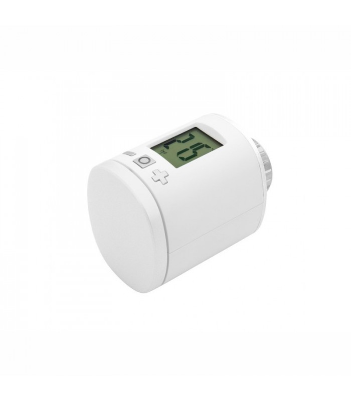

# Compatibility of Zigbee modules

# Eurotronic

|Image|Marque|Nom|Type|Remarque|Lien|
|---|---|---|---|---|---|
||Eurotronic|Spirit valve||Valve that tends to no longer accept an order unless it is re-included.||

# GR-SMARTHOME

|Image|Marque|Nom|Type|Remarque|Lien|
|---|---|---|---|---|---|
||GR-SMARTHOME|[TYZB01] GR-SMARTHOME 1/4 TURN VALVE|||[Buy](https://www.domadoo.fr/fr/peripheriques/5264-gr-smarthome-motorisation-zigbee-30-pour-vanne-14-de-tour.html)|

# Legrand

|Image|Marque|Nom|Type|Remarque|Lien|
|---|---|---|---|---|---|
||Legrand|Legrand cable outlet||||
||Legrand|Legrand micro module||||
||Legrand|Legrand mobile socket Céliane||||

# TZ2000

|Image|Marque|Nom|Type|Remarque|Lien|
|---|---|---|---|---|---|
||TZ2000|[TS0201] Temperature / humidity||||

# Danalock

|Image|Marque|Nom|Type|Remarque|Lien|
|---|---|---|---|---|---|
||Danalock|[DANA_277755] Danalock V3||Jeedom does not recommend this module which seems to have a bug on the firmware which forces the module to be re-included every X hours or days|[Buy](https://www.domadoo.fr/fr/controle-acces/4540-danalock-serrure-connectee-bluetooth-et-zigbee-danalock-v3-5712560000493.html)|

# Danfoss

|Image|Marque|Nom|Type|Remarque|Lien|
|---|---|---|---|---|---|
||Danfoss|[eTRV0100] Danfoss Ally||To reset the valve, remove the batteries and put them back by pressing the button until the screen comes on again.|[Buy](https://www.domadoo.fr/fr/peripheriques/5156-danfoss-tete-electronique-ally-zigbee-30-5702425245008.html)|

# Generic

|Image|Marque|Nom|Type|Remarque|Lien|
|---|---|---|---|---|---|
||Generic|Light RGB||Generic equipment for an RGB light||
||Generic|On / off||Generic equipment for a socket or any On / Off module||
||Generic|Opening / Motion||Generic equipment for opening or motion sensor||

# Heiman

|Image|Marque|Nom|Type|Remarque|Lien|
|---|---|---|---|---|---|
||Heiman|[N-3.0] Smoke sensor||||

# Icasa

|Image|Marque|Nom|Type|Remarque|Lien|
|---|---|---|---|---|---|
||Icasa|[FC] Filamant Bulb||||
||Icasa|[IW11D] AC dimmer||||
||Icasa|[IW11SW] AC switch||||
||Icasa|[KPD14S] Pulse 4S Wall Controller||||
||Icasa|[R12D] Rotary Dimmer||||
||Icasa|[RGBCTT] Sunricher RGB||||

# Ikea

|Image|Marque|Nom|Type|Remarque|Lien|
|---|---|---|---|---|---|
||Ikea|Ikea fyrtur||For inclusion, it is advisable to reset the blind (by pressing the 2 buttons until the diode lights up), then put Jeedom in inclusion mode, remove the betarie and replace the battery of the blind||
||Ikea|Ikea Kadrilj||For inclusion, it is advisable to reset the blind (by pressing the 2 buttons until the diode lights up), then put Jeedom in inclusion mode, remove the betarie and replace the battery of the blind||
||Ikea|Driver 30W||||
||Ikea|Bulb E14 opal 600lm||||
||Ikea|Bulb E27 CWS opal 600lm||||
||Ikea|Bulb GU10 WS 400lm||||
||Ikea|Bulb GU10 WW 400lm||||
||Ikea|Ikea socket||||
||Ikea|Ikea motion sensor||||
||Ikea|[e1743] Ikea 2 button remote control||||
||Ikea|Ikea repeateur||||
||Ikea|[e1766] Ikea remote control 2 buttons store||||
||Ikea|[e1810] Ikea 5 button remote control||||

# Orvibo

|Image|Marque|Nom|Type|Remarque|Lien|
|---|---|---|---|---|---|
||Orvibo|[CC10ZW] RGB controller||||
||Orvibo|[CM10ZW] Multi-functional Replay||||
||Orvibo|[CD10ZW] Sensor connector||||
||Orvibo|Emergency button||||
||Orvibo|[ST30] Temperature / humidity||||
||Orvibo|Water leak||||
||Orvibo|Smoke detector||||

# Philips

|Image|Marque|Nom|Type|Remarque|Lien|
|---|---|---|---|---|---|
||Philips|[LCA001] White and color ambiance||||
||Philips|[ROM001] Drive||||
||Philips|||||
||Philips|[SML001] Philips movement||||

# Schneider

|Image|Marque|Nom|Type|Remarque|Lien|
|---|---|---|---|---|---|
||Schneider|[591011] Opening sensor||!! Attention the module does not work !! The inclusion must be done very close to the key otherwise the module loops on the inclusion||
||Schneider|[592011] Flood sensor||!! Attention the module does not work !! The inclusion must be done very close to the key otherwise the module loops on the inclusion||
||Schneider|[PUCK DIMMER 1] Puck dimmer||||

# Sonoff

|Image|Marque|Nom|Type|Remarque|Lien|
|---|---|---|---|---|---|
||Sonoff|[BASICZBR3] Sonoff Basic ZBR3|||[Buy](https://www.domadoo.fr/fr/peripheriques/5258-sonoff-module-commutateur-10a-zigbee-30.html)|
||Sonoff|[DO01] Sonoff wears||Attention there is a bug in the firmware which makes it go up as a temperature and humidity module it is therefore necessary following the inclusion to reset the correct model and remove the temperature and humidity controls|[Buy](https://www.domadoo.fr/fr/peripheriques/5261-sonoff-detecteur-de-mouvement-zigbee-30.htm)|
||Sonoff|[MS01] Sonoff movement|||[Buy](https://www.domadoo.fr/fr/peripheriques/5261-sonoff-detecteur-de-mouvement-zigbee-30.html)|
||Sonoff|[TH01] Sonoff Temperature / humidity|||[Buy](https://www.domadoo.fr/fr/peripheriques/5260-sonoff-capteur-de-temperature-et-d-humidite-zigbee-30.html)|
||Sonoff|[WB01] Sonoff button|||[Buy](https://www.domadoo.fr/fr/peripheriques/5259-sonoff-interrupteur-sans-fil-zigbee-30.html)|

# Sunricher

|Image|Marque|Nom|Type|Remarque|Lien|
|---|---|---|---|---|---|
||Sunricher|[SR-ZG9080A] Sunricher motor controller||||
||Sunricher|[RGBCTT] Sunricher RGB||||
||Sunricher|[ZG2858A] Sunricher ||||

# Xiaomi

|Image|Marque|Nom|Type|Remarque|Lien|
|---|---|---|---|---|---|
||Xiaomi|[ctrl_neutral1] Xiaomi simple switch without neutral||||
||Xiaomi|[Q8KG03LM] Xioami double switch without neutral||||
||Xiaomi|[Plug] Xiaomi socket||||
||Xiaomi|[C2ACN01] XIAOMI Aqara LLKZMK11LM Intelligent two-way module||||
||Xiaomi|[b286acn01] Xioami double switch|||[Buy](https://www.domadoo.fr/fr/peripheriques/4517-xiaomi-interrupteur-mural-double-sans-fil-zigbee-aqara-6970504210042.html)|
||Xiaomi|[mgl01] Light sensor||||
||Xiaomi|[Cube] Cube||||
||Xiaomi|[Weather] Temperature / humidity sensor||||
||Xiaomi|[magnet] Xiaomi opening sensor||||
||Xiaomi|[motion] Xiaomi motion sensor||||
||Xiaomi|[vibration.aq1] Xioami Aquara Vibration|||[Buy](https://www.domadoo.fr/fr/peripheriques/4667-xiaomi-capteur-de-vibration-zigbee-aqara-192784000113.html)|
||Xiaomi|[Weather] Temperature / pressure / humidity sensor||||
||Xiaomi|[Plug] Xiaomi socket||||
||Xiaomi|[magnet.aq2] Xiaomi Aquara aperture sensor|||[Buy](https://www.domadoo.fr/fr/peripheriques/4514-xiaomi-detecteur-d-ouverture-portefenetre-zigbee-aqara.html)|
||Xiaomi|[motion.aq2] Xiaomi Aquara motion|||[Buy](https://www.domadoo.fr/fr/peripheriques/4518-xiaomi-detecteur-de-mouvement-zigbee-aqara-192784000090.html)|
||Xiaomi|[swtich] Xiaomi Aquara switch||||
||Xiaomi|[wleak.aq1] Xiaomi Aquara flood|||[Buy](https://www.domadoo.fr/fr/peripheriques/4519-xiaomi-capteur-d-eau-zigbee-aqara-6970504210257.html)|

This list is based on user feedback, the Jeedom team cannot therefore guarantee that all the modules in this list are 100% functional

2020-10-16 00:32:03
