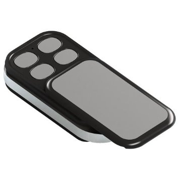
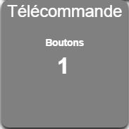
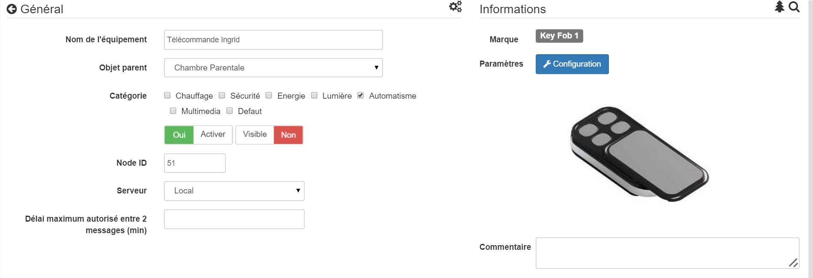
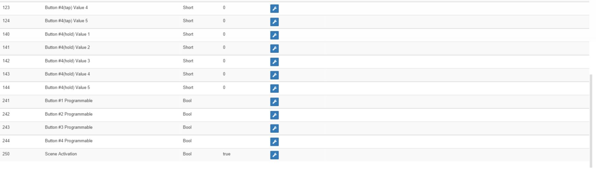
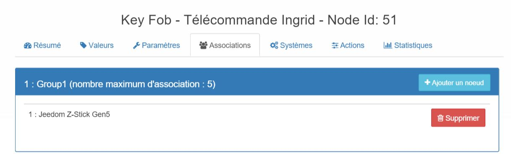

# 

**The module**

**The Jeedom visual**

## Summary

. .

. .

## Fonctions

-   
-   
-   
-   
-   
-   
-   Ease of use and installation

## Technical specifications

-   Module type : Z-Wave Transmitter
-   Food : 
-    : 
-   Frequency: 868.
-   Transmission distance : 
-    : -
-   Dimensions : )

## Module data

-   Brand : Aeotec
-   Name : 
-   Manufacturer ID : 134
-   Product Type : 1
-   Product ID : 22

# Configuration

To configure the OpenZwave plugin and learn how to include Jeedom, refer to this [documentation](https://doc.jeedom.com/en_US/plugins/automation%20protocol/openzwave/).
> **Important**
>
> .
>
>Once included, you should get this :

### Commandes

.

Here is the list of commands :

-    : 
  - 1 : 
  - 2 : 
  - 3 : 
  - 4 : 
  - 5 : 
  - 6 : 
  - 7 : 
  - 8 : 

### Module configuration
> **Important**
>
> 
> .

.

You will arrive at this page (after clicking on the Settings tab))

Parameter details :
-   250: )

.

### Groupes
. .

## Good to know

### Specifics

 :

-   1 : 
-   2 : 
-   3 : )
-   4 : 
-   5 : .

# Wakeup

 :

-   

# 

.
.

# Important note

The module needs to be woken up : 
