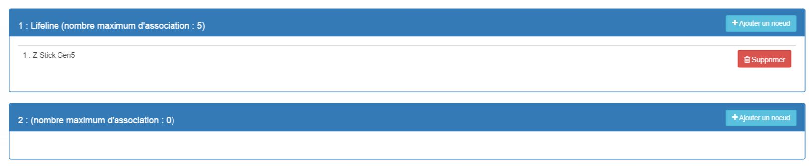

# 

****

****

## 

.

. .

. .

. .

## Fonctions

-   
-   
-   
-   
-   
-   
-   
-   
-   
-   
-   
-   

## 

-    : 
-    : 
-    : 
-   : 868.
-    : 
-    : -
-    : )

## 

-    : Aeotec
-    : 
-    : 134
-    : 1
-    : 88

## Configuration

 .

> ****
>
> .

 :

### Commandes

.

 :

-    : 
  - 1 : 
  - 2 : 
  - 3 : 
  - 4 : 
  - 5 : 
  - 6 : 
  - 7 : 
  - 8 : 

### 

> ****
>
> .

.

)

 :

-   250: )
-   255 : 

### Groupes

.

##  

### 

 :

-   1 : 
-   2 : 
-   3 : 
-   4 : 
-   5 : .

## Wakeup

 :

-   

## .

.

.

## 

 : 
