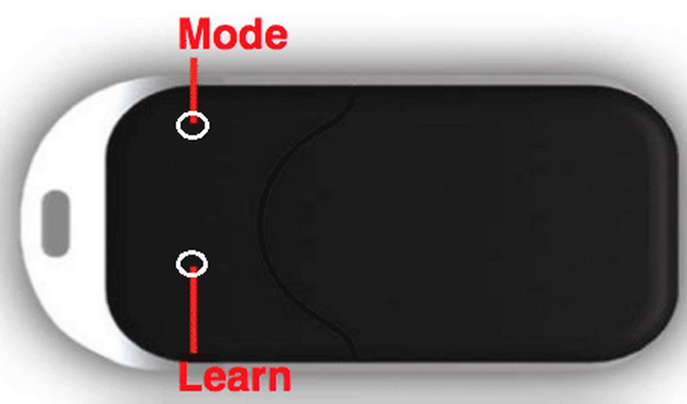

Aeotec Panic Button 
===================

\

-   **The module**

\

\

-   **The Jeedom visual**

\

\

Summary 
------

\

This keychain remote control with a modern and pleasant design has a
button to control all types of Z-Wave devices such as
lamps, blinds, etc..

With its very small dimensions, you can easily put it
in your pocket. Easy to use and elegant, it is equipped with a
ring to attach it to keys, which makes it available to
when leaving home or when returning home.

The button allows you to control two devices or scenes thanks to the
management of short and long presses. This remote control can also be
well used as primary as secondary controller.

This remote control can also be used as a button
emergency or panic. In the event of distress or when its holder
finds himself facing another emergency situation, he just needs to press
the button and a Z-Wave signal will be emitted. In this case, this device
can also be used as a medallion around the neck.

\

Functions 
---------

\

-   Key fob remote control

-   Primary or secondary controller

-   Ultra compact and ultra design

-   1 configurable button

-   Manages up to 2 devices / scenes

-   Can be used as an emergency / panic button

-   Use around the neck as an emergency medallion

\

Technical characteristics 
---------------------------

\

-   Type of module : Z-Wave transmitter

-   Food : 1 Lithium 3V CR2450 battery

-   Battery life : 2 to 3 months for 10 to 20 uses
    per day

-   Frequency: 868.42 MHz

-   Transmission distance : 30m indoors

-   Dimensions : 55 x 30 x 11mm (L x W x H)

\

Module data 
-----------------

\

-   Mark : Aeotec

-   Name : Panic Button

-   Manufacturer ID : 134

-   Product Type : 1

-   Product ID : 38

\

Setup 
-------------

\

To configure the OpenZwave plugin and know how to put Jeedom in
inclusion refer to this
[Documentation](https://jeedom.fr/doc/documentation/plugins/openzwave/en_US/openzwave.html).

\

> **Important**
>
> To put this module in inclusion mode, press the button
> LEARN, in accordance with its paper documentation.

\

\

Once included you should get this :

\

\

### Commands 

\

Once the module has been recognized, the commands associated with the module will be
disponibles.

\

\

Here is the list of commands :

\

-   Buttons : it is the command which will push the button up

1 : Short press button

2 : Long press button

\

### Configuration of the module 

\

> **Important**
>
> During a first inclusion always wake up the module just after
> inclusion.

\

Then if you want to configure the module according to
of your installation, you have to go through the button
"Configuration "of Jeedom's OpenZwave plugin.

\

\

You will arrive on this page (after clicking on the tab
Settings)

\

\

Parameter details :

\

-   250: operating mode of the remote control (absolutely
    Scene for remote control)

-   255 : allows the Keyfob to be reset from the factory

\

### Groups 

\

This module has a single association group. It is
indispensable.

\

\

Good to know 
------------

\

### Specificities 

To use this module as a remote control, proceed as follows :

-   1 : Include remote control

-   2 : Wake up the remote control

-   3 : Change parameter 250 to true (do so even if
    already appears to be true)

-   4 : Wake up the remote control and make sure the change has been
    taken into account

-   5 : Change the operating mode of the remote control while remaining
    press the two buttons on the back for 3 seconds.

Wakeup 
------

\

To wake up this module there is only one way :

-   press and hold the LEARN button for 3 seconds

\

Faq. 
------

\

This module wakes up by pressing the LEARN button for 3 seconds.

\

This module is a battery module, the new configuration will not be
take into account that if you wake up the remote control.

\

Important note 
---------------

\

> **Important**
>
> You have to wake up the module : after its inclusion, after a change
> of the configuration, after a change of wakeup, after a
> change of association groups

\

**@sarakha63**
