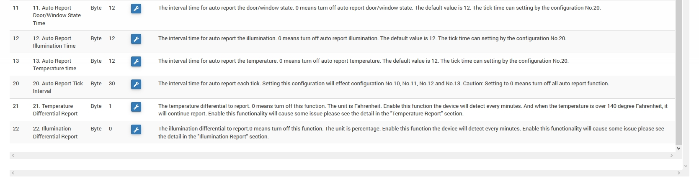

# D-Link DCH-Z110 - "3 in 1 Aperture"

**The module**

**The Jeedom visual**

## Summary

The DCH-Z110 detector offers 3 different functions : opening detection, temperature sensor and brightness detector. It consists of two parts : a detector and a magnet. They are designed to be placed on a door or window with the magnet fixed on the part that opens and the detector on the fixed part.

Opening the door or window will move the magnet away from the detector, which will trigger the detector which will send a Z-Wave alarm signal, if the system is armed (this signal can be operated by a siren or by a home automation box for example). The sensor can also be used for automatic lighting control, depending on the light level. For example, the sensor will send a signal to the Z-Wave switch to turn on the light when the door opens and the room is dark.

The detector will also raise the brightness and the temperature, either in the event of a significant change, and each time the opening/closing is detected. A Z-Wave controller (remote control, dongle…?) is necessary in order to integrate this detector into your network if you already have an existing network.

## Fonctions

-   3 in 1 detector: Aperture, temperature, light
-   Optimized antenna range
-   Use for home automation or security applications
-   Button to include/exclude the detector
-   Autoprotection
-   Low battery indication
-   Small, discreet and aesthetic
-   Ease of use and installation

## Technical characteristics

Site [official](http://www.dlink.com/-/media/Consumer_Products/DCH/DCH%20Z110/Datasheet/DCH_Z110_Datasheet_FR.pdf)

Other link [technical](http://www.kafkas.gr/uploads/Pdf/182732/DCH-Z120_183010381_01_Z02.PDF)

## Module data

-   Mark : D-Link
-   Model : DCH-Z110 mydlink™ Home Door and Window Sensor
-   Maker : FIBARO System
-   Manufacturer ID : 264 \[0x0108\]
-   Type Product : 2 \[0x0002\]
-   Product ID : 14 \[0x000e\]

## Configuration

To configure the OpenZwave plugin and know how to include Jeedom refer to this [documentation](https://doc.jeedom.com/en_US/plugins/automation%20protocol/openzwave/).

> **Important**
>
> Do not install the module on the window/door before setting it up correctly, and pay close attention to the alignment of the magnet when testing on a flat surface and during installation. (Use wedges if necessary) To put this module in inclusion mode, press the association button 3 times in 1.5 seconds, according to its documentation. (constant red flashing in pairing mode)

Once included you should get this :

### Commandes

Once the module is recognized, the commands associated with the module will be available.

Here is the list of commands :

-   Opening : this is the command that will report an opening detection
-   Temperature : this is the command that allows you to raise the temperature
-   Brightness : this is the command that allows you to increase the brightness
-   Sabotage : this is the sabotage command (it is triggered in the event of tearing)
-   Battery : this is the battery command

### Module configuration

> **Important**
>
> During a first inclusion, or a modification, save then always wake up the module by pressing the association button. It should flash red and change status.

Then it is necessary to configure the module according to your installation. To do this, you must go through the "Configuration" button of the OpenZwave plugin from Jeedom.

You will arrive on this page (after clicking on the Settings tab)

Parameter details :

-   2: adjusts the signal sent to the modules in association group 2
-   4: allows you to adjust the level of brightness from which the signal defined in parameter 2 will be sent to the modules associated with group 2
-   5: mode of operation (refer to the manufacturer's documentation)
-   6: multi-sensor operating mode (refer to the manufacturer's documentation). Recommended value : 7
-   7: personalized operating mode of the multi-sensor (refer to the manufacturer's documentation). Recommended value : 20 (to have the functional opening)
-   9: allows you to define after how long the OFF signal will be sent to the modules associated with group 2
-   10: allows you to define the duration between two battery reports (one unit = parameter 20)
-   11: allows you to define the duration between two auto opening ratios (one unit = parameter 20)
-   12: allows you to define the duration between two auto brightness ratios (one unit = parameter 20). Recommended value : 6
-   13: allows you to define the duration between two automatic temperature reports (one unit = parameter 20). Recommended value : 2
-   20: duration of an interval for parameters 10 to 13. Recommended value : 10
-   21: variation value in °F of temperature to trigger a report
-   22: value in % of brightness variation to trigger a report. Recommended value : 10

### Groupes

This module has two association groups, only the first is essential.

## Good to know

Possible association/notification with other modules (example: Siren DCH-Z510 chime notification on door/window opening)

## Wakeup

To wake up this module there is only one way to proceed :

-   Release the pairing button and press it again
-   Lower the wake-up interval in the module configuration/system (in seconds)

## FAQs.

This module wakes up by pressing its association button.

This module is a battery-powered module, the new configuration will be taken into account at the next wakeup. (association button to force it, hence the interest of not setting up the module before its correct configuration)

## Important note

> **Important**
>
> You have to wake up the module : after its inclusion, after a change of configuration, after a change of wakeup, after a change of association groups
