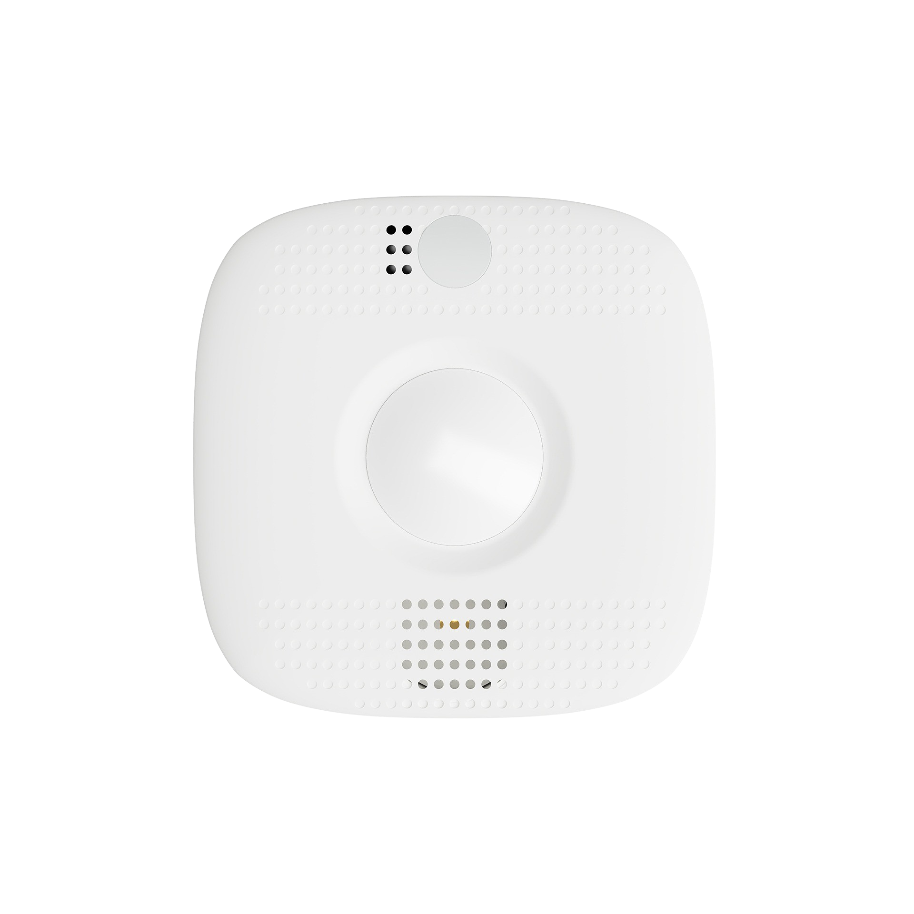

# Zwave equipment compatibility

# Aeotec

|Image|Marque|Nom|Type|Remarque|Lien|
|---|---|---|---|---|---|
||Aeotec|Range Extender (DSD37)|Repeater|Module without functionality except for relaying network information|[Buy](http://www.domadoo.fr/fr/peripheriques/2342-aeon-labs-repeteur-de-signal-z-wave-1220000012660.html)|
||Aeotec|Z-Stick Lite (DSA07203)|Controller|||
||Aeotec|Key Fob (DSA22)|Remote control|Replaced in shops by the Gen5 keyfob|[Documentation](https://doc.jeedom.com/en_US/zwave/aeotec.keyfob_-_Telecommande) [Buy](http://www.domadoo.fr/fr/peripheriques/2677-aeon-labs-telecommande-porte-cles-z-wave-plus-4-boutons-gen5.html)|
||Aeotec|Panic Button (DSA38)|Remote control||[Documentation](https://doc.jeedom.com/en_US/zwave/aeotec.panic_button_-_Telecommande) [Buy](http://www.domadoo.fr/fr/peripheriques/278-aeon-labs-telecommande-z-wave-porte-cles-1-bouton.html)|
||Aeotec|Minimote (DSA03202)|Remote control||[Documentation](https://doc.jeedom.com/en_US/zwave/aeotec.minimote_-_Telecommande) [Buy](http://www.domadoo.fr/fr/peripheriques/291-aeon-labs-telecommande-z-wave-blanche-1220000010253.html)|
||Aeotec|Key Fob Gen5 (ZW088)|Remote control||[Documentation](https://doc.jeedom.com/en_US/zwave/aeotec.keyfob_Gen5_-_Telecommande) [Buy](http://www.domadoo.fr/fr/peripheriques/2677-aeon-labs-telecommande-porte-cles-z-wave-plus-4-boutons-gen5.html)|
||Aeotec|Z-Stick Gen5 (ZW090)|Controller||[Buy](http://www.domadoo.fr/fr/peripheriques/2917-aeon-labs-controleur-usb-z-wave-plus-z-stick-gen5-1220000012813.html)|
||Aeotec|Z-Stick Lite Gen5 (ZW092)|Controller|||
||Aeotec|MultiSensor 6 (ZW100)|Multicapteurs||[Buy](http://www.domadoo.fr/fr/peripheriques/2921-aeon-labs-detecteur-multifonctions-6-en-1-multisensor-z-wave-plus-gen5-1220000013100.html)|
||Aeotec|Door / Window Sensor 6 (ZW112)|Ouverture||[Buy](http://www.domadoo.fr/fr/peripheriques/3579-aeon-labs-capteur-pour-porte-et-fenetre-z-wave-dw-sensor-6-1220000013162.html)|
||Aeotec|Door / Window Sensor Gen5 (ZW120)|Ouverture|||
||Aeotec|Water Sensor 6 (ZW122)|Fuite|||
||Aeotec|WallMote Duo (ZW129)|Remote control|||
||Aeotec|WallMote Quad (ZW130)|Remote control|||
||Aeotec|Z-Stick S2 (DSA02203)|Controller|||
||Aeotec|Home Energy Meter 2nd Edition (DSB28)|Consommation||[Buy](http://www.domadoo.fr/fr/peripheriques/281-aeon-labs-compteur-de-consommation-electrique-z-wave-3c-60a-version-g2-1220000011670.html)|
||Aeotec|Door / Window Sensor 2nd Edition (DSB29)|Ouverture||[Buy](http://www.domadoo.fr/fr/peripheriques/2340-aeon-labs-detecteur-d-ouverture-z-wave-g2-1220000011830.html)|
||Aeotec|Water Sensor (DSB45)|Fuite|Parameter 121 must be forced to 4113|[Buy](http://www.domadoo.fr/fr/peripheriques/3182-aeon-labs-capteur-d-eau-z-wave-1220000012486.html)|
||Aeotec|Door / Window Sensor (DSB04100)|Ouverture||[Buy](http://www.domadoo.fr/fr/peripheriques/2340-aeon-labs-detecteur-d-ouverture-z-wave-g2-1220000011830.html)|
||Aeotec|Recessed Door Sensor (DSB54)|Ouverture|||
||Aeotec|MultiSensor (DSB05) |Multicapteurs|Attention this module can raise bad data, it is necessary to pay attention to the configuration. Replaced in store by its Gen5 equivalent|[Buy](http://www.domadoo.fr/fr/peripheriques/2681-aeon-labs-detecteur-multifonction-multisensor-z-wave-plus-gen5-1220000012684.html)|
||Aeotec|MultiSensor Gen5 (ZW074)|Multicapteurs|Attention this module can raise bad data, it is necessary to pay attention to the configuration|[Buy](http://www.domadoo.fr/fr/peripheriques/2681-aeon-labs-detecteur-multifonction-multisensor-z-wave-plus-gen5-1220000012684.html)|
||Aeotec|Recessed Door Sensor Gen5 (ZW089)|Ouverture||[Buy](http://www.domadoo.fr/fr/peripheriques/2680-aeon-labs-capteur-d-ouverture-de-porte-a-encastrer-z-wave-plus-gen5-1220000012721.html)|
||Aeotec|Home Energy Meter Gen5 (ZW095)|Consommation|||
||Aeotec|Home Energy Meter Gen5 (ZW095)|Consommation|||
||Aeotec|Home Energy Meter Gen5 (ZW095)|Consommation|||
||Aeotec|Home Energy Meter Gen5 (ZW095)|Consommation|||
||Aeotec|Dry Contact Sensor Gen5 (ZW097)|Ouverture|||
||Aeotec|Home Energy Meter (DSB09104)|Consommation|Replaced by the Home Energy Meter 2G (DSB28)||
||Aeotec|Z-Stick Gen5 (ZW090)|Controller||[Buy](http://www.domadoo.fr/fr/peripheriques/2917-aeon-labs-controleur-usb-z-wave-plus-z-stick-gen5-1220000012813.html)|
||Aeotec|MultiSensor 6 (ZW100)|Multicapteurs||[Buy](http://www.domadoo.fr/fr/peripheriques/2921-aeon-labs-detecteur-multifonctions-6-en-1-multisensor-z-wave-plus-gen5-1220000013100.html)|
||Aeotec|Door / Window Sensor 6 (ZW112)|Ouverture||[Buy](http://www.domadoo.fr/fr/peripheriques/3579-aeon-labs-capteur-pour-porte-et-fenetre-z-wave-dw-sensor-6-1220000013162.html)|
||Aeotec|Door / Window Sensor Gen5 (ZW120)|Ouverture|||
||Aeotec|Water Sensor 6 (ZW122)|Fuite|||
||Aeotec|WallMote Duo (ZW129)|Remote control|Partially compatible: Works in direct association only ||
||Aeotec|WallMote Quad (ZW130)|Remote control|Partially compatible: Works in direct association only |[Buy](https://www.domadoo.fr/fr/peripheriques/3859-aeotec-interrupteur-sans-fil-wallmote-4-boutons-z-wave-1220000014503.html?domid=4&id_campaign=9)|
||Aeotec|Recessed Door Sensor Gen5 (ZW089)|Ouverture||[Buy](http://www.domadoo.fr/fr/peripheriques/2680-aeon-labs-capteur-d-ouverture-de-porte-a-encastrer-z-wave-plus-gen5-1220000012721.html)|
||Aeotec|Home Energy Meter Gen5 (ZW095)|Consommation|||
||Aeotec|Home Energy Meter Gen5 (ZW095)|Consommation|||
||Aeotec|Home Energy Meter Gen5 (ZW095)|Consommation|||
||Aeotec|Dry Contact Sensor Gen5 (ZW097)|Ouverture|||
||Aeotec|Nano Dimmer (ZW111)|Micromodule|||
||Aeotec|Nano Switch (ZW116)|Micromodule|||
||Aeotec|Led Strip (ZW121)|RGBW|||
||Aeotec|Dual Nano Switch (ZW132)|Micromodule|||
||Aeotec|Dual Nano Switch (ZW140)|Micromodule|||
||Aeotec|Garage Door Controller Gen5 (ZW062)|Porte||[Buy](http://www.domadoo.fr/fr/peripheriques/3403-aeon-labs-controleur-de-porte-de-garage-z-wave-gen5.html)|
||Aeotec|Smart Switch Gen5 (ZW075)|Prise||[Buy](http://www.domadoo.fr/fr/peripheriques/2594-aeon-labs-module-prise-commutateur-z-wave-plus-avec-mesure-d-energie-gen5-1220000012578.html)|
||Aeotec|Heavy Duty Smart Switch Gen5 (ZW078)|Prise||[Buy](http://www.domadoo.fr/fr/peripheriques/2593-aeon-labs-module-commutateur-forte-charge-40a-z-wave-plus-gen5-1220000012547.html)|
||Aeotec|Smart Switch 6 (ZW096)|Prise||[Buy](http://www.domadoo.fr/fr/peripheriques/2918-aeon-labs-mini-prise-commutateur-z-wave-plus-avec-consometre-smart-switch-6-1220000013049.html)|
||Aeotec|LED Bulb (ZW098)|Ampoule||[Buy](http://www.domadoo.fr/fr/peripheriques/2922-aeon-labs-ampoule-led-z-wave-plus-1220000012974.html)|
||Aeotec|Smart Dimmer 6 (ZW099)|Prise|||
||Aeotec|Range Extender (ZW117)|Repeater|Module without functionality except for relaying network information||
||Aeotec|Range Extender (DSD37)|Repeater|Module without functionality except for relaying network information|[Buy](http://www.domadoo.fr/fr/peripheriques/2342-aeon-labs-repeteur-de-signal-z-wave-1220000012660.html)|
||Aeotec|Siren Gen5 (ZW080)|Mermaid||[Buy](http://www.domadoo.fr/fr/peripheriques/2592-aeon-labs-sirene-z-wave-plus-sur-prise-electrique-gen5-1220000012592.html)|
||Aeotec|Heavy Duty Smart Switch (DSC10)|Prise|||
||Aeotec|Nano Dimmer (ZW111)|Micromodule|||
||Aeotec|Nano Switch (ZW116)|Micromodule|||
||Aeotec|Smart Strip (DSC11)|Multiprise|||
||Aeotec|Led Strip (ZW121)|RGBW|||
||Aeotec|Micro Smart Energy Switch (DSC12103)|Micromodule||[Buy](http://www.domadoo.fr/fr/peripheriques/286-aeon-labs-micromodule-commutateur-et-compteur-d-energie-g2-1220000011014.html)|
||Aeotec|Dual Nano Switch (ZW132)|Micromodule|||
||Aeotec|Nano Switch (ZW139)|Micromodule|||
||Aeotec|Micro Smart Energy Illuminator (DSC13103)|Micromodule||[Buy](http://www.domadoo.fr/fr/peripheriques/287-aeon-labs-micromodule-variateur-et-compteur-d-energie-g2-1220000011120.html)|
||Aeotec|Dual Nano Switch (ZW140)|Micromodule|||
||Aeotec|Nano Shutter ZW141|Volets||[Documentation](https://help.aeotec.com/support/solutions/articles/6000198854-nano-shutter-user-guide-) [Buy](https://www.domadoo.fr/fr/peripheriques/4622-aeotec-micromodule-volet-roulant-z-wave-nano-shutter-122000001603.html?domid=4&id_campaign=9)|
||Aeotec|Micro Motor Controller (DSC14104)|Volets||[Buy](http://www.domadoo.fr/fr/peripheriques/284-aeon-labs-micromodule-z-wave-pour-volet-roulant-1220000010864.html)|
||Aeotec|Micro Double Smart Switch (DSC17103)|Micromodule|Virtually no longer sold|[Buy](http://www.domadoo.fr/fr/peripheriques/285-aeon-labs-micromodule-commutateur-double-et-compteur-d-energie-1220000010949.html)|
||Aeotec|Micro Smart Switch 2nd Edition (DSC18103)|Micromodule||[Buy](http://www.domadoo.fr/fr/peripheriques/286-aeon-labs-micromodule-commutateur-et-compteur-d-energie-g2-1220000011014.html)|
||Aeotec|Micro Smart Dimmer 2nd Edition (DSC19103)|Micromodule||[Buy](http://www.domadoo.fr/fr/peripheriques/287-aeon-labs-micromodule-variateur-et-compteur-d-energie-g2-1220000011120.html)|
||Aeotec|Micro Switch 2nd Edition (DSC26103)|Micromodule|||
||Aeotec|Micro Dimmer (DSC27103)|Micromodule|||
||Aeotec|Garage Door Controller Gen5 (ZW062)|Porte||[Documentation](https://doc.jeedom.com/en_US/zwave/aeotec.zw062_garage_door_controller) [Buy](http://www.domadoo.fr/fr/peripheriques/3403-aeon-labs-controleur-de-porte-de-garage-z-wave-gen5.html)|
||Aeotec|Smart Energy Switch (DSC06106)|Prise||[Buy](http://www.domadoo.fr/fr/peripheriques/282-aeon-labs-smart-energy-switch-z-wave-1220000010369.html)|
||Aeotec|Smart Switch Gen5 (ZW075)|Prise||[Buy](http://www.domadoo.fr/fr/peripheriques/2594-aeon-labs-module-prise-commutateur-z-wave-plus-avec-mesure-d-energie-gen5-1220000012578.html)|
||Aeotec|Heavy Duty Smart Switch Gen5 (ZW078)|Prise||[Buy](http://www.domadoo.fr/fr/peripheriques/2593-aeon-labs-module-commutateur-forte-charge-40a-z-wave-plus-gen5-1220000012547.html)|
||Aeotec|Smart Energy Illuminator (DSC08101)|Prise||[Buy](http://www.domadoo.fr/fr/peripheriques/283-aeon-labs-smart-energy-illuminator-z-wave-1220000010499.html)|
||Aeotec|Smart Switch 6 (ZW096)|Prise||[Buy](http://www.domadoo.fr/fr/peripheriques/2918-aeon-labs-mini-prise-commutateur-z-wave-plus-avec-consometre-smart-switch-6-1220000013049.html)|
||Aeotec|LED Bulb (ZW098)|Ampoule||[Buy](http://www.domadoo.fr/fr/peripheriques/2922-aeon-labs-ampoule-led-z-wave-plus-1220000012974.html)|
||Aeotec|Smart Dimmer 6 (ZW099)|Prise|||
||Aeotec|Range Extender (ZW117)|Repeater|Module without functionality except for relaying network information||
||Aeotec|Range Extender (DSD37)|Repeater|Module without functionality except for relaying network information|[Buy](http://www.domadoo.fr/fr/peripheriques/2342-aeon-labs-repeteur-de-signal-z-wave-1220000012660.html)|
||Aeotec|Siren Gen5 (ZW080)|Mermaid||[Buy](http://www.domadoo.fr/fr/peripheriques/2592-aeon-labs-sirene-z-wave-plus-sur-prise-electrique-gen5-1220000012592.html)|
||Aeotec|Recessed Door Sensor Gen5 (ZW089)|Ouverture||[Buy](http://www.domadoo.fr/fr/peripheriques/2680-aeon-labs-capteur-d-ouverture-de-porte-a-encastrer-z-wave-plus-gen5-1220000012721.html)|
||Aeotec|Door / Window Sensor 7 (ZWA011)|Ouverture||[Documentation](https://help.aeotec.com/support/solutions/articles/6000230382-door-window-sensor-7-basic-user-guide-zwa011-) [Buy](https://www.domadoo.fr/fr/peripheriques/5775-aeotec-capteur-d-ouverture-portefenetre-z-wave-700-doorwindow-sensor-7-1220000016668.html?domid=4&id_campaign=9)|
||Aeotec|Door / Window Sensor 7 Pro (ZWA012)|Ouverture||[Documentation](https://help.aeotec.com/support/solutions/articles/6000230465-door-window-sensor-7-pro-user-guide-zwa012-) [Buy](https://www.domadoo.fr/fr/peripheriques/5514-aeotec-capteur-d-ouverture-portefenetre-z-wave-700-doorwindow-sensor-7-pro-1220000016682.html?domid=4&id_campaign=9)|
||Aeotec|Water Sensor 7 Pro (ZWA019)|Fuite||[Documentation](https://help.aeotec.com/support/solutions/articles/6000235950-water-sensor-7-pro-user-guide-zwa019-) [Buy](https://www.domadoo.fr/fr/peripheriques/5773-aeotec-capteur-d-inondation-z-wave-700-water-sensor-7-pro-1220000016729.html?domid=4&id_campaign=9)|
||Aeotec|Radiator Thermostat|Thermostat|||
||Aeotec|MultiSensor Gen7 (ZW024)|Sensor, Motion, Vibration, Temperature, Humidity, Brightness, UV||[Documentation](https://help.aeotec.com/helpdesk/attachments/6121529483) [Buy](https://www.domadoo.fr/fr/peripheriques/5825-aeotec-detecteur-multifonctions-6-en-1-multisensor-7-z-wave-700-1220000016873.html?domid=4&id_campaign=9)|
||Aeotec|NanoMote Quad (ZWA003)|Remote control||[Buy](https://www.domadoo.fr/fr/peripheriques/4618-aeotec-telecommande-4-boutons-z-wave-nanomote-quad-1220000016118.html?domid=4&id_campaign=9)|
||Aeotec|NanoMote One (ZWA004)|Remote control|||
||Aeotec|Trisensor (ZWA005)|Multicapteurs||[Buy](https://www.domadoo.fr/fr/peripheriques/4621-aeotec-detecteur-multifonctions-3-en-1-z-wave-trisensor-1220000016132.html?domid=4&id_campaign=9)|
||Aeotec|Door / Window Sensor 7 (ZWA008)|Ouverture|||
||Aeotec|aerQ Temperature & Humidity (ZWA009)|Multicapteurs||[Buy](https://www.domadoo.fr/fr/peripheriques/5397-aeotec-capteur-de-temperature-et-d-humidite-z-wave-700-aerq-1220000017054.html?domid=4&id_campaign=9)|
||Aeotec|Nano Shutter ZW141|Volets||[Documentation](https://help.aeotec.com/support/solutions/articles/6000198854-nano-shutter-user-guide-) [Buy](https://www.domadoo.fr/fr/peripheriques/4622-aeotec-micromodule-volet-roulant-z-wave-nano-shutter-122000001603.html?domid=4&id_campaign=9)|
||Aeotec|Doorbell 6 (ZW162)|Mermaid||[Buy](https://www.domadoo.fr/fr/peripheriques/4777-aeotec-sonnette-z-wave-doorbell-6-1220000015982.html?domid=4&id_campaign=9)|
||Aeotec|Siren 6 (ZW164)|Mermaid||[Documentation](https://help.aeotec.com/support/solutions/articles/6000202227-siren-6-user-guide-) [Buy](https://www.domadoo.fr/fr/peripheriques/4778-aeotec-sirene-interieure-z-wave-siren-6-1220000016224.html?domid=4&id_campaign=9)|
||Aeotec|Smart Switch 7 (ZW175)|Prise|||
||Aeotec|Smart Boost Timer Switch (ZWA006)|Prise|||
||Aeotec|LED Bulb 6 Multi-White (ZWA001)|Ampoule|||
||Aeotec|LED Bulb 6 Multi-Color (ZWA002)|Ampoule|||
||Aeotec|Range Extender (ZW189)|Repeater|Module without functionality except for relaying network information|[Documentation](https://help.aeotec.com/support/solutions/articles/6000226827-range-extender-7-user-guide-) [Buy](https://www.domadoo.fr/fr/peripheriques/5179-aeotec-repeteur-de-signal-z-wave-700-range-extender-7-1220000016583.html?domid=4&id_campaign=9)|

# Assa abloy

|Image|Marque|Nom|Type|Remarque|Lien|
|---|---|---|---|---|---|
||Assa abloy|Yale Touchscreen Lever (YRL220)|Serrure|Inclusion in secure mode||
||Assa abloy|Yale Touchscreen Deadbolt (YRD220)|Serrure|Inclusion in secure mode||
||Assa abloy|Yale Push Button Lever Lock (YRL210)|Serrure|Inclusion in secure mode||
||Assa abloy|Yale Push Button Deadbolt (YRD210)|Serrure|Inclusion in secure mode||
||Assa abloy|Yale Key Free Touchscreen Deadbolt (YRD240)|Serrure|Inclusion in secure mode||
||Assa abloy|Yale Keyless Connected Smart Lock (YSL)|Serrure|Inclusion in secure mode||
||Assa abloy|Yale Keyless Connected Smart Lock (YSL)|Serrure|Inclusion in secure mode||

# Benext

|Image|Marque|Nom|Type|Remarque|Lien|
|---|---|---|---|---|---|
||Benext|Built In Dimmer|Micromodule||[Buy](http://www.domadoo.fr/fr/peripheriques/2346-benext-module-variateur-z-wave-encastrable-avec-mesure-d-energie-0632181493762.html)|
||Benext|Panic Button|Remote control||[Buy](http://www.domadoo.fr/fr/peripheriques/2349-benext-telecommande-bouton-d-urgence-z-wave-0632181493731.html)|
||Benext|Panic Watch|Remote control||[Buy](http://www.domadoo.fr/fr/peripheriques/2350-benext-bracelet-bouton-d-urgence-z-wave-0632181493748.html)|
||Benext|Scene Controller 7 buttons|Remote control||[Buy](http://www.domadoo.fr/fr/peripheriques/2534-benext-telecommande-7-boutons-z-wave-scene-controller-0632181493786.html)|
||Benext|Plug In Dimmer|Prise||[Buy](http://www.domadoo.fr/fr/peripheriques/2347-benext-module-prise-variateur-z-wave-avec-mesure-d-energie-0632181493779.html)|
||Benext|MoLite Sensor|Multicapteurs|||
||Benext|MoLite Sensor|Multicapteurs|||
||Benext|Heating Control|Micromodule|||
||Benext|Heating Control|Micromodule|||
||Benext|Door Sensor|Ouverture|||
||Benext|Door Sensor|Ouverture|||
||Benext|Mini Keypad RFID|RFID keyboard|The badge used does not go back. This module is currently sold under the Zipato brand|[Buy](http://www.domadoo.fr/fr/peripheriques/2470-zipato-clavier-a-code-et-rfid-z-wave-3858890730579.html)|
||Benext|Mini Keypad RFID|RFID keyboard|The badge used does not go back. This module is currently sold under the Zipato brand|[Buy](http://www.domadoo.fr/fr/peripheriques/2470-zipato-clavier-a-code-et-rfid-z-wave-3858890730579.html)|

# Chromagic

|Image|Marque|Nom|Type|Remarque|Lien|
|---|---|---|---|---|---|
||Chromagic|HSP02|Multicapteurs|This module is currently sold under the brand Everspring|[Buy](http://www.domadoo.fr/fr/peripheriques/842-everspring-detecteur-de-mouvement-z-wave-hsp02-3700946500165.html)|
||Chromagic|HSM02|Ouverture|This module is currently sold under the brand Everspring|[Buy](http://www.domadoo.fr/fr/peripheriques/838-everspring-mini-detecteur-d-ouverture-z-wave-hsm02-3700946500134.html)|
||Chromagic|HSM02|Ouverture|This module is currently sold under the brand Everspring|[Buy](http://www.domadoo.fr/fr/peripheriques/838-everspring-mini-detecteur-d-ouverture-z-wave-hsm02-3700946500134.html)|

# Danfoss

|Image|Marque|Nom|Type|Remarque|Lien|
|---|---|---|---|---|---|
||Danfoss|RA Plus-W Radiator Thermostat|Thermostat|||
||Danfoss|Popp Radiator Thermostat|Thermostat||[Buy](http://www.domadoo.fr/fr/peripheriques/3683-popp-tete-thermostatique-sans-fil-z-wave-0019962010101.html)|
||Danfoss|RS Room Sensor|Thermostat||[Buy](http://www.domadoo.fr/fr/peripheriques/3069-danfoss-sonde-d-ambiance-z-wave-danfoss-link-rs.html)|
||Danfoss|RS Room Sensor|Thermostat||[Buy](http://www.domadoo.fr/fr/peripheriques/3069-danfoss-sonde-d-ambiance-z-wave-danfoss-link-rs.html)|
||Danfoss|Living Connect Radiator Thermostat|Thermostat|||
||Danfoss|Devolo Home Control Radiator Thermostat|Thermostat|||
||Danfoss|Living Connect Thermostat|Thermostat||[Buy](http://www.domadoo.fr/fr/peripheriques/2495-danfoss-tete-electronique-living-connect-z-wave-lc-13-5013567421497.html)|
||Danfoss|Living Connect Thermostat|Thermostat||[Buy](http://www.domadoo.fr/fr/peripheriques/2495-danfoss-tete-electronique-living-connect-z-wave-lc-13-5013567421497.html)|
||Danfoss|RS Room Sensor|Thermostat||[Buy](http://www.domadoo.fr/fr/peripheriques/3069-danfoss-sonde-d-ambiance-z-wave-danfoss-link-rs.html)|

# Devolo

|Image|Marque|Nom|Type|Remarque|Lien|
|---|---|---|---|---|---|
||Devolo|Metering Plug (MT02646)|Prise|||
||Devolo|Smart Metering Plug (MT02792)|Prise|||
||Devolo|Motion Sensor MT02647|Multicapteurs|||
||Devolo|Door / Window Contact MT02648|Ouverture|||
||Devolo|Flood Sensor MT02756|Multisensor|||
||Devolo|Flood Sensor MT02756|Fuite|||
||Devolo|Scene Switch MT 2652|Remote control|||
||Devolo|Keyfob (MT2653)|Remote control|||
||Devolo|Siren MT02758|Mermaid|||
||Devolo|Smoke Detector MT02651|Smoke|||

# Dlink

|Image|Marque|Nom|Type|Remarque|Lien|
|---|---|---|---|---|---|
||Dlink|DCH-Z120|Presence|||
||Dlink|DCH-Z110|Ouverture||[Documentation](https://doc.jeedom.com/en_US/zwave/dlink.dchz110_-_3en1_Ouverture) [Buy](http://www.domadoo.fr/fr/peripheriques/3692-d-link-capteur-de-portefenetre-z-wave-3-en-1-790069409844.html)|
||Dlink|DCH-Z510|Mermaid||[Buy](http://www.domadoo.fr/fr/peripheriques/3696-d-link-sirene-z-wave-6-sons-110-db--790069410758.html)|

# Dome

|Image|Marque|Nom|Type|Remarque|Lien|
|---|---|---|---|---|---|
||Dome|Motion Detector|Multicapteurs|||
||Dome|Leak Sensor|Fuite|||
||Dome|Mouser|Ouverture|||
||Dome|On / Off Plug-In Switch|Prise|||
||Dome|Siren|Mermaid|||
||Dome|Door / Window Sensor|Ouverture|||
||Dome|Water Shut-Off Valve|Valve|||
||Dome|Door / Window Sensor Pro|Ouverture|||

# Domitech

|Image|Marque|Nom|Type|Remarque|Lien|
|---|---|---|---|---|---|
||Domitech|Smart LED Retrofit Kit ZE27EU|Interrupteur||[Buy](http://www.domadoo.fr/fr/peripheriques/3226-domitech-ampoule-led-dimmable-z-wave-zbulb-869166000060.html)|

# Domux

|Image|Marque|Nom|Type|Remarque|Lien|
|---|---|---|---|---|---|
||Domux|Motion Sensor (DX1MS-Z)|Multicapteurs|||
||Domux|Smart Smoke Sensor (DX1SA-Z)|Smoke|||
||Domux|Gas Sensor (DX1CG-Z)|Gaz|No alerting to the controller. Sounds on detection of combustible gas||
||Domux|Flood Sensor (DX1WL-Z)|Fuite|||
||Domux|CO Sensor (DX1CA-Z)|CO|||
||Domux|Smart Metering Plug (DX2SK-Z)|Prise|||
||Domux|Temperature & Humidity Sensor (DX1HT-Z)|Multicapteurs|||
||Domux|Smart Plug (DX2SK-Z)|Prise|||
||Domux|Door Sensor (DX1DS-Z)|Ouverture|||

# Duwi

|Image|Marque|Nom|Type|Remarque|Lien|
|---|---|---|---|---|---|
||Duwi|ZW EDAN 300 Dimmer|Interrupteur|It is necessary to activate the polling to have a recovery of state|[Buy](http://www.domadoo.fr/fr/peripheriques/749-duwi-interrupteur-variateur-everlux-z-wave-4008297054337.html)|
||Duwi|ZW ZS 3500 Plugin Switch|Prise|It is necessary to activate the polling to have a recovery of state|[Buy](http://www.domadoo.fr/fr/peripheriques/752-duwi-module-prise-on-off-z-wave-pour-l-exterieur-4008297054382.html)|
||Duwi|ZW ESJ Duwi Blind Control|Volets||[Documentation](https://doc.jeedom.com/en_US/zwave/duwi.05436_-_Volets) |
||Duwi|Wireless remote control 10-channel|Remote control|Replaced by Z-WAVE.ME RC2|[Buy](http://www.domadoo.fr/fr/peripheriques/3075-z-waveme-telecommande-z-wave-10-canaux.html)|
||Duwi|Wireless Flush Mounted Switch (5443)|Remote control|||
||Duwi|DURO 2000 Dimmer 05458|Interrupteur||[Buy](http://www.domadoo.fr/fr/peripheriques/2307-z-waveme-interrupteur-variateur-z-wave-avance-finition-duro-2000-0019962003509.html)|
||Duwi|Duro 2000 dimmer switch|Interrupteur|It is necessary to activate the polling to have a recovery of state|[Buy](http://www.domadoo.fr/fr/peripheriques/758-duwi-interrupteur-variateur-duro-2000-z-wave-4008297054580.html)|
||Duwi|ZW_ES_1000 Wall Plug |Interrupteur|It is necessary to activate the polling to have a recovery of state|[Buy](http://www.domadoo.fr/fr/peripheriques/748-duwi-interrupteur-on-off-everlux-z-wave-4008297054313.html)|

# Ecolink

|Image|Marque|Nom|Type|Remarque|Lien|
|---|---|---|---|---|---|
||Ecolink|Door / Window Sensor|Ouverture|||

# Electronicsolutions

|Image|Marque|Nom|Type|Remarque|Lien|
|---|---|---|---|---|---|
||Electronicsolutions|DBMZ Motor Control|Volets|||

# Eurotronic

|Image|Marque|Nom|Type|Remarque|Lien|
|---|---|---|---|---|---|
||Eurotronic|Thermostatic valve Z-Wave StellaZ|Thermostat||[Buy](http://www.domadoo.fr/fr/peripheriques/2361-eurotronic-vanne-thermostatique-z-wave-stellaz.html)|
||Eurotronic|Z-Wave + Comet thermostatic valve|Thermostat||[Buy](http://www.domadoo.fr/fr/peripheriques/3228-eurotronic-vanne-thermostatique-z-wave-comet-4260012711011.html)|
||Eurotronic|Thermostatic valve Spiritz|Thermostat|||
||Eurotronic|Thermostatic valve Spiritz|Thermostat|||
||Eurotronic|Thermostatic valve Spiritz|Thermostat|||

# Everspring

|Image|Marque|Nom|Type|Remarque|Lien|
|---|---|---|---|---|---|
||Everspring|HSP02 Motion Detector|Multicapteurs||[Buy](http://www.domadoo.fr/fr/peripheriques/842-everspring-detecteur-de-mouvement-z-wave-hsp02-3700946500165.html)|
||Everspring|SP814 Motion Detector|Multicapteurs||[Buy](http://www.domadoo.fr/fr/peripheriques/857-everspring-detecteur-de-presence-z-wave-sp814-3700946500288.html)|
||Everspring|SP815|Mouvement|||
||Everspring|SP816 Motion Detector|Mouvement|||
||Everspring|SP817 Motion Detector|Multicapteurs|||
||Everspring|ST812|Fuite||[Buy](http://www.domadoo.fr/fr/peripheriques/860-everspring-detecteur-d-eau-z-wave-st-812-3700946500318.html)|
||Everspring|SE812|Mermaid||[Buy](http://www.domadoo.fr/fr/peripheriques/845-everspring-sirene-z-wave-se812-3700946500189.html)|
||Everspring|Indoor voice Siren SE813|Mermaid|||
||Everspring|SF812|Smoke||[Buy](http://www.domadoo.fr/fr/peripheriques/848-everspring-detecteur-de-fumee-z-wave-sf812-3700946500219.html)|
||Everspring|HAC01|Ouverture||[Buy](http://www.domadoo.fr/fr/peripheriques/837-everspring-micromodule-emetteur-z-wave-hac01-3700946500110.html)|
||Everspring|HAN01|Micromodule||[Buy](http://www.domadoo.fr/fr/peripheriques/2497-everspring-micromodule-commutateur-z-wave-han01-3700946500042.html)|
||Everspring|HAN02|Micromodule|||
||Everspring|EH403|Movement, Light|||
||Everspring|HSM02|Ouverture||[Buy](http://www.domadoo.fr/fr/peripheriques/838-everspring-mini-detecteur-d-ouverture-z-wave-hsm02-3700946500134.html)|
||Everspring|SM103|Ouverture||[Buy](http://www.domadoo.fr/fr/peripheriques/851-everspring-capteur-d-ouverture-z-wave-sm103-3700946500233.html)|
||Everspring|SM810|Ouverture|||
||Everspring|SP103|Mouvement||[Buy](http://www.domadoo.fr/fr/peripheriques/854-everspring-detecteur-de-mouvement-pir-z-wave-sp-103-3700946500257.html)|
||Everspring|AN145|Douille||[Buy](http://www.domadoo.fr/fr/peripheriques/829-everspring-module-douille-e27-z-wave-3700946500059.html)|
||Everspring|AD142-6|Prise||[Buy](http://www.domadoo.fr/fr/peripheriques/825-everspring-module-lampe-z-wave-french-3700946500035.html)|
||Everspring|Miniplug Dimmer|Prise||[Documentation](https://doc.jeedom.com/en_US/zwave/everspring.AD147-6_-_Miniplug_Dimmer) [Buy](http://www.domadoo.fr/fr/peripheriques/2687-everspring-mini-prise-variateur-z-wave-plus-ad147-6-prise-francaise-3700946500370.html)|
||Everspring|AN157-6|Prise||[Buy](http://www.domadoo.fr/fr/peripheriques/831-everspring-module-prise-on-off-z-wave-an157-6-french-3700946500080.html)|
||Everspring|AN158|Prise||[Buy](http://www.domadoo.fr/fr/peripheriques/835-everspring-module-prise-on-off-z-wave-mesure-d-energie-an158-2-ger-3700946500097.html)|
||Everspring|Miniplug On / Off|Prise||[Buy](http://www.domadoo.fr/fr/peripheriques/2684-everspring-mini-prise-onoff-z-wave-plus-an180-6-prise-francaise-3700946500400.html)|
||Everspring|HSM02|Ouverture||[Buy](http://www.domadoo.fr/fr/peripheriques/838-everspring-mini-detecteur-d-ouverture-z-wave-hsm02-3700946500134.html)|
||Everspring|SM103|Ouverture||[Buy](http://www.domadoo.fr/fr/peripheriques/851-everspring-capteur-d-ouverture-z-wave-sm103-3700946500233.html)|
||Everspring|ST814|Temperature, Humidity||[Buy](http://www.domadoo.fr/fr/peripheriques/861-everspring-capteur-de-temperature-et-d-humidite-z-wave-st814-3700946500325.html)|
||Everspring|ST815|Luminosité||[Buy](http://www.domadoo.fr/fr/peripheriques/2498-everspring-capteur-de-luminosite-z-wave-avec-ecran-lcd-st815-3700946500349.html)|
||Everspring|TSE03 Door Bell|Carillon|||

# Evolve

|Image|Marque|Nom|Type|Remarque|Lien|
|---|---|---|---|---|---|
||Evolve|LSM-15|Micromodule|||

# Fakro

|Image|Marque|Nom|Type|Remarque|Lien|
|---|---|---|---|---|---|
||Fakro|||||
||Fakro|ARZ Roof Window Roller Shutter|Volets|||
||Fakro|ZWS230 Chain actuator 230VAC|Volets|Requires inclusion in secure mode|[Buy](http://www.domadoo.fr/fr/peripheriques/2362-fakro-moteur-pour-fenetre-de-toit-z-wave-zws230-5900988500378.html)|
||Fakro|ZWS12 Chain actuator 12VDC|Volets|Requires inclusion in secure mode||
||Fakro|ZWS230 Chain actuator 230VAC|Volets|Requires inclusion in secure mode|[Buy](http://www.domadoo.fr/fr/peripheriques/2362-fakro-moteur-pour-fenetre-de-toit-z-wave-zws230-5900988500378.html)|

# Fibaro

|Image|Marque|Nom|Type|Remarque|Lien|
|---|---|---|---|---|---|
||Fibaro|Single charge switch micromodule|Relais|Module replaced by the FGS-212|[Buy](http://www.domadoo.fr/fr/peripheriques/2862-fibaro-micromodule-commutateur-z-wave-fgs-212-5902020528272.html)|
||Fibaro|Single charge switch micromodule|Relais|Module replaced by the FGS-212|[Buy](http://www.domadoo.fr/fr/peripheriques/2862-fibaro-micromodule-commutateur-z-wave-fgs-212-5902020528272.html)|
||Fibaro|FGS-211 Single Charge|Micromodule|Module replaced by the FGS-212|[Buy](http://www.domadoo.fr/fr/peripheriques/2862-fibaro-micromodule-commutateur-z-wave-fgs-212-5902020528272.html)|
||Fibaro|FGS-211 Single Charge|Micromodule|Module replaced by the FGS-212|[Buy](http://www.domadoo.fr/fr/peripheriques/2862-fibaro-micromodule-commutateur-z-wave-fgs-212-5902020528272.html)|
||Fibaro|FGS-211 Single Charge|Micromodule|Module replaced by the FGS-212|[Buy](http://www.domadoo.fr/fr/peripheriques/2862-fibaro-micromodule-commutateur-z-wave-fgs-212-5902020528272.html)|
||Fibaro|FGS-211 Single Charge|Micromodule|Module replaced by the FGS-212|[Buy](http://www.domadoo.fr/fr/peripheriques/2862-fibaro-micromodule-commutateur-z-wave-fgs-212-5902020528272.html)|
||Fibaro|FGS-211 Single Charge|Micromodule|Module replaced by the FGS-212|[Buy](http://www.domadoo.fr/fr/peripheriques/2862-fibaro-micromodule-commutateur-z-wave-fgs-212-5902020528272.html)|
||Fibaro|FGS-212 Single Charge|Micromodule|Replaces FGS-211|[Buy](http://www.domadoo.fr/fr/peripheriques/2862-fibaro-micromodule-commutateur-z-wave-fgs-212-5902020528272.html)|
||Fibaro|FGS-212 Single Charge|Micromodule|Replaces FGS-211|[Buy](http://www.domadoo.fr/fr/peripheriques/2862-fibaro-micromodule-commutateur-z-wave-fgs-212-5902020528272.html)|
||Fibaro|FGS-213 Switch|Micromodule|Scene notifications are not sent back, they require CC Central Scene support|[Buy](http://www.domadoo.fr/fr/peripheriques/3727-fibaro-micromodule-commutateur-z-wave-fgs-213-5902020528722.html)|
||Fibaro|FGS-213 Switch|Micromodule||[Buy](http://www.domadoo.fr/fr/peripheriques/3727-fibaro-micromodule-commutateur-z-wave-fgs-213-5902020528722.html)|
||Fibaro|FGS-214 Single Charge|Micromodule|Replaces the FGS-212|[Buy](https://www.domadoo.fr/fr/peripheriques/5180-fibaro-micromodule-commutateur-z-wave-fibaro-smart-module-fgs-214-5902701702083.html?domid=4&id_campaign=9)|
||Fibaro|FGBS-001 Universal Relay|Micromodule||[Buy](http://www.domadoo.fr/fr/peripheriques/916-fibaro-detecteur-universel-z-wave-fgbs-001-5902020528074.html)|
||Fibaro|FGBS-001 Universal Relay|Micromodule||[Buy](http://www.domadoo.fr/fr/peripheriques/916-fibaro-detecteur-universel-z-wave-fgbs-001-5902020528074.html)|
||Fibaro|FGBS-001 Universal Relay|Micromodule||[Buy](http://www.domadoo.fr/fr/peripheriques/916-fibaro-detecteur-universel-z-wave-fgbs-001-5902020528074.html)|
||Fibaro|FGBS-001 Universal Relay|Micromodule||[Buy](http://www.domadoo.fr/fr/peripheriques/916-fibaro-detecteur-universel-z-wave-fgbs-001-5902020528074.html)|
||Fibaro|FGBS-001 Universal Relay|Micromodule||[Buy](http://www.domadoo.fr/fr/peripheriques/916-fibaro-detecteur-universel-z-wave-fgbs-001-5902020528074.html)|
||Fibaro|FGBS-222 Smart Implant|Micromodule||[Buy](https://www.domadoo.fr/fr/peripheriques/4793-fibaro-detecteur-universel-z-wave-fibaro-smart-implant-fgbs-222-5902701701475.html?domid=4&id_campaign=9)|
||Fibaro|FGWPE / FGWPF Wall Plug|Prise||[Documentation](https://doc.jeedom.com/en_US/zwave/fibaro.fgwpe101_-_Wall_Plug) [Buy](http://www.domadoo.fr/fr/peripheriques/2934-fibaro-module-prise-commutateur-z-wave-avec-mesure-d-energie-fgwpf-102-schuko-5902020528302.html)|
||Fibaro|FGWPE / FGWPF Wall Plug Gen5|Prise||[Buy](http://www.domadoo.fr/fr/peripheriques/3909-fibaro-module-prise-commutateur-et-consometre-z-wave-fibaro-wall-plug-fgwpf-102-zw5-schuko-5902020528647.html)|
||Fibaro|FGWPE / FGWPF Wall Plug Gen5|Prise||[Buy](http://www.domadoo.fr/fr/peripheriques/3909-fibaro-module-prise-commutateur-et-consometre-z-wave-fibaro-wall-plug-fgwpf-102-zw5-schuko-5902020528647.html)|
||Fibaro|FGK-101 Door Sensor|Ouverture||[Documentation](https://doc.jeedom.com/en_US/zwave/fibaro.fgk101_-_Ouverture) [Buy](http://www.domadoo.fr/fr/peripheriques/922-fibaro-detecteur-d-ouverture-z-wave-avec-entree-contact-sec-blanc-5902020528111.html)|
||Fibaro|FGK-101 Door Sensor|Ouverture||[Documentation](https://doc.jeedom.com/en_US/zwave/fibaro.fgk101_-_Ouverture) [Buy](http://www.domadoo.fr/fr/peripheriques/922-fibaro-detecteur-d-ouverture-z-wave-avec-entree-contact-sec-blanc-5902020528111.html)|
||Fibaro|FGK-101 ZW5 Door Sensor|Ouverture||[Buy](http://www.domadoo.fr/fr/peripheriques/3608-fibaro-detecteur-d-ouverture-z-wave-avec-entree-contact-sec-blanc-5902020528364.html)|
||Fibaro|FGK-101 ZW5 Door Sensor|Ouverture||[Buy](http://www.domadoo.fr/fr/peripheriques/3608-fibaro-detecteur-d-ouverture-z-wave-avec-entree-contact-sec-blanc-5902020528364.html)|
||Fibaro|FGK-101 ZW5 Door Sensor|Ouverture||[Buy](http://www.domadoo.fr/fr/peripheriques/3608-fibaro-detecteur-d-ouverture-z-wave-avec-entree-contact-sec-blanc-5902020528364.html)|
||Fibaro|FGDW-002 Door Sensor 2|Ouverture||[Buy](http://www.domadoo.fr/fr/peripheriques/4105-fibaro-detecteur-d-ouverture-z-wave-doorwindow-sensor-2-blanc-5902701700348.html)|
||Fibaro|FGMS-001 Motion Sensor|Multicapteurs|By default has a very economical configuration. Read the documentation to configure it correctly|[Documentation](https://doc.jeedom.com/en_US/zwave/fibaro.fgms001_-_Motion) [Buy](http://www.domadoo.fr/fr/peripheriques/2535-fibaro-detecteur-de-mouvement-multifonctions-z-wave-fgms-001-5902020528258.html)|
||Fibaro|FGMS-001 Motion Sensor|Multicapteurs|By default has a very economical configuration. Read the documentation to configure it correctly|[Documentation](https://doc.jeedom.com/en_US/zwave/fibaro.fgms001_-_Motion) [Buy](http://www.domadoo.fr/fr/peripheriques/2535-fibaro-detecteur-de-mouvement-multifonctions-z-wave-fgms-001-5902020528258.html)|
||Fibaro|FGMS-001-ZW5 Motion Sensor ZWave +|Multicapteurs|By default has a very economical configuration. Read the documentation to configure it correctly. Make associations with jeedom for groups 1, 4 and 5|[Documentation](https://doc.jeedom.com/en_US/zwave/fibaro.fgms001ZW5_-_Motion) [Buy](http://www.domadoo.fr/fr/peripheriques/3422-fibaro-detecteur-de-mouvement-multifonctions-z-wave-fgms-001-5902020528579.html)|
||Fibaro|FGMS-001 Motion Sensor|Multicapteurs|By default has a very economical configuration. Read the documentation to configure it correctly|[Documentation](https://doc.jeedom.com/en_US/zwave/fibaro.fgms001_-_Motion) [Buy](http://www.domadoo.fr/fr/peripheriques/2535-fibaro-detecteur-de-mouvement-multifonctions-z-wave-fgms-001-5902020528258.html)|
||Fibaro|FGMS-001-ZW5 Motion Sensor ZWave +|Multicapteurs|By default has a very economical configuration. Read the documentation to configure it correctly. Make associations with jeedom for groups 1, 4 and 5|[Documentation](https://doc.jeedom.com/en_US/zwave/fibaro.fgms001ZW5_-_Motion) [Buy](http://www.domadoo.fr/fr/peripheriques/3422-fibaro-detecteur-de-mouvement-multifonctions-z-wave-fgms-001-5902020528579.html)|
||Fibaro|FGMS-001 Motion Sensor|Multicapteurs|By default has a very economical configuration. Read the documentation to configure it correctly|[Documentation](https://doc.jeedom.com/en_US/zwave/fibaro.fgms001ZW5_-_Motion) [Buy](http://www.domadoo.fr/fr/peripheriques/2535-fibaro-detecteur-de-mouvement-multifonctions-z-wave-fgms-001-5902020528258.html)|
||Fibaro|FGMS-001-ZW5 Motion Sensor ZWave +|Multicapteurs|By default has a very economical configuration. Read the documentation to configure it correctly. Make associations with jeedom for groups 1, 4 and 5|[Documentation](https://doc.jeedom.com/en_US/zwave/fibaro.fgms001ZW5_-_Motion) [Buy](http://www.domadoo.fr/fr/peripheriques/3422-fibaro-detecteur-de-mouvement-multifonctions-z-wave-fgms-001-5902020528579.html)|
||Fibaro|FGRGB-101 RGBW 25.25|RGBW|Can also be used as multi-probe sensors|[Documentation](https://doc.jeedom.com/en_US/zwave/fibaro.fgrgb101_-_RGVBControler) [Buy](http://www.domadoo.fr/fr/peripheriques/2367-fibaro-controleur-rgbw-z-wave-fgrgb-101-5902020528159.html)|
||Fibaro|FGRGB-101 RGBW|RGBW|Can also be used as multi-probe sensors|[Documentation](https://doc.jeedom.com/en_US/zwave/fibaro.fgrgb101_-_RGVBControler) [Buy](http://www.domadoo.fr/fr/peripheriques/2367-fibaro-controleur-rgbw-z-wave-fgrgb-101-5902020528159.html)|
||Fibaro|FGRGB-101 RGBW 25.25|RGBW|Can also be used as multi-probe sensors|[Documentation](https://doc.jeedom.com/en_US/zwave/fibaro.fgrgb101_-_RGVBControler) [Buy](http://www.domadoo.fr/fr/peripheriques/2367-fibaro-controleur-rgbw-z-wave-fgrgb-101-5902020528159.html)|
||Fibaro|FGRGB-101 RGBW|RGBW|Can also be used as multi-probe sensors|[Documentation](https://doc.jeedom.com/en_US/zwave/fibaro.fgrgb101_-_RGVBControler) [Buy](http://www.domadoo.fr/fr/peripheriques/2367-fibaro-controleur-rgbw-z-wave-fgrgb-101-5902020528159.html)|
||Fibaro|FGRGB-101 RGBW|RGBW|Can also be used as multi-probe sensors|[Documentation](https://doc.jeedom.com/en_US/zwave/fibaro.fgrgb101_-_RGVBControler) [Buy](http://www.domadoo.fr/fr/peripheriques/2367-fibaro-controleur-rgbw-z-wave-fgrgb-101-5902020528159.html)|
||Fibaro|RGBW-442|RGBW|Can also be used as multi-probe sensors|[Buy](https://www.domadoo.fr/fr/peripheriques/4969-fibaro-controleur-rgbw-z-wave-fibaro-rgbw-controller-2-5902701701581.html?domid=4&id_campaign=9)|
||Fibaro|FGD-211 Dimmer|Micromodule|This module is replaced in stores by the FGD-212|[Documentation](https://doc.jeedom.com/en_US/zwave/fibaro.fgd211_-_Dimmer) [Buy](http://www.domadoo.fr/fr/peripheriques/2965-fibaro-micromodule-variateur-z-wave-fgd-212.html)|
||Fibaro|FGD-211 Dimmer|Micromodule|This module is replaced in stores by the FGD-212|[Documentation](https://doc.jeedom.com/en_US/zwave/fibaro.fgd211_-_Dimmer) [Buy](http://www.domadoo.fr/fr/peripheriques/2965-fibaro-micromodule-variateur-z-wave-fgd-212.html)|
||Fibaro|FGD-211 Dimmer|Micromodule|This module is replaced in stores by the FGD-212|[Documentation](https://doc.jeedom.com/en_US/zwave/fibaro.fgd211_-_Dimmer) [Buy](http://www.domadoo.fr/fr/peripheriques/2965-fibaro-micromodule-variateur-z-wave-fgd-212.html)|
||Fibaro|FGD-211 Dimmer|Micromodule|This module is replaced in stores by the FGD-212|[Documentation](https://doc.jeedom.com/en_US/zwave/fibaro.fgd211_-_Dimmer) [Buy](http://www.domadoo.fr/fr/peripheriques/2965-fibaro-micromodule-variateur-z-wave-fgd-212.html)|
||Fibaro|FGD-211 Dimmer|Micromodule|This module is replaced in stores by the FGD-212|[Documentation](https://doc.jeedom.com/en_US/zwave/fibaro.fgd211_-_Dimmer) [Buy](http://www.domadoo.fr/fr/peripheriques/2965-fibaro-micromodule-variateur-z-wave-fgd-212.html)|
||Fibaro|FGD-211 Dimmer|Micromodule|This module is replaced in stores by the FGD-212|[Documentation](https://doc.jeedom.com/en_US/zwave/fibaro.fgd211_-_Dimmer) [Buy](http://www.domadoo.fr/fr/peripheriques/2965-fibaro-micromodule-variateur-z-wave-fgd-212.html)|
||Fibaro|FGD-212 Dimmer 2|Micromodule|Replaces FGD-211|[Documentation](https://doc.jeedom.com/en_US/zwave/fibaro.fgd212_-_Dimmer2) [Buy](http://www.domadoo.fr/fr/peripheriques/2965-fibaro-micromodule-variateur-z-wave-fgd-212.html)|
||Fibaro|FGD-212 Dimmer 2|Micromodule, Drive|Replaces FGD-211|[Documentation](https://doc.jeedom.com/en_US/zwave/fibaro.fgd212_-_Dimmer2) [Buy](https://www.domadoo.fr/fr/peripheriques/2965-fibaro-micromodule-variateur-z-wave-fgd-212-5902020528524.html?domid=4&id_campaign=9)|
||Fibaro|FGD-212 Dimmer 2|Micromodule|Replaces FGD-211|[Documentation](https://doc.jeedom.com/en_US/zwave/fibaro.fgd212_-_Dimmer2) [Buy](http://www.domadoo.fr/fr/peripheriques/2965-fibaro-micromodule-variateur-z-wave-fgd-212.html)|
||Fibaro|FGFS-101 Flood Sensor|Fuite||[Documentation](https://doc.jeedom.com/en_US/zwave/fibaro.fgfs101_-_FloodSensors) [Buy](http://www.domadoo.fr/fr/peripheriques/2365-fibaro-detecteur-d-inondation-z-wave-fgfs-101-5902020528142.html)|
||Fibaro|FGFS-101 Flood Sensor|Fuite||[Documentation](https://doc.jeedom.com/en_US/zwave/fibaro.fgfs101_-_FloodSensors) [Buy](http://www.domadoo.fr/fr/peripheriques/2365-fibaro-detecteur-d-inondation-z-wave-fgfs-101-5902020528142.html)|
||Fibaro|FGFS-101 Flood Sensor|Fuite||[Documentation](https://doc.jeedom.com/en_US/zwave/fibaro.fgfs101_-_FloodSensors) [Buy](http://www.domadoo.fr/fr/peripheriques/2365-fibaro-detecteur-d-inondation-z-wave-fgfs-101-5902020528142.html)|
||Fibaro|FGFS-101 ZW5 Flood Sensor|Fuite||[Buy](http://www.domadoo.fr/fr/peripheriques/3582-fibaro-detecteur-d-inondation-z-wave-fgfs-101-5902020528357.html)|
||Fibaro|FGFS-101 ZW5 Flood Sensor|Fuite||[Buy](http://www.domadoo.fr/fr/peripheriques/3582-fibaro-detecteur-d-inondation-z-wave-fgfs-101-5902020528357.html)|
||Fibaro|FGFS-101 ZW5 Flood Sensor|Fuite||[Buy](http://www.domadoo.fr/fr/peripheriques/3582-fibaro-detecteur-d-inondation-z-wave-fgfs-101-5902020528357.html)|
||Fibaro|FGSS-001 Smoke Sensor|Smoke|Replaced by its equivalent to the standards FGSD-002|[Buy](http://www.domadoo.fr/fr/peripheriques/2751-fibaro-detecteur-de-fumee-z-wave-plus-fgsd-002-5902020528265.html)|
||Fibaro|FGSD-002 Smoke Sensor CE|Smoke||[Documentation](https://doc.jeedom.com/en_US/zwave/fibaro.fgsd102_-_Fumees) [Buy](http://www.domadoo.fr/fr/peripheriques/2751-fibaro-detecteur-de-fumee-z-wave-plus-fgsd-002-5902020528265.html)|
||Fibaro|FGSD-002 Smoke Sensor CE|Smoke||[Buy](http://www.domadoo.fr/fr/peripheriques/2751-fibaro-detecteur-de-fumee-z-wave-plus-fgsd-002-5902020528265.html)|
||Fibaro|FGGC-001 Swipe|Gesture controller||[Buy](http://www.domadoo.fr/fr/peripheriques/3423-fibaro-controleur-gestuel-z-wave-swipe-blanc-fggc-001-5902020528821.html)|
||Fibaro|FGGC-001 Swipe|Gesture controller||[Buy](http://www.domadoo.fr/fr/peripheriques/3423-fibaro-controleur-gestuel-z-wave-swipe-blanc-fggc-001-5902020528821.html)|
||Fibaro|FGPB101 Button|Controller|Partially compatible: Works in direct association only|[Buy](http://www.domadoo.fr/fr/peripheriques/3701-fibaro-bouton-de-commande-the-button-z-wave-blanc--5902020528968.html)|
||Fibaro|FGPB101 Button|Controller||[Buy](http://www.domadoo.fr/fr/peripheriques/3701-fibaro-bouton-de-commande-the-button-z-wave-blanc--5902020528968.html)|
||Fibaro|FGKF-601 Keyfob|Remote control|Remote control in non-functional scene mode, however works in combination with other modules|[Buy](http://www.domadoo.fr/fr/peripheriques/3994-fibaro-telecommande-porte-cles-z-wave-fibaro-keyfob-fgkf-601-5905279987562.html)|
||Fibaro|FGKF-601 Keyfob|Remote control||[Buy](http://www.domadoo.fr/fr/peripheriques/3994-fibaro-telecommande-porte-cles-z-wave-fibaro-keyfob-fgkf-601-5905279987562.html)|
||Fibaro|FGCD-001 CO Sensor|Smoke||[Buy](https://www.domadoo.fr/fr/peripheriques/4185-fibaro-detecteur-de-monoxyde-de-carbone-z-wave-fibaro-co-sensor-5902020528838.html?domid=4&id_campaign=9)|
||Fibaro|FGCD-001 CO Sensor|Smoke||[Buy](https://www.domadoo.fr/fr/peripheriques/4185-fibaro-detecteur-de-monoxyde-de-carbone-z-wave-fibaro-co-sensor-5902020528838.html?domid=4&id_campaign=9)|
||Fibaro|FGT-001 HEAT CONTROLLER|Thermostat||[Buy](https://www.domadoo.fr/fr/peripheriques/4279-fibaro-tete-thermostatique-z-wave-fibaro-heat-controller-5902701701062.html?domid=4&id_campaign=9)|
||Fibaro|FGT-001 HEAT CONTROLLER|Thermostat||[Documentation](https://manuals.fibaro.com/heat-controller/) [Buy](https://www.domadoo.fr/fr/peripheriques/4279-fibaro-tete-thermostatique-z-wave-fibaro-heat-controller-5902701701062.html?domid=4&id_campaign=9)|
||Fibaro|FGS-221 Double load|Micromodule|This module is replaced in stores by the FGS-222|[Buy](http://www.domadoo.fr/fr/peripheriques/2863-fibaro-micromodule-commutateur-double-z-wave-fgs-222-5902020528289.html)|
||Fibaro|FGS-221 Double load|Micromodule|This module is replaced in stores by the FGS-222|[Buy](http://www.domadoo.fr/fr/peripheriques/2863-fibaro-micromodule-commutateur-double-z-wave-fgs-222-5902020528289.html)|
||Fibaro|FGS-221 Double load|Micromodule|This module is replaced in stores by the FGS-222|[Buy](http://www.domadoo.fr/fr/peripheriques/2863-fibaro-micromodule-commutateur-double-z-wave-fgs-222-5902020528289.html)|
||Fibaro|FGS-221 Double load|Micromodule|This module is replaced in stores by the FGS-222|[Buy](http://www.domadoo.fr/fr/peripheriques/2863-fibaro-micromodule-commutateur-double-z-wave-fgs-222-5902020528289.html)|
||Fibaro|FGS-221 Double load|Micromodule|This module is replaced in stores by the FGS-222|[Buy](http://www.domadoo.fr/fr/peripheriques/2863-fibaro-micromodule-commutateur-double-z-wave-fgs-222-5902020528289.html)|
||Fibaro|FGS-221 Double load|Micromodule|This module is replaced in stores by the FGS-222|[Buy](http://www.domadoo.fr/fr/peripheriques/2863-fibaro-micromodule-commutateur-double-z-wave-fgs-222-5902020528289.html)|
||Fibaro|FGS-221 Double load|Micromodule|This module is replaced in stores by the FGS-222|[Buy](http://www.domadoo.fr/fr/peripheriques/2863-fibaro-micromodule-commutateur-double-z-wave-fgs-222-5902020528289.html)|
||Fibaro|FGS-221 Double load|Micromodule|This module is replaced in stores by the FGS-222|[Buy](http://www.domadoo.fr/fr/peripheriques/2863-fibaro-micromodule-commutateur-double-z-wave-fgs-222-5902020528289.html)|
||Fibaro|FGS-221 Double load|Micromodule|This module is replaced in stores by the FGS-222|[Buy](http://www.domadoo.fr/fr/peripheriques/2863-fibaro-micromodule-commutateur-double-z-wave-fgs-222-5902020528289.html)|
||Fibaro|FGS-221 Double load|Micromodule|This module is replaced in stores by the FGS-222|[Buy](http://www.domadoo.fr/fr/peripheriques/2863-fibaro-micromodule-commutateur-double-z-wave-fgs-222-5902020528289.html)|
||Fibaro|FGS-221 Double load|Micromodule|This module is replaced in stores by the FGS-222|[Buy](http://www.domadoo.fr/fr/peripheriques/2863-fibaro-micromodule-commutateur-double-z-wave-fgs-222-5902020528289.html)|
||Fibaro|FGS-221 Double load|Micromodule|This module is replaced in stores by the FGS-222|[Buy](http://www.domadoo.fr/fr/peripheriques/2863-fibaro-micromodule-commutateur-double-z-wave-fgs-222-5902020528289.html)|
||Fibaro|FGS-221 Double load|Micromodule|This module is replaced in stores by the FGS-222|[Buy](http://www.domadoo.fr/fr/peripheriques/2863-fibaro-micromodule-commutateur-double-z-wave-fgs-222-5902020528289.html)|
||Fibaro|FGS-222 Double charge|Micromodule|Replaces the FGS-221|[Buy](http://www.domadoo.fr/fr/peripheriques/2863-fibaro-micromodule-commutateur-double-z-wave-fgs-222-5902020528289.html)|
||Fibaro|FGS-223 Double load|Micromodule|Manual refresh is required on instance 1 (Switch S2) for power recovery and S2 status. Scene notifications are not sent back, they require CC Central Scene support.|[Buy](http://www.domadoo.fr/fr/peripheriques/3728-fibaro-micromodule-commutateur-double-z-wave-fgs-223-5902020528661.html)|
||Fibaro|FGS-224 Double charge|Micromodule, Contactor||[Documentation](https://manuals.fibaro.com/smart-module/) [Buy](https://www.domadoo.fr/fr/peripheriques/5189-fibaro-micromodule-commutateur-libre-de-potentiel-double-z-wave-fibaro-smart-module-fgs-224-5902701702090.html?domid=4&id_campaign=9)|
||Fibaro|FGWPGE UK Wall Plug Gen5|Prise|||
||Fibaro|Walli Switch FGWDSEU-221|Micromodule||[Buy](https://www.domadoo.fr/fr/peripheriques/4848-fibaro-interrupteur-intelligent-z-wave-fibaro-walli-switch-5902701701352.html?domid=4&id_campaign=9)|
||Fibaro|Walli Switch FGWDSEU-221|Micromodule||[Buy](https://www.domadoo.fr/fr/peripheriques/4848-fibaro-interrupteur-intelligent-z-wave-fibaro-walli-switch-5902701701352.html?domid=4&id_campaign=9)|
||Fibaro|Walli dimmer|Micromodule||[Buy](https://www.domadoo.fr/fr/peripheriques/4849-fibaro-interrupteur-variateur-intelligent-z-wave-fibaro-walli-dimmer-5902701701369.html?domid=4&id_campaign=9)|
||Fibaro|Walli Roller shutter|Volets||[Buy](https://www.domadoo.fr/fr/peripheriques/4850-fibaro-interrupteur-intelligent-pour-volet-roulant-z-wave-fibaro-walli-roller-shutter-5902701701376.html?domid=4&id_campaign=9)|
||Fibaro|FGRM-221 Roller shutter|Volets|Module equivalent to FGRM-222|[Buy](http://www.domadoo.fr/fr/peripheriques/2604-fibaro-micromodule-pour-volet-roulant-z-wave-fgrm-222-5902020528227.html)|
||Fibaro|FGRM-221 Roller shutter|Volets|Module equivalent to FGRM-222|[Buy](http://www.domadoo.fr/fr/peripheriques/2604-fibaro-micromodule-pour-volet-roulant-z-wave-fgrm-222-5902020528227.html)|
||Fibaro|FGRM-221 Roller shutter|Volets|Module equivalent to FGRM-222|[Buy](http://www.domadoo.fr/fr/peripheriques/2604-fibaro-micromodule-pour-volet-roulant-z-wave-fgrm-222-5902020528227.html)|
||Fibaro|FGRM-221 Roller shutter|Volets|Module equivalent to FGRM-222|[Buy](http://www.domadoo.fr/fr/peripheriques/2604-fibaro-micromodule-pour-volet-roulant-z-wave-fgrm-222-5902020528227.html)|
||Fibaro|FGRM-221 Roller shutter|Volets|Module equivalent to FGRM-222|[Buy](http://www.domadoo.fr/fr/peripheriques/2604-fibaro-micromodule-pour-volet-roulant-z-wave-fgrm-222-5902020528227.html)|
||Fibaro|FGRM-222 Roller shutter|Volets|New name of the FGRM-221 module|[Documentation](https://doc.jeedom.com/en_US/zwave/fibaro.fgrm222_-_Volets) [Buy](http://www.domadoo.fr/fr/peripheriques/2604-fibaro-micromodule-pour-volet-roulant-z-wave-fgrm-222-5902020528227.html)|
||Fibaro|FGR-222 Roller shutter|Volets|New name of the FGR-221 module|[Documentation](https://doc.jeedom.com/en_US/zwave/fibaro.fgr222_-_Volets) [Buy](http://www.domadoo.fr/fr/peripheriques/3250-fibaro-micromodule-pour-volet-roulant-z-wave-fgr-222.html)|
||Fibaro|FGR-223 Roller shutter|Volets|New name of the FGR-222 module|[Buy](https://www.domadoo.fr/fr/peripheriques/4737-fibaro-micromodule-pour-volet-roulant-z-wave-fibaro-roller-shutter-3-fgr-223-5905279987197.html?domid=4&id_campaign=9)|
||Fibaro|FGWOF-011 Walli Outlet Type F|Prise||[Buy](https://www.domadoo.fr/fr/peripheriques/4852-fibaro-prise-murale-intelligente-z-wave-fibaro-walli-outlet-type-f-schuko-5902701701345.html?domid=4&id_campaign=9)|
||Fibaro|Walli Controller|Controller, Remote control||[Documentation](https://manuals.fibaro.com/walli-controller/) [Buy](https://www.domadoo.fr/fr/peripheriques/5534-fibaro-interrupteur-mural-sans-fil-z-wave-700-fibaro-walli-controller-5902701702076.html)|

# Firstalert

|Image|Marque|Nom|Type|Remarque|Lien|
|---|---|---|---|---|---|
||Firstalert|ZCombo Smoke and Carbon Monoxide Detector|Smoke|||

# Fortrezz

|Image|Marque|Nom|Type|Remarque|Lien|
|---|---|---|---|---|---|
||Fortrezz|MIMOlite|Compteur||[Buy](http://www.domadoo.fr/fr/peripheriques/2380-fortrezz-module-entree-sortie-z-wave-mimolite-0661799563291.html)|
||Fortrezz|MIMOlite|Compteur||[Buy](http://www.domadoo.fr/fr/peripheriques/2380-fortrezz-module-entree-sortie-z-wave-mimolite-0661799563291.html)|
||Fortrezz|MIMOlite|Compteur||[Buy](http://www.domadoo.fr/fr/peripheriques/2380-fortrezz-module-entree-sortie-z-wave-mimolite-0661799563291.html)|
||Fortrezz|Automated Water Shut-Off Valve (WV-01)|Valve||[Buy](http://www.domadoo.fr/fr/peripheriques/2957-fortrezz-vanne-d-arret-d-eau-34-z-wave-661799486057.html)|
||Fortrezz|SSA-01|Mermaid||[Buy](http://www.domadoo.fr/fr/peripheriques/979-fortrezz-sirene-z-wave-flash-clair-ssa1-0661799486033.html)|
||Fortrezz|SSA-02|Mermaid||[Buy](http://www.domadoo.fr/fr/peripheriques/980-fortrezz-sirene-z-wave-flash-rouge-ssa2-0661799486026.html)|
||Fortrezz|SSA-02|Mermaid||[Buy](http://www.domadoo.fr/fr/peripheriques/980-fortrezz-sirene-z-wave-flash-rouge-ssa2-0661799486026.html)|
||Fortrezz|SSA-02|Mermaid||[Buy](http://www.domadoo.fr/fr/peripheriques/980-fortrezz-sirene-z-wave-flash-rouge-ssa2-0661799486026.html)|
||Fortrezz|SSA-03|Mermaid||[Buy](http://www.domadoo.fr/fr/peripheriques/978-fortrezz-sirene-exterieure-ip54-z-wave-flash-ssa-03-0661799563277.html)|
||Fortrezz|SSA-03|Mermaid||[Buy](http://www.domadoo.fr/fr/peripheriques/978-fortrezz-sirene-exterieure-ip54-z-wave-flash-ssa-03-0661799563277.html)|

# Ge

|Image|Marque|Nom|Type|Remarque|Lien|
|---|---|---|---|---|---|
||Ge|12724 3 Way Dimmer|Micromodule|||
||Ge|12730 Smart Fan Control|Micromodule|||
||Ge|12344 In-Wall Smart Dimmer|Micromodule|||
||Ge|12722 On / Off Relay Switch|Micromodule|||

# Gig

|Image|Marque|Nom|Type|Remarque|Lien|
|---|---|---|---|---|---|
||Gig|CT101 Iris thermostat|Thermostat|||

# Gr-smarthome

|Image|Marque|Nom|Type|Remarque|Lien|
|---|---|---|---|---|---|
||Gr-smarthome|1/4 turn valve (GR-105N)|Vanne|||
||GR-Smarthome|Z-Wave Auto Valve 7G plus2|Vanne||[Documentation](https://www.domadoo.fr/fr/index.php?controller=attachment&id_attachment=2355) [Buy](https://www.domadoo.fr/fr/peripheriques/5238-gr-smarthome-motorisation-z-wave-700-pour-vanne-14-de-tour.html)|
||Gr-smarthome|1/4 turn valve (GR-105)|Vanne||[Buy](http://www.domadoo.fr/fr/peripheriques/2958-gr-smarthome-motorisation-z-wave-pour-vanne-14-de-tour.html)|

# Greenwave

|Image|Marque|Nom|Type|Remarque|Lien|
|---|---|---|---|---|---|
||Greenwave|Powernode 1|Prise||[Documentation](https://doc.jeedom.com/en_US/zwave/greenwave.Powernode1_-_Prise) [Buy](http://www.domadoo.fr/fr/peripheriques/2857-greenwave-module-prise-z-wave-powernode-schuko-8886464000235.html)|
||Greenwave|Powernode 6 sockets|Multiprise|Read the documentation for the automatic reporting of consumption|[Documentation](https://doc.jeedom.com/en_US/zwave/greenwave.powernode_-_Multiprise) [Buy](http://www.domadoo.fr/fr/peripheriques/2728-greenwave-multiprise-z-wave-6-ports-powernode-schuko--8886464000242.html)|

# Hank

|Image|Marque|Nom|Type|Remarque|Lien|
|---|---|---|---|---|---|
||Hank|Smart Plug (HKZW-SO05)|Prise|||
||Hank|Smart Plug (HKZW-SO08)|Prise|||
||Hank|Bulb|Ampoule|System tab, modify Color Channels with the value 31 to have consistent color ratios||
||Hank|Smart Plug (HKZW-SO01)|Prise|||
||Hank|Scene Controller 4|Portable controller|||
||Hank|Motion Sensor (HKZW-MS02)|Multicapteurs|||
||Hank|MultiSensor (HKZW-MS01)|Multicapteurs|||
||Hank|Door / Window Sensor (HKZW-DWS01)|Ouverture|||
||Hank|Scene Controller 1|Portable controller|||
||Hank|Scene Controller 1|Portable controller|||

# Heiman

|Image|Marque|Nom|Type|Remarque|Lien|
|---|---|---|---|---|---|
||Heiman|Motion Sensor (HS1MS-Z)|Multicapteurs|||
||Heiman|Smart Smoke Sensor (HS1SA-Z)|Smoke|||
||Heiman|Gas Sensor (HS1CG-Z)|Gaz|No alerting to the controller. Sounds on detection of combustible gas|[Buy](https://www.domadoo.fr/fr/peripheriques/4818-heiman-capteur-de-gaz-z-wave-6971348970062.html?domid=4&id_campaign=9)|
||Heiman|Flood Sensor (HS1WL-Z)|Fuite|||
||Heiman|CO Sensor (HS1CA-Z)|CO|||
||Heiman|Smart Metering Plug (HS2SK-Z)|Prise|||
||Heiman|Temperature & Humidity Sensor (HS1HT-Z)|Multicapteurs|||
||Heiman|Smart Plug (HS2SK-Z)|Prise|||
||Heiman|Door Sensor (HS1DS-Z)|Ouverture|||

# Heltun

|Image|Marque|Nom|Type|Remarque|Lien|
|---|---|---|---|---|---|
||Heltun|Heltun HEZWTHERM-FL2|Chauffage|||
||Heltun|Heltun Switvher 5 Channel|Interrupteur|||
||Heltun|High Load Switch|Contactor, Thermostat||[Documentation](https://drive.google.com/file/d/1Am29EvTZOPLXEh_xq3K-5kcFl_-4VKS3/view) [Buy](https://www.domadoo.fr/fr/actionneurs-variateurs/5114-heltun-module-commutateur-forte-charge-16a-z-wave-700.html)|
||Heltun|Heating Thermostat|Thermostat||[Documentation](https://drive.google.com/file/d/1WUElb_KCbdrdZg-SMSv9YnDyrg_aDNtH/view) [Buy](https://www.domadoo.fr/fr/chauffage-clim/5183-heltun-thermostat-z-wave-700-pour-chauffage-electrique.html)|
||Heltun|Fan Coil Thermostat|Thermostat||[Documentation](https://drive.google.com/file/d/1a0yey6o1lbBcZTCmXG5zaz4wr4iaToFt/view) [Buy](https://www.domadoo.fr/fr/chauffage-clim/5182-heltun-thermostat-z-wave-700-pour-ventilo-convecteur.html)|
||Heltun|Touch Panel Switch Quinto|Interrupteur||[Documentation](https://drive.google.com/file/d/1Vv7bCqYxsPWuRoi5jUWCIYMwQkMD0Yuh/view) [Buy](https://www.domadoo.fr/fr/interrupteurs/5184-heltun-interrupteur-tactile-z-wave-700-quinto-5-boutons.html)|
||Heltun|Touch Panel Switch Solo|Interrupteur||[Documentation](https://drive.google.com/file/d/1d0Q-FSZy3W0Qem59g_XpIkFB41OT8Erw/view) [Buy](https://www.domadoo.fr/fr/interrupteurs/5109-heltun-interrupteur-tactile-z-wave-700-solo-1-bouton.html)|
||Heltun|Relay Switch Quinto|Contactor, Thermostat||[Documentation](https://drive.google.com/file/d/1DVLXZMvv2cpf6QF-breB7TwtrOlCOd8z/view) [Buy](https://www.domadoo.fr/fr/eclairage/5119-heltun-module-commutateur-quinto-5-canaux-z-wave-700.html)|

# Homeseer

|Image|Marque|Nom|Type|Remarque|Lien|
|---|---|---|---|---|---|
||Homeseer|EZMotion 3in1|Multicapteurs|||
||Homeseer|EZMotion + 3in1|Multicapteurs|||

# Horstmann

|Image|Marque|Nom|Type|Remarque|Lien|
|---|---|---|---|---|---|
||Horstmann|HRT4-ZW Transmitter|Thermostat|Module sold under the brand name Secure SRT321|[Buy](http://www.domadoo.fr/fr/peripheriques/1982-secure-thermostat-srt321-avec-ecran-lcd-z-wave-5015914250071.html)|
||Horstmann|SRT 323 Electronic Room Thermostat and Temperature|Thermostat|Module sold under the Secure SRT323 brand|[Documentation](https://doc.jeedom.com/en_US/zwave/secure.srt323_-_Thermostat) [Buy](http://www.domadoo.fr/fr/peripheriques/3218-secure-thermostat-srt323-avec-ecran-lcd-et-relai-integre-5015914250569.html)|
||Horstmann|SES 302 Temperature Sensor|Temperature|Module sold under the Secure brand|[Documentation](https://doc.jeedom.com/en_US/zwave/secure.ses302_-_Temperature) [Buy](http://www.domadoo.fr/fr/peripheriques/3211-secure-sonde-de-temperature-sur-piles-z-wave-5015914840081.html)|
||Horstmann|SES 303 Temperature and Humidity Sensor|Multicapteurs|Module sold under the Secure brand|[Documentation](https://doc.jeedom.com/en_US/zwave/secure.ses303_-_Temperature_Humidite) [Buy](http://www.domadoo.fr/fr/peripheriques/3227-secure-sonde-de-temperature-et-d-humidite-sur-piles-z-wave-5015914840098.html)|
||Horstmann|SIR 321 RF Countdown Timer|Timer|No schedule management, no status reporting|[Documentation](https://doc.jeedom.com/en_US/zwave/secure.sir321_-_Timer) [Buy](http://www.domadoo.fr/fr/peripheriques/3216-secure-minuterie-manuelle-3060120-minutes-z-wave-5015914083563.html)|
||Horstmann|SIR 321 RF Countdown Timer|Timer||[Documentation](https://doc.jeedom.com/en_US/zwave/secure.sir321_-_Timer) [Buy](http://www.domadoo.fr/fr/peripheriques/3216-secure-minuterie-manuelle-3060120-minutes-z-wave-5015914083563.html)|
||Horstmann|SSR303 ASR-ZW Receiver|Thermostat|Module sold under the Secure brand|[Buy](http://www.domadoo.fr/fr/peripheriques/1987-secure-actionneur-de-chaudiere-ssr303-z-wave-5015914250095.html)|
||Horstmann|SCS317, 7 Day Programmable Room Thermostat|Thermostat|Module sold under the Secure brand|[Buy](http://www.domadoo.fr/fr/peripheriques/2419-secure-thermostat-electronique-programmable-z-wave-scs317-5015914370083.html)|

# Idinio

|Image|Marque|Nom|Type|Remarque|Lien|
|---|---|---|---|---|---|
||Idinio|Idinio foot Dimmer|dimmer||[Buy](https://www.domadoo.fr/fr/peripheriques/5742-idinio-variateur-sur-pied-z-wave-pour-led-noir-blanc-8720246201314.html?domid=4&id_campaign=9)|

# Inovelli

|Image|Marque|Nom|Type|Remarque|Lien|
|---|---|---|---|---|---|
||Inovelli|||||
||Inovelli|||||

# Kaipule

|Image|Marque|Nom|Type|Remarque|Lien|
|---|---|---|---|---|---|
||Kaipule|IM20 Magnetic Contact|Ouverture||[Buy](http://www.domadoo.fr/fr/peripheriques/3871-kaipule-detecteur-d-ouverture-portefenetre-z-wave.html)|
||Kaipule|PIR celing sensor|Presence|||

# Kwikset

|Image|Marque|Nom|Type|Remarque|Lien|
|---|---|---|---|---|---|
||Kwikset|Electronic Deadbolt Smartcode|Serrure|||

# Linear

|Image|Marque|Nom|Type|Remarque|Lien|
|---|---|---|---|---|---|
||Linear|Dimmable LED Light Bulb (LB60Z-1)|Ampoule|||

# Logicsoft

|Image|Marque|Nom|Type|Remarque|Lien|
|---|---|---|---|---|---|
||Heatit|Z-Din 616|Rail-Din||[Documentation](https://media.heatit.com/1756) [Buy](https://www.domadoo.fr/fr/chauffage-clim/5201-heatit-controls-module-6-relais-contact-sec-rail-din-z-wave-z-din-616-7071236014324.html)|

# Mco

|Image|Marque|Nom|Type|Remarque|Lien|
|---|---|---|---|---|---|
||Mco|MH-S311 Simple|Interrupteur|Equivalent to MH-S411|[Buy](http://www.domadoo.fr/fr/peripheriques/2888-mcohome-interrupteur-tactile-en-verre-z-wave-1-charge-blanc-2015032300123.html)|
||Mco|MH-S312 Double|Interrupteur|Equivalent to MH-S412|[Buy](http://www.domadoo.fr/fr/peripheriques/2889-mcohome-interrupteur-tactile-en-verre-z-wave-2-charges-blanc.html)|
||Mco|MH-S314 Four-load|Interrupteur|||
||Mco|MH-S314 Four-load GEN5|Interrupteur|||
||Mco|MH-S314 Four-load GEN5|Interrupteur|||
||Mco|MH-S411 Simple|Interrupteur||[Buy](http://www.domadoo.fr/fr/peripheriques/2888-mcohome-interrupteur-tactile-en-verre-z-wave-1-charge-blanc-2015032300123.html)|
||Mco|MH-S412 Double|Interrupteur||[Documentation](https://doc.jeedom.com/en_US/zwave/mco.MH-S412_Double_-_Interrupteur) [Buy](http://www.domadoo.fr/fr/peripheriques/2889-mcohome-interrupteur-tactile-en-verre-z-wave-2-charges-blanc.html)|
||Mco|MH-S411 Simple|Interrupteur||[Buy](http://www.domadoo.fr/fr/peripheriques/2888-mcohome-interrupteur-tactile-en-verre-z-wave-1-charge-blanc-2015032300123.html)|
||Mco|MH-S312 Double|Interrupteur|Equivalent to MH-S412|[Buy](http://www.domadoo.fr/fr/peripheriques/2889-mcohome-interrupteur-tactile-en-verre-z-wave-2-charges-blanc.html)|
||Mco|MH7H-WH / EH thermostat|Thermostat|||
||Mco|MH7H-WH / EH thermostat|Thermostat|||
||Mco|MH7H-WH / EH thermostat|Thermostat|||
||Mco|MH7H-WH / EH thermostat|Thermostat|||
||Mco|MH8-FC-EU thermostat|Thermostat||[Buy](http://www.domadoo.fr/fr/peripheriques/3735-mcohome-thermostat-pour-ventilo-convecteur-a-2-tubes-z-wave-mh8-fc-4251295700212.html)|
||Mco|MH8-FC-EU thermostat|Thermostat||[Buy](http://www.domadoo.fr/fr/peripheriques/3735-mcohome-thermostat-pour-ventilo-convecteur-a-2-tubes-z-wave-mh8-fc-4251295700212.html)|
||Mco|MH8-FC4-EU thermostat|Thermostat||[Buy](http://www.domadoo.fr/fr/peripheriques/3736-mcohome-thermostat-pour-ventilo-convecteur-a-2-tubes-z-wave-mh8-fc-4251295700205.html)|
||Mco|MH8-FC-EU thermostat|Thermostat||[Buy](http://www.domadoo.fr/fr/peripheriques/3735-mcohome-thermostat-pour-ventilo-convecteur-a-2-tubes-z-wave-mh8-fc-4251295700212.html)|
||Mco|CO2 Monitor (MH9-CO2-WD)|Multicapteurs||[Buy](http://www.domadoo.fr/fr/peripheriques/3734-mcohome-capteur-d-humidite-temperature-et-co2-avec-ecran-z-wave-mh9-co2-4251295700229.html)|
||Mco|CO2 Monitor (MH9-CO2-WD)|Multicapteurs||[Buy](http://www.domadoo.fr/fr/peripheriques/3734-mcohome-capteur-d-humidite-temperature-et-co2-avec-ecran-z-wave-mh9-co2-4251295700229.html)|
||Mco|MH-P210 Mini Energy Dimmer|Micromodule|Sold under the brand name Zipato|[Buy](http://www.domadoo.fr/fr/peripheriques/3577-zipato-mini-micromodule-variateur-z-wave-3858890732733.html)|

# Neocoolcam

|Image|Marque|Nom|Type|Remarque|Lien|
|---|---|---|---|---|---|
||Neocoolcam|PIR Sensor|Multicapteurs|||
||Neocoolcam|Siren Alarm NAS-AB01Z|Mermaid|||
||Neocoolcam|Door Sensor|Ouverture|||
||Neocoolcam|PIR Sensor|Multicapteurs|||
||Neocoolcam|Flood Sensor|Fuite|||
||Neocoolcam|Smart Power Plug NAS-WR01ZE|Prise|||
||Neocoolcam|Siren Alarm NAS-AB01Z|Mermaid|||
||Neocoolcam|PIR Sensor|Multicapteurs|||
||Neocoolcam|Smart Power Plug NAS-WR01ZE|Prise|||
||Neocoolcam|Curtain Switch NAS-SC03ZE|Volets|||

# Nodon

|Image|Marque|Nom|Type|Remarque|Lien|
|---|---|---|---|---|---|
||Nodon|Smartplug|Prise||[Documentation](https://doc.jeedom.com/en_US/zwave/nodon.smartplug_-_Prise) [Buy](http://www.domadoo.fr/fr/peripheriques/2892-nodon-prise-intelligente-z-wave-type-schuko-3700313920206.html)|
||Nodon|MicroSmartplug|Prise|||
||Nodon|Octan Remote|Remote control||[Documentation](https://doc.jeedom.com/en_US/zwave/nodon.octan_-_Remote_-_Telecommande) [Buy](http://www.domadoo.fr/fr/peripheriques/2939-nodon-octan-telecommande-murale-z-wave-3700313920282.html)|
||Nodon|Soft Remote|Remote control||[Documentation](https://doc.jeedom.com/en_US/zwave/nodon.Soft_-_Remote_-_Telecommande) [Buy](http://www.domadoo.fr/fr/peripheriques/2979-nodon-soft-remote-z-wave-plus-wasabi-3700313920336.html)|
||Nodon|Wall switch|Interrupteur||[Documentation](https://doc.jeedom.com/en_US/zwave/nodon.wall_-_Switch_-_Interrupteur) [Buy](http://www.domadoo.fr/fr/peripheriques/2995-nodon-interrupteur-mural-z-wave-plus-cozi-white-3700313920268.html)|

# Northq

|Image|Marque|Nom|Type|Remarque|Lien|
|---|---|---|---|---|---|
||Northq|Power Reader|Compteur|Activate the manual refresh at 5 minutes on the Energy value to have the reports|[Buy](http://www.domadoo.fr/fr/peripheriques/1538-northq-compteur-optique-de-consommation-z-wave-adaptateur-ac-dc-5707162002242.html)|
||Northq|Power Reader|Compteur|Activate the manual refresh at 5 minutes on the Energy value to have the reports|[Buy](http://www.domadoo.fr/fr/peripheriques/1537-northq-compteur-optique-de-consommation-z-wave.html)|
||Northq|NQ-9121 Gas Meter|Compteur|Activate the manual refresh at 5 minutes on the Gas value to have the reports|[Buy](http://www.domadoo.fr/fr/peripheriques/1539-northq-compteur-optique-de-consommation-de-gaz-z-wave.html)|

# Oomi

|Image|Marque|Nom|Type|Remarque|Lien|
|---|---|---|---|---|---|
||Oomi|WallMote Quad (ZW130)|Remote control|||

# Philio

|Image|Marque|Nom|Type|Remarque|Lien|
|---|---|---|---|---|---|
||Philio|PAN03 Switch Module with meter 3 KW X1|Micromodule|Also sold under the Zipato brand|[Buy](http://www.domadoo.fr/fr/peripheriques/2959-zipato-micromodule-commutateur-z-wave-avec-mesure-d-energie-3858890733242.html)|
||Philio|PAN04 In Wall Switch Module with meter 2X1.5KW|Micromodule|Also sold under the Zipato brand|[Buy](http://www.domadoo.fr/fr/peripheriques/2610-zipato-micromodule-commutateur-double-z-wave-avec-mesure-d-energie-3858890730821.html)|
||Philio|PAN08-1 In Wall Roller Shutter Controller|Volets|||
||Philio|PAN04 In Wall Switch Module with meter 2X1.5KW|Micromodule|Also sold under the Zipato brand|[Buy](http://www.domadoo.fr/fr/peripheriques/2610-zipato-micromodule-commutateur-double-z-wave-avec-mesure-d-energie-3858890730821.html)|
||Philio|PAN06 In Wall Switch Module 2X1.5KW|Micromodule||[Buy](http://www.domadoo.fr/fr/peripheriques/2482-philio-micromodule-commutateur-double-z-wave-4713698570019.html)|
||Philio|PAN08-1 In Wall Roller Shutter Controller|Volets|||
||Philio|PST02-A 4in1 Multi-Sensor|Multicapteurs|Also sold under the Zipato brand|[Documentation](https://doc.jeedom.com/en_US/zwave/philio.pst02a_-_4_en_1) [Buy](http://www.domadoo.fr/fr/peripheriques/2608-zipato-detecteur-z-wave-4-en-1-mouvement-ouverture-luminosite-tem-3858890730425.html)|
||Philio|PST02-B PIR / Motion 3in1 Sensor|Multicapteurs|Also sold under the Zipato brand|[Documentation](https://doc.jeedom.com/en_US/zwave/philio.psp01_-_Multicapteurs) [Buy](http://www.domadoo.fr/fr/peripheriques/3067-philio-detecteur-z-wave-3-en-1-mouvement-luminosite-temperature-4713698570170.html)|
||Philio|PST02-C Door / Window 3in1 sensor|Multicapteurs|Also sold under the Zipato brand|[Documentation](https://doc.jeedom.com/en_US/zwave/philio.pst02c_-_3_en_1_Ouverture) [Buy](http://www.domadoo.fr/fr/peripheriques/2606-zipato-detecteur-z-wave-3-en-1-ouverture-luminosite-temperature-3858890730371.html)|
||Philio|PSP01 / PSM02|Multicapteurs|Also sold under the Zipato brand|[Buy](http://www.domadoo.fr/fr/peripheriques/2608-zipato-detecteur-z-wave-4-en-1-mouvement-ouverture-luminosite-tem-3858890730425.html)|
||Philio|PH-PSG01 Smoke Sensor|Smoke||[Buy](http://www.domadoo.fr/fr/peripheriques/3149-zipato-capteur-de-fumee-z-wave--3858890733051.html)|
||Philio|PAT02-C Flood Sensor|Multicapteurs|Also sold under the Zipato brand|[Buy](http://www.domadoo.fr/fr/peripheriques/3152-zipato-detecteur-d-inondation-3-en-1-z-wave-plus-3858890733112.html)|
||Philio|PAT02-B 2in1 Multi Sensor|Multicapteurs|The first humidity value may take some time to rise. Also sold under the Zipato brand|[Buy](https://www.domadoo.fr/fr/peripheriques/3826-philio-capteur-de-temperature-et-d-humidite-z-wave-4713698571467.html?domid=4&id_campaign=9)|
||Philio|PSP05 B, C & D version|Multicapteurs||[Buy](http://www.domadoo.fr/fr/peripheriques/4108-philio-detecteur-de-mouvement-exterieur-z-wave-4713698573508.html)|
||Philio|PH-PSE02 Z-Wave + siren|Mermaid||[Buy](http://www.domadoo.fr/fr/peripheriques/2960-zipato-sirene-d-interieur-z-wave-3858890733310.html)|
||Philio|Smart Dimmer E27|Douille|||
||Philio|Smart Dimmer E27|Douille|||
||Philio|Energy Meter Micromodule (PH-PAB01)|Consommation|Sold under the Zipato pot|[Buy](http://www.domadoo.fr/fr/peripheriques/3576-zipato-micromodule-compteur-d-energie-z-wave-3858890732689.html)|
||Philio|PSR04 Smart Color Button|Interrupteur||[Documentation](https://doc.jeedom.com/en_US/zwave/philio.psr04_-_Smart_Color_Button) [Buy](http://www.domadoo.fr/fr/peripheriques/3207-philio-interrupteurtelecommande-mural-z-wave-4713698571542.html)|

# Polycontrol

|Image|Marque|Nom|Type|Remarque|Lien|
|---|---|---|---|---|---|
||Polycontrol|Polylock|Serrure|Inclusion in secure mode|[Documentation](https://doc.jeedom.com/en_US/zwave/polycontrol.polylock_-_Serrure) [Buy](http://www.domadoo.fr/fr/peripheriques/1752-poly-control-serrure-motorisee-poly-lock-z-wave.html)|
||Polycontrol|Danalock|Serrure|Inclusion in secure mode||
||Polycontrol|Danalock V2 BTZE|Serrure|Inclusion in secure mode|[Documentation](https://doc.jeedom.com/en_US/zwave/polycontrol.danalock-v2_-_Serrure) [Buy](http://www.domadoo.fr/fr/peripheriques/3175-danalock-serrure-connectee-bluetooth-et-z-wave-modele-circulaire-5712560000264.html)|
||Polycontrol|Danalock V3 BTZE|Serrure|Inclusion in secure mode|[Buy](http://www.domadoo.fr/fr/peripheriques/4197-danalock-serrure-connectee-bluetooth-et-z-wave-danalock-v3-5712560000462.html)|

# Popp

|Image|Marque|Nom|Type|Remarque|Lien|
|---|---|---|---|---|---|
||Popp|Z-Weather Wind and Weather Sensor|Multicapteurs||[Buy](http://www.domadoo.fr/fr/peripheriques/2961-popp-station-meteo-z-wave-z-weather.html)|
||Popp|009303 Z-Wave Plus Battery Wall Controller|Remote control||[Buy](http://www.domadoo.fr/fr/peripheriques/3074-popp-controleur-mural-sans-fil-z-wave.html)|
||Popp|KFOB-C|Remote control||[Buy](http://www.domadoo.fr/fr/peripheriques/3071-popp-telecommande-porte-cles-4-boutons-z-wave-0019962009204.html)|
||Popp|Smoke Detector and Siren|Smoke||[Buy](http://www.domadoo.fr/fr/peripheriques/3073-popp-detecteur-de-fumee-et-sirene-d-interieur-z-wave-0019962004100.html)|
||Popp|700397 Wall Plug Switch Outdoor Schuko (IP44) |Prise|||
||Popp|009105 Wall Plug Switch Schuko (IP44)|Prise||[Buy](http://www.domadoo.fr/fr/peripheriques/3070-popp-z-wave-plugin-switch-ip44-outdoor-use.html)|
||Popp|700793 Smart Plug|Prise|||
||Popp|Rain gauge|Rain gauge||[Buy](http://www.domadoo.fr/fr/peripheriques/4094-popp-pluviometre-z-wave-z-rain-4251295700168.html)|
||Popp|Solar Powered Outdoor Siren|Mermaid||[Buy](http://www.domadoo.fr/fr/peripheriques/3180-popp-sirene-exterieure-solaire-z-wave-0019962005107.html)|
||Popp|POPE004407 CO Detector|CO||[Buy](http://www.domadoo.fr/fr/peripheriques/3852-popp-detecteur-de-monoxyde-de-carbone-z-wave-0019962004407.html)|
||Popp|10-Year Smoke Detector (009402)|Smoke||[Buy](http://www.domadoo.fr/fr/peripheriques/3636-popp-detecteur-de-fumee-z-wave-avec-autonomie-10-ans-0019962009402.html)|
||Popp|Strike Lock Control|Gache||[Buy](https://www.domadoo.fr/fr/peripheriques/3856-popp-module-de-controle-d-ouverture-de-porte-z-wave-0019962012501.html?domid=4&id_campaign=9)|
||Popp|Universal Keypad|Clavier|||

# Qees

|Image|Marque|Nom|Type|Remarque|Lien|
|---|---|---|---|---|---|
||Qees|Turtle Dimmer|Variateur|||
||Qees|Turtle Switch|Interrupteur|||
||Qees|Reto plug in Switch|Interrupteur|||

# Qubino

|Image|Marque|Nom|Type|Remarque|Lien|
|---|---|---|---|---|---|
||Qubino|ZMNHDA2 Dimmer|Micromodule|Replaced by the ZMNHDDx Dimmer||
||Qubino|ZMNHDDx Dimmer|Micromodule||[Buy](http://www.domadoo.fr/fr/peripheriques/3063-qubino-micromodule-variateur-et-consometre-z-wave-zmnhdd1-3830062070096.html)|
||Qubino|ZMNHSDx Din Dimmer|Rail-din||[Buy](http://www.domadoo.fr/fr/peripheriques/3256-qubino-module-rail-din-variateur-z-wave-zmnhsd1-3830062070386.html)|
||Qubino|ZMNHVDx Flush Dimmer 0-10V|Rail-din||[Buy](http://www.domadoo.fr/fr/peripheriques/3256-qubino-module-rail-din-variateur-z-wave-zmnhsd1-3830062070386.html)|
||Qubino|RGBW dimmer|RGBW||[Buy](http://www.domadoo.fr/fr/peripheriques/3990-qubino-micromodule-variateur-rgbw-z-wave.html)|
||Qubino|ZMNHHDx Mini Dimmer|Micromodule||[Buy](https://www.domadoo.fr/fr/actionneurs-variateurs/4958-qubino-micromodule-variateur-z-wave-mini-dimmer-3830062071673.html?domid=4&id_campaign=9)|
||Qubino|ZMNHBA2 Double Charge|Micromodule|Known problem of status feedback, Switch1 and Power. Replaced by ZMNHBD1|[Buy](http://www.domadoo.fr/fr/peripheriques/3062-qubino-micromodule-commutateur-2-relais-et-consometre-z-wave-zmnhbd1-3830062070119.html.html)|
||Qubino|ZMNHAA2 Single Charge|Micromodule|Replaced by ZMNHAD1|[Buy](http://www.domadoo.fr/fr/peripheriques/3060-qubino-micromodule-commutateur-1-relai-et-consometre-z-wave-zmnhad1-3830062070102.html)|
||Qubino|ZMNHBDx Double Charge|Micromodule|Known problem of status feedback, Switch1 and Power|[Buy](http://www.domadoo.fr/fr/peripheriques/3062-qubino-micromodule-commutateur-2-relais-et-consometre-z-wave-zmnhbd1-3830062070119.html)|
||Qubino|ZMNHADx Simple Charge|Micromodule||[Buy](http://www.domadoo.fr/fr/peripheriques/3060-qubino-micromodule-commutateur-1-relai-et-consometre-z-wave-zmnhad1-3830062070102.html)|
||Qubino|ZMNHNDx Dry contact Z-Wave +|Micromodule||[Buy](http://www.domadoo.fr/fr/peripheriques/2950-qubino-micromodule-contact-sec-z-wave-zmnhnd1-3830062070072.html)|
||Qubino|ZMNYDx Smartplug|Prise||[Buy](https://www.domadoo.fr/fr/peripheriques/4494-qubino-prise-commandee-z-wave-smart-plug-16a-3830062071505.html?domid=4&id_campaign=9)|
||Qubino|ZMNHCA2 Shutters|Volets|Replaced by ZMNHCD1|[Buy](http://www.domadoo.fr/fr/peripheriques/3061-qubino-micromodule-pour-volet-roulant-et-consometre-z-wave-zmnhcd1-3830062070126.html)|
||Qubino|ZMNHCDx Shutters|Volets||[Buy](http://www.domadoo.fr/fr/peripheriques/3061-qubino-micromodule-pour-volet-roulant-et-consometre-z-wave-zmnhcd1-3830062070126.html)|
||Qubino|ZMNHOD1 Flush shutter DC|Volets||[Buy](http://www.domadoo.fr/fr/peripheriques/2951-qubino-z-wave-flush-shutter-dc-zmnhod1-3830062070089.html)|
||Qubino|ZMNHJA2 Pilot Wire|Micromodule||[Buy](http://www.domadoo.fr/fr/peripheriques/2654-qubino-module-fil-pilote-encastrable-z-wave-zmnhja2.html)|
||Qubino|ZMNHJD1 Pilot Wire|Micromodule||[Buy](http://www.domadoo.fr/fr/peripheriques/3210-qubino-module-fil-pilote-encastrable-z-wave-zmnhjd1.html)|
||Qubino|ZMNHUD1 DIN Pilot Wire|Rail-din||[Buy](http://www.domadoo.fr/fr/peripheriques/3409-qubino-module-rail-din-fil-pilote-z-wave-zmnhud1.html)|
||Qubino|ZMNHIA2 Thermostat|Micromodule||[Buy](http://www.domadoo.fr/fr/peripheriques/2653-qubino-micromodule-thermostat-encastrable-z-wave-zmnhia2-3830062070041.html)|
||Qubino|ZMNHLAx PWM Thermostat|Micromodule||[Buy](http://www.domadoo.fr/fr/peripheriques/2941-qubino-micromodule-thermostat-pwm-encastrable-z-wave-zmnhla2-3830062070065.html)|
||Qubino|ZMNHID1 On / Off Thermostat|Micromodule||[Buy](http://www.domadoo.fr/fr/peripheriques/3319-qubino-micromodule-thermostat-encastrable-z-wave-zmnhid1.html)|
||Qubino|ZMNHKDx Heat and Cool Thermostat Z-Wave +|Micromodule||[Buy](http://www.domadoo.fr/fr/peripheriques/2948-qubino-micromodule-thermostat-chaud-froid-encastrable-z-wave-zmnhka2.html)|
||Qubino|ZMNHLDx PWM Z-Wave + Thermostat|Micromodule||[Buy](http://www.domadoo.fr/fr/peripheriques/2949-qubino-micromodule-thermostat-pwm-encastrable-z-wave-zmnhld1.html)|
||Qubino|ZMNKIDX On / Off Thermostat|Micromodule||[Buy](https://www.domadoo.fr/fr/peripheriques/4971-qubino-micromodule-thermostat-encastrable-z-wave-zmnkid1-flush-onoff-thermostat-2-3830062071710.html?domid=4&id_campaign=9)|
||Qubino|ZMNHTDx Smart meter|Rail-din|The module must be included in secure mode to be able to control the relays|[Buy](http://www.domadoo.fr/fr/peripheriques/3251-qubino-module-rail-din-compteur-d-energie-z-wave-3830062070362.html)|
||Qubino|ZMNHZDx Weather Station Z-Wave +|Weather station||[Buy](http://www.domadoo.fr/fr/peripheriques/3443-qubino-station-meteo-z-wave-zmnhzd1-3830062070560.html)|
||Qubino|ZMNHXDx 3 PhaseSmart meter|Rail-din|The module must be included in secure mode to be able to control the additional relays|[Buy](https://www.domadoo.fr/fr/peripheriques/4187-qubino-module-rail-din-compteur-d-energie-triphase-z-wave-3-phases-smart-meter-3830062070683.html?domid=4&id_campaign=9)|
||Qubino|ZMNHQDX Luxy Smart Light|Micromodule||[Buy](https://www.domadoo.fr/fr/peripheriques/5311-qubino-veilleuse-intelligente-z-wave-luxy-smart-light-3830062071796.html?domid=4&id_campaign=9)|

# Remotec

|Image|Marque|Nom|Type|Remarque|Lien|
|---|---|---|---|---|---|
||Remotec|ZRC-90|Portable controller||[Buy](https://www.domadoo.fr/fr/peripheriques/3634-remotec-controleur-de-scenes-z-wave-zrc-90-4896628185108.html?domid=4&id_campaign=9)|
||Remotec|ZXT-120|Thermostat|Pose worries on networks with other modules|[Buy](http://www.domadoo.fr/fr/peripheriques/826-remotec-zxt-120-passerelle-z-wave-vers-ir-pour-climatiseur-ac.html)|
||Remotec|ZXT-600|Thermostat|||

# Schlage

|Image|Marque|Nom|Type|Remarque|Lien|
|---|---|---|---|---|---|
||Schlage|Mini Keypad RFID|RFID keyboard|The badge used does not go back. This module is currently sold under the Zipato brand|[Buy](http://www.domadoo.fr/fr/peripheriques/2470-zipato-clavier-a-code-et-rfid-z-wave-3858890730579.html)|
||Schlage|On-Wall Power Socket|Prise|This module is currently sold under the TapHome brand||

# Sensative

|Image|Marque|Nom|Type|Remarque|Lien|
|---|---|---|---|---|---|
||Sensative|Comfort Strips|Multicapteur||[Buy](https://www.domadoo.fr/fr/peripheriques/5772-sensative-capteur-multifonctions-temperature-humidite-luminosite-extra-fin-z-wave-strips-comfort-700.html?domid=4&id_campaign=9)|
||Sensative|Strips|Ouverture||[Buy](http://www.domadoo.fr/fr/peripheriques/3200-sensative-capteur-d-ouverture-extra-fin-strips-z-wave-7330985122972.html)|
||Sensative|Strip Guard 700|Detector, Opening||[Buy](https://www.domadoo.fr/fr/peripheriques/5770-sensative-capteur-d-ouverture-extra-fin-z-wave-strips-guard-700-7350088520437.html?domid=4&id_campaign=9)|

# Sigma

|Image|Marque|Nom|Type|Remarque|Lien|
|---|---|---|---|---|---|
||Sigma|Z-Wave Plus USB Controller|Controller||[Buy](http://www.domadoo.fr/fr/peripheriques/3171-sigma-designs-controleur-z-wave-plus-usb.html)|

# Smarthome by everspring

|Image|Marque|Nom|Type|Remarque|Lien|
|---|---|---|---|---|---|
||Smarthome by everspring|AD146-0 Drive|Micromodule||[Documentation](https://doc.jeedom.com/en_US/zwave/smart_Home_by_Everspring.AD146-0_-_In_Wall_Dimmer) [Buy](http://www.domadoo.fr/fr/peripheriques/2688-smarthome-europe-micromodule-variateur-mural-z-wave-plus-ad146-3700946500356.html)|
||Smarthome by everspring|AD146-0 Drive|Micromodule||[Documentation](https://doc.jeedom.com/en_US/zwave/smart_Home_by_Everspring.AN179-0_-_In_Wall_On-Off) [Buy](http://www.domadoo.fr/fr/peripheriques/2688-smarthome-europe-micromodule-variateur-mural-z-wave-plus-ad146-3700946500356.html)|
||Smarthome by everspring|AN179-0 On / Off|Micromodule||[Buy](http://www.domadoo.fr/fr/peripheriques/2689-smarthome-europe-micromodule-mural-onoff-z-wave-plus-an179-3700946500387.html)|

# Steinel

|Image|Marque|Nom|Type|Remarque|Lien|
|---|---|---|---|---|---|
||Steinel|XHome2 LED|Multicapteurs|||
||Steinel|RS LED D2|Multicapteurs|||
||Steinel|L 810 iHF LED|Multicapteurs|||
||Steinel|RS LED D2|Multicapteurs|||

# Stelpro

|Image|Marque|Nom|Type|Remarque|Lien|
|---|---|---|---|---|---|
||Stelpro|STZW402 + Electronic Thermostat|Thermostat|||

# Sunricher

|Image|Marque|Nom|Type|Remarque|Lien|
|---|---|---|---|---|---|
||Sunricher|Dimmer ZV-9101|Micromodule|||
||Sunricher|Dimmer ZV-9040|Micromodule|||
||Sunricher|Wall Controller SR-ZV9001|Remote control||[Buy](https://www.domadoo.fr/fr/peripheriques/5011-sunricher-controleur-de-scenes-8-boutons-z-wave.html?domid=4&id_campaign=9)|
||Sunricher|Wall Controller G2|Remote control||[Buy](https://www.domadoo.fr/fr/peripheriques/5084-sunricher-controleur-de-scenes-4-boutons-2-zones-z-wave.html?domid=4&id_campaign=9)|
||Sunricher|Wall Controller SR-ZV90014|Remote control|||

# Swiid

|Image|Marque|Nom|Type|Remarque|Lien|
|---|---|---|---|---|---|
||Swiid|SwiidInter|Interrupteur||[Documentation](https://doc.jeedom.com/en_US/zwave/swiid.inter_-_Interrupteur_Cordon) [Buy](http://www.domadoo.fr/fr/peripheriques/2675-swiid-interrupteur-sur-cordon-z-wave-swiidinter-blanc-370092591002.html)|
||Swiid|SwiidPlug|Prise||[Buy](http://www.domadoo.fr/fr/peripheriques/2737-swiid-prise-gigogne-z-wave-plus-swiidplug-format-francais-370092591101.html)|

# Thermofloor

|Image|Marque|Nom|Type|Remarque|Lien|
|---|---|---|---|---|---|
||Thermofloor|Heatit Z-Wave thermostat|Thermostat||[Buy](http://www.domadoo.fr/fr/peripheriques/2731-thermofloor-thermostat-z-wave-heatit-3600w-16a-blanc-7071236011934.html)|
||Heatit|Z-Smoke Detector Battery|Smoke, Movement, Temperature||[Buy](https://www.domadoo.fr/fr/securite/5203-heatit-controls-detecteur-de-fumee-multifonctions-z-wave-z-smoke-sur-batterie-7071236015215.html)|
||Heatit|Z-TRM3 thermostat|Thermostat||[Documentation](https://www.thermo-floor.no/media/multicase/documents/_tfasdokumentasjon/heatit%20controls/heatit%20z-trm3/manual_heatit_z-trm3_fw%204.0%20ver2020-b_eng.pdf) [Buy](https://www.domadoo.fr/fr/thermostats/5193-heatit-controls-thermostat-z-wave-pour-plancher-chauffant-electrique-16a-z-trm3-7071236015239.html)|
||Heatit|Z-Relay|Contacteur||[Documentation](https://www.heatit.com/wp-content/uploads/2019/12/Manual_Heatit_Z-Relay_ENG.pdf) [Buy](https://www.domadoo.fr/fr/chauffage-clim/5200-heatit-controls-module-relais-25a-z-wave-z-relay.html)|
||Heatit|Z-Water|Rail-Din||[Documentation](https://www.thermo-floor.no/media/multicase/documents/_tfasdokumentasjon/heatit%20controls/heatit%20z-water/manual_heatit_z-water_analog%20inputs_fw%202.1_ver2019-a_eng.pdf) [Buy](https://www.domadoo.fr/fr/thermostats/5199-heatit-controls-controleur-de-chauffage-hydronique-z-wave-10-sorties-z-water-7071236014065.html)|
||Heatit|Z-Dim|Variateur||[Documentation](https://www.thermo-floor.no/media/multicase/documents/_tfasdokumentasjon/heatit%20controls/heatit%20z-dim/manual_heatit_z-dim_fw%201.0_ver2019-b_eng.pdf) [Buy](https://www.domadoo.fr/fr/eclairage/5293-heatit-controls-interrupteur-variateur-rotatif-z-wave-z-dim-7071236014003.html)|
||Heatit|Z-Temp2 thermostat|Thermostat|Hold down the inclusion button for 20 seconds|[Documentation](https://www.heatit.com/wp-content/uploads/2019/12/Manual_Heatit_Z-Temp2_FW-1.1_Ver2020-B_ENG.pdf) [Buy](https://www.domadoo.fr/fr/thermostats/5196-heatit-controls-thermostat-z-wave-sans-fil-z-temp2-7071236015307.html)|

# Vision security

|Image|Marque|Nom|Type|Remarque|Lien|
|---|---|---|---|---|---|
||Vision security|USB Stick ZU 1401|Controller|||
||Vision security|USB Stick ZU 1401|Controller|||
||Vision security|USB Stick ZU 1401|Controller|||
||Vision security|ZD2102|Ouverture|Also sold under the Zipato brand.|[Buy](http://www.domadoo.fr/fr/peripheriques/2609-zipato-detecteur-d-ouverture-z-wave-3858890730470.html)|
||Vision security|ZD2102|Ouverture|Also sold under the Zipato brand.|[Buy](http://www.domadoo.fr/fr/peripheriques/2609-zipato-detecteur-d-ouverture-z-wave-3858890730470.html)|
||Vision security|ZD2102|Ouverture|Also sold under the Zipato brand.|[Buy](http://www.domadoo.fr/fr/peripheriques/2609-zipato-detecteur-d-ouverture-z-wave-3858890730470.html)|
||Vision security|ZD2102|Ouverture|Also sold under the Zipato brand.|[Buy](http://www.domadoo.fr/fr/peripheriques/2609-zipato-detecteur-d-ouverture-z-wave-3858890730470.html)|
||Vision security|ZD2102|Ouverture|Also sold under the Zipato brand.|[Buy](http://www.domadoo.fr/fr/peripheriques/2609-zipato-detecteur-d-ouverture-z-wave-3858890730470.html)|
||Vision security|ZP3102|Multicapteurs|Also sold under the Zipato brand.|[Buy](http://www.domadoo.fr/fr/peripheriques/2605-zipato-detecteur-de-mouvement-et-capteur-de-temperature-z-wave-3858890730272.html)|
||Vision security|ZP3102|Multicapteurs|Also sold under the Zipato brand.|[Buy](http://www.domadoo.fr/fr/peripheriques/2605-zipato-detecteur-de-mouvement-et-capteur-de-temperature-z-wave-3858890730272.html)|
||Vision security|ZP3102|Multicapteurs|Also sold under the Zipato brand.|[Buy](http://www.domadoo.fr/fr/peripheriques/2605-zipato-detecteur-de-mouvement-et-capteur-de-temperature-z-wave-3858890730272.html)|
||Vision security|ZP3102|Multicapteurs|Also sold under the Zipato brand.|[Buy](http://www.domadoo.fr/fr/peripheriques/2605-zipato-detecteur-de-mouvement-et-capteur-de-temperature-z-wave-3858890730272.html)|
||Vision security|ZP3102|Multicapteurs|Also sold under the Zipato brand.|[Buy](http://www.domadoo.fr/fr/peripheriques/2605-zipato-detecteur-de-mouvement-et-capteur-de-temperature-z-wave-3858890730272.html)|
||Vision security|ZS5101|Vibration||[Buy](http://www.domadoo.fr/fr/peripheriques/2157-vision-security-detecteur-de-choc-z-wave.html)|
||Vision security|ZS5101|Vibration||[Buy](http://www.domadoo.fr/fr/peripheriques/2157-vision-security-detecteur-de-choc-z-wave.html)|
||Vision security|ZS5101|Vibration||[Buy](http://www.domadoo.fr/fr/peripheriques/2157-vision-security-detecteur-de-choc-z-wave.html)|
||Vision security|ZS5101 ZWave + shock detector|Vibration||[Buy](http://www.domadoo.fr/fr/peripheriques/2157-vision-security-detecteur-de-choc-z-wave-0019962005503.html)|
||Vision security|ZS5101 ZWave + shock detector|Vibration||[Buy](http://www.domadoo.fr/fr/peripheriques/2157-vision-security-detecteur-de-choc-z-wave-0019962005503.html)|
||Vision security|ZS6101 Smoke Detector |Smoke||[Buy](http://www.domadoo.fr/fr/peripheriques/2158-vision-security-detecteur-de-fumee-z-wave-0696859123443.html)|
||Vision security|ZM1601|Mermaid|Replaced by the ZM1601EU5||
||Vision security|ZM1601|Mermaid|Replaced by the ZM1601EU5||
||Vision security|ZM1601EU5|Mermaid||[Buy](http://www.domadoo.fr/fr/peripheriques/2435-vision-security-sirene-z-wave-zm1601-alimentee-sur-batterie-0019962005404.html)|
||Vision security|ZM1701 Door Lock without Handle|Serrure|Inclusion in secure mode||
||Vision security|ZM1702 Door Lock|Serrure|Inclusion in secure mode||
||Vision security|ZM1701 Door Lock without Handle|Serrure|Inclusion in secure mode||
||Vision security|ZM1602|Mermaid||[Buy](http://www.domadoo.fr/fr/peripheriques/2436-vision-security-sirene-z-wave-zm1602-alimentee-sur-secteur.html)|
||Vision security|ZM1602+|Mermaid||[Buy](http://www.domadoo.fr/fr/peripheriques/2436-vision-security-sirene-z-wave-zm1602-alimentee-sur-secteur-0019962005602.html)|
||Vision security|ZG8101|Ouverture||[Buy](http://www.domadoo.fr/fr/peripheriques/2434-vision-security-detecteur-de-porte-de-garage-z-wave-zg8101-0696859123412.html.html)|
||Vision security|ZS 6301 Wireless CO Detector|CO||[Buy](http://www.domadoo.fr/fr/peripheriques/2159-vision-security-detecteur-de-monoxyde-de-carbone-z-wave.html)|
||Vision security|ZS 6301 Wireless CO Detector|CO||[Buy](http://www.domadoo.fr/fr/peripheriques/2159-vision-security-detecteur-de-monoxyde-de-carbone-z-wave.html)|
||Vision security|Flood-Sensor (ZF5201)|Fuite|||
||Vision security|ZD2201 Multisensor 4in1|Ouverture|Also sold under the Zipato brand.|[Buy](http://www.domadoo.fr/fr/peripheriques/3150-zipato-detecteur-z-wave-plus-4-en-1-3858890732931.html)|
||Vision security|ZD2301 Multisensor 4in1|Ouverture|Also sold under the Zipato brand.|[Buy](http://www.domadoo.fr/fr/peripheriques/3823-zipato-detecteur-z-wave-plus-4-en-1-3858890732153.html)|

# Vitrum

|Image|Marque|Nom|Type|Remarque|Lien|
|---|---|---|---|---|---|
||Vitrum|ZWE060 6 buttons|Interrupteur|||

# Wenzhou

|Image|Marque|Nom|Type|Remarque|Lien|
|---|---|---|---|---|---|
||Wenzhou|TZ88|Prise|Also sold under the brand TkbHome||
||Wenzhou|ST812|Fuite|Sold under the brand Everspring|[Buy](http://www.domadoo.fr/fr/peripheriques/860-everspring-detecteur-d-eau-z-wave-st-812-3700946500318.html)|
||Wenzhou|TZ65D|Interrupteur|Also sold under the brand TkbHome. Right button works in association only.|[Buy](http://www.domadoo.fr/fr/peripheriques/2056-tkb-home-tz65d-interrupteur-variateur-double-z-wave-blanc-6959174465006.html)|
||Wenzhou|TZ68e|Prise|Also sold under the brand TkbHome||
||Wenzhou|TZ66D|Interrupteur|Also sold under the brand TkbHome. Right button works in association only.|[Buy](http://www.domadoo.fr/fr/peripheriques/2058-tkb-home-tz66d-interrupteur-double-z-wave-blanc-6959174466010.html)|
||Wenzhou|TZ56|Interrupteur|The second button is only used in direct association||
||Wenzhou|TZ55|Interrupteur|The second button is only used in direct association||
||Wenzhou|TZ78 Single charge|Micromodule|||
||Wenzhou|TZ67|Prise|Also sold under the brand TkbHome.||
||Wenzhou|TZ57|Interrupteur|||
||Wenzhou|TZ74 Double charge|Micromodule|||

# Widom

|Image|Marque|Nom|Type|Remarque|Lien|
|---|---|---|---|---|---|
||Widom|Widom Ora Zrx|Volets|||
||Widom|Open Zrx|Volets|||
||Widom|USB Single charge|Micromodule|||
||Widom|Widom Ora Zrx|Volets|||
||Widom|WDS Double charge|Micromodule||[Buy](http://www.domadoo.fr/fr/peripheriques/3694-widom-micromodule-commutateur-double-z-wave-8059265060047.html)|
||Widom|WPMS Smart Plug|Prise|||
||Widom|WPMS Smart Roller Shutter|Volets|||
||Widom|WPMS Smart Dry Contact|Micromocule|||
||Widom|Smart TE Dimmer|Micromodule|||
||Widom|WDSM Smart Double Switch|Micromodule|||
||Widom|WPMS Energy Driven Switch|Micromodule||[Buy](http://www.domadoo.fr/fr/peripheriques/3688-widom-micromodule-z-wave-commutateur-avec-mesure-d-energie.html)|

# Zipato

|Image|Marque|Nom|Type|Remarque|Lien|
|---|---|---|---|---|---|
||Zipato|PAN04 In Wall Switch Module with meter 2X1.5KW|Micromodule|Also sold under the Philio brand|[Buy](http://www.domadoo.fr/fr/peripheriques/2610-zipato-micromodule-commutateur-double-z-wave-avec-mesure-d-energie-3858890730821.html)|
||Zipato|PAN08-1 In Wall Roller Shutter Controller|Volets|||
||Zipato|PSM02 4in1 Multi-Sensor|Multicapteurs||[Buy](http://www.domadoo.fr/fr/peripheriques/2608-zipato-detecteur-z-wave-4-en-1-mouvement-ouverture-luminosite-tem-3858890730425.html)|
||Zipato|Bulb RGBW|Ampoule||[Buy](http://www.domadoo.fr/fr/peripheriques/2541-zipato-ampoule-led-rgbw-z-wave-3858890731026.html)|
||Zipato|Bulb 2|Ampoule|System tab, modify Color Channels with the value 31 to have consistent color ratios|[Buy](http://www.domadoo.fr/fr/peripheriques/4111-zipato-ampoule-led-rgbw-z-wave-v2-3858890733464.html)|
||Zipato|Mini Keypad RFID|RFID keyboard|The badge used does not go back.|[Documentation](https://doc.jeedom.com/en_US/zwave/zipato.minikeypad_-_Clavier_Rfid) [Buy](http://www.domadoo.fr/fr/peripheriques/2470-zipato-clavier-a-code-et-rfid-z-wave-3858890730579.html)|
||Zipato|PIR Sensor|Multicapteurs|||
||Zipato|Door Sensor|Ouverture|||
||Zipato|Indoor Siren|Siren|||
||Zipato|PIR Sensor|Multicapteurs||[Buy](http://www.domadoo.fr/fr/peripheriques/4160-zipato-capteur-de-mouvement-pir-z-wave-3858890733341.html)|
||Zipato|PIR Sensor|Multicapteurs|||
||Zipato|Smart Smoke Sensor (HS1SA-Z)|Smoke||[Buy](http://www.domadoo.fr/fr/peripheriques/4149-zipato-capteur-de-fumee-z-wave--3858890733594.html)|
||Zipato|Gas Sensor (HS1CG-Z)|Gaz|No alerting to the controller. Sounds on detection of combustible gas|[Buy](http://www.domadoo.fr/fr/peripheriques/4153-zipato-capteur-de-gaz-z-wave-3858890733587.html)|
||Zipato|Flood Sensor (HS1WL-Z)|Fuite||[Buy](http://www.domadoo.fr/fr/peripheriques/4159-zipato-capteur-d-inondation-z-wave--3858890733624.html)|
||Zipato|CO Sensor (HS1CA-Z)|CO||[Buy](http://www.domadoo.fr/fr/peripheriques/4151-zipato-capteur-de-monoxyde-de-carbone-z-wave-3858890733563.html)|
||Zipato|PH-PSE02 Z-Wave + siren|Mermaid||[Buy](http://www.domadoo.fr/fr/peripheriques/2960-zipato-sirene-d-interieur-z-wave-3858890733310.html)|
||Zipato|VS-ZD2102 Door / Window Sensor|Ouverture||[Buy](http://www.domadoo.fr/fr/peripheriques/2609-zipato-detecteur-d-ouverture-z-wave-3858890730470.html)|
||Zipato|ZP3102|Multicapteurs||[Buy](http://www.domadoo.fr/fr/peripheriques/2605-zipato-detecteur-de-mouvement-et-capteur-de-temperature-z-wave-3858890730272.html)|
||Zipato|ZD2301 Multisensor 4in1|Ouverture|Also sold under the Vision brand.|[Buy](http://www.domadoo.fr/fr/peripheriques/3823-zipato-detecteur-z-wave-plus-4-en-1-3858890732153.html)|

# Zooz

|Image|Marque|Nom|Type|Remarque|Lien|
|---|---|---|---|---|---|
||Zooz|Universal Relay|Relais||[Documentation](https://cdn.shopify.com/s/files/1/0218/7704/files/zooz-700-series-z-wave-plus-universal-relay-zen17-ver1.0-manual.pdf) [Buy](https://www.domadoo.fr/fr/peripheriques/6149-zooz-module-relais-universel-avec-2-sorties-contact-sec-z-wave-700-zen17-853478006179.html?domid=4&id_campaign=9)|
||Zooz|XS Open Close Sensor|Opening detector||[Documentation](https://cdn.shopify.com/s/files/1/0218/7704/files/zooz-zse41-manual-online.pdf?v=1628275237) [Buy](https://www.domadoo.fr/fr/peripheriques/6151-zooz-capteur-d-ouverture-portefenetre-z-wave-700-zse41-853478006414.html?domid=4&id_campaign=9)|
||Zooz|XS Water Leak Sensor|Fuite||[Documentation](https://cdn.shopify.com/s/files/1/0218/7704/files/zooz-xs-water-leak-sensor-zse42-user-manual.pdf?v=1628820692) [Buy](https://www.domadoo.fr/fr/peripheriques/6152-zooz-capteur-de-fuite-d-eau-z-wave-700-zse42-853478006421.html?domid=4&id_campaign=9)|
||Zooz|XS Tilt Shock Sensor|Shock,Tilt||[Documentation](https://cdn.shopify.com/s/files/1/0218/7704/files/zooz-700-series-tilt-shock-xs-sensor-zse43-manual.pdf?v=1640009785) [Buy](https://www.domadoo.fr/fr/peripheriques/6153-zooz-capteur-de-chocinclinaison-z-wave-700-zse43-853478006438.html?domid=4&id_campaign=9)|
||Zooz|XS Temperature Humidity Sensor|Temperature, Humidity||[Documentation](https://cdn.shopify.com/s/files/1/0218/7704/files/zooz-z-wave-plus-700-series-temperature-humidity-xs-sensor-zse44-manual.pdf) [Buy](https://www.domadoo.fr/fr/peripheriques/6154-zooz-capteur-de-temperature-et-d-humidite-z-wave-700-zse44-853478006445.html?domid=4&id_campaign=9)|
||Zooz|4-in-1 Sensor|Movement, Brightness, Temperature, Humidity||[Documentation](https://cdn.shopify.com/s/files/1/0218/7704/files/zooz-zse40-700-manual-online.pdf?v=1633541564) [Buy](https://www.domadoo.fr/fr/peripheriques/6150-zooz-capteur-4-en-1-z-wave-700-mouvement-luminosite-temperature-et-humidite-zse40-853478006407.html?domid=4&id_campaign=9)|

# Zwaveme

|Image|Marque|Nom|Type|Remarque|Lien|
|---|---|---|---|---|---|
||Zwaveme|KFOB|Remote control|||
||Zwaveme|004308 Smoke Detector|Smoke|Detected as the Zwave-me USB Stick. No wizard for settings.||
||Zwaveme|USB Stick|Controller|||
||Zwaveme|ZME_UZB1 USB Stick|controleur||[Buy](http://www.domadoo.fr/fr/peripheriques/2669-z-waveme-mini-controleur-usb-z-wave-plus-0019962006500.html)|
||Zwaveme|USB Stick|Controller|||
||Zwaveme|Z-Weather Wind and Weather Sensor|Multicapteurs|Sold under the name POPP - Z-Wave weather station + Z-Weather|[Buy](http://www.domadoo.fr/fr/peripheriques/2961-popp-station-meteo-z-wave-z-weather.html)|
||Zwaveme|KFOB Key Chain Controller|Remote control||[Buy](http://www.domadoo.fr/fr/peripheriques/2311-z-waveme-telecommande-porte-cles-4-boutons-z-wave-0696859123344.html)|
||Zwaveme|Secure Wall Controller|Remote control|||
||Zwaveme|KFOB Secure 4 Button Key Chain Controller|Remote control|||
||Zwaveme|Popp KFOB-C Remote Control|Remote control||[Buy](http://www.domadoo.fr/fr/peripheriques/3071-popp-telecommande-porte-cles-4-boutons-z-wave.html)|
||Zwaveme|Double Paddle Wall Controller (ZME WCD2)|Telecommande|||
||Zwaveme|Smoke Sensor|Smoke|||
||Zwaveme|Smoke Sensor|Smoke|||
||Zwaveme|Z-Uno|Developer card|||
||Zwaveme|ZME-054313 Flush mountable switch|Micromodule|||
||Zwaveme|ZME 06433 Dimmer|Micromodule|||
||Zwaveme|Micro Motor Controller (ZME06436)|Volets|||
||Zwaveme|Wall Controller (ZME064435)|Telecommande|||
||Zwaveme|Remote Control 2|Remote control||[Buy](http://www.domadoo.fr/fr/peripheriques/3075-z-waveme-telecommande-z-wave-10-canaux.html)|
||Zwaveme|Dimmer plugin|Prise|||
||Zwaveme|Itemp Temperature Sensor|Multicapteurs|||
||Zwaveme|Itemp Temperature Sensor|Multicapteurs|||
||Zwaveme|Z-Wave thermostat|Thermostat|||
||Zwaveme|Binary Sensor|Multicapteurs|||
||Zwaveme|RaZberry Controller ZWave +|Controller||[Buy](http://www.domadoo.fr/fr/peripheriques/2312-z-waveme-carte-d-extension-razberry-z-wave-pour-raspberry-pi-696859123290.html)|
||Zwaveme|RaZberry Controller|Controller|||

This list is based on user feedback, the Jeedom team cannot therefore guarantee that all the modules in this list are 100% functional

2023-11-26 01:08:10
