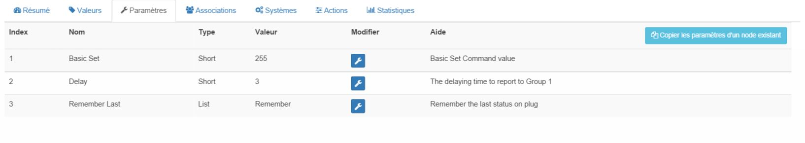

Everspring Miniplug On / Off - AN180-6 
====================================

\

-   **The module**

\

\

-   **The Jeedom visual**

\

\

Summary 
------

\

The Mini On / Off Plug is designed to control ignition and
switching off the lights and electrical equipment of your
House. With a voltage of 220 - 240 V, this Plug can support a
load up to 1500W (resistance), 800W (incandescent), 200W (motor,
fluorescent, Led).

The Mini On / Off Plug is a Z-Wave ™ compatible device which is intended
to work with all Z-Wave ™ compatible networks. She can
be controlled by a remote control, PC software, or any
Z-Wave controller for your network.

\

Functions 
---------

\

-   Control a lamp or device remotely

-   Plug module integrating directly between an electrical outlet and
    the load to order

-   ON / OFF function to control lamps or devices (not
    variation)

-   Local charge control via integrated button

-   Z-Wave Plus technology

-   Reduced dimensions to go almost unnoticed

-   Status LED on the integrated button

-   Z-Wave repeater function

\

Technical characteristics 
---------------------------

\

-   Type of module : Z-Wave receiver

-   Food : 230 V, 50 Hz

-   Consumption : 0.6W

-   Maximum power : Resistive load : 1500W, Incandescent bulb
    : 800W, Compact fluorescent bulb : 200W, Led bulb (not dimmable) :
    200W

-   Frequency : 868.42 Mhz

-   Scope : up to 70 m outdoors, up to 30 m in buildings

-   Viewing: LED on the button

-   Dimensions : Length (plug included) : 74mm Diameter : 52mm

\

Module data 
-----------------

\

-   Mark : Everspring

-   Name : Miniplug On / Off

-   Manufacturer ID : 96

-   Product Type : 4

-   Product ID : 7

\

Setup 
-------------

\

To configure the OpenZwave plugin and know how to put Jeedom in
inclusion refer to this
[Documentation](https://jeedom.fr/doc/Documentation/plugins/openzwave/en_US/openzwave.html).

\

> **IMPORTANT**
>
> To put this module in inclusion mode, press 3 times on its
> button, according to its paper documentation. It's important to
> note that this module goes directly to inclusion when
> does not belong to any network and is powered

\

\

Once included you should get this :

\

\

### Commands 

\

Once the module has been recognized, the commands associated with the modules will be
available.

\

\

Here is the list of commands :

\

-   State : It is the command which allows to know the status of the
    socket (On / Off)

-   We : This is the command that turns on the outlet

-   Off : It is the command which makes it possible to extinguish the catch

\

Note that on the dashboard, the status information, ON / OFF can be found on
the same icon.

\

### Configuration of the module 

\

You can configure the module according to your
installation. This requires going through the "Configuration" button of the
Jeedom OpenZwave plugin.

\

\

You will arrive on this page (after clicking on the tab
settings)

\

\

Parameter details :

\

-   1 : This parameter defines the status value command, it is not
    advised to change this value.

-   2 : This parameter defines the delay in sending the change of state to
    group 1 (value between 3 and 25 seconds)

-   3 : This parameter is used to define whether the socket will resume its status
    (ON or OFF) after a power recovery.

### Groups 

\

This module has 2 association groups.

\

\

> **IMPORTANT**
>
> At a minimum Jeedom should end up in group 1 \

Good to know 
------------

\

### Specificities 

\

-   Status feedback cannot be configured below 3
    seconds. \

Wakeup 
------

\

No notion of wakeup on this module.

\

Faq. 
------

\

Yes it is parameter 2 and it cannot be set below 3
seconds.

\

**@sarakha63**
