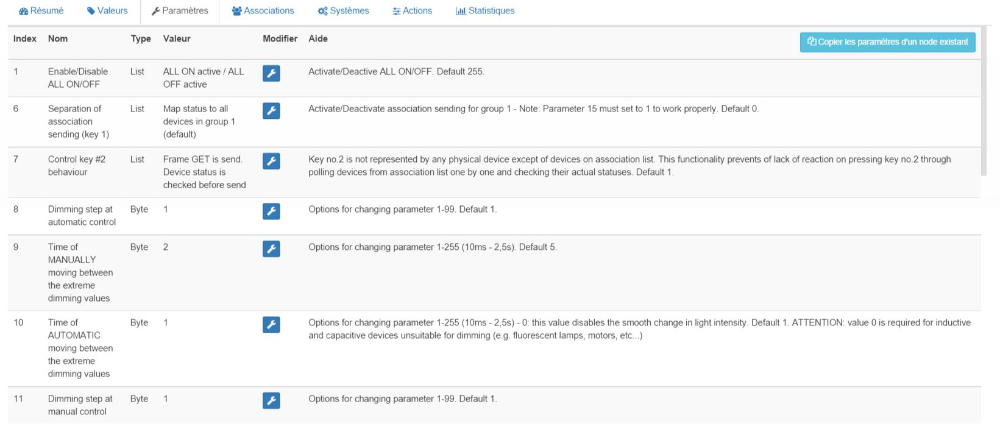

# 

****

****

## 

.

. ). .

).

).

. . .

## Fonctions

-   
-   
-   
-   )
-   
-   
-   
-   

## 

-    : 
-    : 
-    : 
-    : .)
-   ) : 
-   ) : 
-    : 
-    : 
-    : 
-   Dimensions: 
-    : 
-    : 105°C
-    : 

## 

-    : 
-    : ]
-    : 271
-    : 256
-    : 4106

## Configuration

 .

> ****
>
> .

> ****
>
> .

 :

### Commandes

.

 :

-    : 
-    : 
-    : 
-    : 

### 

. .

)

 :

-   1:  : 
-   6: 
-   7: 
-   8: )
-   9: )
-   10: )
-   11: )
-   12: 
-   13: 
-   14:  : )
-   15: )
-   16: 
-   17: 
-   18: 
-   19: )
-   20: 
-   30: 
-   39: 
-   41: 

### Groupes

.

## 

### 

> ****
>
> . . .

)

### 

## Wakeup

.

## .

.
