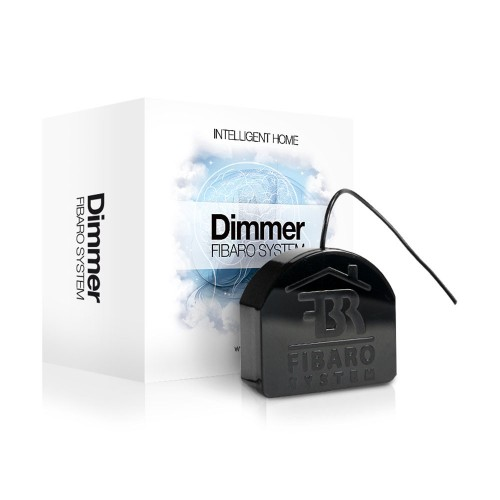
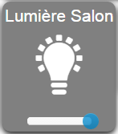
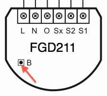
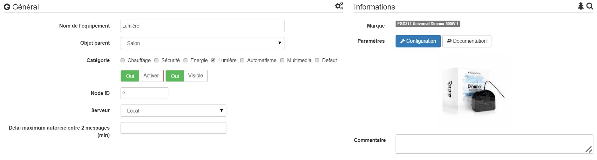
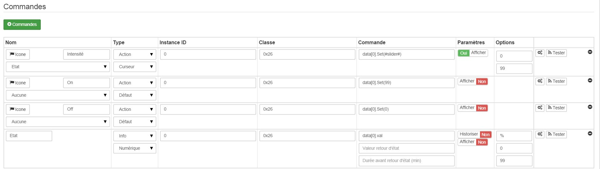
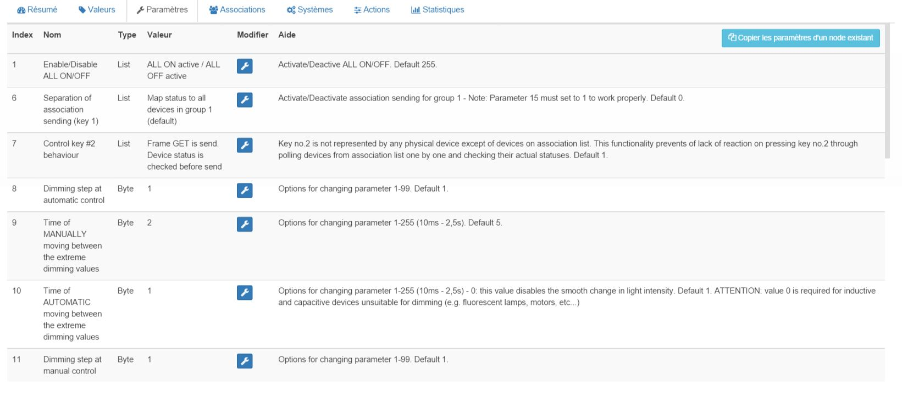
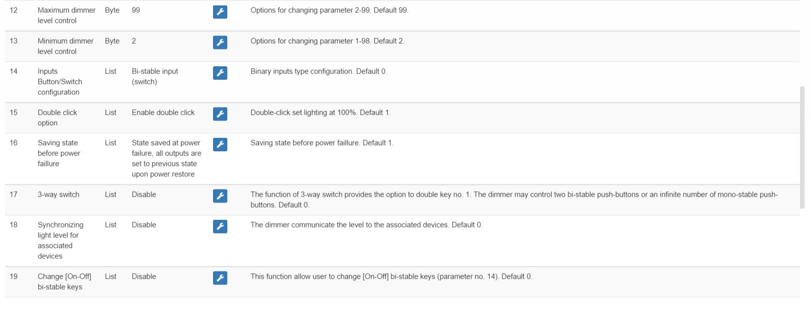
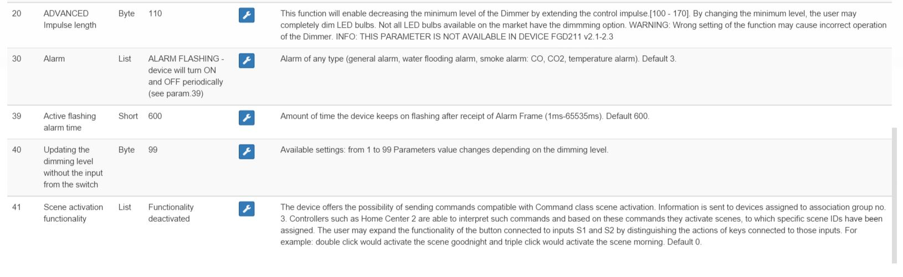
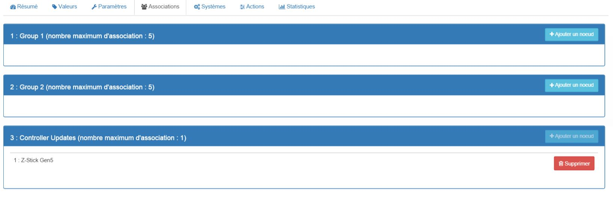

# 

**The module**

**The Jeedom visual**

## Summary

.

. ). .

).

).

. . Each Z-Wave module acts as a wireless repeater with the other modules, ensuring complete coverage of your home.

## Fonctions

-   
-   Installs behind an existing switch
-   ON/OFF Function and Dimming
-   )
-   
-   
-   Small, discreet and aesthetically pleasing
-   Ease of use and installation

## Technical specifications

-   Module type : Z-Wave Receiver
-   Food : 230V, 50 Hz
-   Wiring : 
-   Maximum load : .)
-   ) : 
-   ) : 
-    : 
-   Frequency : 868.42 MHz
-   Transmission distance : 50m open field, 30m indoors
-   Dimensions: 
-   Operating temperature : 0-40°C
-   Limit temperature : 105°C
-   Standards : 

## Module data

-   Brand : Fibar Group
-   Name : ]
-   Manufacturer ID : 271
-   Product Type : 256
-   Product ID : 4106

## Configuration

To configure the OpenZwave plugin and learn how to include Jeedom, refer to this [documentation](https://doc.jeedom.com/en_US/plugins/automation%20protocol/openzwave/).

> **Important**
>
> To put this module into inclusion mode, press the inclusion button 3 times, as per its printed documentation.

> ****
>
> .

Once included, you should get this :

### Commandes

Once the module is recognized, the commands associated with the module will be available.

Here is the list of commands :

-   Intensity : 
-   On : 
-   Off : 
-   State : 

Note that on the dashboard, all the information is displayed under the same icon

### Module configuration

You can configure the module according to your installation. To do this, you need to use the "Configuration" button in the Jeedom OpenZwave plugin.

You will arrive at this page (after clicking on the Settings tab))

Parameter details :

-   1:  : 
-   6: 
-   7: 
-   8: )
-   9: )
-   10: )
-   11: )
-   12: 
-   13: 
-   14:  : )
-   15: )
-   16: 
-   17: 
-   18: 
-   19: )
-   20: 
-   30: 
-   39: 
-   41: 

### Groupes

.

## Good to know

### Specifics

> **Caution**
>
> . . .

)

### Alternative image

## Wakeup

There is no concept of wakeup on this module.

## .

.
