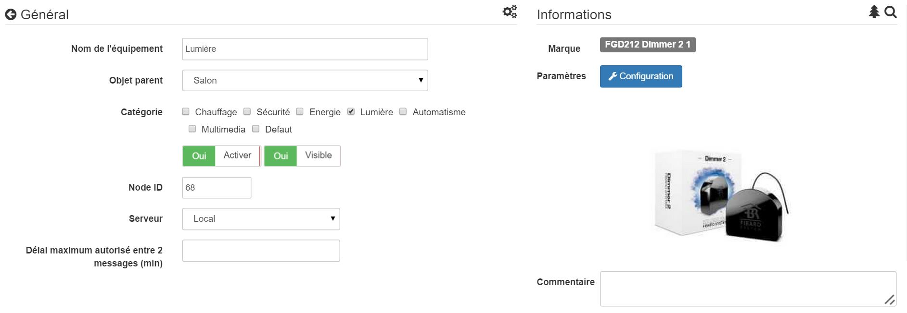
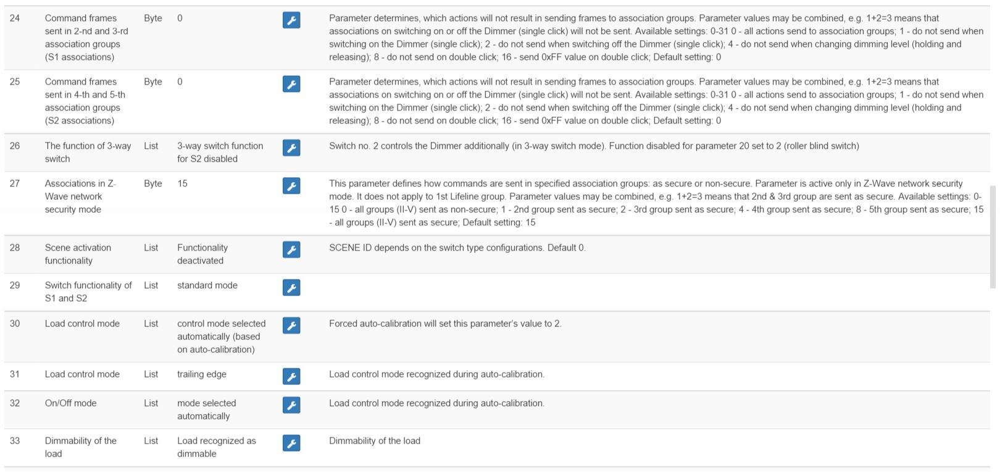

# 

-   **The module**

-   **The Jeedom visual**

Summary 
------

.

.

. ,
).

. 

(.

Fonctions
---------

-   

-   Installs behind an existing switch

-   

-   Use in 2-wire mode (neutral not necessary)

-   

-   
    standard

-   

-   

-   

-   

-   ,
    .

-   )

-   
    

-   

-   ,
    

-   

-   

-   

Technical characteristics
---------------------------

-   Mod type : Z-Wave Receiver

-   Feed : 

-   Consumption : 

-    : 

-    : 
    ()

-   ) : ,
    

-   ) : 

-   Frequency : 868.42Mhz

-    : 1mW

-    : 

-   Dimensions : 42..

-   Operating temperature : 

-    : 105°C

-    : 
    1999/5/EC

Module data
-----------------

-   Mark : 

-   Last name : 

-   Manufacturer ID : 271

-   Type Product : 258

-   Product ID : 4096

Configuration
-------------

[documentation](https://doc.jeedom.com/en_US/plugins/automation%20protocol/openzwave/).

> **Important**
>
> 
> . 
> 
> .

> **Tip**
>
> 
> 
> .

Once included you should get this :

### Commandes

disponibles.

Here is the list of commands :

-   Intensity : 
    

-   We : This is the command that turns on the light

-   Off : This is the command that turns off the light

-   State : 
    

-   Consumption : 
    

-    : 
    

icone

### Module configuration

.

)

Parameter details :

### Groupes

indispensable.

Good to know
------------

### Specificities

> ****
>
> 
> . 
> .

()

### 

Wakeup
------

.

.
------

.

**@sarakha63**
