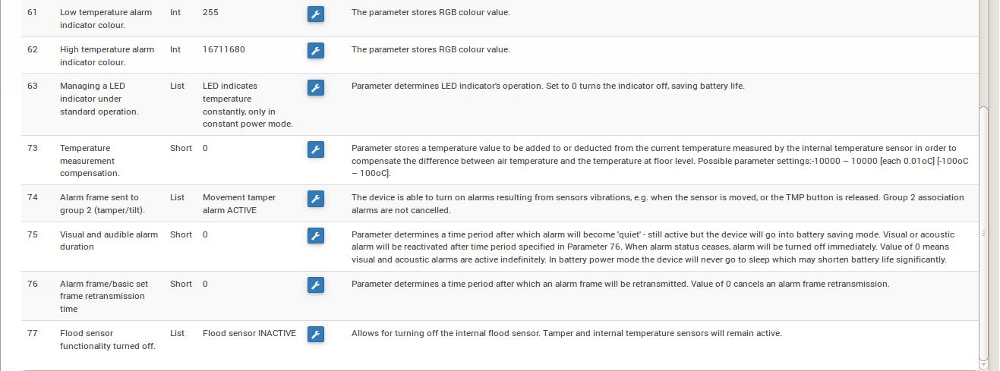

Fibaro FGFS-101 "Flood Sensor" 
==============================

\

-   **The module**

\

\

-   **The jeedom visual**

\

\

Summary 
------

\

The FGFS-101 sensor is compact and has a wide variety of
functions. With its advanced technology and precision, the sensor
Flood Fibaro alerts you to a threatening flood, or an increase
or rapid temperature drop.

It is equipped with a tilt sensor which sends an alert
immediately to the Z-Wave network if the detector is moved or stolen
(feeds back to the Z-Wave controller the tilt or
mouvement).

This universal flood and temperature detector can be powered
by battery or by an external 12 or 24 VDC power supply. When he is
connected to an external power source, the battery serves as a source
emergency power.

Thanks to its temperature sensor you can control the temperature of
your soil. It is waterproof, in case of flood it floats on the surface of
l'eau.

It also has a siren alarm which can sound in the event of
problem. You can connect the dry contact output to a system
existing alarm. A front LED to check the status of the
FGFS-101.

This sensor incorporates a Z-Wave network range tester, which lets you
ensures correct operation of the sensor during installation.

\

Functions 
---------

\

-   Flood detector (presence of water via contacts)

-   Temperature detector

-   Tilt detector

-   Audible and visual alarm

-   Z-Wave range tester

-   Z-Wave repeater ?? (see section "Good to know")

\

Technical characteristics 
---------------------------

\

-   Type of module : Z-Wave transmitter

-   Module can be powered externally : 12 - 24 VDC

-   Battery Type : CR123A

-   Battery life : 2 years

-   Consumption on external power supply : 0,4W

-   Maximum current supported at output (ALARM NC, TAMP NC) :25mA

-   Maximum voltage supported at output : 40V (AC or DC)

-   Frequency : 868.42 MHz

-   Transmission distance : 50m free field, 30m indoors

-   Dimensions : 72 x 28 mm (diameter x height)

-   Operating temperature : 0-40 ° C (-20 ° C to 70 ° C if
    external power supply)

-   Temperature measurement range : -20 to 100 ° C

-   Measurement accuracy : 0.5 ° C (in a range of 0 to 40 ° C)

-   Standards : EMC 2004/108 / EC and R & TTE 199/5 / WE

\

Module data 
-----------------

\

-   Mark : Fibar Group

-   Model : FGFS101 Flood Sensor

-   Maker : FIBARO System

-   Manufacturer ID : 271

-   Product Type : 2816

-   Product ID : 4097

\

Configuration 
-------------

\

To configure the OpenZwave plugin and know how to put Jeedom in
inclusion refer to this
[documentation](https://jeedom.fr/doc/documentation/plugins/openzwave/en_US/openzwave.html).

\

> **Important**
>
> To put this module in inclusion mode, press the button 3 times
> central inclusion button, identified TMP, according to its documentation
> paper (the black tab).

\

\

Once included you should get this :

\

\

### Orders 

\

Once the module has been recognized, the commands associated with the module will be
disponibles.

\

\

Here is the list of commands :

\

-   Leak : this is the module alert command (for the presence
    water, flooding ...)

-   Temperature : it is the temperature measurement command

-   Sabotage : this is the sabotage command. It signals the opening
    of the case

-   Drums : it's the battery command

\

### Configuration of the module 

\

> **Important**
>
> During a first inclusion always wake up the module just after
> inclusion.

\

Then it is necessary to configure the module in
depending on your installation. This requires going through the button
"Configuration "of Jeedom's OpenZwave plugin.

\

\

You will arrive on this page (after clicking on the tab
Settings)

\

\

Parameter details :

\

-   Wakeup : this is the module wake-up interval (value
    recommended 21600)

-   1 \. Alarm cancellation delay after detection of a flood :
    valeur de 0 à 3600 s (0 par défaut/ dès qu‘il n'y a plus de détection il
    stops instantly)

-   2 \. Choice of alarm type. Value :

        0 : Audible and visual alarm deactivated
        1 : Audible alarm deactivated and visual alarm activated
        2 : Audible alarm on and visual alarm off
        3 : Audible and visual alarm activated.

-   10 \. Transfer time between two temperature readings : 1 to 65,535 s
    (300 by default). Be careful not to put a carry value too
    close together under penalty of seeing the module battery melt at all
    speed ! (1800 is recommended)

-   12 \. Temperature difference between two reports : from 1 to 1000 (50 by default
    = 0.5 °). In accordance with parameter 10, it is also possible to
    manage the temperature transfer according to the variation of
    these last.

-   50 \. Setting the low temperature alarm : from -10000 to + 10000
    (1500 by default = 15 ° C) Triggers an alarm when the
    temperature drops below a certain threshold.

-   51.Setting the high temperature alarm : from -10000 to + 10000
    (3500 by default = 35 ° C) Used to trigger an alarm when the
    temperature goes above a certain threshold.

-   73 \. Temperature compensation : from -10000 to + 10000 (0 by default
    = 0 ° C) Used to define an offset between the sensor temperature and
    the actual temperature

-   75 \. Setting the duration of the alarm : from 0 to 65535s (0 by default,
    The alarm stops as soon as it no longer detects a fault.)

\

### Groups 

\

For optimum operation of your module. Jeedom must be
associated at least with groups 1, 4 and 5:

\

\

Good to know 
------------

Powered from the outside, this module can act as a repeater
Z-wave (information not currently confirmed)

Wiring for external power. \

\

Wakeup 
------

\

To wake up this module, press the central button 3 times

\

Faq. 
------

\

This module wakes up by pressing 3 times on its inclusion button.

\

This module is, by default, a battery module, the new
configuration will be taken into account at the next wakeup.

\

Important note 
---------------

\

> **Important**
>
> You have to wake up the module : after its inclusion, after a change
> of the configuration, after a change of wakeup, after a
> change of association groups

\

\
Usage detail :
<http://blog.domadoo.fr/2014/12/18/jeedom-guide-dutilisation-du-detecteur-dinondation-fibaro-fgfs-001/>
Fibaro documentation :
<http://www.fibaro.com/manuals/en/FGFS-101-Flood-Sensor/FGFS-101-Flood-Sensor-en-2.1-2.3.pdf>

\

