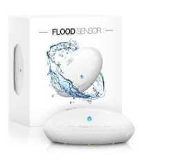
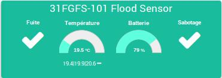
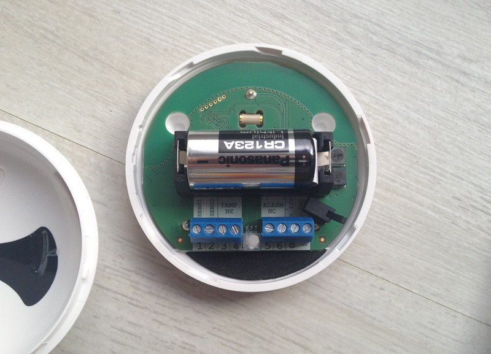
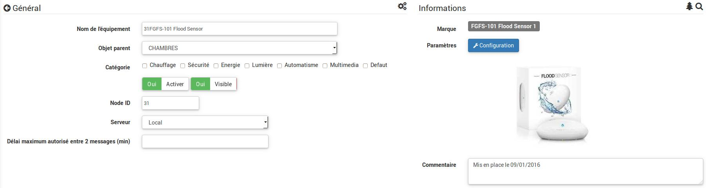
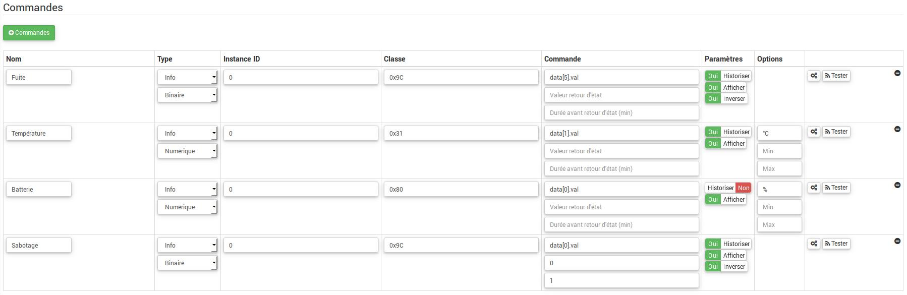
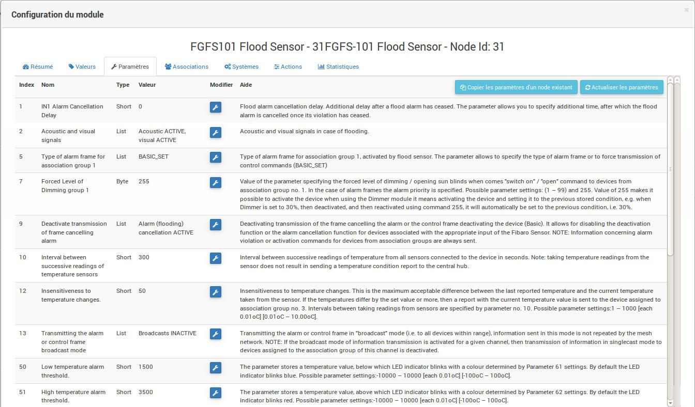
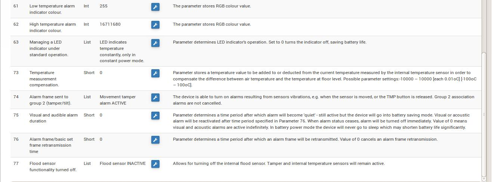
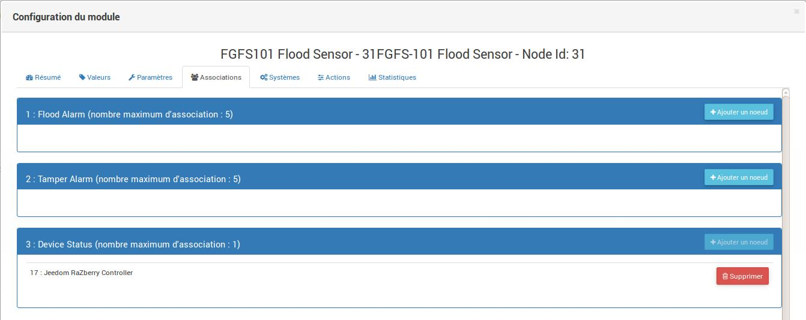
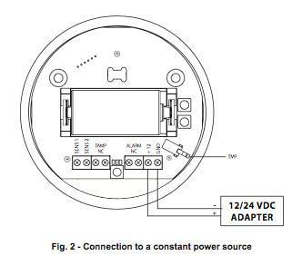

# "

**The module**

**The Jeedom visual**

## Summary

. .

).

. .

. .

. . .

.

## Fonctions

-   )
-   
-   
-   
-   
-    ?? (")

## Technical specifications

-   Module type : Z-Wave Transmitter
-    : 
-    : 
-   Battery life : 
-    : 0,4W
-   ) :25mA
-    : )
-   Frequency : 868.42 MHz
-   Transmission distance : 50m open field, 30m indoors
-   Dimensions : )
-   Operating temperature : )
-   Temperature measurement range : -20 to 100°C
-   Measurement accuracy : )
-   Standards : EMC 2004/108/EC and R&TTE 199/5/WE

## Module data

-   Brand : Fibar Group
-    : 
-    : 
-   Manufacturer ID : 271
-   Product Type : 2816
-   Product ID : 4097

## Configuration

To configure the OpenZwave plugin and learn how to include Jeedom, refer to this [documentation](https://doc.jeedom.com/en_US/plugins/automation%20protocol/openzwave/).

> **Important**
>
> ).

Once included, you should get this :

### Commandes

Once the module is recognized, the commands associated with the module will be available.

Here is the list of commands :

-    : )
-   Temperature : This is the temperature measurement control
-   Sabotage : This is the sabotage command. It signals the opening of the case
-   Battery : This is the battery control

### Module configuration

> **Important**
>
> During the initial inclusion, always wake up the module immediately after inclusion.

Next, you need to configure the module according to your installation. To do this, you need to use the "Configuration" button in the Jeedom OpenZwave plugin.

You will arrive at this page (after clicking on the Settings tab))

Parameter details :

-   Wakeup : This is the module's wake-up interval (recommended value 21600))
-   .  : valeur de 0 à 3600 s (0 par défaut/ dès qu‘il n'y a plus de détection il s'arrête instantanément)
-   . .  :
  - 0 : 
  - 1 : 
  - 2 : 
  - 3 : .
-   .  : ).  ! ()
-   .  : ). .
-   .  : .
-   51. : .
-   .  : 
-   .  : .)

### Groupes

. :

## Good to know

)

.

## Wakeup

## .

.

.

## Important note

> **Important**
>
> The module needs to be woken up : 

 
 
