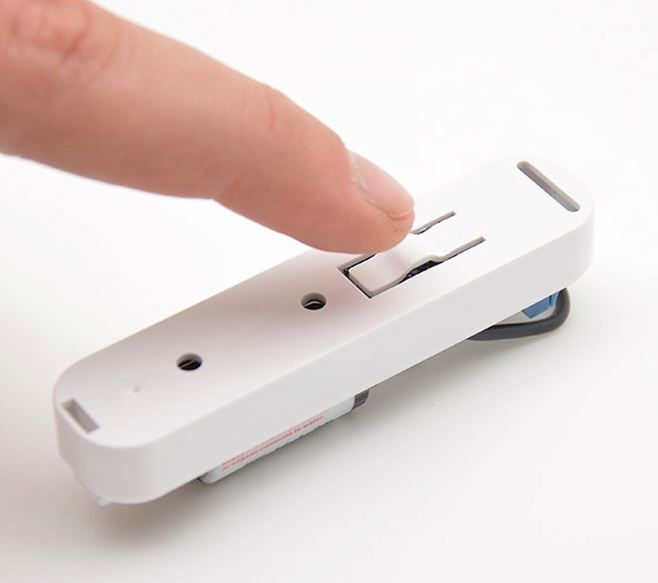

 
======================================

\

-   **The Module**

\

\

-   **The Jeedom visual**

\

\

Summary 
------

\

.

. 
.

. 

 : 

,
Etc..

A Z-Wave controller (remote control, dongle, Etc..) is required in order to

existing.

\

Functions 
---------

\

-   

-   Button to include / exclude the detector

-   Low battery detection

-   Tamper protection

-   

-   
    

-   Very small, reduced dimensions

-   Ease of use and installation

\

Technical characteristics 
---------------------------

\

-   Type of Module : Z-Wave transmitter

-   Color : 

-   Food : 

-   Frequency : 868.42 Mhz

-   Transmission distance : 50m free field, 30m indoors

-   Dimensions: 

-   Operating temperature : 0-40 ° C

\

Module data 
-----------------

\

-   Mark : Fibar Group

-   Name : 

-   Manufacturer ID : 271

-   Product Type : 1792

-   Product ID : 4096

\

Setup 
-------------

\

To configure the OpenZwave plugin and know how to put Jeedom in
inclusion refer to this
[documentation](https://jeedom.fr/doc/documentation/plugins/openzwave/en_US/openzwave.html).

\

> **IMPORTANT**
>
> To put this Module in inclusion mode, press the button 3 times
> inclusion button, according to its paper documentation.

\

\

Once included you should get this :

\

\

### Commands 

\

Once the Module has been recognized, the commands associated with the Module will be
available.

\

\

Here is the list of commands :

\

-   State : 
    Module

-   Drums : 
    drums

\

.

\

### Setup of the Module 

\

> **IMPORTANT**
>
> During a first inclusion always wake up the Module just after
> inclusion.

\

Then if you want to configure the Module according to
of your installation, you have to go through the button
"Setup "of Jeedom's OpenZwave plugin.

\

\

You will arrive on this page (after clicking on the tab
Settings)

\

\

Parameter details :

\

-   Wakeup : this is the Module's wake-up interval (value
    7200 recommended)

-   1: 
    

-   2: 
    

-   3: 

-   5: 
    

-   7: 

-   9: 
    

-   12: 
    

-   13: 
    

-   14: 

\

### Groups 

\

This Module has three association groups, only the third is
essential.

\

\

Good to know 
------------

\

### Specificities 

\

> **Tip**
>
> 
> 

\

### Alternative visual 

\

\

Wakeup 
------

\

To wake up this Module there is only one way :

-   . 
    

\

Faq. 
------

\

.

\

. 
.

\

This Module is a battery Module, the new configuration will be
taken into account at the next wakeup.

\

IMPORTANT note 
---------------

\

> **IMPORTANT**
>
> You have to wake up the Module : after its inclusion, after a change
> of the configuration, after a change of wakeup, after a
> change of association groups

\

**@sarakha63**
