# 

**The module**

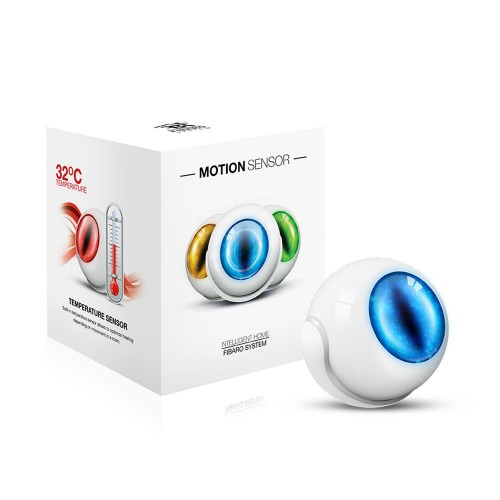

 **The Jeedom visual**

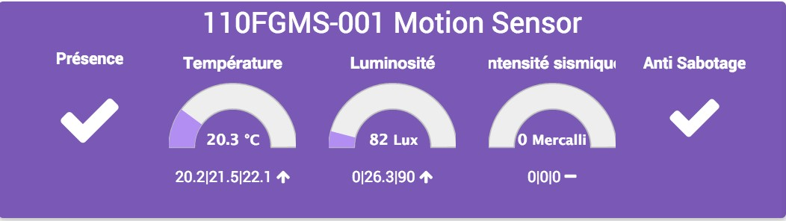

## Summary

. . .

. .

.

## Fonctions

-   
-   
-   
-   
-   
-   
-   
-   
-   
-   
-   

## Technical specifications

-   Module type : 
-   Food : 
-    : 2,4m
-    : -
-   Measurement accuracy : 0,5°C
-    : X
-   Frequency : 868.42 MHz
-   Transmission distance : 50m open field, 30m indoors
-   Dimensions: 
-   Operating temperature : 0-40°C
-   Certifications : 

## Module data

-   Brand : Fibar Group
-   Name : ]
-   Manufacturer ID : 271
-   Product Type : 2048
-   Product ID : 4097

## Configuration

To configure the OpenZwave plugin and learn how to include Jeedom, refer to this [documentation](https://doc.jeedom.com/en_US/plugins/automation%20protocol/openzwave/).

> **Important**
>
> To put this module into inclusion mode, press the inclusion button 3 times, as per its printed documentation.

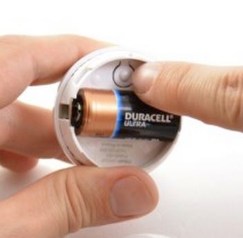

 :

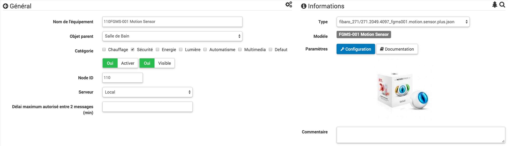

### Commandes

. Once the module is recognized, the commands associated with the module will be available.

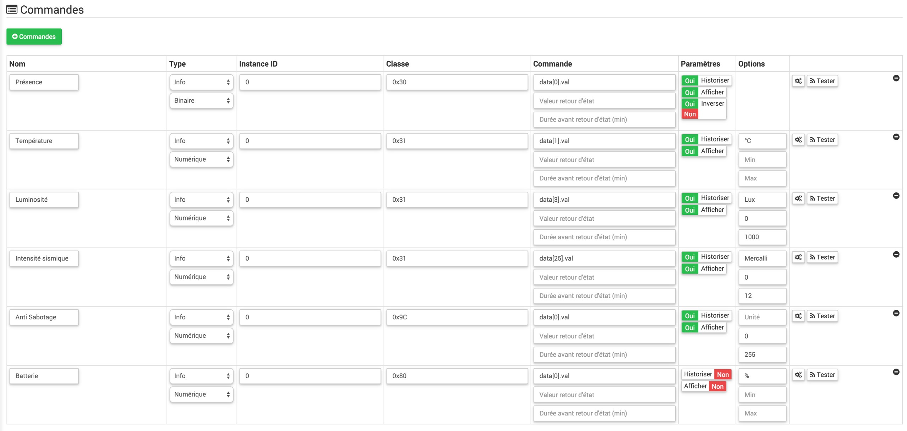

Here is the list of commands :

-    : 
-   Temperature : 
-    : 
-    : 
-   Sabotage : )
-   Battery : This is the battery control

### Module configuration

> **Important**
>
> During the initial inclusion, always wake up the module immediately after inclusion.

Next, if you want to configure the module according to your installation, you must use the "Configuration" button in the Jeedom OpenZwave plugin.

You will arrive at this page (after clicking on the settings tab))

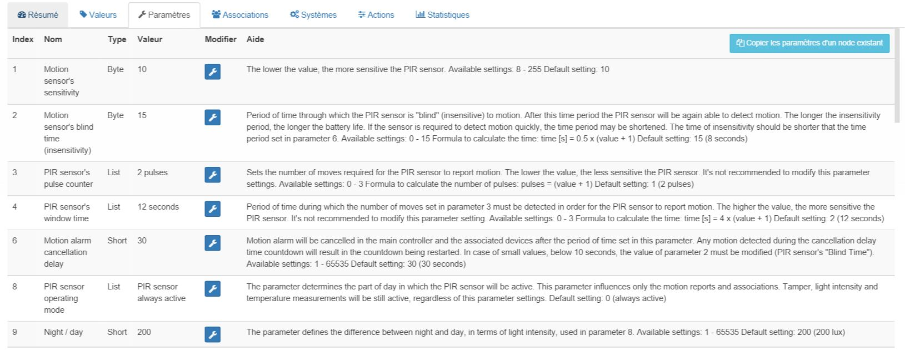

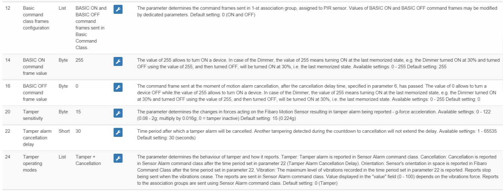

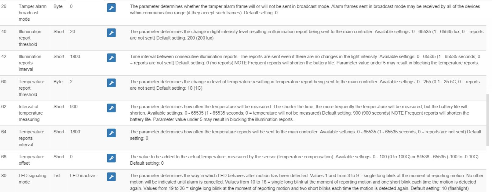

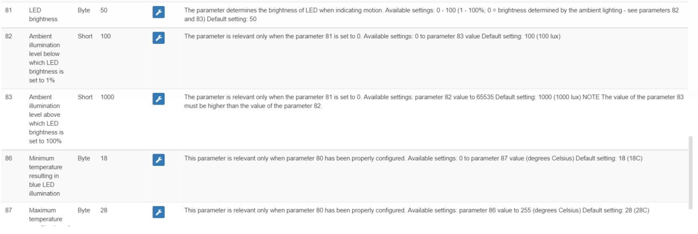

Parameter details :

-   Wakeup : )
-   1: 
-   2: 
-   3: 
-   4: 
-   6: )
-   8:  : )
-   9: )
-   12: )
-   14: idem
-   16: idem
-   20: )
-   22: )
-   24:  :  :  )
-   26: 
-   40: )
-   42: )
-   60: .)
-   62: )
-   64: )
-   66: 
-   80: )
-   81: 
-   82: )
-   83: )
-   86: )
-   87: )
-   89: 

### Groupes

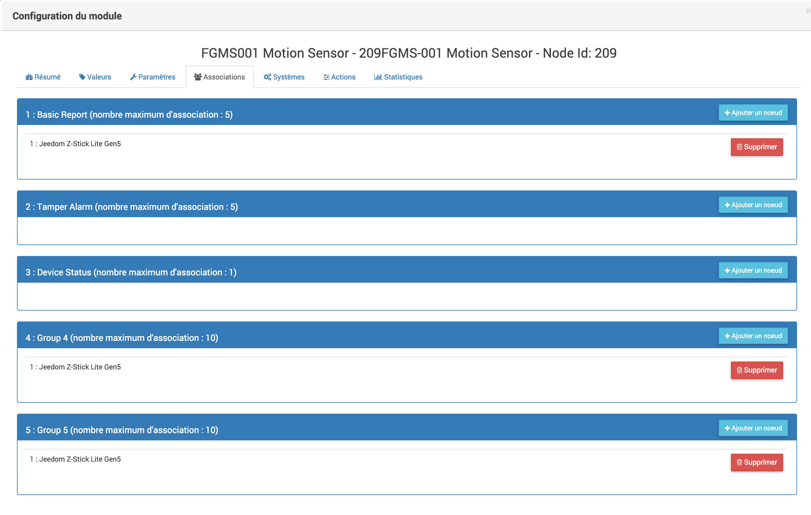

> ****
>
> .

:

-   1 : . .
-   2 : .
-   3 : .
-   4 : . .
-   5 : . .

## Good to know

### Specifics

> ****
>
> . .

### Alternative image

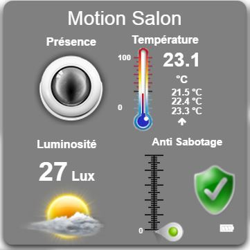

## Wakeup

 :

-   ). )

## .

.

. .

.

## Important note

> **Important**
>
> The module needs to be woken up : 
