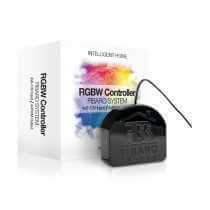
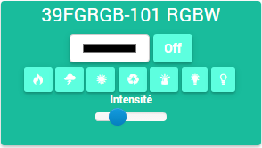
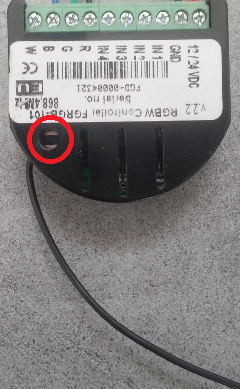
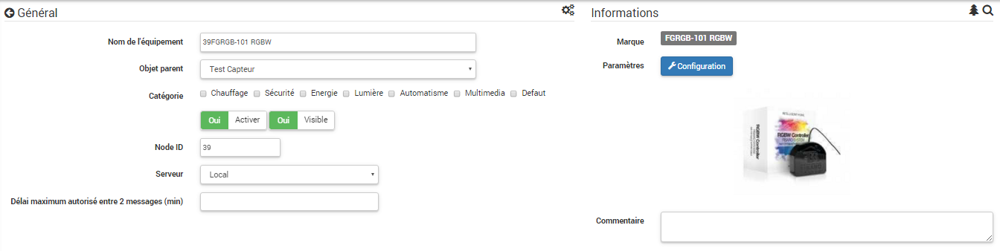
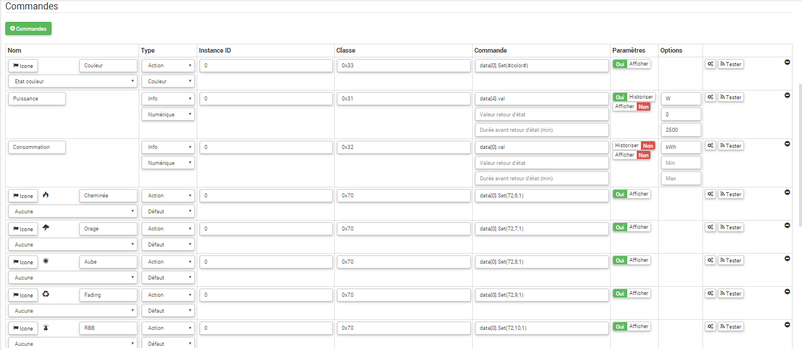
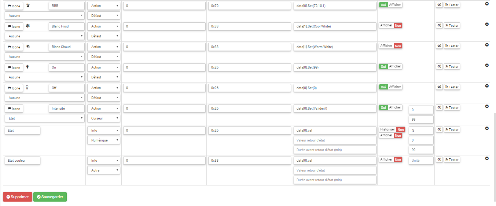
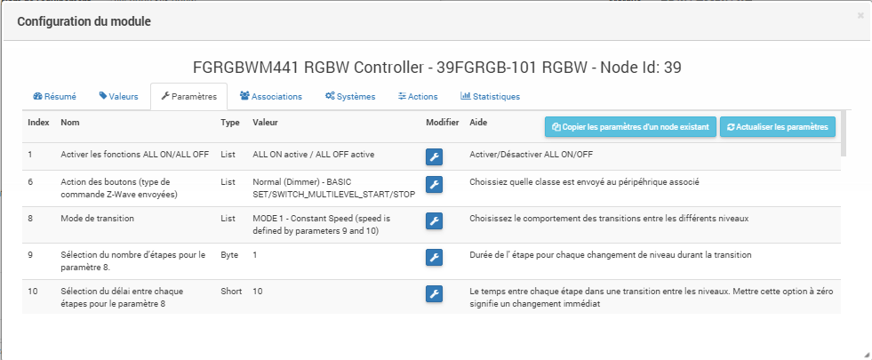
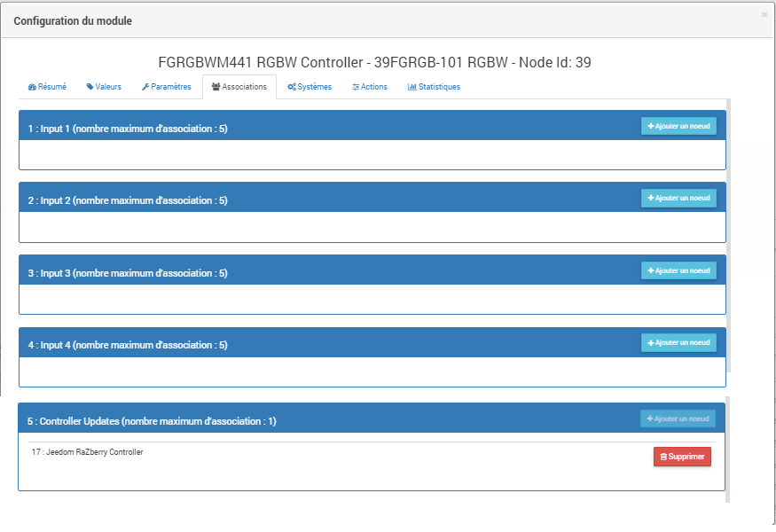
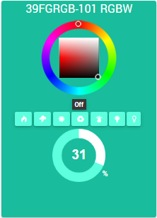

# Fibaro RGVB Controller - FGRGB-101

-   **The module**

-   **The Jeedom visual**

## Summary

The Fibaro FGRGB-101 Z-Wave micromodule allows you to control 12/24V low-voltage lighting (halogen or LED), an RGB or RGB+white LED strip, or connect analog sensors using the 0-10V standard.

-   4 analog inputs (0-10V) for connection to numerous compatible sensors, potentiometers, pushbuttons (monostable) or switches (bistable)).
-   4 PWM (Pulse Width Modulation) outputs for control :
-   * i.e., 1 channel of RGB + White (RGBW) LEDs, 12/24V
-   * or 4 channels of 12/24V white LEDs
-   * or 4 channels of 12/24V halogen lamps (144W 12V / 288W 24V max).)
-   * or 12/24V fans.
-   Requires a separate 12/24V power supply.
-   Measurement of overall consumption or consumption by channel, instantaneous or cumulative.
-   Repeater (router) function to extend the Z-Wave network.

## Fonctions

-   Order low voltage 12/24V lighting (halogen or LED))
-   Installs behind an existing switch
-   Previously programmed light simulation
-   ON/OFF Function and Dimming
-   Small, discreet and aesthetically pleasing
-   Ease of use and installation

## Technical specifications

-   Food : 12V or 24V DC
-   Maximum output power :
-   * 12A total (sum of all channels)),
-   * 6A max. by channel
-   Maximum power with halogen lamps :
-   * 12V - 144W total (all channels)),
-   * 24V - 288W total (all channels))
-   PWM modulation frequency : 244 Hz
-   Consumption : 0,3W
-   Radio protocol : Z-Wave at 868.4 MHz (EU)
-   Z-Wave transmission power : 1mW
-   Operating temperature : 0 - 40 C
-   For installation in boxes : Ø≥50 mm
-   Dimensions : 42 x 37 x 17 mm
-   European Standards : EMC 2004/108/EC R&TTE 199/5/WE
-   This module requires a Z-Wave controller to function.

## Module data

-   Brand : Fibar Group
-   Name : Fibaro FGRGB-101 RGBW
-   Manufacturer ID : 271
-   Product Type : 2304
-   Product ID : 4096

## Configuration

To configure the OpenZwave plugin and learn how to include Jeedom, refer to this [documentation](https://doc.jeedom.com/en_US/plugins/automation%20protocol/openzwave/).

> **Important**
>
> To put this module into inclusion mode, press the inclusion button 3 times, as per its printed documentation.

Once included, you should get this :

### Commandes

Once the module is recognized, the commands associated with the module will be available.

Here is the list of commands :

-   Color : This is the command that allows you to set the color code to be displayed
-   Chimney : This is the control that allows you to simulate a fireplace atmosphere
-   Thunderstorm : This is the command that allows you to simulate a storm atmosphere
-   Dawn : This is the command that allows you to simulate an dawn atmosphere (gradual sunrise))
-   Fading : This is the command that allows you to simulate the entire color spectrum
-   RBB : This is the command that allows you to simulate a police atmosphere
-   Cool White : This is the command that allows you to simulate a cool white color, if the color picker allows it. (This command is not visible by default)
-   Warm White : This is the command that allows you to simulate a warm white color, if the color picker allows it. (This command is not visible by default)
-   On : This is the command that allows you to turn on the strip in the last color chosen previously
-   Off : This is the control that allows you to turn off the strip
-   Intensity : This is the control that allows you to adjust the light intensity

Note that on the dashboard, all the information is displayed under the same icon

### Module configuration

You can configure the module according to your installation. To do this, you need to use the "Configuration" button in the Jeedom OpenZwave plugin.

You will arrive at this page (after clicking on the Settings tab))

Parameter details :

Please refer to the previous screenshot; the settings are translated into French.

### Groupes

This module has five association groups, only the fifth one is essential.

## Good to know

### Specifics

Use of 0-10V sensors.

> **Caution**
>
> Currently, the default Jeedom configuration does not allow this, but a specific configuration can be considered.

### Alternative image

## Wakeup

There is no concept of wakeup on this module.
