# Fibaro FGRM-222 "Roller shutter""

**The module**

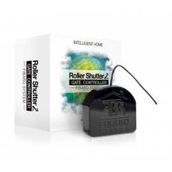

**The Jeedom visual**

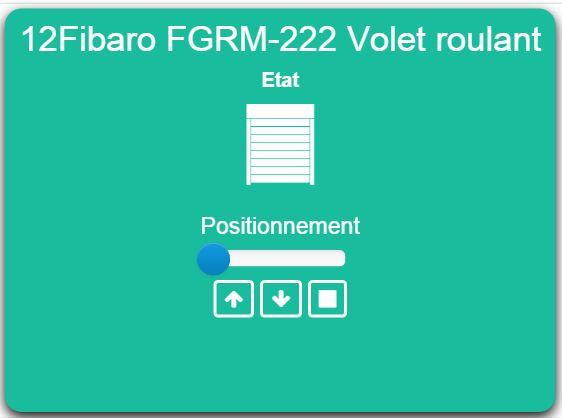

## Summary

The FGRM-222 micromodule will allow you to control motorized shutters with electronic limit switches, Venetian blinds, or garage doors using the Z-Wave protocol, all while keeping your existing switch. You will therefore be able to operate the connected motor using the existing switch, a Z-Wave transmitter, or directly from the button on the micro-module.

Furthermore, this micromodule is capable of transmitting the instantaneous (W) and cumulative (kWh) power consumption of the equipment connected to it.

A Z-Wave controller (remote control, dongle, etc.) is required to integrate this module into your network if you already have an existing network.

Each Z-Wave module acts as a wireless repeater with the other modules, ensuring complete coverage of your home.

Note : This module requires a neutral wire to function.

## Fonctions

-   Order your blinds or roller shutters remotely
-   Compatible with external venetian blinds and slat positioning
-   Installs behind an existing switch
-   Up/down function and positioning
-   Compatible with motors with mechanical or electronic limit switches
-   Measurement of instantaneous and cumulative consumption
-   Wireless update with the Fibaro Home Center 2 box
-   Z-Wave network coverage test function
-   Small, discreet and aesthetically pleasing
-   Ease of use and installation

## Technical specifications

-   Module type : Z-Wave Receiver
-   Food : 230V, 50 Hz
-   Electricity consumption : &lt; 0,8W
-   Wiring : 3 wires, neutral required
-   Maximum load : 1000W
-   Frequency : 868.42 MHz
-   Signal strength : 1mW
-   Transmission distance : 50m open field, 30m indoors
-   Dimensions: 17 x 42 x 37 mm
-   Operating temperature : 0-40°C
-   Limit temperature : 105°C
-   Standards : LVD (2006/95/EC), EMC (2004/10B/EC), R&TTE(1999/5/EC))

## Module data

-   Brand : Fibar Group
-   Name : Fibaro FGRM-222
-   Manufacturer ID : 271
-   Product Type : 769
-   Product ID : 4097

## Configuration

To configure the OpenZwave plugin and learn how to include Jeedom, refer to this [documentation](https://doc.jeedom.com/en_US/plugins/automation%20protocol/openzwave/).

> **Important**
>
> To put this module into inclusion mode, press the inclusion button 3 times, as per its printed documentation.

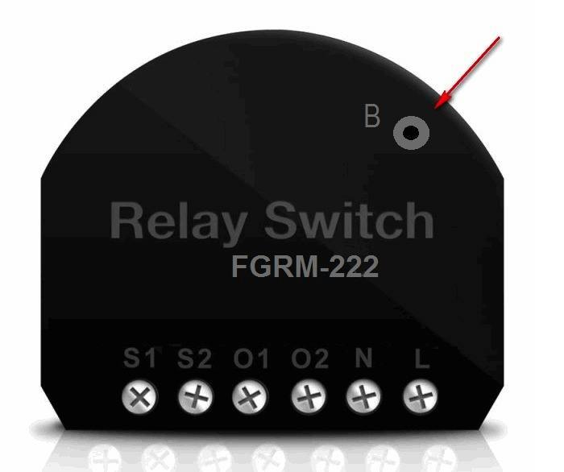

Once included, you should get this :

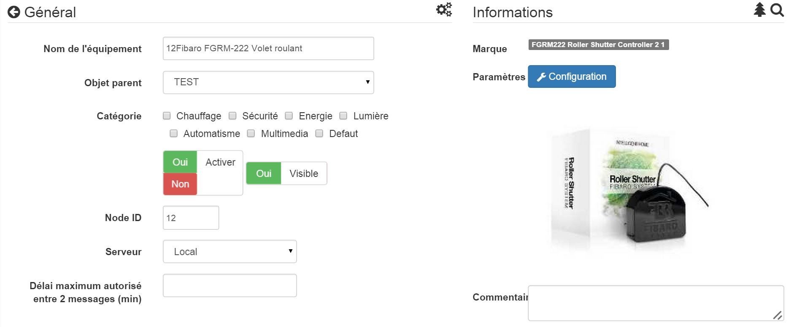

### Commandes

Once the module is recognized, the commands associated with the module will be available.

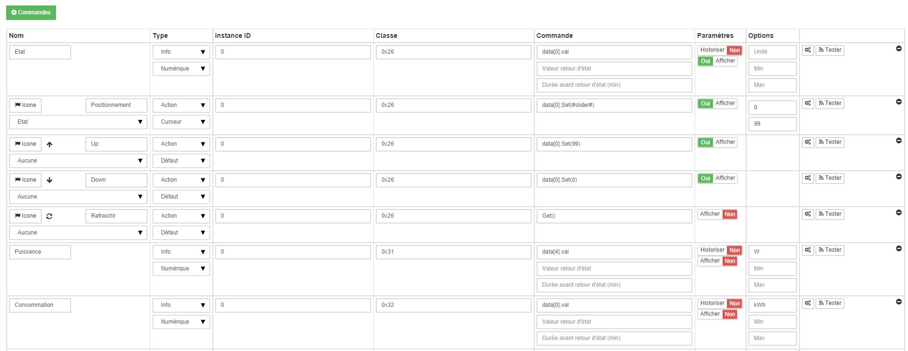

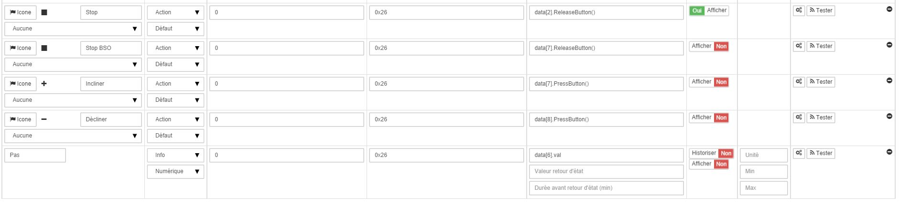

Here is the list of commands :

-   State : This is the control that allows you to know the position of your shutter
-   Positioning : This is the command that allows you to define the opening percentage
-   Up : This is the control that allows the shutter to be fully opened
-   Down : This is the control that allows you to completely close the shutter
-   Refresh : This is the command that allows you to request the shutter's position again
-   Power : Command to obtain the module's power consumption
-   Consumption : Command allowing you to know the instantaneous power used by the module
-   STOP : Control to stop the movement of the shutter
-   STOP BSO : Control to stop the movement (in adjustable slat mode))
-   Tilt : Allows you to tilt the slats (adjustable slat mode))
-   Decline : Allows for adjustable slat configuration (slat mode))
-   Not : Allows you to define the step size for pressing the Decline or Tilt button

### Module configuration

Next, if you want to configure the module according to your installation, you must use the "Configuration" button in the Jeedom OpenZwave plugin.

You will arrive at this page (after clicking on the settings tab))

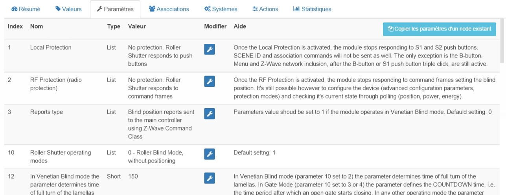

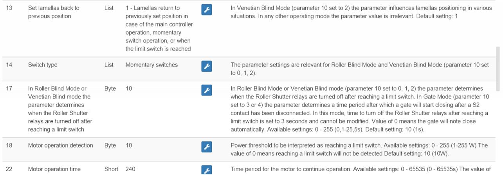

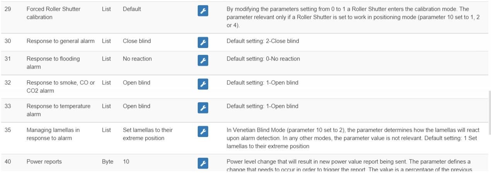

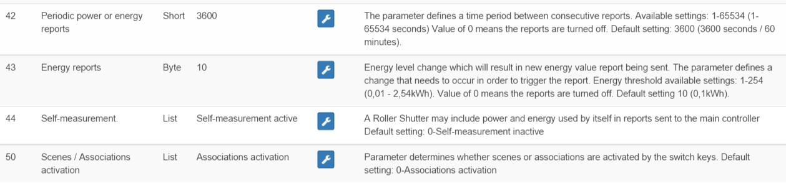

Parameter details :

-   1: allows you to lock the module (to freeze a shutter) (in the case of a switch being pressed))
-   2: Same, but for Z-Wave commands
-   3: type of reports (classic or Fibar))
-   10: operating mode (Venetian blind, shutter, etc.))
-   12: duration of a complete rotation (in Venetian blind mode))
-   13: allows you to choose when the slats should return to their previous position
-   14: allows you to choose the type of switch
-   17: allows you to choose how long after the limit defined in 18 the shutter stops
-   18: safety power for the motor
-   22: NA
-   29: allows you to calibrate the shutter
-   30 to 35: allows you to define the module's behavior in response to different Z-Wave alarms
-   40: power delta to trigger an information update (even outside the period defined in 42)
-   42: information feedback period
-   43: energy delta to trigger an information update (even outside the period defined in 42)
-   44: allows you to choose whether or not the consumption and power should take into account that of the module itself
-   50: allows you to choose whether the module should send information to the associated nodes in scene mode or association mode

### Groupes

This module has 3 association groups, only the third one is essential.

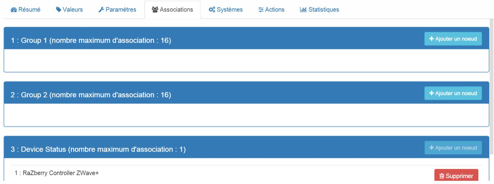

## Good to know

### Reset

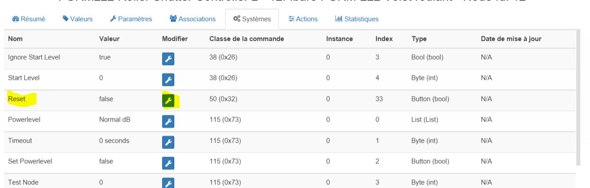

You can reset your consumption counter by clicking on this button available in the System tab.

### Important

> **Important**
>
> For status feedback to work in Jeedom, it is necessary to force calibration of the equipment (parameter 29 set to "Yes") and positioning must be active (parameter 10 set to "Direct Active", "Venetian Active", or "Door Active")").

## Wakeup

There is no concept of wakeup on this module.
