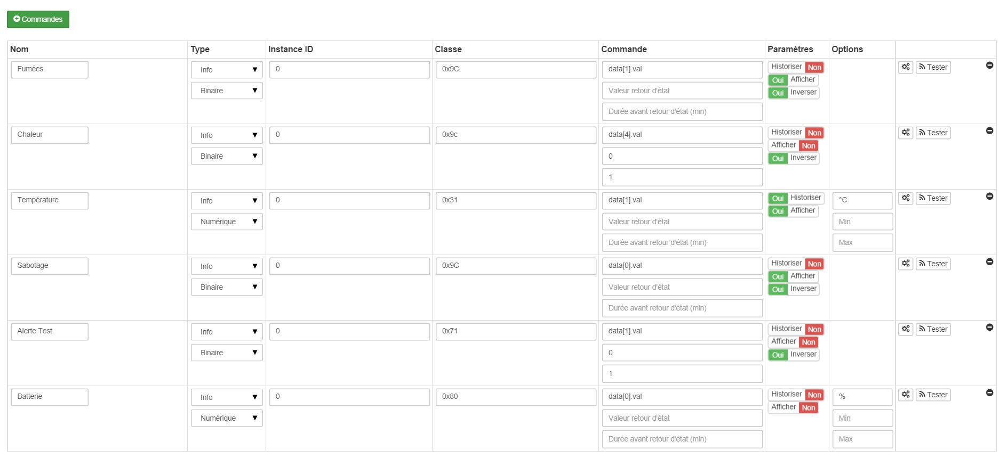
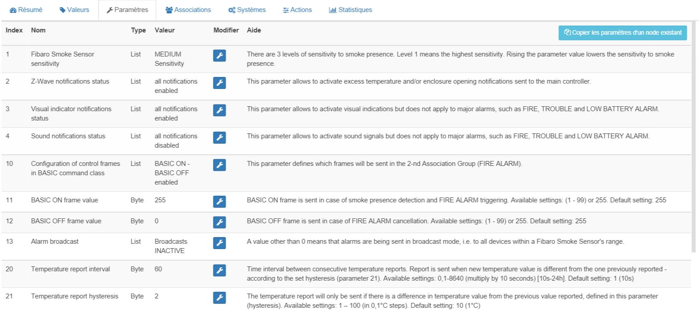

Fibaro FGSD-002 "Smoke Sensor 2" 
================================

-   **The module**

-   **The jeedom visual**

Summary
------

With soft lines, a polished surface and a small size, this
smoke detector will allow you to be alerted of a threat with
Multicolor RGB LEDs and an integrated siren. The large format of the
grid can detect the smallest amount of smoke so
get a quick reaction. It will thus very easily find its
place in your home to preserve the security of the whole
famille.

The Fibaro FGSD-002 smoke detector is an Alarm Detector
Autonomous Smoke (DAAF) compliant with standard EN 14604:2005. Good
that autonomous, it is also communicating thanks to Z-Wave technology
Plus.

Some materials burn without smoking. This is why the engineers at
Fibaro have decided to include additional protection in their
smoke detector in the form of a temperature sensor. If the
not enough smoke to sound the alarm,
the device will still be able to detect a threat by detecting
a rapid change in temperature caused by fire. A change
rapid temperature rise or increase to 54 ° C is sufficient
for the smoke sensor to detect a threat and report it to
inhabitants of the house. Only this type of smoke sensor offers
high efficiency, regardless of what burns.

Fonctions
---------

-   Z-Wave smoke detector

-   Battery powered

-   Adjustable sensor sensitivity (3 levels)

-   Tamper protection

-   Alarm signaled by sound, LED light and Z-Wave signal

-   Fire detection by measuring the air temperature

-   Automatic efficiency test, performed every 5 seconds

-   Integrated Z-Wave network coverage tester

-   Complies with standard EN 14604:2005

-   Z-Wave Plus compatible

-   Very simple installation - just install it in one place
    or there is a risk of fire

Technical characteristics
---------------------------

-   Type of module : Z-Wave transmitter

-   Food : 3V CR123A Lithium Battery

-   Battery life : 3 years

-   Frequency : 868.42 MHz

-   Transmission distance : 50m free field, 30m indoors

-   Dimensions : 65 x 28 mm (diameter x height)

-   Operating temperature : 0-55 ° C

-   Operating humidity : 0% - 93%

-   Temperature measurement range : -20 to 100 ° C

-   Sensitivity to smoke : 1st level - 1.20 +/- 0.5% obs / m; 2nd
    level - 1.80 +/- 0.5% obs / m; 3rd level - 2.80 +/- 0.5% obs / m

-   Sound level: 85 dB at 3m

-   Measurement accuracy : 0.5 ° C (in a range of 0 to 55 ° C)

-   Standards : EMC 2004/108 / EC and R & TTE 199/5 / WE

-   Certifications : EN 14604:2005

Module data
-----------------

-   Mark : Fibar Group

-   Name : Fibaro Smoke Sensor FGSD-002

-   Manufacturer ID : 271

-   Product Type : 3074

-   Product ID : 4098

Configuration
-------------

To configure the OpenZwave plugin and know how to put Jeedom in
inclusion refer to this
[Documentation](https://doc.jeedom.com/en_US/plugins/automation%20protocol/openzwave/).

> **IMPORTANT**
>
> To put this module in inclusion mode, press the button 3 times
> central inclusion button, according to its paper documentation.

Once included you should get this :

### Commandes

Once the module has been recognized, the commands associated with the module will be
disponibles.

Here is the list of commands :

-   Smoke : this is the module alert command (for smoke,
    heat…)

-   Temperature : it is the temperature measurement command

-   Sabotage : this is the sabotage command. It signals the opening
    of the case

-   Test alert : it is the command which will bring up the fact that the module
    is in test mode

-   Heat alert : it is the control which will raise a heat alert
    (not reliable yet)

-   Drums : it's the battery command

### Configuration of the module

> **IMPORTANT**
>
> During a first inclusion always wake up the module just after
> inclusion.

Then it is necessary to configure the module in
depending on your installation. This requires going through the button
"Configuration "of Jeedom's OpenZwave plugin.

You will arrive on this page (after clicking on the tab
Settings)

Parameter details :

-   Wakeup : this is the module wake-up interval (value
    recommended 21600)

-   1: adjusts the sensitivity of smoke detection

-   2: allows you to choose which notifications will be sent to Jeedom
    (advice : toutes)

-   3: allows you to choose which notifications will be accompanied by a
    visual indication

-   4: allows you to choose which notifications will be accompanied by a
    audible indication (in all cases the heat detections and
    the module will ring)

-   10: don't change this setting unless you know what you
    faites

-   11: idem

-   12: idem

-   13: allows to notify other zwave modules (to deactivate unless
    you know why you activate it)

-   20: time between two temperature reports

-   21: temperature difference from which, even if the duration
    from above is not reached, the temperature will be sent to Jeedom

-   30: Heat alarm trigger temperature

-   31: temperature peak reporting interval

-   32: signal interval if loss of Zwave

### Groupes

For optimum operation of your module. Jeedom must be
at least associated with groups 1 4 and 5:

Good to know
------------

### Specificities

### Alternative visual

Wakeup
------

To wake up this module, press the central button 3 times

Faq.
------

This module wakes up by pressing 3 times on its inclusion button.

This module is a battery module, the new configuration will be
taken into account at the next wakeup.

Important note
---------------

> **IMPORTANT**
>
> You have to wake up the module : after its inclusion, after a change
> of the configuration, after a change of wakeup, after a
> change of association groups

**@sarakha63**
